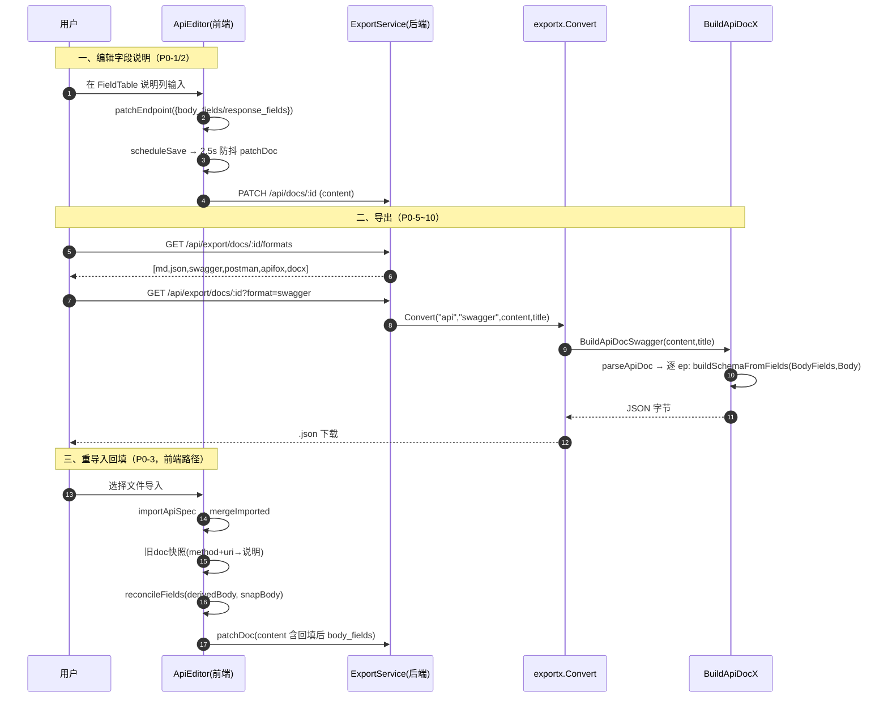
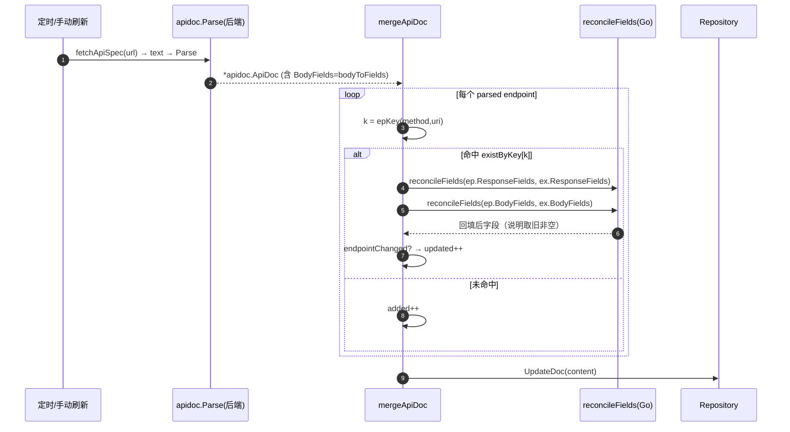

# 增量架构设计：接口文档「字段说明可编辑 + 多格式导出」

> 模块：`doc_type=api`（仿 Apifox 的接口文档编辑器）
> 作者：架构师 高见远
> 输入：`haiku-apidoc-prd-increment.md`（增量 PRD，已采纳 Q1~Q6 全部推荐默认值）
> 性质：**增量设计**——只在既有代码上做最小改动，不重写整篇设计、不新增数据库表。

---

## 1. 改动总览

本次改动围绕两条主线，共触及 **前端 2 个文件、后端 3 个文件**，全部为既有文件的增量修改，无新表、无新页面：

1. **字段说明可编辑 + 持久化 + 回填**（P0-1 ~ P0-4）
   - 前端契约 `ApiEndpoint` 新增 `body_fields`（请求体字段说明载体），`FieldTable` 的「说明」列改为就地可编辑 `Input`，编辑经 `patchEndpoint` → 复用既有 2.5s 防抖 `patchDoc` 落库。
   - 重导入有两条路径，都实现「按字段路径回填人工说明」：
     - 前端文件导入 `mergeImported()`：从整篇旧 doc 建 `method+uri → 说明快照`，对新 endpoint 逐字段调和。
     - 后端 URL 刷新 `mergeApiDoc()`：对命中 `existByKey` 的 endpoint，先调和 `ResponseFields`/`BodyFields` 再计数。
   - 后端解析 `apidoc.Parse` 为 JSON 请求体补算 `BodyFields`（把前端 `jsonToFields` 移植到 Go），供刷新路径回填。

2. **多格式导出**（P0-5 ~ P0-10）
   - 后端 `exportx` 新增 `BuildApiDocSwagger` / `BuildApiDocPostman` / `BuildApiDocApifox` 三个 JSON 构建器，以及增强 `BuildApiDocMD`（含两张字段表）；docx 复用既有 `BuildDocx(BuildApiDocMD(...))`。
   - `formatsByDocType["api"]` 增加 `swagger/postman/apifox/docx`，`Convert()` 增加分支。
   - 前端 `clientFormatsFor('api')` 改为返回 `[]`，让导出对话框完全由服务端格式清单驱动。

核心难点是：我们的数据模型里「请求体 / 返回结果」是**扁平字段表（`ApiField[]`，name 形如 `data.list[].dishId`）+ 原始 JSON 示例字符串**，而 Swagger/Postman/Apifox 需要**嵌套 JSON Schema**。设计用一个 `buildSchemaFromFields(fields, exampleJSON)` 函数把扁平字段表重建为嵌套 Schema，三种导出统一复用。

---

## 2. 数据结构与契约变更

### 2.1 前端契约 `web/src/lib/apiDoc.ts`

- `ApiEndpoint` 新增可选字段（行 45 之后）：
  ```ts
  /** 请求体字段说明表（新增，承载人工补写的请求体字段说明） */
  body_fields?: ApiField[]
  ```
- `jsonToFields`（已存在，行 631）**不改**，继续作为「请求体行结构来源」。
- 新增两个纯函数（放 `apiDoc.ts` 末尾，便于单测与后端对照）：

  ```ts
  /**
   * 渲染态合并：请求体字段表 = 行结构(名称/类型/必填) 取 derived，仅 description 叠加 saved。
   * - body 变化时 derived 自动增减行；saved 里没有对应路径的行被忽略（不残留陈旧行）。
   * - 只有 description 被 saved 覆盖；type / required 一律取 derived（以真实 body 为准）。
   */
  export function mergeBodyFields(derived: ApiField[], saved?: ApiField[] | null): ApiField[] {
    const savedMap = new Map<string, ApiField>()
    for (const f of saved ?? []) if (f.name) savedMap.set(f.name, f)
    return derived.map((d) => {
      const s = savedMap.get(d.name)
      return { ...d, description: s && s.description ? s.description : (d.description ?? '') }
    })
  }

  /**
   * 回填调和（前后端同语义）：按 name 匹配。
   * - 字段行（名称/类型/必填）一律以 new 为准；
   * - description：old[name] 非空 → 采用 old，否则采用 new[name].description；都为空 → 空。
   * - old 中不在 new 的字段丢弃（只遍历 new）。
   * - new 为 nil/空 → 直接返回 new；old 为 nil/空 → 退化为 new 自身。
   */
  export function reconcileFields(newFields: ApiField[], oldFields?: ApiField[] | null): ApiField[] {
    if (!newFields || newFields.length === 0) return newFields ?? []
    const oldBy = new Map<string, string>()
    for (const f of oldFields ?? []) if (f.name) oldBy.set(f.name, f.description ?? '')
    return newFields.map((f) => ({
      name: f.name,
      type: f.type,
      required: f.required,
      description: (oldBy.get(f.name) ?? '') !== '' ? (oldBy.get(f.name) as string) : (f.description ?? ''),
    }))
  }
  ```

### 2.2 后端契约 `server/internal/service/apidoc/parser.go`

- `ApiEndpoint` 结构体（行 40）新增字段：
  ```go
  BodyFields []ApiField `json:"body_fields,omitempty"`
  ```
  （`ResponseFields` 已存在，保持不动。）
- 新增 `bodyToFields`（前端 `jsonToFields` 的 Go 移植，仅处理「JSON 示例」而非 schema）：
  ```go
  // bodyToFields 把请求体 JSON 示例字符串推导为扁平字段表（name 路径 / type / required=false）。
  // 与前端 jsonToFields 同语义：对象不单独成行，数组成行且元素递归（前缀 + "[]"），叶节点取 Go 类型。
  func bodyToFields(body string) []ApiField {
      if strings.TrimSpace(body) == "" { return nil }
      var obj any
      if err := json.Unmarshal([]byte(body), &obj); err != nil { return nil }
      var out []ApiField
      var walk func(node any, prefix string)
      walk = func(node any, prefix string) {
          switch n := node.(type) {
          case nil:
              out = append(out, ApiField{Name: prefix, Type: "null"})
          case []any:
              out = append(out, ApiField{Name: prefix, Type: "array"})
              if len(n) > 0 { walk(n[0], prefix+"[]") }
          case map[string]any:
              for k, v := range n {
                  np := k
                  if prefix != "" { np = prefix + "." + k }
                  walk(v, np)
              }
          default:
              out = append(out, ApiField{Name: prefix, Type: goScalarType(node)})
          }
      }
      walk(obj, "")
      if out == nil { return nil }
      return out
  }
  func goScalarType(v any) string {
      switch v.(type) {
      case string: return "string"
      case float64, int64: return "number"
      case bool: return "boolean"
      default: return "any"
      }
  }
  ```
- 在四个解析函数（`parseSwagger2` / `parseOpenAPI3` / `parseApifoxApi` / `parsePostman` 中构建 `body` 后）补算：
  ```go
  bodyFields := []ApiField{}
  if bodyType == "json" && strings.TrimSpace(body) != "" {
      bodyFields = bodyToFields(body)
  }
  ```
  并在对应 `ApiEndpoint{...}` 字面量里加 `BodyFields: bodyFields,`。（`parsePostman` 的 raw 不一定可解析为 JSON，仅当 `bodyType=="json"` 时算。）

### 2.3 后端导出契约 `server/internal/service/exportx/api_doc.go`

- 新增 `ApiField`（与 `apidoc.ApiField` 字段名/JSON tag 对齐，便于 `json.Unmarshal` 直接映射）：
  ```go
  // ApiField 字段说明表的一行（请求体 / 返回结果通用）。
  type ApiField struct {
      Name        string `json:"name"`
      Type        string `json:"type"`
      Description string `json:"description,omitempty"`
      Required    bool   `json:"required"`
  }
  ```
- `ApiEndpoint`（行 18）增加字段（**不改动已有字段**，避免破坏既有 md/json 导出）：
  ```go
  ResponseFields []ApiField `json:"response_fields,omitempty"`
  BodyFields     []ApiField `json:"body_fields,omitempty"`
  ```
  `parseApiDoc` 用 `json.Unmarshal` 已能自动把正文里的 `response_fields` / `body_fields` 映射进来，无需额外代码。

---

## 3. 回填调和算法（重点）

### 3.1 后端 `reconcileFields`

放在 `api_refresh_service.go`（与 `endpointChanged` 同文件，复用 `apidoc.ApiField`）。签名与语义：

```go
// reconcileFields 按字段路径（name）调和说明。
//   - 字段行（名称/类型/必填）一律以 new 为准；
//   - description：old[name] 非空 → 采用 old，否则采用 new[name].description；都为空 → 空；
//   - old 中不在 new 的字段丢弃（只遍历 new，不补齐）；
//   - new 为 nil/空 → 原样返回 new；old 为 nil/空 → 退化为 new 自身（无说明可恢复）。
func reconcileFields(newFields, oldFields []apidoc.ApiField) []apidoc.ApiField {
    if len(newFields) == 0 {
        return newFields
    }
    oldBy := map[string]string{}
    for _, f := range oldFields {
        if f.Name != "" {
            oldBy[f.Name] = f.Description
        }
    }
    out := make([]apidoc.ApiField, 0, len(newFields))
    for _, f := range newFields {
        d := f.Description
        if old, ok := oldBy[f.Name]; ok && old != "" {
            d = old
        }
        out = append(out, apidoc.ApiField{
            Name:        f.Name,
            Type:        f.Type,
            Required:    f.Required,
            Description: d,
        })
    }
    return out
}
```

三种边界处理：
- `old == nil`：循环不执行，`oldBy` 为空，全部取 `new.Description`（上游 schema 自带或空）。✅
- `new == nil`：首行 `return newFields` 直接返回，避免误填。✅
- 同名 description 都为空：`oldBy` 命中但值为 `""`，`old != ""` 为 false，保留 `new.Description`（即空）。✅

### 3.2 前端 `mergeImported()` 的回填实现

关键点（PRD §3.4）：**说明快照必须来自整篇旧 doc 全部分组**，不限于被替换的分组。

```ts
const mergeImported = useCallback((parsed: ApiDoc) => {
  const newSources = new Set(parsed.groups.map((g) => g.import_source || '').filter(Boolean))
  mutate((d) => {
    // 1) 从「整篇旧 doc」构建 method+uri → {body 说明, resp 说明} 快照
    const snapBody = new Map<string, ApiField[]>()
    const snapResp = new Map<string, ApiField[]>()
    const keyOf = (m: string, u: string) => `${(m || 'GET').toUpperCase()}:${u || ''}`
    for (const g of d.groups) {
      for (const ep of g.items) {
        const k = keyOf(ep.method, ep.uri)
        if (ep.body_fields?.length) snapBody.set(k, ep.body_fields)
        if (ep.response_fields?.length) snapResp.set(k, ep.response_fields)
      }
    }
    // 2) 逐 endpoint 调和（请求体用 jsonToFields 推导行，再与快照调和）
    const reconciledGroups = parsed.groups.map((g) => ({
      ...g,
      items: g.items.map((ep) => {
        const k = keyOf(ep.method, ep.uri)
        const derivedBody = jsonToFields(ep.body)
        const bodyFields = reconcileFields(derivedBody, snapBody.get(k))
        const responseFields = reconcileFields(ep.response_fields ?? [], snapResp.get(k))
        return { ...ep, body_fields: bodyFields, response_fields: responseFields }
      }),
    }))
    // 3) 删除同 import_source 旧分组，保留其余 + 调和后的新分组
    const kept = d.groups.filter((g) => !g.import_source || !newSources.has(g.import_source))
    const isEmptyDefault = d.groups.length === 1 && d.groups[0].name === '默认分组' && d.groups[0].items.length === 0
    return {
      version: 1,
      base_host: d.base_host || parsed.base_host || '',
      groups: isEmptyDefault ? reconciledGroups : [...kept, ...reconciledGroups],
    }
  })
  // ...message.success（保持不变）
}, [mutate])
```

> 说明：Par物sed 的新 endpoint 本身不带 `body_fields`（导入解析只产 `response_fields`），请求体说明通过 `jsonToFields(ep.body)` 推导行 + 快照调和得到；落库后渲染时 `mergeBodyFields(jsonToFields(ep.body), ep.body_fields)` 会再次叠加，结果一致。

### 3.3 后端 `mergeApiDoc()` 的回填接入

在 `api_refresh_service.go` 的合并循环里，命中 `existByKey[k]` 后、调用 `endpointChanged` 之前插入调和；并让 `ensureSlices` 覆盖 `BodyFields`。

```go
// 在循环内：if ex, ok := existByKey[k]; ok {
ex, ok := existByKey[k]
if ok {
    ep.ID = ex.ID // 复用既有 id，调试历史不丢
    // —— 新增：回填人工说明（Q6：统一用回填后的说明）——
    ep.ResponseFields = reconcileFields(ep.ResponseFields, ex.ResponseFields)
    ep.BodyFields = reconcileFields(ep.BodyFields, ex.BodyFields)
    if endpointChanged(&ep, ex) {
        updated++
    }
} else {
    added++
}
```

`ensureSlices` 增加：
```go
if ep.BodyFields == nil {
    ep.BodyFields = []apidoc.ApiField{}
}
```
（`ResponseFields` 已有；`existByKey` 里的旧 endpoint 经 `json.Unmarshal` 进 `apidoc.ApiEndpoint`，已能读出既有 `body_fields`/`response_fields`，无需改解析。）

---

## 4. 导出构建器设计（重点）

### 4.1 核心：`buildSchemaFromFields` —— 扁平字段表 → 嵌套 JSON Schema

> 所有请求体 / 返回结果在导出时都是「扁平字段表 + 原始 JSON 示例字符串」，需重建为可被工具识别的嵌套 Schema。本函数统一解决。

**路径解析约定**（与前端 `jsonToFields` 产出的 `name` 完全一致）：
- `.` 分隔对象层级：`a.b.c`
- `[]` 标记数组步：`a.list[]` 表示 `a.list` 是数组，其元素继续沿后续路径展开，如 `a.list[].dishId`
- 数组步永远是「非末步」（元素会被递归），因此数组步的目标是一个「元素对象节点」

**算法（Go，放 `exportx/api_doc.go`）**：

```go
// schemaNode 是构建期的树节点（object / array / leaf 三态）。
type schemaNode struct {
    IsLeaf      bool
    IsArray     bool
    Type        string
    Description string
    Required    bool
    Example     any
    Properties  map[string]*schemaNode
    Items       *schemaNode
}

type pathStep struct{ Name string; IsArray bool }

// splitFieldPath 把 "data.list[].dishId" 拆成 [{data},{list,array},{dishId}]。
func splitFieldPath(path string) []pathStep {
    var steps []pathStep
    for _, p := range strings.Split(path, ".") {
        if p == "" { continue }
        if strings.HasSuffix(p, "[]") {
            steps = append(steps, pathStep{Name: p[:len(p)-2], IsArray: true})
        } else {
            steps = append(steps, pathStep{Name: p})
        }
    }
    return steps
}

// lookupExample 沿 steps 在 example 中取叶值（数组步取下标 0）。
func lookupExample(example any, steps []pathStep) any {
    cur := example
    for _, s := range steps {
        m, ok := cur.(map[string]any)
        if !ok { return nil }
        if s.IsArray {
            arr, ok := m[s.Name].([]any)
            if !ok || len(arr) == 0 { return nil }
            cur = arr[0]
            continue
        }
        cur = m[s.Name]
    }
    return cur
}

// normalizeSchemaType JSON Schema 类型归一（int64/integer→integer 等）。
func normalizeSchemaType(t string) string {
    switch strings.ToLower(t) {
    case "int", "int64", "integer": return "integer"
    case "float", "double", "number": return "number"
    case "bool", "boolean": return "boolean"
    case "array": return "array"
    case "object": return "object"
    default: return "string"
    }
}

// buildSchemaFromFields 把扁平字段表重建为嵌套 JSON Schema。
// exampleJSON 用于回填叶节点的 example（取不到则省略）。
func buildSchemaFromFields(fields []ApiField, exampleJSON string) map[string]any {
    var example any
    if strings.TrimSpace(exampleJSON) != "" {
        _ = json.Unmarshal([]byte(exampleJSON), &example)
    }
    root := &schemaNode{Properties: map[string]*schemaNode{}}
    for _, f := range fields {
        steps := splitFieldPath(f.Name)
        if len(steps) == 0 { continue }
        cur := root
        for i, step := range steps {
            last := i == len(steps)-1
            if step.IsArray {
                child, ok := cur.Properties[step.Name]
                if !ok {
                    child = &schemaNode{IsArray: true}
                    cur.Properties[step.Name] = child
                }
                if last {
                    // 数组且为末步：items 为叶（标量数组场景）
                    child.Items = &schemaNode{IsLeaf: true, Type: f.Type, Description: f.Description, Required: f.Required, Example: lookupExample(example, steps)}
                } else {
                    if child.Items == nil { child.Items = &schemaNode{Properties: map[string]*schemaNode{}} }
                    cur = child.Items
                }
            } else {
                child, ok := cur.Properties[step.Name]
                if !ok {
                    child = &schemaNode{Properties: map[string]*schemaNode{}}
                    cur.Properties[step.Name] = child
                }
                if last {
                    child.IsLeaf = true
                    child.Type = f.Type
                    child.Description = f.Description
                    child.Required = f.Required
                    child.Example = lookupExample(example, steps)
                } else {
                    cur = child
                }
            }
        }
    }
    return nodeToSchema(root)
}

func nodeToSchema(n *schemaNode) map[string]any {
    if n == nil { return nil }
    if n.IsLeaf {
        m := map[string]any{"type": normalizeSchemaType(n.Type)}
        if n.Description != "" { m["description"] = n.Description }
        if n.Example != nil { m["example"] = n.Example }
        return m
    }
    if n.IsArray {
        m := map[string]any{"type": "array"}
        if n.Items != nil { m["items"] = nodeToSchema(n.Items) }
        if n.Description != "" { m["description"] = n.Description }
        return m
    }
    props := map[string]any{}
    req := []any{}
    // 按字段定义顺序输出更友好
    for name, child := range n.Properties {
        props[name] = nodeToSchema(child)
        if child.Required { req = append(req, name) }
    }
    m := map[string]any{"type": "object", "properties": props}
    if len(req) > 0 { m["required"] = req }
    if n.Description != "" { m["description"] = n.Description }
    return m
}
```

**产物示例**：字段表
```
data.list[].dishId  int64  菜品ID  必填
code                int    状态码
```
+ `exampleJSON = {"code":0,"data":{"list":[{"dishId":1}]}}`
→
```json
{
  "type": "object",
  "properties": {
    "code": { "type": "integer", "description": "状态码" },
    "data": {
      "type": "object",
      "properties": {
        "list": {
          "type": "array",
          "items": {
            "type": "object",
            "properties": { "dishId": { "type": "integer", "description": "菜品ID", "example": 1 } },
            "required": ["dishId"]
          }
        }
      }
    }
  },
  "required": ["code"]
}
```

### 4.2 三种导出的顶层封装与字段承载

#### Swagger 2.0（`BuildApiDocSwagger`）

```
{
  "swagger": "2.0",
  "info": { "title": <title>, "version": "1.0", "description": "由 haiku-wiki 接口文档导出" },
  "host": "<由 doc.BaseHost 解析出的 host，无则省略>",
  "basePath": "<BaseHost 的 path 部分，无则省略>",
  "schemes": ["https"],
  "paths": {
    "<ep.URI>": {
      "<ep.Method小写>": {
        "summary": ep.Name,
        "description": ep.Description,
        "parameters": [
          // 由 ep.Headers/Params 展开为 in:header/query/path（带 description/type/example）
          // bodyType=="json" 时追加： { "in":"body","name":"body","required":true,"schema": <buildSchemaFromFields(ep.BodyFields, ep.Body)> }
          // bodyType=="form" 时追加： 每个 ep.Params 转为 in:formData
        ],
        "responses": {
          "200": {
            "description": "OK",
            "schema": <buildSchemaFromFields(ep.ResponseFields, ep.ResponseExample)>
          }
        }
      }
    }
  }
}
```
- `host/basePath/schemes`：`doc.BaseHost`（如 `https://api.example.com/v1`）用 `net/url` 解析，`scheme://` 去scheme 得 host，path 得 basePath；为空则三者全省（Swagger UI 仍可读）。
- body 仅 `json` 用 Schema 表达；`form` 用 `in:formData`；`none`/`raw` 省略 body 参数。

#### Postman Collection v2.1（`BuildApiDocPostman`）

```
{
  "info": { "name": <title>, "_postman_id": <uuid>,
            "schema": "https://schema.getpostman.com/json/collection/v2.1.0/collection.json" },
  "item": [
    { "name": <group.Name>,
      "item": [
        { "name": ep.Name,
          "request": {
            "method": ep.Method,
            "url": { "raw": <ep.URI 或 baseHost+uri>, "host":[...], "path":[...] },
            "header": [ { "key","value","description" } ... ],
            "body": { "mode":"raw", "raw": <ep.Body 原文>, "options": { "raw": { "language":"json" } } },
            "description": <由 body_fields/response_fields 生成的 Markdown 字段说明表>
          },
          "response": [
            { "name":"200", "code":200, "status":"OK",
              "body": <ep.ResponseExample 原文>,
              "_postman_previewlanguage":"json",
              "description": <由 response_fields 生成的 Markdown 字段说明表> }
          ]
        }
      ]
    }
  ]
}
```
- **设计决策（Postman 无原生嵌套 body schema 槽）**：`body.raw` 填原始 JSON 示例以保证「Postman 直接导入即可发请求」；人工字段说明放到 `request.description` / `response.description` 的 Markdown 字段表里，保证可读、可识别。Postman 重新导入本系统时不会恢复字段说明（本系统 `parsePostman` 不读 description），因此**回灌本系统的指定格式是 Apifox**（见 Q1），Postman 仅需「可被 Postman 识别」。

#### Apifox 项目 JSON（`BuildApiDocApifox`）——可被 Apifox 导入 + 回灌本系统

```
{
  "apifoxProject": "haiku-wiki",            // 触发 importApiSpec 的 apifox 分支
  "info": { "name": <title> },
  "apiCollection": [
    { "name": <group.Name>,
      "items": [
        { "name": ep.Name,
          "api": {
            "method": ep.Method,
            "path": ep.URI,
            "description": ep.Description,
            "parameters": {
              "header": [ {name,description,type,example} ... ],   // 来自 ep.Headers
              "query":  [ ... ],                                  // 来自 ep.Params
              "path":   [ ... ]
            },
            "requestBody": (bodyType!="none")
                 ? { "type": ep.BodyType, "jsonSchema": <buildSchemaFromFields(ep.BodyFields, ep.Body)> }
                 : { "type": "none" },
            "responses": [
              { "code": 200,
                "description": "OK",
                "jsonSchema": <buildSchemaFromFields(ep.ResponseFields, ep.ResponseExample)> }
            ]
          }
        }
      ]
    }
  ]
}
```
- 结构与 `parseApifox` 完全对齐：`apiCollection[].items[].api.{method,path,description,parameters.{header,query,path},requestBody.{type,jsonSchema},responses[].{code,jsonSchema}}`，因此本系统的 `importApiSpec` 可直接回灌（满足 Q1）。
- Schema 内联（不依赖 `#/definitions`），`parseApifox` 的 `schemaToSample`/`schemaToFields` 对内联 schema 直接可用。
- 字段说明落在各 property 的 `description`（来自回填后的 `body_fields`/`response_fields`），符合「description 填人工说明」。

### 4.3 Markdown / Word（`BuildApiDocMD` 增强 + `BuildDocx`）

- `BuildApiDocMD` 在每个接口下，请求体（`BodyType != none && Body != ""`）与返回结果区，各追加一张字段说明表（Markdown 表格：`| 字段名 | 类型 | 说明 | 必填 |`），数据来自 `ep.BodyFields` / `ep.ResponseFields`（已含回填后说明；若为空则回退 `jsonToFields` 推导）。
- docx：`Convert()` 的 `api` 分支 `case "docx":` 调 `BuildDocx(BuildApiDocMD(content, title))`（既有 `BuildDocx` 已支持表格/代码块渲染）。

### 4.4 导出注册（`export.go`）

`formatsByDocType["api"]` 改为：
```go
"api": {
    {Value: "md", Label: "接口文档（.md）", Ext: "md", MIME: "text/markdown; charset=utf-8"},
    {Value: "json", Label: "接口数据（.json）", Ext: "json", MIME: "application/json; charset=utf-8"},
    {Value: "swagger", Label: "Swagger 2.0（.json）", Ext: "json", MIME: "application/json; charset=utf-8"},
    {Value: "postman", Label: "Postman 集合（.json）", Ext: "json", MIME: "application/json; charset=utf-8"},
    {Value: "apifox", Label: "Apifox 项目（.json）", Ext: "json", MIME: "application/json; charset=utf-8"},
    {Value: "docx", Label: "Word 文档（.docx）", Ext: "docx", MIME: "application/vnd.openxmlformats-officedocument.wordprocessingml.document"},
},
```
`Convert()` 的 `case "api":` 增加分支：
```go
case "swagger":
    data, err := BuildApiDocSwagger(content, title)
    return data, spec, err
case "postman":
    data, err := BuildApiDocPostman(content, title)
    return data, spec, err
case "apifox":
    data, err := BuildApiDocApifox(content, title)
    return data, spec, err
case "docx":
    md, err := BuildApiDocMD(content, title)
    if err != nil { return nil, spec, err }
    data, err := BuildDocx(string(md), title)
    return data, spec, err
```
（`json`/`md` 原分支保留。）

### 4.5 前端导出清单修正（`web/src/lib/export/index.ts`）

`clientFormatsFor` 对 `api` 类型直接返回 `[]`（删掉末尾通用分支对 api 的误注入）：
```ts
export function clientFormatsFor(docType: DocType, fileExt?: string): { value: ClientFormat; label: string }[] {
  if (docType === 'file') { /* 保持不变 */ }
  if (docType === 'drawing') return []
  if (docType === 'whiteboard') { /* 保持不变 */ }
  if (docType === 'api') return []   // ← 新增：接口文档全部由服务端导出
  return [ /* 其他类型保持原样 */ ]
}
```
导出对话框经 `GET /api/export/docs/:id/formats` 拿到服务端清单，自动只显示 swagger/postman/apifox/docx/md/json。

---

## 5. 任务分解（有序、含依赖）

> 顺序保证：**数据结构/契约 → 前端编辑与回填 → 后端刷新回填 → 导出 → 回归**。

| 任务 | 文件 | 改动点 | 依赖 | 验收点 |
|------|------|--------|------|--------|
| **T1 数据结构与契约** | `web/src/lib/apiDoc.ts`<br>`server/internal/service/apidoc/parser.go`<br>`server/internal/service/exportx/api_doc.go` | 前端 `ApiEndpoint.body_fields`；新增 `mergeBodyFields`/`reconcileFields`（TS）。后端 `apidoc.ApiEndpoint.BodyFields` + `bodyToFields`；`exportx.ApiField` + `ApiEndpoint.ResponseFields/BodyFields`。 | 无 | 前后端编译/类型检查通过；`json.Unmarshal` 能把正文 `body_fields` 映射进 `exportx.ApiEndpoint`；`bodyToFields` 单测与前端 `jsonToFields` 输出一致（路径/类型）。 |
| **T2 前端字段表就地编辑 + 渲染** | `web/src/components/editor/ApiEditor.tsx`<br>`web/src/lib/export/index.ts` | `FieldTable`「说明」列改 `Input`（受控 `onChange`）；请求体表用 `mergeBodyFields(jsonToFields(ep.body), ep.body_fields)`；返回结果表就地改 `ep.response_fields[].description`；`clientFormatsFor('api')` 返回 `[]`。 | T1 | US-1/US-2：编辑失焦 → 自动保存 → 刷新页面说明仍在；空说明显示「—」；导出对话框只显示服务端 5 种格式。 |
| **T3 前端重导入回填** | `web/src/components/editor/ApiEditor.tsx` | 改造 `mergeImported`：从整篇旧 doc 建 `method+uri→说明快照`，逐 endpoint 用 `reconcileFields` 调和 `body_fields`/`response_fields`。 | T1, T2 | US-3：重导入同文件后，人工说明按字段路径还原；被替换分组外的说明也能复用。 |
| **T4 后端 URL 刷新回填** | `server/internal/service/apidoc/parser.go`<br>`server/internal/service/api_refresh_service.go` | `parser.go` 在 JSON body 分支补算 `BodyFields=bodyToFields(body)`；`api_refresh_service.go` 加 `reconcileFields(Go)`，`mergeApiDoc` 命中时先调和 `ResponseFields`/`BodyFields` 再 `endpointChanged`；`ensureSlices` 补 `BodyFields`。 | T1 | US-4：刷新后旧说明保留、按字段回填；调试历史（`api_debug_history`）不受影响；`added/updated/removed` 计数正确。 |
| **T5 导出构建器** | `server/internal/service/exportx/api_doc.go`<br>`server/internal/service/exportx/export.go` | `api_doc.go`：`buildSchemaFromFields` + `BuildApiDocSwagger/Postman/Apifox` + `BuildApiDocMD` 字段表；`export.go`：`formatsByDocType["api"]` 增 4 项 + `Convert()` 增分支。 | T1 | US-5/6/7/8：Swagger 2.0 可被 Swagger UI 导入；Postman 可被 Postman 导入；Apifox 可被 Apifox 导入且能回灌本系统 `importApiSpec`；md/docx 含两张字段表与说明。 |
| **T6 回归测试与联调** | （测试 + 既有 PRD 验收） | 旧文档向后兼容；跑 PRD US-1~US-8；刷新/重导入双路径对照；导出四种 JSON 工具导入验证。 | T2,T3,T4,T5 | 全部 US 通过；不破坏既有 `json`/`md` 导出与 2.5s 防抖自动保存链路。 |

---

## 6. 共享知识 / 约定

- **前后端字段名一致性**：前端 `ApiField.description` 即「字段说明」；`name` 路径统一用 `.` 分隔对象、`[]` 标记数组（如 `data.list[].dishId`），后端 `apidoc.ApiField` 与 `exportx.ApiField` JSON tag 均为 `name/type/description/required`，正文直接互通。
- **导出文件 MIME / 扩展名**：swagger/postman/apifox 均为 `application/json; charset=utf-8` + 扩展名 `json`；docx 为 `application/vnd.openxmlformats-officedocument.wordprocessingml.document` + `docx`。文件名由 `export_service.go` 的 `sanitizeFilename(title)+"."+spec.Ext` 统一生成。
- **导出注册方式**：所有新格式在 `exportx/formatsByDocType["api"]` 声明 `FormatSpec`，并在 `Convert()` 的 `case "api":` 增加 `case` 分支调用对应 `BuildXxx`，无需改 handler。
- **说明唯一真相**：界面、Swagger/Postman/Apifox 导出统一使用「回填后」的 `response_fields`/`body_fields` 说明（Q6）。
- **请求体行来源**：始终由 `body` JSON 推导（`jsonToFields`/`bodyToFields`），用户只编辑 `description`；`body_fields` 数组只承载「路径→说明」映射（P0-5 边界：不做手动新增字段行）。
- **必填列**：仅由 schema/body 推导，不持久化人工覆盖（Q5）。

---

## 7. 待明确事项（含推荐处理）

1. **Swagger `host` 缺失时的处理**：`doc.BaseHost` 可能为空（尤其分组内接口用各自 `base_host`）。推荐：整篇 `doc.BaseHost` 为空时省略 `host/basePath/schemes`，由各接口 `ep.BaseHost`（若有）拼接进 `paths` 的 key 或 `parameters` 里补 `host` header。Q 级：建议先省略，保持导出可读。
2. **Postman 字段说明的承载形式**：Postman 原生无 body/response 的嵌套 schema 槽。本设计选定「`body.raw`=原始 JSON + `description`=Markdown 字段表」，以「可被 Postman 直接导入发请求」为第一优先级。若主理人更看重「字段说明机器可读」，可改为把 JSON Schema 序列进 `request.description`（仍非 Postman 原生）。推荐维持现状（人工可读优先）。
3. **Apifox 内联 vs `#/definitions`**：本设计选择**内联 schema**（不求 `$ref`），与 `parseApifox` 的 `schemaToSample`/`schemaToFields` 兼容且最简单。若未来 Apifox 导入器要求强 `#/definitions` 引用，再升级（不影响回灌本系统）。
4. **`body_fields` 在 `parsePostman` raw 非 JSON 场景**：仅当 `bodyType=="json"` 才调用 `bodyToFields`；raw/其他类型 `BodyFields` 留空（前端 `mergeBodyFields` 会回退到无说明行）。属已知可接受边界。
5. **`data.list[]` 末步为标量数组**（如 `[1,2,3]`）的极少见结构：`buildSchemaFromFields` 会把 `items` 建成带 `type` 的叶节点；若前端 `jsonToFields` 产出 `name="[]"` 之类的异常路径，Schema 会退化为 `items:{}`。推荐：接受此边界，不专门为标量数组建模（真实 API 几乎不存在）。

---

## 附：调用时序（导出 & 回填）




