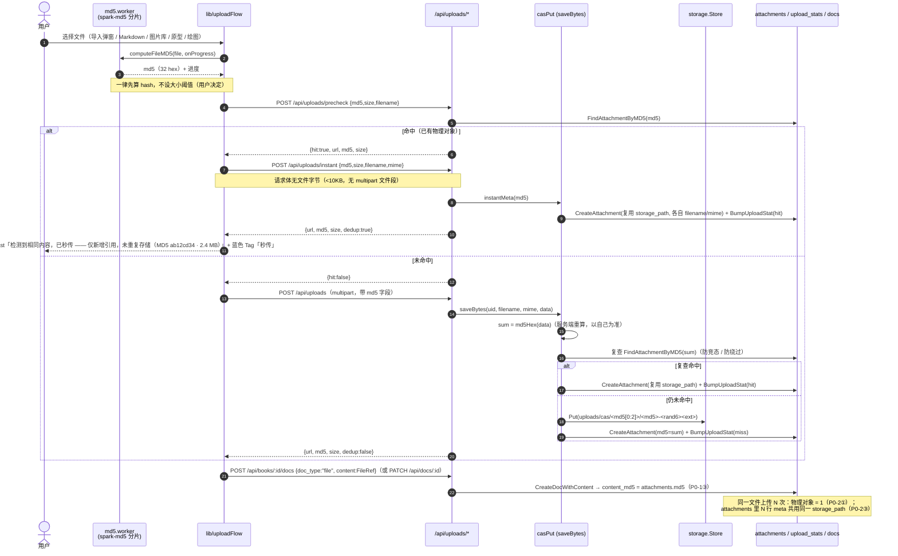
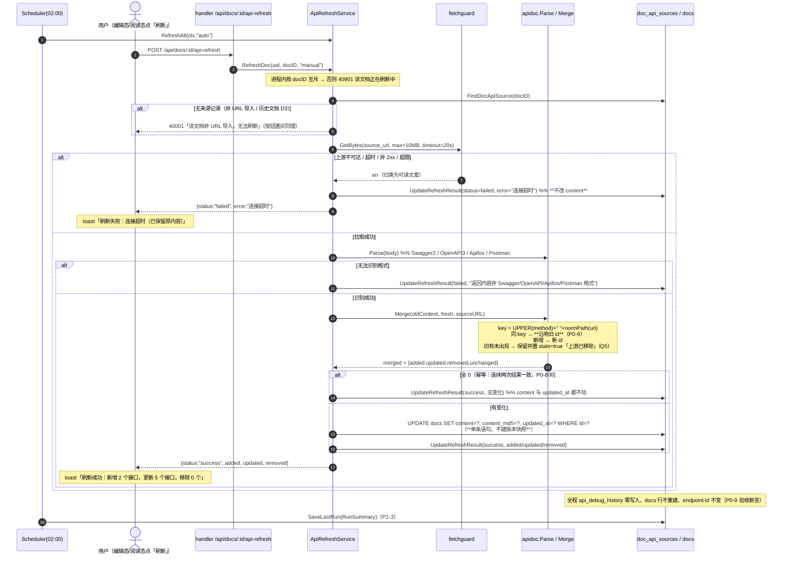
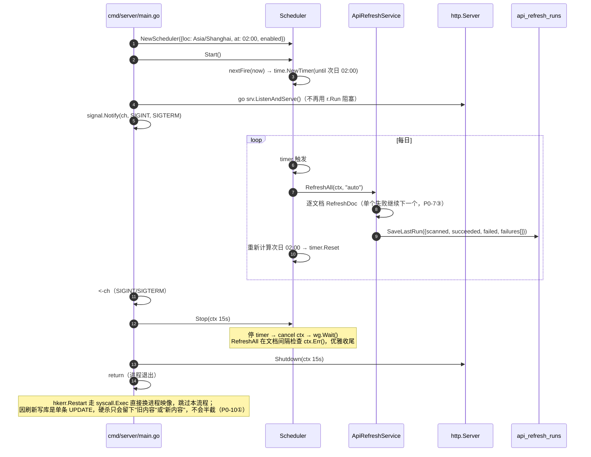

# 寄海文库（haiku-wiki）三项改造 · 系统架构设计 + 任务分解

> 架构师：高见远　|　输入：`deliverables/software-company/haiku-wiki/prd.md`
> 覆盖范围：**P0-1 ~ P0-10 全部**，P1-1 ~ P1-4 全部；P2-1 ~ P2-4 明确不做
> 设计原则：**不引入新框架**、向后兼容历史数据、单实例假设、可独立验证

---

## 0. 事实基线（已逐文件核对，设计不得与之冲突）

下表是本设计的**硬约束来源**，全部经代码勘察确认。

| # | 事实 | 位置 |
| --- | --- | --- |
| F1 | 原件字节的**唯一收敛入口**是 `saveBytes`（`Save` :61、`SaveBytes` :88 都委托它）。图片库 `buildGalleryImage` :214、原型 :260/:288/:309/:331/:340/:359/:370/:385/:509/:529 也全部走 `saveBytes` | `server/internal/service/upload_service.go:116` 等 |
| F2 | 键名规则 `uploads/YYYY/MM/<uuid>.<ext>`（UTC），local/S3 共用 | `upload_service.go:121` |
| F3 | 派生图入口 `saveDerivedFile`：同目录、同基名、换扩展名（`preview.jpg`/`thumb.jpg`/`original.jpg`/`svg`/`png`），**确定性命名**；调用点 6 处 | `attachment_service.go:116`、`gallery_service.go:246/251`、`prototype_service.go:275/276/677/694/699/702` |
| F4 | `storage.Store` 只有 `Put/Read/Open/Exists/Delete/List/URL/LocalPath`，**无 hash 元数据能力**；`KeyFromURL/URLFromKey` 是 key↔URL 唯一换算 | `server/internal/storage/storage.go:28-49,121-133` |
| F5 | `model.Attachment` 只有 StoragePath/MimeType/Size，**无摘要字段**；全仓**零 hash 逻辑** | `server/internal/model/attachment.go:6-14` |
| F6 | 文件信息全塞在 `docs.content` 的 JSON（`FileRef`/`WebRef`/`GalleryContent`/`PrototypeContent`），**无独立文件表** | `exportx/export.go:319-337`、`gallery_service.go:29-50`、`prototype_service.go:41-64` |
| F7 | 迁移是纯 `AutoMigrate` + `MigrateData` + `SeedData`，**无 migrations 目录/版本号**；`migrateTables` 注释明确"新增模型必须同步，否则静默丢数据" | `repository/database.go:124-141`、`service/migrate_service.go:227-239`、`cmd/server/main.go:30-40` |
| F8 | `migrateTables` 中登记名写 `api_debug_histories`，而模型 `TableName()` 是 `api_debug_history`。`tableCopier.name` **仅用于进度文案**（`copyRows` 用泛型取 `TableName()`），故属文案不一致、非数据缺陷 | `migrate_service.go:238` vs `model/api_debug_history.go:17`；`migrate_service.go:181,187,244` |
| F9 | 接口文档 URL 导入 **100% 在前端**（`proxyRequest` GET → `importApiSpec` → `PATCH /api/docs/:id`），**后端无对应 handler** | `web/src/lib/apiDoc.ts:173`、`web/src/components/editor/ApiEditor.tsx:730-749` |
| F10 | `mergeImported` 的逻辑是"同 `import_source` **先删旧分组再全量重导**" → **会重建接口 id**（P0-9 最大风险点） | `ApiEditor.tsx:694-714` |
| F11 | 调试历史锚定 `docs.content` 里 `ApiEndpoint.ID`；`api_debug_history` 独立表 + 联合索引 `(doc_id, endpoint_id, user_id)`，每接口每用户 10 条 | `model/api_debug_history.go:7-17`、`service/api_debug_history_service.go:11-21,41,69`、`repository/api_debug_history_repo.go:27`、`router.go:102-104` |
| F12 | 前端 `apiDoc.ts` 的 `import_source`(:53) 与 `response_example`/`response_fields`(:42-45) **后端结构体未建模**，后端解析时忽略（导出会丢） | `exportx/api_doc.go:18-44` |
| F13 | **无任何 cron/scheduler/ticker/robfig**；`r.Run()` 阻塞、**无 `signal.Notify`、无 `http.Server`/`Shutdown`**；重启用 `syscall.Exec` 原地替换进程 | `cmd/server/main.go:62`、`server/internal/pkg/restart.go:22-37` |
| F14 | 物理删除只发生在图片库/原型：`deleteUploaded`（`gallery_service.go:159,289`）、`deletePrefix`/`deleteUploaded`（`prototype_service.go:205-211,608`）。回收站 `Purge` **只删 meta** | 同上 + `trash_service.go:31-48` |
| F15 | 前端全仓**无 hash 计算**（无 md5/spark-md5/crypto.subtle/FileReader）；现有"去重"仅按「名称::大小」在导入弹窗内过滤 | `ImportDialog.tsx:36-39,61,174` |
| F16 | 附件上传调用点 5 处：`ImportDialog.tsx:110`、`VditorEditor.tsx:280`、`DrawioEditor.tsx:428`、`MindmapEditor.tsx:440`、`api/uploads.ts:5`；图片库/原型走 multipart 到 `docs/:id/gallery/images`、`docs/:id/prototype/items` | 已 grep 确认 |
| F17 | Vditor 内部 mermaid：选择器 `.language-mermaid`，脚本 URL `{cdn}/dist/js/mermaid/mermaid.min.js?v=11.16.1`，随后 `mermaid.initialize({securityLevel:'loose', flowchart:{htmlLabels:true,...}})` 并 `el.innerHTML = svg`；**该渲染是 fire-and-forget，`after` 回调不等待它** | `web/node_modules/vditor/dist/index.min.js`（模块 840 / `c=function(e,t,n)` 段） |
| F18 | `js/mermaid/mermaid.min.js` **存在于 node_modules（3,566,058 B，v11.16.1）但未拷入 `public/vditor/dist/js/`**（INCLUDE 白名单只有 `lute/highlight.js/katex/icons/i18n`）→ 404 → 静默失效 | `web/scripts/copy-vditor-assets.mjs:24-33`；`ls web/public/vditor/dist/js/` 已确认 |
| F19 | 项目自带 `mermaid@11.17.2`（`node_modules/mermaid/dist/mermaid.min.js`，3,572,661 B，UMD 暴露全局 `mermaid`），与 Vditor 内置 11.16.1 **版本不同** | `web/package.json:41`；`ls -la node_modules/mermaid/dist/` |
| F20 | **DOMPurify 3.4.15 的 `svgDisallowed` 与 `DEFAULT_FORBID_CONTENTS` 都含 `foreignobject`** → 会对 mermaid(htmlLabels:true) 生成的 `<foreignObject>` 标签**连内容一起删掉** | `web/node_modules/dompurify/dist/purify.cjs.js:308,730` |
| F21 | 前端导出：`lib/export/html.ts` 用 `Vditor.md2html`（**不触发任何渲染器**）→ 导出的 HTML/PDF 里 mermaid 只会是代码块；`lib/export/pdf.ts` 是 html2canvas 截阅读页 DOM | `web/src/lib/export/html.ts:27`、`pdf.ts:1-16`、`blocks.ts:300-301` |
| F22 | 响应封装 `{code,message,data}` + 错误码 `0/40001/40101/40301/40401/40901/41301/41501/42901/50000`；前端 axios 拦截器按 `code!==0` 弹错 | `server/internal/pkg/{respond.go,errors.go}`、`web/src/api/request.ts:29-58` |
| F23 | SSRF 防护 `validateFetchTarget` 与 `proxyClient` 目前**在 handler 包内**（未导出），service 无法复用（会循环依赖） | `handler/fetch_title_handler.go:34,59`、`handler/proxy_handler.go:17` |
| F24 | 验证套件共用端口与 Chrome profile，**必须串行**；新增套件必须登记进 `run-all.sh` 的 `DEFAULT_SUITES` 与 `PORT_OF` | `tools/verify/run-all.sh:23-52`、`README.md:52-73` |

---

## 1. 实现方案总览 + 框架选型

### 1.1 总原则

| 原则 | 落地要求 |
| --- | --- |
| **不引入新框架** | 后端 Go + Gin + GORM，前端 Vite5 + React18 + TS + AntD5；定时任务用标准库 `time.Timer`（不引 robfig/cron）；MD5 用标准库 `crypto/md5` |
| **不新增存储抽象** | 不改 `storage.Store` 接口（F4）——MD5 落在**业务层 + DB**；键名/URL 换算继续走 `KeyFromURL`/`URLFromKey` |
| **向后兼容** | 历史 `uploads/YYYY/MM/<uuid>.<ext>` URL 不改写、不回填；新增 JSON 字段一律可缺省；新增 HTTP 字段一律可选 |
| **单入口收敛** | 原件只经 `saveBytes`、派生件只经 `saveDerivedFile`（F1/F3），避免多路径各自为政 |
| **单实例假设** | 进程内互斥即可（`sync.Mutex`），不做分布式锁（C5） |

### 1.2 改造一：内容寻址去重 + 秒传（P0-1~P0-5、P1-1、P1-4）

**技术路线**

```
前端 hash 预检（一律先算，不设阈值 —— 用户决定）
   └─ Web Worker + 分片读取(spark-md5 增量) + 进度回调
        ├─ 命中 → POST /api/uploads/instant（JSON，无文件字节）→ 直接拿 URL → createDoc
        └─ 未命中 → POST /api/uploads（multipart，带 md5 字段兜底）
后端收敛（唯一写盘点）
   casPut(md5, ext, data)
        ├─ 命中（attachments.md5 索引）→ 不 Put、复用 storage_path、只新增 meta 行 → dedup=true
        └─ 未命中 → Put(uploads/cas/<md5[0:2]>/<md5>-<rand6><ext>) + 新 meta 行(md5) → dedup=false
派生件
   saveDerivedFile(origURL, ext, data, force=false)
        └─ out = 原件键换扩展名（确定性）；Exists(out) && !force → 跳过 Put，直接复用 URL
```

**关键取舍**

| 议题 | 决定 | 理由 |
| --- | --- | --- |
| 键名 | `uploads/cas/<md5 前 2 位>/<md5>-<随机 6 位>.<ext>`（**采纳 Q1+Q2**） | 纯 MD5 键名在免鉴权 `/uploads` 下可被反查；去重靠 **DB 的 md5 索引**已足够满足"物理只存一份" |
| 派生件去重机制 | **确定性命名 + `Exists()` 跳过**（不建派生 md5 索引） | 原件命中后 storage_path 复用 → 派生路径必然一致 → 二次导入 `Exists` 命中即跳过。零新表、零新行，且天然满足"两次返回 URL 一致"；`force=true` 仅用于 `RegenerateGalleryImage` 的覆盖语义 |
| 摘要落点 | `attachments.md5`（原件）、`docs.content_md5`（正文摘要） | `attachments` 是唯一可挂 MD5 的地方（F5/F6）；不改 storage 接口 |
| 并发同文件 | 进程内 `casMu sync.Mutex` 串行化「查 → 写 → 记 meta」 | 单实例假设；避免两个同内容请求各写一份物理对象 |
| 删除语义 | **永不删 `uploads/cas/` 前缀对象**；非 CAS 路径删除前检查"是否有其它 meta 行共用该 `storage_path`"，共用则跳过 | 满足 P0-4③ 且**不引入引用计数列**（D2 禁止）；`uploads/cas` 前缀同时是将来孤儿清理的识别标记（P2-2） |
| 大文件 hash 预检 | **一律先算 hash，不设阈值、不做"小文件直传"分支**（用户推翻 Q9） | 前端路径统一，代码分支最少；后端仍保留 md5 兜底复查（防绕过/兼容老客户端） |

**前端 hash 库选型**

| 方案 | 结论 | 理由 |
| --- | --- | --- |
| `crypto.subtle.digest('MD5')` | ❌ 不可用 | WebCrypto **不支持 MD5**；且 `subtle.digest` 必须一次性吃完整 `ArrayBuffer`，无法分片、无法报进度，百 MB 文件会有内存尖峰 |
| 手写纯 JS MD5 | ❌ 不采用 | 自己实现易错、不可信；收益仅是省一个小依赖 |
| **`spark-md5` + Web Worker** | ✅ **采用** | 支持 `ArrayBuffer` 增量 `append` → 可分片读、可报进度、Worker 内不阻塞 UI；体积约 8 KB；输出标准 MD5，与 Go `crypto/md5` 逐字节一致 |

### 1.3 改造二：Mermaid 渲染打通（P0-6，D4 不做模板菜单）

**根因**（F17/F18）：Vditor 内部对 `.language-mermaid` 无条件调用 `mermaidRender`，它 `addScript('/vditor/dist/js/mermaid/mermaid.min.js?v=11.16.1')`；而 `copy-vditor-assets.mjs` 的 INCLUDE 没拷 `js/mermaid` → 404 → `.then` 永不执行 → 代码块原样显示且**无报错**。

**技术路线（四步，最小改动优先）**

1. **资源就位**：`copy-vditor-assets.mjs` 的 `INCLUDE` 加 `'js/mermaid'`。
2. **版本归一（消除 F19 风险）**：拷贝后**用项目自带 mermaid 覆盖** Vditor 那份 —— `node_modules/mermaid/dist/mermaid.min.js` → `public/vditor/dist/js/mermaid/mermaid.min.js`。两者同为 UMD 全局 `mermaid`、同 major（11.x），`?v=11.16.1` 只是缓存串。**收益：markdown 代码块与独立 `flowchart` doc_type 用同一份 mermaid 11.17.2，"八种图类型是否支持"的验证只需对一次版本。**
3. **渲染保真（DOMPurify 关键点）**：`MarkdownView` 的 DOMPurify 二次清洗在 `after` 回调里，而 mermaid 是 fire-and-forget（F17）→ **清洗先于 SVG 注入**，不会误伤；但 mermaid 注入的产物将**完全未经清洗**（`securityLevel:'loose'` + `htmlLabels:true`，作者可借 code block 注入 HTML）。故新增共享模块 `web/src/lib/mermaidRender.ts`：
   - `waitForMermaidBlocks(root, timeoutMs)`：MutationObserver 等每个 `.language-mermaid` 出现 `<svg>`（或超时），供"注入后"动作使用；
   - `sanitizePreservingMermaid(root, opts)`：**摘出 mermaid 节点 → DOMPurify 清洗其余 → 原位放回**，规避 F20（DOMPurify 会连内容删掉 `<foreignObject>`）。
   `after` 的新顺序：先洗 Vditor 原始产物 → `waitForMermaidBlocks` → `sanitizePreservingMermaid`。
4. **导出保真**：`lib/export/html.ts` 由 `Vditor.md2html` 改为"离屏容器 + `Vditor.preview` + 等 mermaid + 摘出-清洗-放回"，产出可直接进 html2canvas 的 HTML（F21）。

**编辑态"预览出图"**：现编辑器是 `mode:'ir'`（`VditorEditor.tsx:100-115`），IR 模式代码块以源码显示。设计：给 toolbar 增加 Vditor 内置 `'preview'` 项（一键浮层预览，走同一 `preview()` → mermaid 渲染）；用户也可用已有 `'edit-mode'` 切到 `sv`（左编辑右预览、常驻右侧）。**不改默认 IR 模式**，避免破坏 Notion 行菜单交互。

### 1.4 改造三：接口文档刷新（P0-7~P0-10、P1-2、P1-3）

**技术路线**

```
导入侧（补来源）
  前端 URL 在线导入：解析后给每个 group 打 import_source_url = 用户输入 URL
        └─ PATCH /api/docs/:id { content, api_source_url }（服务端只对 doc_type=api 落库）
服务端刷新引擎（新工作）
  fetchguard（从 handler 下沉的 SSRF 防护）→ 拉取(20s/10MB)
  apidoc.Parse（Go 版 Swagger2/OpenAPI3/Apifox/Postman 解析，镜像 apiDoc.ts 的归约规则）
  apidoc.Merge(old, fresh, sourceURL)：
      key = UPPER(method) + " " + normPath(uri)
      同 key → 沿用旧 id（P0-9 命门）；新增 → 新 id；旧有未出现 → 保留并置 stale=true「上游已移除」（Q5 用户决定）
      幂等：连续两次刷新结果逐字段一致（P0-8③）
  写库：单条 UPDATE docs SET content, content_md5, updated_at（**不建版本快照**、不碰 api_debug_history）
调度
  Scheduler：Asia/Shanghai 每日 02:00（标准库 time.Timer 自算下次触发），进程内互斥防重入
  前置修复：main.go 引入 http.Server + signal.Notify + Scheduler.Stop + srv.Shutdown（**先决条件**）
```

**为什么必须新建 Go 解析器**：后端没有 URL 导入 handler（F9），刷新必须服务端完成；把 TS 解析器搬到 Go 是本次最大新增代码块，但它被 `apidoc` 包整体隔离、纯函数、可单测，风险可控。

**契约扩展（防数据丢失）**：前端 `apiDoc.ts` 已有 `response_example`/`response_fields`/`import_source`（F12），后端 `ApiEndpoint` 未建模 → 若刷新用 Go 解析结果直接覆盖，会**静默丢掉这些字段**。故 `exportx` 契约必须先补字段（`ApiField`、`ResponseExample`、`ResponseFields`、`Stale`、`StaleNote`、`ApiGroup.ImportSource`、`ApiGroup.ImportSourceURL`），再实现解析与合并。

### 1.5 新增依赖清单与取舍

| 依赖 | 类型 | 版本 | 用途 | 取舍 |
| --- | --- | --- | --- | --- |
| `crypto/md5` / `crypto/rand` | Go 标准库 | — | MD5 计算、随机 6 位后缀 | ✅ 零成本 |
| `net/http` + `time.Timer` + `os/signal` + `context` | Go 标准库 | — | 上游抓取、进程内 02:00 调度、优雅退出 | ✅ **不引 robfig/cron**：单实例只需"每天一次的定时器"，标准库 + 自算下次触发即可 |
| `spark-md5` | npm | `^3.0.2` | 前端分片增量 MD5（Web Worker 内） | ✅ 唯一新增 npm 依赖，见 §1.2 选型 |
| `mermaid` | npm | 沿用 `^11.17.2`（不升版） | 覆盖 Vditor 内置版本，统一 11.17.2 | ✅ 不新增，只改拷贝来源 |
| `golang.org/x/net` 等 | — | — | 不需要 | ❌ 不引入 |

> 结论：**Go 侧零第三方新增**，前端**仅新增 `spark-md5`**。

---

## 2. 数据模型设计

### 2.1 新增 / 修改的模型

```go
// ---------- 修改：server/internal/model/attachment.go ----------
type Attachment struct {
    ID          uint64    `gorm:"primaryKey" json:"id"`
    UploaderID  uint64    `json:"uploader_id"`
    Filename    string    `gorm:"size:255" json:"filename"`
    StoragePath string    `gorm:"size:255" json:"storage_path"` // uploads/YYYY/MM/<uuid>.<ext>（历史） 或 uploads/cas/<2>/<md5>-<rand6>.<ext>（新）
    MimeType    string    `gorm:"size:255" json:"mime_type"`
    Size        int64     `json:"size"`
    // MD5 原件内容摘要（32 位小写 hex）。空串 = 历史存量（未回填，P2-1 不做）。
    // 多行 meta 共享同一 md5 与同一 storage_path 是**设计预期**（P0-2③ / P0-4）。
    MD5       string    `gorm:"size:32;index:idx_attachments_md5" json:"md5,omitempty"`
    CreatedAt time.Time `json:"created_at"`
}

// ---------- 修改：server/internal/model/doc.go ----------
type Doc struct {
    // ...（其余字段不变）
    // ContentMD5 正文摘要：手写类 = 规范化正文的 MD5；附件类 = 原件 MD5（与 attachments.md5 一致）。
    // 空串 = 空正文或历史存量（不参与重复提示）。
    ContentMD5 string `gorm:"size:32;index:idx_docs_content_md5" json:"content_md5,omitempty"`
}

// ---------- 新增：server/internal/model/doc_api_source.go ----------
// DocApiSource 接口文档的「URL 导入来源」元数据（D3：只对本次改动之后新导入的文档生效）。
type DocApiSource struct {
    DocID           uint64     `gorm:"primaryKey" json:"doc_id"`
    SourceURL       string     `gorm:"size:1024;index:idx_doc_api_source_url" json:"source_url"`
    ImportedAt      time.Time  `json:"imported_at"`               // 首次导入时间，刷新时**不改写**
    LastRefreshedAt *time.Time `json:"last_refreshed_at,omitempty"`
    RefreshStatus   string     `gorm:"size:16" json:"refresh_status"` // "" | success | failed
    RefreshError    string     `gorm:"size:512" json:"refresh_error,omitempty"`
    LastAdded       int        `json:"last_added"`
    LastUpdated     int        `json:"last_updated"`
    LastRemoved     int        `json:"last_removed"`
    CreatedAt       time.Time  `json:"created_at"`
    UpdatedAt       time.Time  `json:"updated_at"`
}
func (DocApiSource) TableName() string { return "doc_api_sources" }

// ---------- 新增：server/internal/model/upload_stat.go ----------
// UploadStat 去重命中率只读统计（P1-4）。单行表（固定 ID=1），**不参与任何删除决策**。
type UploadStat struct {
    ID           uint64    `gorm:"primaryKey" json:"id"` // 恒为 1
    TotalUploads int64     `json:"total_uploads"`        // 落 meta 的次数量（含秒传）
    DedupHits    int64     `json:"dedup_hits"`           // 命中秒传次数
    SavedBytes   int64     `json:"saved_bytes"`          // 因命中而未写入的字节数
    UpdatedAt    time.Time `json:"updated_at"`
}
func (UploadStat) TableName() string { return "upload_stats" }

// ---------- 新增：server/internal/model/api_refresh_run.go ----------
// ApiRefreshRun 最近一次接口文档刷新任务的执行结果（P1-3；只留最近一次，不建全量任务表 —— Q8）。
type ApiRefreshRun struct {
    ID         uint64     `gorm:"primaryKey" json:"id"` // 恒为 1
    Trigger    string     `gorm:"size:16" json:"trigger"` // auto | manual | admin
    StartedAt  time.Time  `json:"started_at"`
    FinishedAt *time.Time `json:"finished_at,omitempty"`
    Scanned    int        `json:"scanned"`
    Succeeded  int        `json:"succeeded"`
    Failed     int        `json:"failed"`
    Added      int        `json:"added"`
    Updated    int        `json:"updated"`
    Removed    int        `json:"removed"`
    Failures   string     `gorm:"type:longtext" json:"failures"` // JSON: [{doc_id,title,error}]
}
func (ApiRefreshRun) TableName() string { return "api_refresh_runs" }
```

### 2.2 与现有 `docs` / `attachments` 的关系

| 关系 | 说明 |
| --- | --- |
| `attachments` → CAS 物理对象 | **N:1**。同一 md5 允许多行 meta（不同上传者/文件名/文库），`storage_path` 相同。**不给 `storage_path` 加唯一约束**（这是 P0-2③/P0-4 的前提） |
| `docs` → `attachments` | 仍是"URL 字符串"弱关联（F6），不新增外键。`docs.content_md5`（附件类）= 对应 `attachments.md5` |
| `docs` → `doc_api_sources` | **1:0..1**，`doc_id` 为主键（无来源 URL 的文档不建行）；`PurgeDocs` 时应一并删除该行（见 T08 任务说明） |
| `docs` → `api_debug_history` | 不变。**刷新流程对 `api_debug_history` 零写入**（P0-9） |

### 2.3 迁移成对改动（C4 硬约束）

| 位置 | 改动 |
| --- | --- |
| `repository/database.go` `AutoMigrate` | 追加 `&model.DocApiSource{}`、`&model.UploadStat{}`、`&model.ApiRefreshRun{}`（`Attachment`/`Doc` 已在列，加列由 AutoMigrate 自动完成） |
| `service/migrate_service.go` `migrateTables` | 追加 `doc_api_sources`、`upload_stats`、`api_refresh_runs` 三项 copier；**并把 `api_debug_histories` 标签改为 `api_debug_history`**（F8；仅文案，`copyRows` 走泛型 `TableName()`） |
| `repository/database.go` `MigrateData` | **不改**（不引入任何数据回填：P2-1 明确不做）。`SeedData` 顺带 `EnsureUploadStatRow()` 建单行统计（幂等） |
| `repository/database.go` `PurgeDocs` 路径 | 追加"同时删除 `doc_api_sources` 中对应 `doc_id`"（避免孤儿来源行被定时任务反复刷新已删文档） |

> ⚠️ 未同步 `migrateTables` 的后果是**迁移库时静默丢表**（F7 注释原话），评审时作为 checklist 硬项。

---

## 3. 接口设计（HTTP）

### 3.1 复用约定

- 响应体恒为 `{"code":0,"message":"ok","data":...}`（`resp.OK` / `resp.Fail` / `resp.Error`）。
- 错误码沿用现有体系，**不新增码值**：`0` 成功、`40001` 参数、`40101` 未登录、`40301` 无权限、`40401` 不存在、`40901` 冲突、`41301` 文件超限、`41501` 类型不允许、`42901` 限频、`50000` 服务器内部错误。
- 时间字段一律 RFC3339（UTC）字符串；前端按 `Asia/Shanghai` 格式化展示。

### 3.2 路由一览

| # | 方法 | 路径 | 鉴权 | 关联需求 |
| --- | --- | --- | --- | --- |
| R1 | POST | `/api/uploads/precheck` | JWT | P0-2、Q4 |
| R2 | POST | `/api/uploads/instant` | JWT | P0-2、P0-5 |
| R3 | POST | `/api/uploads`（**改**） | JWT | P0-2、P0-3、P0-5 |
| R4 | PATCH | `/api/docs/:id`（**改**） | JWT | P0-1、P0-7（落来源 URL）、P1-1 |
| R5 | GET | `/api/docs/:id/api-source` | JWT（读） | P1-2、P0-8① |
| R6 | POST | `/api/docs/:id/api-refresh` | JWT（写） | P0-8、P0-10 |
| R7 | GET | `/api/admin/api-refresh/status` | Admin | P1-3 |
| R8 | POST | `/api/admin/api-refresh/run` | Admin | P0-7②（可控触发入口） |
| R9 | GET | `/api/admin/upload-stats` | Admin | P1-4 |

### 3.3 接口详情

**R1 `POST /api/uploads/precheck`** —— 只回"是否命中"，**不写任何 meta**（Q4）

```jsonc
// req
{ "md5": "ab12cd34...(32 hex)", "size": 2516582, "filename": "2026年度产品规划.pdf" }
// resp.data —— 命中
{ "hit": true, "md5": "ab12...", "size": 2516582, "url": "/uploads/cas/ab/ab12...-9f3c1a.pdf" }
// resp.data —— 未命中（url 省略）
{ "hit": false, "md5": "ab12...", "size": 2516582 }
```
- `40001`：md5 非 32 位 hex / size < 0。
- `41301` / `41501`：与普通上传同口径（提前拦截，避免"预检通过但上传必失败"）。
- **信息最小化**：响应**不返回**其他上传者、文件名、所属知识库（P0-5④）。

**R2 `POST /api/uploads/instant`** —— 秒传落 meta（**请求体无文件字节**，P0-2②）

```jsonc
// req
{ "md5": "ab12...", "size": 2516582, "filename": "2026年度产品规划.pdf", "mime": "application/pdf" }
// resp.data —— 与 R3 同构
{ "url": "/uploads/cas/ab/ab12...-9f3c1a.pdf", "filename": "2026年度产品规划.pdf",
  "size": 2516582, "md5": "ab12...", "dedup": true }
```
- `40401`：`md5` 在 `attachments` 中不存在 → 前端**自动降级**为普通 multipart 上传（老后端 / 内容已变）。
- `40901`：md5 存在但 `size` 不一致（异常客户端）→ 拒绝复用，降级普通上传。
- 写 meta 走正常 JWT 鉴权；目标文库的写权限由随后 `createDoc` 校验（**秒传不能越权写入**，Q4）。

**R3 `POST /api/uploads`（修改）**

- 请求新增可选 form 字段 `md5`（前端算出的值，仅用于日志比对与UI回显；**服务端一律自己重算**，不一致以服务端为准）。
- 响应 `data` 扩展为：
```jsonc
{ "url": "...", "filename": "...", "size": 123,
  "md5": "ab12...", "dedup": false }   // dedup=true 表示服务端复查命中、本次未写盘
```
- 老前端不受影响（新增字段可选）。

**R4 `PATCH /api/docs/:id`（修改）**

```jsonc
// req：新增可选 api_source_url（仅 doc_type=api 且为 URL 导入时传）
{ "content": "...", "source": "manual", "api_source_url": "https://api.example.com/openapi.json" }
// resp.data 扩展
{ "doc": { "...": "...", "content_md5": "ab12..." },
  "changed": true,
  "content_duplicate": { "count": 1, "doc_id": 42, "doc_title": "另一篇" } }  // P1-1，非阻断
```
- `content_duplicate` 仅当 `content_md5` 非空且**存在另一篇**同摘要文档时出现；`doc_title` **仅在该用户对那篇文档有读权限时返回**，否则只有 `count`（防跨库信息泄露）。
- `api_source_url` 语义：记录在 `doc_api_sources`；**已存在时只更新 URL、不改写 `imported_at`**；空串表示"清除来源"（不提供 UI，仅用于调试）。

**R5 `GET /api/docs/:id/api-source`**

```jsonc
{ "doc_id": 12, "source_url": "https://...", "imported_at": "2026-09-01T02:12:00Z",
  "last_refreshed_at": "2026-09-21T18:00:03Z", "status": "success", "error": "",
  "added": 2, "updated": 5, "removed": 0 }
```
- 无来源记录时 `40401`（前端据此把「刷新」按钮置灰 + Tooltip「该文档非 URL 导入，无法刷新」）。

**R6 `POST /api/docs/:id/api-refresh`** —— 手动刷新，与自动刷新**同一套 `RefreshDoc`**（P0-8）

```jsonc
// resp.data —— 成功且有变化 / 成功无变化
{ "status": "success", "added": 2, "updated": 5, "removed": 0, "unchanged": 41,
  "last_refreshed_at": "2026-09-21T18:00:03Z" }
// resp.data —— 失败（内容已保留）
{ "status": "failed", "error": "连接超时", "last_refreshed_at": "2026-09-21T18:00:03Z" }
```
- 错误码：`40401` 文档不存在；`40301` 无写权限；`40001` 该文档非 URL 导入，无法刷新；`40901` 该文档正在刷新中（进程内按 docID 互斥）；`50000` 其他。
- **幂等**：连续刷新两次，第二次 `added/updated/removed` 均为 0、`unchanged == 接口总数`（P0-8③）。

**R7 `GET /api/admin/api-refresh/status`**

```jsonc
{ "enabled": true, "at": "02:00", "timezone": "Asia/Shanghai", "next_fire_at": "2026-09-22T18:00:00Z",
  "running": false,
  "last_run": { "trigger": "auto", "started_at": "...", "finished_at": "...", "scanned": 7,
                "succeeded": 6, "failed": 1,
                "failures": [{ "doc_id": 12, "title": "订单服务 API", "error": "连接超时" }] } }
```

**R8 `POST /api/admin/api-refresh/run`** —— 管理员手动触发全量刷新（**同步**返回摘要，供 P0-7② 的"可控时间入口"验证）

```jsonc
{ "trigger": "admin", "started_at": "...", "finished_at": "...", "scanned": 7, "succeeded": 7,
  "failed": 0, "added": 3, "updated": 11, "removed": 0,
  "failures": [] }
```
> 同步执行的理由：单实例 + 文档量小，便于脚本断言；前端/脚本通过 R7 观察 `running`。服务端对单文档加超时（20s），整体自然有界。

**R9 `GET /api/admin/upload-stats`**（P1-4，只读）
```jsonc
{ "total_uploads": 128, "dedup_hits": 31, "saved_bytes": 812345678 }
```

---

## 4. 类图（Mermaid classDiagram）

```mermaid
classDiagram
    direction LR

    %% ========== 存储与去重（改造一） ==========
    class UploadService {
        +Save(uid, fh) UploadOutput
        +SaveBytes(uid, filename, data) UploadOutput
        +Precheck(md5, size, filename) PrecheckResult
        +Instant(uid, md5, size, filename, mime) UploadOutput
    }
    class UploadOutput {
        +URL string
        +Filename string
        +Size int64
        +MD5 string
        +Dedup bool
    }
    class PrecheckResult {
        +Hit bool
        +MD5 string
        +Size int64
        +URL string
    }
    class casService {
        <<package service>>
        +CasPrefix string = "uploads/cas"
        +casMu sync.Mutex
        +md5Hex(data) string
        +casKey(md5, ext) string
        +casPut(uid, filename, contentType, ext, data) casPutResult
        +randHex6() string
    }
    class AttachmentService {
        +Prepare(uid, in) PrepareOutput
        +LocalizePptx(uid, url) PptxLocalizeResult
        -saveDerivedFile(origURL, ext, data, force) string
    }
    class Store {
        <<interface>>
        +Put(key, data, contentType)
        +Read(key) []byte
        +Exists(key) bool
        +Delete(key)
        +URL(key) string
        +LocalPath(key) (string, func(), error)
    }
    class DeleteGuard {
        <<package service>>
        +shouldKeepPhysical(url) bool
        +safeDeleteUploaded(url) error
        +safeDeletePrefix(prefix) error
    }

    %% ========== 模型（改造一 / 三） ==========
    class Attachment {
        +ID uint64
        +UploaderID uint64
        +Filename string
        +StoragePath string
        +MimeType string
        +Size int64
        +MD5 string
    }
    class Doc {
        +ID uint64
        +BookID uint64
        +Title string
        +DocType string
        +Content string
        +ContentMD5 string
        +UpdatedAt time.Time
    }
    class DocApiSource {
        +DocID uint64
        +SourceURL string
        +ImportedAt time.Time
        +LastRefreshedAt *time.Time
        +RefreshStatus string
        +RefreshError string
        +LastAdded int
        +LastUpdated int
        +LastRemoved int
    }
    class UploadStat {
        +ID uint64
        +TotalUploads int64
        +DedupHits int64
        +SavedBytes int64
    }
    class ApiRefreshRun {
        +ID uint64
        +Trigger string
        +StartedAt time.Time
        +FinishedAt *time.Time
        +Scanned int
        +Succeeded int
        +Failed int
        +Added int
        +Updated int
        +Removed int
        +Failures string
    }

    %% ========== 文档 / 接口文档（改造三） ==========
    class DocService {
        +CreateDocWithContent(book, uid, parentID, title, docType, content) Doc
        +UpdateDoc(uid, docID, title, content, source) (Doc, bool, error)
        +Duplicate(uid, docID) Doc
        +SetApiSource(uid, docID, sourceURL) error
    }
    class ApiDebugHistoryService {
        +LoadHistory(uid, docID, endpointID) []ApiDebugHistoryRecord
        +SaveHistory(uid, docID, endpointID, rec) error
    }
    class ApiRefreshService {
        +RefreshDoc(uid, docID, trigger) RefreshResult
        +RefreshAll(ctx, trigger) RunSummary
        +runningFor(docID) bool
    }
    class RefreshResult {
        +Status string
        +Added int
        +Updated int
        +Removed int
        +Unchanged int
        +Error string
    }
    class apidoc {
        <<package apidoc>>
        +Parse(body) (*exportx.ApiDoc, error)
        +Merge(old, fresh, sourceURL) (*exportx.ApiDoc, MergeStats)
        +endpointKey(ep) string
        +newID(prefix) string
    }
    class MergeStats {
        +Added int
        +Updated int
        +Removed int
        +Unchanged int
    }
    class fetchguard {
        <<package fetchguard>>
        +ValidateTarget(rawURL) error
        +NewClient(timeout) *http.Client
        +GetBytes(rawURL, maxBytes) ([]byte, error)
    }
    class Scheduler {
        +Enabled bool
        +Loc *time.Location
        +At time.Duration
        +Start()
        +Stop(ctx)
        +nextFire(now) time.Time
        +TriggerOnce(trigger) RunSummary
    }
    class ApiDoc {
        +Version int
        +BaseHost string
        +Groups []ApiGroup
    }
    class ApiGroup {
        +ID string
        +Name string
        +ImportSource string
        +ImportSourceURL string
        +Items []ApiEndpoint
    }
    class ApiEndpoint {
        +ID string
        +Name string
        +Method string
        +URI string
        +BaseHost string
        +ContentType string
        +Headers []ApiKeyVal
        +Params []ApiKeyVal
        +BodyType string
        +Body string
        +Description string
        +ResponseExample string
        +ResponseFields []ApiField
        +Stale bool
        +StaleNote string
    }
    class ApiField {
        +Name string
        +Type string
        +Description string
        +Required bool
    }

    %% ========== 关系 ==========
    UploadService ..> casService : 委托唯一写盘入口
    AttachmentService ..> casService : 派生件走确定性路径
    casService --> Store : Put/Exists/URL
    casService ..> Attachment : 新增 meta(md5)
    casService ..> UploadStat : TotalUploads/DedupHits/SavedBytes++
    UploadService ..> UploadOutput
    UploadService ..> PrecheckResult
    AttachmentService ..> Doc : 回填 content_md5
    DeleteGuard --> Store : 条件删除
    DocService ..> Doc
    DocService ..> Attachment : file 类取原件 md5
    DocService ..> DocApiSource : 写来源 URL
    ApiRefreshService ..> fetchguard : 拉取上游
    ApiRefreshService ..> apidoc : Parse + Merge
    ApiRefreshService ..> DocApiSource : 状态/时间/原因
    ApiRefreshService ..> Doc : 单条 UPDATE content（不建快照）
    ApiRefreshService ..> Attachment : 不涉及
    ApiRefreshService ..> ApiRefreshRun : 最近一次结果
    ApiRefreshService ..> ApiDebugHistoryService : 零写入（约束）
    Scheduler ..> ApiRefreshService : 每日 02:00 触发
    apidoc ..> ApiDoc
    ApiDoc *-- ApiGroup
    ApiGroup *-- ApiEndpoint
    ApiEndpoint *-- ApiField
```

---

## 5. 关键时序图（Mermaid sequenceDiagram）

### 5.1 上传秒传全链路（含前端 hash 预检）



### 5.2 接口文档刷新全链路（含 id 沿用策略）



### 5.3 定时任务启动 / 触发 / 优雅退出



---

## 6. 文件清单（相对 `项目根目录`）

### 6.1 后端 — 新增

| 文件 | 职责 |
| --- | --- |
| `server/internal/service/cas_service.go` | CAS 常量与键名规则、`md5Hex`、`randHex6`、`casPut`（唯一写盘 + 命中复用 + 统计自增）、`casMu` 串行化、`instantMeta`、`shouldKeepPhysical`/`safeDeleteUploaded`/`safeDeletePrefix`（删除守卫） |
| `server/internal/repository/cas_repo.go` | `FindAttachmentByMD5`、`FindAttachmentByStoragePath`、`CountAttachmentsByPath`、`BumpUploadStat`、`GetUploadStat`、`EnsureUploadStatRow` |
| `server/internal/repository/doc_api_source_repo.go` | `UpsertDocApiSource`（首建保留 imported_at）、`FindDocApiSource`、`ListRefreshableDocIDSources`、`UpdateRefreshResult`、`DeleteDocApiSourceByDocIDs` |
| `server/internal/repository/api_refresh_run_repo.go` | `SaveLastRun`、`GetLastRun` |
| `server/internal/model/doc_api_source.go` | `DocApiSource` 模型 |
| `server/internal/model/upload_stat.go` | `UploadStat` 模型（单行） |
| `server/internal/model/api_refresh_run.go` | `ApiRefreshRun` 模型（最近一次） |
| `server/internal/service/api_refresh_service.go` | `RefreshDoc`（拉取→解析→合并→单条 UPDATE→状态记录）、`RefreshAll`、按 docID 互斥、失败原因归类文案、`RunSummary`/`RefreshResult` |
| `server/internal/service/apidoc/parse.go` | Go 版 Swagger2 / OpenAPI3 / Apifox / Postman 解析（镜像 `apiDoc.ts` 的分组与字段归约），输出 `exportx.ApiDoc` |
| `server/internal/service/apidoc/merge.go` | `endpointKey`、`Merge(old, fresh, sourceURL)`（沿用旧 id / 新增 / 标记 stale）、`newID` |
| `server/internal/service/apidoc/parse_test.go` + `merge_test.go` + `testdata/{swagger2,openapi3,apifox,postman}.json` | 解析与合并单测（**P0-9 的一线防线**） |
| `server/internal/service/scheduler.go` | `Scheduler`：`nextFire`（Asia/Shanghai 02:00，含 tzdata 缺失时 `FixedZone("CST",8h)` 兜底）、`Start/Stop/TriggerOnce`、env 覆盖（`HAIKU_API_REFRESH_ENABLED`/`_HOUR`/`_MINUTE`） |
| `server/internal/service/scheduler_test.go` | `nextFire` 单测（当天/跨日/时区/边界 01:59/02:00） |
| `server/internal/pkg/fetchguard/fetchguard.go` | 从 handler 下沉的 SSRF 防护：`ValidateTarget`、`NewClient(timeout)`（跟随重定向时每跳重校验）、`GetBytes(url, maxBytes)` |
| `server/internal/handler/api_refresh_handler.go` | R5/R6/R7/R8 的 HTTP 入口（参数校验、错误码映射） |
| `server/internal/handler/upload_stat_handler.go` | R9 去重统计（仅 admin） |
| `server/internal/handler/precheck_handler.go` | R1/R2 的 HTTP 入口（含 md5 格式校验） |

### 6.2 后端 — 修改

| 文件 | 改动 |
| --- | --- |
| `server/internal/model/attachment.go` | 新增 `MD5 string gorm:"size:32;index:idx_attachments_md5"` |
| `server/internal/model/doc.go` | 新增 `ContentMD5 string gorm:"size:32;index:idx_docs_content_md5"` |
| `server/internal/repository/database.go` | `AutoMigrate` 追加 3 个新模型；`SeedData` 调 `EnsureUploadStatRow()` |
| `server/internal/service/migrate_service.go` | `migrateTables` 追加 `doc_api_sources`/`upload_stats`/`api_refresh_runs`；把 `api_debug_histories` 标签修正为 `api_debug_history`（F8） |
| `server/internal/service/upload_service.go` | `saveBytes` 改为委托 `casPut`；`UploadOutput` 加 `MD5`/`Dedup`；新增 `Precheck`/`Instant` 方法 |
| `server/internal/service/attachment_service.go` | `saveDerivedFile(origURL, ext, data, force bool)`：`!force && Exists(out)` → 跳过 Put 直接复用 URL；`savePptxAsset`/`replaceUploadedFile` 走 CAS 前缀 |
| `server/internal/service/gallery_service.go` | `buildGalleryImage` 适配新签名；`RemoveGalleryImage`/`deleteUploaded` 改走 `safeDeleteUploaded` |
| `server/internal/service/prototype_service.go` | `RemovePrototypeItem` 的 `deleteUploaded`/`deletePrefix` 改走守卫版本；`saveDerivedFile` 调用补 `force` 参数 |
| `server/internal/service/book_service.go` | `CreateDocWithContent`/`UpdateDoc` 计算 `content_md5`；file 类从 `attachments` 反查原件 md5；`UpdateDoc` 返回重复提示信息；`SetApiSource` |
| `server/internal/service/exportx/api_doc.go` | 契约扩展：`ApiField`、`ApiEndpoint.ResponseExample/ResponseFields/Stale/StaleNote`、`ApiGroup.ImportSource/ImportSourceURL`；导出 `ParseApiDoc`；`BuildApiDocMD` 对 stale 加「⚠️ 上游已移除」 |
| `server/internal/handler/upload_handler.go` | `Upload` 透传/回显 `md5`、`dedup` |
| `server/internal/handler/doc_handler.go` | `PatchDoc` 支持 `api_source_url` 与 `content_duplicate` 响应字段 |
| `server/internal/handler/fetch_title_handler.go` | `validateFetchTarget`/`fetchTitleClient` 改为委托 `fetchguard`（保留原行为与错误码） |
| `server/internal/handler/proxy_handler.go` | `proxyClient` 改为 `fetchguard.NewClient(20s)` |
| `server/internal/router/router.go` | 追加 R1/R2/R5/R6（jwt 组）与 R7/R8/R9（admin 组） |
| `server/cmd/server/main.go` | 改为 `http.Server` + goroutine `ListenAndServe` + `signal.Notify` + `Scheduler.Start/Stop` + `srv.Shutdown`（**P0-7 的前置条件**） |

### 6.3 前端 — 新增

| 文件 | 职责 |
| --- | --- |
| `web/src/lib/md5.ts` | `computeFileMD5(file, onProgress)`：Worker + 4MiB 分片 + 进度；Worker 不可用时主线程分片兜底 |
| `web/src/lib/md5.worker.ts` | Worker 内用 `spark-md5` 增量 `append` 计算 MD5 |
| `web/src/lib/uploadFlow.ts` | `uploadWithDedup(file, opts)`：hash → precheck → instant / 普通上传；失败自动降级；统一 toast 文案（P0-5） |
| `web/src/lib/mermaidRender.ts` | `waitForMermaidBlocks(root, timeoutMs)`、`sanitizePreservingMermaid(root, opts)`（摘出-清洗-放回，规避 DOMPurify 删 `foreignObject`） |
| `web/src/lib/apiRefresh.ts` | 前端版 `mergeApiDocs(old, fresh, sourceURL)`（与后端同语义：按 method+uri 沿用旧 id）、`normPath`、`endpointKey` |
| `web/src/api/apiRefresh.ts` | `getApiSource(docId)`、`refreshApiDoc(docId)`、`getRefreshStatus()`、`runRefresh()`（admin）、`getUploadStats()` |
| `web/src/components/editor/ApiSourceBar.tsx` | 「最后刷新：YYYY-MM-DD HH:mm ✅成功/❌失败 + Tooltip 原因」+「⟳ 刷新」按钮（loading/防重复/无来源置灰） |
| `web/src/pages/ApiRefreshPage.tsx` | 管理员定时任务页：最近一次任务摘要 + 失败文档列表（可跳转）+ 手动触发（P1-3） |
| `web/scripts/verify-mermaid-assets.mjs` | 断言 `public/vditor/dist/js/mermaid/mermaid.min.js` 存在、大小与 `node_modules/mermaid/dist/mermaid.min.js` 一致（**版本归一的实证**） |
| `tools/verify/mermaid-render-check.sh` | 8 种图 × 2 场景（编辑预览 / 阅读态）断言出 SVG、无 mermaid 404（登记进 run-all） |
| `tools/verify/dedup-instant-check.sh` | 同文件上传 2 次：物理对象数不变、第 2 次请求体 < 10KB、URL 一致、attachments 2 行同 storage_path |
| `tools/verify/api-refresh-check.sh` | 本地起一个"上游"静态 JSON，导入 → 改上游 → 刷新：内容更新 + `api_debug_history` 前后 DB diff 为空 + endpoint id 不变 |

### 6.4 前端 — 修改

| 文件 | 改动 |
| --- | --- |
| `web/scripts/copy-vditor-assets.mjs` | `INCLUDE` 追加 `'js/mermaid'`；追加"用 `node_modules/mermaid/dist/mermaid.min.js` 覆盖 public 下同名文件"的一步 |
| `web/package.json` | 依赖加 `spark-md5@^3.0.2`；scripts 加 `verify:mermaid-assets` |
| `web/src/api/uploads.ts` | `uploadFile(file, {md5})`；新增 `precheckUpload`、`instantUpload` |
| `web/src/types.ts` | `UploadResult` 加可选 `md5`/`dedup`；`FileAttachment` 无需改动 |
| `web/src/lib/apiDoc.ts` | `ApiEndpoint` 加 `stale?`/`stale_note?`；`ApiGroup` 加 `import_source_url?`；URL 导入时给分组打 `import_source_url` |
| `web/src/components/import/ImportDialog.tsx` | 附件分支改用 `uploadWithDedup`；`ImportItem` 加 `dedup`/`md5`；蓝色 `Tag`「秒传」+ Tooltip；toast 文案（P0-5①） |
| `web/src/components/editor/VditorEditor.tsx` | `onPickFile` 改用 `uploadWithDedup`；toolbar 增加 `'preview'` 项（编辑态一键预览出图） |
| `web/src/components/editor/DrawioEditor.tsx` / `MindmapEditor.tsx` | 上传改用 `uploadWithDedup`（各 1 处） |
| `web/src/components/gallery/GalleryEditor.tsx` / `prototype/PrototypeEditor.tsx` | 上传前算 md5 并随 multipart 提交（服务端据此跳过写盘），命中项显示「秒传」Tag |
| `web/src/components/editor/ApiEditor.tsx` | ① `mergeImported` 改为调用 `mergeApiDocs`（**按 method+uri 沿用旧 id**，F10 修复）；② URL 在线导入时提交 `api_source_url`；③ 顶栏挂 `ApiSourceBar`（编辑态与阅读态都显示刷新）；④ stale 接口渲染「上游已移除」Tag |
| `web/src/components/reader/MarkdownView.tsx` | `after` 改为"先洗原始产物 → 等 mermaid → `sanitizePreservingMermaid`"两段式 |
| `web/src/lib/export/html.ts` | markdown 分支改用离屏 `Vditor.preview` + 等 mermaid + 保真清洗，使导出的 HTML/PDF 含真实图形（P0-6④） |
| `web/src/App.tsx` | 新增 `/admin/api-refresh` 路由（`RequireAdmin` + `LazyBoundary`） |
| `web/src/layouts/AppLayout.tsx` | 管理员菜单增加「接口文档刷新」入口 |
| `tools/verify/run-all.sh` | `DEFAULT_SUITES` **插入 3 个新套件到 `sim-docker-web` 之前**（**不是追加到末尾**）；`PORT_OF` 分配端口（**已钉**：`dedup-instant-check`=18083、`api-refresh-check`=18085、`mermaid-render-check`=18086；见 §12.9） |

---

## 7. 任务列表（有序 · 按依赖 · 可直接照着写代码）

> **分组说明**：本项目含**三条互不相干的改造线**（去重 / mermaid / 接口刷新）。若强压成 5 个任务，单任务会跨 20+ 文件且无法独立编译验证。故按"**可独立编译 + 可独立验证**"切为 10 个任务，并用 5 个里程碑（M1~M5）体现模块分组；每个任务 ≥3 个文件，配置类改动全部集中在所属任务内。

### M1 里程碑：内容去重后端地基

**T01 · 模型与迁移（新增列 / 新表 / migrateTables 同步）** — P0-1、P0-4、P0-7、P1-3、P1-4
- 依赖：无　|　优先级：**P0**
- 改哪些文件、做什么：
  1. `server/internal/model/attachment.go`：加 `MD5`（`size:32;index:idx_attachments_md5`）。
  2. `server/internal/model/doc.go`：加 `ContentMD5`（`size:32;index:idx_docs_content_md5`）。
  3. 新建 `model/doc_api_source.go`、`model/upload_stat.go`、`model/api_refresh_run.go`（字段见 §2.1）。
  4. `repository/database.go`：`AutoMigrate` 追加 3 个新模型；`SeedData` 末尾调 `EnsureUploadStatRow()`。
  5. `service/migrate_service.go`：`migrateTables` 追加 3 项 copier，并把 `api_debug_histories` 标签改成 `api_debug_history`。
  6. 新建 `repository/cas_repo.go`、`repository/doc_api_source_repo.go`、`repository/api_refresh_run_repo.go`（函数签名见 §6.1）。
  7. `repository/database.go` 的 purge 路径：同步删除 `doc_api_sources`。

**T02 · CAS 落盘链路 + 派生件去重 + 删除守卫** — P0-2①②③⑤、P0-3①③、P0-4③、P1-4
- 依赖：T01　|　优先级：**P0**
- 改哪些文件、做什么：
  1. 新建 `service/cas_service.go`：`CasPrefix`、`md5Hex`、`randHex6`、`casKey`、`casMu`、`casPut`（命中→复用 storage_path 且**不 Put**；未命中→写 `uploads/cas/...`）、`instantMeta`、`shouldKeepPhysical`/`safeDeleteUploaded`/`safeDeletePrefix`。
  2. `service/upload_service.go`：`saveBytes` 改为委托 `casPut`（保留白名单/大小校验口径不变）；`UploadOutput` 加 `MD5`/`Dedup`；新增 `Precheck(md5,size,filename)`、`Instant(uid,md5,size,filename,mime)`。
  3. `service/attachment_service.go`：`saveDerivedFile` 加 `force bool` 形参，`!force && st.Exists(out)` → 直接 `return st.URL(out), nil`；`savePptxAsset` 走 CAS 前缀。
  4. `service/gallery_service.go` / `service/prototype_service.go`：`saveDerivedFile` 调用点补 `force`（`Regenerate*` 传 `true`）；`RemoveGalleryImage`/`RemovePrototypeItem` 改走 `safeDeleteUploaded`/`safeDeletePrefix`。

**T03 · 上传 / 秒传 HTTP 接口** — P0-2、P0-5①、Q4
- 依赖：T02　|　优先级：**P0**
- 改哪些文件、做什么：
  1. 新建 `handler/precheck_handler.go`：`PrecheckUpload`（md5 32 位 hex 校验）、`InstantUpload`（40401 未知 md5 → 前端降级；40901 size 不符）。
  2. `handler/upload_handler.go`：`Upload` 响应回显 `md5`/`dedup`，接收可选 `md5` form 字段（仅比对 + 日志）。
  3. `router/router.go`：jwt 组挂 `POST /uploads/precheck`、`POST /uploads/instant`。

### M2 里程碑：正文摘要 + 重复提示 + 统计

**T04 · 正文 MD5、重复提示、去重统计接口** — P0-1①②、P0-5③、P1-1、P1-4
- 依赖：T01、T02　|　优先级：**P0**
- 改哪些文件、做什么：
  1. 新建 `service/content_md5.go`：`normalizeContent`（`\r\n|\r → \n`）、`contentMD5(content)`（空内容→`""`）、`originMD5ByURL(url)`（从 `attachments` 按 storage_path 反查）。
  2. `service/book_service.go`：`CreateDocWithContent`（file 类取原件 md5；其它类取正文 md5）、`UpdateDoc`（内容变化时重算 + 查同摘要另一篇）、`Copy`/`Duplicate` 带上 `ContentMD5`；新增 `SetApiSource(uid, docID, url)`。
  3. `handler/doc_handler.go`：`PatchDoc` 支持 `api_source_url`，响应加 `content_duplicate`。
  4. 新建 `handler/upload_stat_handler.go`：`GET /api/admin/upload-stats`；`router.go` 挂到 admin 组。

### M3 里程碑：Mermaid 渲染打通

**T05 · Mermaid 资源链路 + 渲染保真 + 导出保真** — P0-6①②③④⑤
- 依赖：无（与 M1/M2 无文件交叉，可并行）　|　优先级：**P0**
- 改哪些文件、做什么：
  1. `web/scripts/copy-vditor-assets.mjs`：`INCLUDE` 加 `'js/mermaid'`；随后**用 `node_modules/mermaid/dist/mermaid.min.js` 覆盖** `public/vditor/dist/js/mermaid/mermaid.min.js`（版本归一 11.17.2），并打印覆盖日志。
  2. 新建 `web/scripts/verify-mermaid-assets.mjs`：断言文件存在 + 大小与源一致。
  3. 新建 `web/src/lib/mermaidRender.ts`。
  4. `web/src/components/reader/MarkdownView.tsx`：两段式清洗。
  5. `web/src/lib/export/html.ts`：markdown 分支改离屏 `Vditor.preview` + 等 mermaid + 保真清洗。
  6. `web/src/components/editor/VditorEditor.tsx`：toolbar 加 `'preview'`（编辑态一键预览出图，D4 不做模板菜单）。
  7. `web/package.json`：加 `verify:mermaid-assets` 脚本。

### M4 里程碑：接口文档刷新（后端）

**T06 · 接口文档 Go 解析器 + 按 id 沿用的合并器 + 契约扩展** — P0-9、P0-8③
- 依赖：T01　|　优先级：**P0**
- 改哪些文件、做什么：
  1. `server/internal/service/exportx/api_doc.go`：加 `ApiField`、`ApiEndpoint.ResponseExample/ResponseFields/Stale/StaleNote`、`ApiGroup.ImportSource/ImportSourceURL`；导出 `ParseApiDoc`；`BuildApiDocMD` 对 `Stale` 输出「⚠️ 上游已移除」。
  2. 新建 `service/apidoc/parse.go`（Swagger2/OpenAPI3/Apifox/Postman → `exportx.ApiDoc`，镜像 `apiDoc.ts` 归约规则，含 `$ref` 解析与 `schemaToSample/schemaToFields` 等价实现）。
  3. 新建 `service/apidoc/merge.go`：`endpointKey`（`UPPER(method)+" "+normPath(uri)`）、`Merge`（同 key 沿用旧 id、新增新 id、旧有未出现→`Stale=true` 保留、**幂等**）、只处理 `import_source_url == sourceURL` 的分组；无 marker 时全量 add/update 兜底。
  4. 新建 `apidoc/parse_test.go`、`apidoc/merge_test.go` + `testdata/*.json`（重点断言：①两次 Merge 结果一致；②`id` 逐字节不变；③上游删除的接口仍在且 `stale=true`）。

**T07 · 刷新服务 + SSRF 抓取下沉 + 定时调度 + 优雅退出** — P0-7①③④⑤、P0-10①②④⑤、P1-3、C5
- 依赖：T06、T01、T04（`SetApiSource`）　|　优先级：**P0**
- 改哪些文件、做什么：
  1. 新建 `server/internal/pkg/fetchguard/fetchguard.go`（`ValidateTarget`/`NewClient`/`GetBytes`）；把 `handler/fetch_title_handler.go`、`handler/proxy_handler.go` 改为调用它（错误码与行为不变）。
  2. 新建 `service/api_refresh_service.go`：`RefreshDoc`（取来源→抓取→解析→合并→**单条 UPDATE**→状态/原因/时间落库；无变化时不动 `content` 与 `updated_at`）、`RefreshAll`（逐文档恢复式、`ctx` 间隔检查）、按 docID 互斥、失败文案归类。
  3. 新建 `service/scheduler.go` + `scheduler_test.go`：`nextFire`（Asia/Shanghai 02:00 + tzdata 兜底 + env 覆盖）。
  4. `cmd/server/main.go`：`http.Server` + goroutine + `signal.Notify` + `Scheduler.Start/Stop` + `srv.Shutdown`。
  5. 新建 `handler/api_refresh_handler.go`（R5/R6/R7/R8）；`router/router.go` 挂路由（user 组 + admin 组）。
  6. `service/book_service.go`/`handler/doc_handler.go` 已由 T04 提供 `api_source_url` 落库路径（本任务只做联调校验）。

### M5 里程碑：接口文档刷新（前端）+ 可观测 + 验证套件

**T08 · 前端刷新入口 + 前端合并策略（修 `mergeImported`）** — P0-8①②③、P0-9③、P1-2
- 依赖：T07　|　优先级：**P0**
- 改哪些文件、做什么：
  1. 新建 `web/src/api/apiRefresh.ts`。
  2. 新建 `web/src/lib/apiRefresh.ts`：`mergeApiDocs(old, fresh, sourceURL)`（与后端同语义，**绝不重建 id**）。
  3. `web/src/lib/apiDoc.ts`：类型扩展（`stale`/`stale_note`/`import_source_url`），URL 导入时给分组打 marker。
  4. `web/src/components/editor/ApiEditor.tsx`：`mergeImported` 改用 `mergeApiDocs`；URL 在线导入提交 `api_source_url`；顶栏挂 `ApiSourceBar`；stale 接口渲染 Tag。
  5. 新建 `web/src/components/editor/ApiSourceBar.tsx`（最后刷新时间 + 刷新按钮 + 三态 toast，失败文案必带「已保留原内容」）。

**T09 · 管理端可观测 + 三条验证套件 + 回归登记** — P1-3、P0-4、P0-6、P0-9 的验收工具化
- 依赖：T05、T08　|　优先级：**P1（但验证套件为 P0 验收前置，视为 P0）**
- 改哪些文件、做什么：
  1. 新建 `web/src/pages/ApiRefreshPage.tsx`；`web/src/App.tsx` + `web/src/layouts/AppLayout.tsx` 挂路由与菜单。
  2. 新建 `tools/verify/mermaid-render-check.sh`（8 图 × 2 场景 + 无 404 断言）、`tools/verify/dedup-instant-check.sh`（物理对象数/请求体大小/URL 一致）、`tools/verify/api-refresh-check.sh`（`api_debug_history` 前后 diff 为空 + id 不变 + 上游改动生效）。
  3. `tools/verify/run-all.sh`：`DEFAULT_SUITES` **把三套插入到 `sim-docker-web` 之前**（**不是追加**）、`PORT_OF` 登记（`dedup-instant-check`=18083、`api-refresh-check`=18085、`mermaid-render-check`=18086；顺序见 §12.9）。

> **需求映射**：P0-1→T01/T04；P0-2→T02/T03/T04；P0-3→T02；P0-4→T01/T02；P0-5→T03/T04；P0-6→T05/T09；P0-7→T06/T07；P0-8→T07/T08；P0-9→T06/T08/T09；P0-10→T07；P1-1→T04；P1-2→T08；P1-3→T07/T09；P1-4→T01/T02/T04。

---

## 8. 依赖包列表

| 生态 | 包 | 版本 | 新增/沿用 | 用途 |
| --- | --- | --- | --- | --- |
| Go | `crypto/md5`、`crypto/rand`、`encoding/hex` | 标准库 | 新增使用（无需 go.mod 变更） | 原件摘要、随机后缀 |
| Go | `net/http`、`time`、`os/signal`、`context`、`sync` | 标准库 | 新增使用 | 上游抓取、02:00 调度、优雅退出、进程内互斥 |
| Go | `github.com/google/uuid`、`gorm.io/gorm`、`gin-gonic/gin` | 现有 | 沿用 | 不升版 |
| npm | `spark-md5` | `^3.0.2` | **新增** | 前端分片增量 MD5（Web Worker） |
| npm | `mermaid` | `^11.17.2` | 沿用（**改变拷贝来源**，不再使用 Vditor 内置 11.16.1） | 统一 markdown 代码块与 flowchart doc_type 的渲染版本 |
| npm | `vditor` `^3.10.8` | 现有 | 沿用（不升版） | — |

---

## 9. 跨文件共享约定

| 类别 | 约定 |
| --- | --- |
| **CAS 常量** | `CasPrefix = "uploads/cas"`（Go，`cas_service.go`）。该前缀同时是将来孤儿清理的识别标记（P2-2）；前端**不感知**该前缀（一律用服务端返回的 URL） |
| **原件键名** | `uploads/cas/<md5 前 2 位>/<md5>-<随机 6 位 hex>.<ext>` |
| **派生件键名** | `原件键去掉扩展名 + "." + 派生扩展名`（`svg`/`png`/`preview.jpg`/`thumb.jpg`/`original.jpg`）—— 沿用现有确定性规则，**"命中即跳过 Put"依赖这条确定性** |
| **历史键名** | `uploads/YYYY/MM/<uuid>.<ext>` 保持不变：不迁移、不回填、不改写任何历史 URL |
| **摘要口径** | 一律 32 位**小写** hex；`docs.content_md5` 的正文规范化 = `replace(/\r\n|\r/g, "\n")`；**空内容不写摘要**（`""`） |
| **错误码** | 不加新码值，`0/40001/40101/40301/40401/40901/41301/41501/42901/50000`；"该文档非 URL 导入，无法刷新" 用 `40001`；"该文档正在刷新中" 用 `40901` |
| **响应契约** | 恒为 `{code,message,data}`；新增字段一律可选（前端 `UploadResult` 用 `md5?`/`dedup?`，老前端不破） |
| **接口文档 JSON 契约** | 字段名 **snake_case**，与 `web/src/lib/apiDoc.ts` 严格同名；新增字段一律 `omitempty` 且可缺省（老正文能解析）；`version` 保持 `1` |
| **id 稳定性** | 接口文档的 `ApiEndpoint.ID` 与 `ApiGroup.ID` 是**历史锚点**（`api_debug_history.endpoint_id`）：任何重写 content 的路径（刷新、前端导入）**必须**按 `method + uri` 沿用旧 id |
| **时间与时区** | DB 存 UTC（沿用 `time.Now().UTC()`）；调度按 **Asia/Shanghai**；接口返回 RFC3339，前端按 Asia/Shanghai 展示 `YYYY-MM-DD HH:mm` |
| **命名规范（Go）** | `casPut` / `md5Hex` / `contentMD5` / `originMD5ByURL` / `endpointKey` / `MergeStats` / `RefreshDoc` / `RefreshAll` / `shouldKeepPhysical` / `nextFire` |
| **命名规范（TS）** | `computeFileMD5` / `uploadWithDedup` / `precheckUpload` / `instantUpload` / `waitForMermaidBlocks` / `sanitizePreservingMermaid` / `mergeApiDocs` / `getApiSource` / `refreshApiDoc` |
| **日志** | 刷新失败逐文档 `log.Printf("[api-refresh] doc=%d url=%s err=%v")`；秒传命中 `log.Printf("[cas] hit md5=%s size=%d")`（不打印文件名与知识库，避免日志侧泄露） |

---

## 10. 待明确事项

1. **「编辑态预览出图」的实现形态**：现编辑器是 `mode:'ir'`（`VditorEditor.tsx:100-115`），IR 模式代码块以**源码**显示，不存在"右侧预览窗"。本设计按「toolbar 增加 Vditor 内置 `preview`（浮层预览）+ 已有 `edit-mode` 可切 `sv` 分屏」实现。若 PM 要求**常驻右侧预览**，需追加一次编辑器模式改造（`ir → sv` 会破坏现有 Notion 行菜单交互），请确认。
2. **刷新是否保留用户对接口的手工编辑**（如调试用的参数默认值、中文说明）：本设计为"上游字段覆盖、id 沿用"。若需保留本地编辑，需做三方合并（本期不做）。
3. **图片库 / 原型批量入口是否也必须"完全不传字节"**：这两个入口走 `POST /docs/:id/gallery/images`、`/prototype/items`（multipart），且响应必须带服务端生成的派生元数据。本设计为"前端先算 md5 随表单提交、服务端命中即跳过写盘"（满足 P0-2① 的"存储新增对象数=0"），但**字节仍会传输**。若验收严格要求该入口也不传字节，需追加两阶段协议（预检 + 引用式批量入库），请确认。
4. **P1-1 重复提示能否显示另一篇文档标题**：本设计为"仅当用户对该文档有读权限时才返回标题，否则只报篇数"，以遵守 P0-5④ 的信息最小化。若产品希望恒显示标题，需明确接受跨库泄露风险。
5. **历史接口文档（无 `import_source_url` marker）的刷新范围**：本设计兜底为"整篇按 add/update 合并 + 未出现的标 stale"。是否需要在前端提示"该文档首次刷新将按整篇合并"？
6. **`api_debug_history` 的表名不一致**（F8）是否需要一并"修正为真实表名"：仅影响迁移进度文案，不动数据；本设计在 T01 顺手改标签。
7. **刷新是否要写入版本快照**：P2-4 明确本期不做；本设计为"不建快照"。若产品希望"可回滚到上一次接口文档"，需追加。

---

## 11. 风险与验证方法

| # | 风险 | 影响 | 处置 | 验证方法 |
| --- | --- | --- | --- | --- |
| **R1** | **P0-6：Vditor 内置 mermaid 11.16.1 与项目 mermaid 11.17.2 能力差异**（八种图类型，尤其 `mindmap`/`timeline`/`erDiagram`） | 某类图在 markdown 代码块里渲染失败 → 16 用例不能全过 | **版本归一**：copy 脚本用 `node_modules/mermaid/dist/mermaid.min.js`（11.17.2）覆盖 Vditor 那份；`securityLevel` 仍由 Vditor 决定 | ①`node web/scripts/verify-mermaid-assets.mjs` 断言覆盖生效（大小/哈希一致）；②`tools/verify/mermaid-render-check.sh` 对 8 种图 ×（编辑预览 / 阅读态）断言 `.language-mermaid svg` 存在、`svg` 的 `getBBox()` 非空、控制台无 `mermaid.min.js` 404、断外网可复现（自托管）；③若某类仍失败：先看 svg 是否生成（生成→图内元素问题；未生成→抄 mermaid 抛出的错误文案定位语法/版本） |
| **R2** | **P0-6：DOMPurify 连内容删掉 `<foreignObject>`**（F20 已核实：`svgDisallowed` 与 `DEFAULT_FORBID_CONTENTS` 都含 `foreignobject`）→ mermaid 节点变空框 | 图出不来但**无报错**，极难排查 | `sanitizePreservingMermaid`：摘出 mermaid 节点 → 清洗其余 → 原位放回；`MarkdownView` 两段式（先洗原始产物，再等 SVG 注入后定向处理） | 阅读态用含中文标签的 `flowchart`/`pie` 案例断言 `<text>`/`<foreignObject>` 里的文字**仍可见**；对同一页面的 `innerHTML` 做 DOMPurify 前后 diff，断言 mermaid 节点字节不变 |
| **R3** | **P0-9：接口 id 被重建导致调试历史全失联**（F10 是最大风险点） | 最高优先级兼容底线被破 → 历史记录"消失" | 后端 `apidoc.Merge` + 前端 `mergeApiDocs` **都**按 `UPPER(method)+" "+normPath(uri)` 沿用旧 id；`mergeImported` 的"先删后导"写法必须删除 | ①Go 单测：对同一 old/fresh 连续 Merge 两次，`id` 集合逐字节相等、结果幂等；②`tools/verify/api-refresh-check.sh`：导入→调试一次→刷新→`sqlite3` 对 `api_debug_history` 做**前后全表 diff**（行数 + `records` 逐字节）+ 断言 `endpoint_id` 集合不变；③上游删除接口后断言该 `endpoint_id` 的历史行**仍存在**（P0-9④） |
| **R4** | **无优雅退出**（F13）：`syscall.Exec` 原地重启/容器 SIGTERM 会硬杀在跑的刷新 | 刷新中断；若实现为"先删后写"会毁内容 | T07 必须先做前置改造：`http.Server`+`signal.Notify`+`Scheduler.Stop`+`Shutdown`；刷新**只在最后写一次** `UPDATE docs SET content...`（单语句原子），失败路径**绝不触碰** `docs` | ①`kill -TERM` 后日志出现"开始优雅退出"且进程在 15s 内正常退出；②`scheduler_test.go` 断言 `nextFire`（当天 02:00 前/后、跨日、tzdata 缺失、env 覆盖）；③刷新过程中 `kill -9`：回读文档内容要么是旧内容要么是新内容，**永不半截** |
| **R5** | 秒传并发竞态（两个同内容请求同时未命中 → 写两份物理对象） | 违反 P0-2① | `cas_service.go` 的 `casMu` 串行化「查 md5 → Put → 记 meta」；`handler` 的即时路径也走同一入口 | `tools/verify/dedup-instant-check.sh`：并发 2 个同文件上传，断言 `attachments` 中该 md5 的 `DISTINCT storage_path` 数 = 1 |
| **R6** | 历史 URL 兼容：改键名/加 CAS 后历史 `/uploads/...` 打不开 | 全站历史内容损坏 | 只对**新**上传走 CAS 前缀；`uploadKey` 前缀校验保留（CAS 路径同属 `uploads/`）；不改鉴权、不加签名 URL | 回归套件 `embed-prod-check` / `e2e-import` / `e2e_export` 全绿 + 用 fixtures 里的历史 `uploads/` 数据断言可直接访问 |
| **R7** | 迁移静默丢表（F7）：新模型漏登记 `migrateTables` | 库迁移后新表空 | T01 作为 checklist 硬项：`AutoMigrate` 与 `migrateTables` **同一次提交**改完 | 用 `fixtures/e2e-data/haiku.db` 跑一次「SQLite→SQLite」迁移，断言 3 张新表存在且行数一致 |
| **R8** | 刷新覆盖导致前端已有字段丢失（F12：`response_example`/`response_fields`/`import_source` 后端未建模） | 用户可见的数据退化 | T06 先扩展 `exportx` 契约再实现解析；Go 解析器填全这些字段 | 单测：解析 → 序列化 → 反序列化 → 字段逐一非空；`api-refresh-check.sh` 断言刷新前后这些字段仍在 |
| **R9** | `/uploads/*` 免鉴权 + 去重后 URL 跨库共享（Q1） | 合规风险（猜到 URL 即可读） | 按用户决定**不改鉴权**；缓解：键名含随机 6 位后缀不可枚举；预检/秒传响应**不返回**他人文件名/路径/知识库；日志同样不打印 | 断言 R1/R2 响应 JSON 中不含 `filename` 以外的任何他人信息（`filename` 是请求方自己提供的）；`grep` 日志确认无他人路径 |
| **R10** | Python/环境无关性：`.dwg` 转换器缺失时派生失败 | P0-3③ 的 degraded 语义 | 沿用现有 degraded/note 降级，不产生 0 字节空文件 | `e2e-import` 套件原有断言 + 断言派生目录中无 0 字节文件 |
| **R11** | 定时任务"重试风暴" | 上游故障时打爆上游 | 每日**只尝试一次**，不用 HTTP 客户端内部重试；失败记录状态与原因，次日再试 | `api-refresh-check.sh`：让上游返回 500，断言一次运行内该文档只发 1 次请求（打点计数） |

---

## 12. 增量设计（rev.2）：批量入口两阶段协议

> 触发：用户明确要求 **图片库（`POST /api/docs/:id/gallery/images`）与需求原型（`POST /api/docs/:id/prototype/items`）两个批量入口也必须做到「命中则完全不传字节」**，即原 §10 待明确事项 #3 的方案（前端仍传字节、服务端跳过写盘）**升级**为两阶段协议。
> 本章为**增量**，不修改既有章节；与既有内容冲突之处，**以本章为准**并在 12.0 标明。
> 同时**修正/补齐**两处既有文档的疏漏（见 12.0 表格最后两行）。

### 12.0 结论速览

| 议题 | 结论 |
| --- | --- |
| 协议形态 | **两阶段 = ①批量预检（无字节）→ ②一次「manifest + 仅未命中文件字节」的混合 multipart 提交**（不选"完全分两批提交"，理由见 12.1） |
| 新增路由 | **0 个新路由**：预检复用扩展后的 `POST /api/uploads/precheck`（支持批量）；两个批量接口**原地扩展**支持可选 `manifest` 字段 |
| 派生元数据复用 | 新建缓存表 **`attachment_derived`（主键 = 原件 md5）**，在派生成功处写入；引用式入库**直接读缓存**，不重新转换；缓存缺失/派生文件缺失时**回退读原件重派生**（唯一兜底路径） |
| 引用式入库底层 | `cas_service.go` 新增 `referenceMeta(uid, appKind, ReferenceInput)`：不写盘、不派生、建 meta 行、Bump 统计、与 `casPut` **共用 `casMu`** |
| 删除守卫升级 | `safeDeleteUploaded` 扩展为 **`safeDeleteOwnedSet(originURL, extraPrefixes[])`**：`CountAttachmentsByPath(originKey) > 1` → 整个 owned set 都不删（zip 内页目录一并保住） |
| **[修订]** R1 预检不再回 `url` | 原 §3.3 R1 在命中时返回 `url`；本增量**收紧为不回 `url`**（URL 一律由入库接口 R2 / R10 / R11 返回）。理由：与批量预检的信息面保持一致，并进一步收敛 P0-5④ 的信息暴露面。**工程师未开工，此修订无迁移成本。** |
| **[补齐]** 任务编号遗漏 | 原 §7 **遗漏**了前端 hash/秒传链路（`md5.ts`、`md5.worker.ts`、`uploadFlow.ts`、`api/uploads.ts`、`types.ts`、`ImportDialog.tsx`、`VditorEditor.tsx`、`DrawioEditor.tsx`、`MindmapEditor.tsx`、`package.json`）的任务归属 → 本章补为 **T03f**（见 12.9） |
| **[补充]** 迁移成对（补 §2.3） | 新模型 `AttachmentDerived` **必须同步** `AutoMigrate` **与** `migrateTables`，否则迁移库时静默丢表（F7/C4） |

### 12.1 协议形态选型（Point 1）

**候选方案**

| 方案 | 描述 | 评价 |
| --- | --- | --- |
| A. 完全分两批提交 | 请求 1 = 引用式批量入库（仅 md5 清单）；请求 2 = 原 multipart（仅未命中字节） | ❌ **两次内容写入**（两次 `UpdateDoc` → 两个版本快照、两次 `updated_at`）、**条目顺序错乱**（要么全 ref 在前，要么全 file 在后）、多一个失败窗口 |
| **B. 批量预检 + 一次混合提交** ✅ | 请求 1 = 批量预检（无字节）；请求 2 = `manifest`（有序真源）+ 仅未命中项的 `files[]` | ✅ 单次写入保证原子性与顺序；少一次往返；旧前端不带 `manifest` 时零改动兼容 |
| C. 预检与提交合一 | 请求 1 = 只带 `manifest`（全部声明为 ref），服务端回"哪些 md5 未知"，请求 2 再补字节 | ❌ 仍需 2 次往返，却多了一段"服务端告知前端要传什么"的额外协议；前端本地已有 md5，无收益 |

**选型：方案 B。** 前端"部分命中"的处理要点：

```
文件列表 files[]（用户选择的全部，顺序即最终展示顺序）
  ↓ computeFileMD5 逐个（顺序执行，进度「计算校验值 2/5」）
  ↓ POST /api/uploads/precheck { items:[{md5,size,filename}...] }
  ↓ 服务端按 index 回 hit 数组
组装 manifest（长度 = files 长度，顺序不变）：
    hit  → { kind:"ref",  md5, name, size }
    miss → { kind:"file",           name, size }   ← 字节取 files 中第 k 个 kind=file 的顺序
请求 2：multipart(manifest=<JSON>, files=[仅 miss 的字节], 原型另加 titles/descs=<全部条目>)
```

**关键约束**：`manifest` 是**唯一真源**；服务端**严格校验** `len(files) == manifest 中 kind=file 的条数`，不等直接 `40001` 整批拒绝 —— 宁可整批报错，也绝不"部分容错"导致**字节与标题错配**（这是本协议唯一的严重失败模式，见风险 R13）。

### 12.2 接口定义（Point 2）

#### 12.2.1 R1-ext　`POST /api/uploads/precheck`（**扩展**，向后兼容）

鉴权：JWT。同一路由承载两种形态，**互斥**（同时给 `md5` 与 `items` → `40001`）。

```jsonc
// A) 单条形态（原 §3.3 的 R1，保留；用于 ImportDialog / Markdown / 绘图等单文件入口）
{ "md5": "ab12...(32hex)", "size": 2516582, "filename": "a.pdf" }
→ data: { "hit": true, "md5": "ab12...", "size": 2516582 }

// B) 批量形态（新增；用于图片库 / 原型）
{ "items": [ { "md5": "ab12...", "size": 2516582, "filename": "a.png" }, { ... } ] }
→ data: { "results": [ { "index": 0, "hit": true,  "md5": "ab12...", "size": 2516582 },
                       { "index": 1, "hit": false, "md5": "cd34...", "size": 88888 } ] }
```

- **不回 `url`**（修订，见 12.0）；不回任何他人文件名/路径/知识库（P0-5④）。
- 错误码：`40001` —— `items` 为空、`items` 超过 **100** 条、任一 md5 非 32 位 hex、`size < 0`、或 `md5` 与 `items` 同时提供。
- 无副作用：**不写 meta、不写盘、不计统计**（Q4）。

#### 12.2.2 R10　`POST /api/docs/:id/gallery/images`（**扩展**：可选 `manifest`）

鉴权：JWT（文档级写权限，沿用 `loadDocForAccess(write=true)`）。`Content-Type: multipart/form-data`。

| 字段 | 必填 | 说明 |
| --- | --- | --- |
| `manifest` | 否 | **JSON 字符串**，有序数组。元素二选一：`{"kind":"ref","md5":"<32hex>","name":"a.png","size":1234}` / `{"kind":"file","name":"b.png","size":2345}` |
| `files` | 否 | **仅 `kind=file` 条目的字节**，顺序 = manifest 中 `kind=file` 的出现顺序 |

**兼容**：`manifest` 缺省时 `files` 即全部条目，行为与现状**完全一致**（老前端不破）。

```jsonc
// 响应（扩展；新增 summary 与每条 dedup，均为可选字段）
{ "images": [ { "id":"...", "name":"a.png", "url":"...", "preview":"...", "thumb":"...",
                "original":"...", "size":1234, "width":800, "height":600, "ext":"png",
                "degraded":false, "note":"", "added_at":"...",
                "dedup": true } ],
  "rejected": [ { "name":"x.psd", "reason":"不支持的图片格式 .psd" } ],
  "mode": "manifest",
  "summary": { "received": 2, "referenced": 3, "written": 2 } }
```

- `images` 顺序 = **manifest 顺序**（旧形态 = `files` 顺序）。
- `mode`：`manifest` | `legacy`。
- `summary`：`received` = 实际收到的文件段数、`referenced` = 引用式入库条数、`written` = 新写 CAS 对象数 —— **专为验收断言设计**（详见 12.10），不含任何他人信息。
- 错误码：`40001` manifest JSON 非法 / `len(files) != kind=file 条数` / 文档不是图片库；`40301` 无写权限；`40401` 文档不存在；`41301` 文件超限；`41501` 类型不允许。

**`kind=ref` 但服务端查不到该 md5（或缓存不可用）→ 该条进 `rejected`，reason `"预检结果已过期，请重新上传该文件"`，其余条目继续。**（选"宽容"而非"整批 40001"，与 `AddGalleryImages` 既有"单张失败不作废整批"语义一致；前端收到该 reason 后就地降级为普通 `uploadFile` 重试。）

#### 12.2.3 R11　`POST /api/docs/:id/prototype/items`（**扩展**：可选 `manifest`）

鉴权同 R10。字段：`manifest`、`files`（同上）、`titles`（JSON 数组）、`descs`（JSON 数组）。

**`titles` / `descs` 的对齐基准随 `manifest` 而变（Point 5 核心）**：

| 场景 | `titles`/`descs` 对齐于 | 长度要求 |
| --- | --- | --- |
| 有 `manifest` | **manifest**（即全部条目，含 ref） | `len == len(manifest)`；不足补空串、超出忽略（沿用 `parsePrototypeMeta` 宽容语义） |
| 无 `manifest`（旧前端） | `files`（现状不变） | 同上，n = `len(files)` |

即 `parsePrototypeMeta(form.Value["titles"], form.Value["descs"], n)` 的 `n` 由 **`len(manifest)`（有 manifest）** 或 **`len(fhs)`（无 manifest）** 决定；映射关系为 `manifest[i] ↔ titles[i]/descs[i]`，其中 `manifest[i].kind=="file"` 的字节取 `files[k]`（k = 第 i 项之前 `kind=file` 的累计数）。

```jsonc
// 响应
{ "items": [ { "id":"...", "title":"首页原型", "desc":"...", "kind":"html",
               "url":"...", "filename":"proto.zip", "size":1234, "ext":"zip",
               "entry":"...", "preview":"...", "thumb":"...", "original":"...",
               "degraded":false, "note":"网页原型包，入口：index.html", "added_at":"...",
               "dedup": true } ],
  "rejected": [ { "name":"x.rp", "reason":"该格式无法在网页中渲染，请下载原件用对应工具打开" } ],
  "mode": "manifest",
  "summary": { "received": 2, "referenced": 1, "written": 2 } }
```

- `40001` 追加：`len(files) != kind=file 条数`。

### 12.3 派生元数据复用：`attachment_derived` 缓存（Point 3，**本增量最关键的机制**）

**为什么必须有缓存（不能用"重新探测派生路径"）**：派生 URL 虽然对**图片库**是原件路径的确定性函数（同目录同基名换扩展），但条目里的 **`width`/`height`/`degraded`/`note`/`kind`/`entry` 不是原件的纯函数** —— 宽高需解码、`entry` 来自 zip 解包选页、`kind` 来自解析结果。而**原型的 zip 网页包更极端**：其内页落在 **`uploads/prototype/<随机 uuid>/...`**（`prototype_service.go:317`），与原件路径毫无关系，**无法从 md5 推导**。所以引用式入库必须有一个按 md5 索引的派生元数据缓存。

**模型（新增）**

```go
// server/internal/model/attachment_derived.go
// AttachmentDerived 内容 → 派生元数据 缓存，主键 = 原件 md5。
// 只读用途（引用式入库复用），不参与权限、不做引用计数（D2）。
type AttachmentDerived struct {
    MD5       string    `gorm:"primaryKey;size:32" json:"md5"`
    App       string    `gorm:"size:16" json:"app"`       // gallery | prototype（同一内容可能被两类文档引用，元数据同构，取首次写入者）
    Ext       string    `gorm:"size:16" json:"ext"`
    Kind      string    `gorm:"size:16" json:"kind"`      // image | html | other（原型）；gallery 恒 image
    OriginURL string    `gorm:"size:512" json:"origin_url"` // 首次落盘的原件 URL（派生文件就是围绕它命名的）
    Preview   string    `gorm:"size:512" json:"preview"`
    Thumb     string    `gorm:"size:512" json:"thumb"`
    Original  string    `gorm:"size:512" json:"original"`
    Entry     string    `gorm:"size:512" json:"entry"`    // 原型网页入口（zip 包用，指向随机目录）
    Width     int       `json:"width"`
    Height    int       `json:"height"`
    Degraded  bool      `json:"degraded"`
    Note      string    `gorm:"size:512" json:"note"`
    // ExtraPrefix 该内容拥有的额外存储前缀（如 zip 内页目录 uploads/prototype/<uuid>/），
    // 供删除守卫判断"删这条是否会毁掉别处正在引用的内页"。
    ExtraPrefix string    `gorm:"size:512" json:"extra_prefix"`
    CreatedAt   time.Time `json:"created_at"`
    UpdatedAt   time.Time `json:"updated_at"`
}
func (AttachmentDerived) TableName() string { return "attachment_derived" }
```

**写入时机（每次派生成功后 upsert，幂等）**

| 位置 | 写入内容 |
| --- | --- |
| `gallery_service.buildGalleryImage`（:202-259）成功后 | `CacheFromGalleryImage(md5, out.URL, img)` → `OriginURL/Preview/Thumb/Original/Width/Height/Degraded/Note`；`ExtraPrefix = ""`（图片库派生件都在原件旁） |
| `prototype_service` 各 builder 汇总处（`AddPrototypeItems` 循环内，`buildPrototypeItem` 返回后） | `CacheFromPrototypeItem(md5, it)` → 上述字段 + `Kind` + `Entry` + `ExtraPrefix = path.Dir(storage.KeyFromURL(it.Entry)) + "/"`（`kind=html` 且 entry 非空时）；**不加 buildAux**，不改 6 个私有 builder 的签名 |
| `gallery_service.RegenerateGalleryImage` / `prototype_service.RegeneratePrototypeItem` 成功后 | **重新 upsert**（缓存必须跟着覆盖后的派生件更新，见 12.4） |

**读取（引用式入库）**

```go
// service/cas_service.go（或新建 service/derived_service.go）
type ReferenceInput struct{ MD5, Filename string; Size int64 }
type ReferenceResult struct {
    URL      string
    Derived  *model.AttachmentDerived   // 供调用方构造 GalleryImage / PrototypeItem
    Dedup    bool                       // 恒为 true（引用式）
}

// referenceMeta 引用式入库：不写盘、不重新转换、不派生，仅新增 meta + 复用派生元数据。
// 第二阶段（锁内）：casMu 保护的"读缓存 → 校验 → 建 meta → Bump 统计"。
func referenceMeta(uid uint64, appName string, in ReferenceInput) (*ReferenceResult, error)
```

**三级回退（唯一兜底路径，必须实现）**

| 级别 | 条件 | 动作 |
| --- | --- | --- |
| L1 缓存直用 | `attachment_derived` 有行 **且** `attachments` 有该 md5 的 storage_path **且** 关键派生 URL（`Preview`/`Thumb`/`Entry` 中非空者）`Exists()` 全部为真 | 直接复用缓存字段，**零 IO 派生**（S3 场景为 HEAD 请求） |
| L2 缓存存在但派生文件缺失 | 上述任一 `Exists()` 为假（迁移/手工清理/容器重建导致） | 读原件字节（`readUploadedFile(originURL)`）→ **重跑一次派生**（图片走 `imgconv.Convert` + `saveDerivedFile(force=true)`；原型走对应 builder 的预览分支）→ 覆写缓存 → 返回 |
| L3 无缓存行 | 内容早于本特性（历史存量）或缓存被清 | 同 L2（读原件重派生 + 写缓存） |

> 语义保证：**引用式路径永不产生"半截条目"** —— 要么给出完整派生元数据，要么该条进 `rejected`（读取原件失败时）。L2/L3 是有界兜底（仅历史内容或异常清理后触发一次），不会成为常态路径。
> **不做的事**：不给 CAD（`.dwg/.dxf`）建缓存。其派生（`svg`/`png`）完全由 `saveDerivedFile` 的确定性路径 + `Exists()` 跳过写盘来保证（P0-3① 已由 T02 覆盖），条目元数据不含宽高语义，无需缓存 —— 避免过度设计。

**迁移成对（补 §2.3）**：`AttachmentDerived` 必须**同时**加入 `repository/database.go` 的 `AutoMigrate` **与** `service/migrate_service.go` 的 `migrateTables`（否则迁移库时静默丢表，F7/C4）。

### 12.4 图片库特殊性：`original` / `ReuseOriginal` 与 regenerate 的 `force` 语义共存（Point 4）

**`GalleryImage` 的字段语义**（`gallery_service.go:40-52`）：`URL`=原件；`Preview`/`Thumb`=派生；`Original`=原尺寸（图片库一律等于 `URL`）；`Degraded/Note`=降级信息；`Width/Height`=原图尺寸。

**引用式入库的填充规则**（完全复用缓存，不重算）：

```
img.ID      = uuid.NewString()        // 每条引用是独立条目（删除用）
img.Name    = manifest[i].name        // 请求方自己的文件名（不泄露他人）
img.URL     = cache.OriginURL         // ← 复用同一物理对象
img.Preview = cache.Preview
img.Thumb   = cache.Thumb
img.Original= cache.Original          // 矢量图时 == OriginURL（ReuseOriginal 语义已被固化进缓存）
img.Width   = cache.Width
img.Height  = cache.Height
img.Degraded= cache.Degraded
img.Note    = cache.Note
img.Size    = manifest[i].size
img.Ext     = 由 name 推导（小写）
img.AddedAt = now
（本次条目额外带 dedup=true，仅用于响应，不写入正文 JSON）
```

**`ReuseOriginal` 语义的固化**：`buildGalleryImage` 在 `res.ReuseOriginal`（SVG 等矢量）时把三档都设成原件 URL，并在**非降级**时提前 return；这一结果直接进缓存 → 引用式入库拿到同样的三档 URL。**无需**在引用路径重新判断是否矢量（判断本身需要读图）。

**与 `RegenerateGalleryImage` 的 `force` 语义共存**：

1. `saveDerivedFile(origURL, ext, data, force)` 的 `force=true` **只影响"是否跳过 Put"**，不改变输出键名（键名始终是"原件键换扩展名"）。因此 regenerate 覆盖后，**URL 不变**。
2. 推论：**其它文档里引用同内容的条目，其 `preview`/`thumb` 在 regenerate 后自动指向新图**（同一 URL），行为与"同一份内容只存一份"一致，**不需要**批量回写任何文档正文。
3. 因此 regenerate 之后**必须 upsert 缓存行**（`saveDerivedFile(..., force=true)` 成功后重写 `attachment_derived`）：否则后续引用式入库会拿到 regenerate 之前的 `width/height/degraded/note`（虽然 URL 仍对）。
4. `saveDerivedFile(force=false)`（普通导入路径）继续"`Exists` 即跳过"，不覆盖他人已生成的派生件。
5. 删除守卫与 regenerate 不冲突：regenerate 是**覆盖写**，不是删除。

> 边界情形：A 文档的图片被 regenerate 成"降级"（转换失败，清空 `preview/thumb`），缓存同步为降级态并有 `Note` → 之后 B 文档引用该内容会得到**降级条目**（占位卡 + 原因），语义正确（内容本身无法生成预览）。

### 12.5 原型特殊性：一个条目对应多个原件 + `titles`/`descs` 映射（Point 5）

**现状事实**：一个原型上传文件可能**派生出多个对象**：

| 上传类型 | 主件 | 额外对象 |
| --- | --- | --- |
| `.zip` 网页包 / `.rp` / `.mp`（本质 zip） | `saveBytes` → CAS 原件 | **`uploads/prototype/<随机 uuid>/<原相对路径>`**（`prototype_service.go:317` 的 `dir`），入口页 `entry` 指向其中一页 |
| `.html` 单页 | CAS 原件 | 无（`entry == url`） |
| `image/*` | CAS 原件 | `preview.jpg`/`thumb.jpg`（原件旁，确定性） |
| `.sketch` | CAS 原件 | 预览三档 |
| 二进制专有格式（Axure `.rp` 抽内嵌图） | CAS 原件 | `original.jpg`/`preview.jpg`/`thumb.jpg` |

**映射表达（引用式入库）**：条目与多对象的绑定关系**不需要新的表达结构** —— 它已经被 `PrototypeItem.URL`（主件）+ `Entry`（网页入口）+ `Preview/Thumb/Original` 完整描述。引用式入库时：

```
it.ID       = uuid.NewString()
it.Title    = titles[i]        // ← 按 manifest 索引取（Point 5）
it.Desc     = descs[i]
it.Kind     = cache.Kind       // html | image | other
it.URL      = cache.OriginURL
it.Entry    = cache.Entry      // ← 复用随机目录里的入口页（关键：不重解压）
it.Preview  = cache.Preview
it.Thumb    = cache.Thumb
it.Original = cache.Original
it.Ext      = 由 name 推导
it.Size     = manifest[i].size
it.Degraded = cache.Degraded
it.Note     = cache.Note
it.AddedAt  = now
```

**`titles`/`descs` 与 manifest 对齐**：见 12.2.3。前端 `PrototypeEditor` 必须把**默认标题（= 文件名）与需求描述按 manifest 顺序组成完整数组**提交，而不是只提交 miss 的（这是最容易写错的一处，列为风险 R13 的一部分）。

**删除守卫扩展（本增量必须同步做）**：`RemovePrototypeItem` 现有行为会 `deletePrefix(dir(entry))` + `deleteUploaded(url/preview/thumb/original)`（`prototype_service.go:205-211`）。引用式入库后，**同内容的第二个文档条目也指向同一个 `<uuid>` 目录与同一批派生件**，直接删会毁掉另一边。故扩展为：

```go
// safeDeleteOwnedSet 删除"一条内容所拥有"的全部对象，但守住共享：
//  1) CountAttachmentsByPath(KeyFromURL(originURL)) > 1 → 该内容被多处引用 → 全部跳过；
//  2) key 前缀为 uploads/cas/ → 跳过 CAS 原件本体（D2：物理内容一律不删）；
//  3) 其余（非 CAS 的 extraPrefixes、非 CAS 的派生件）按既有语义删除。
func safeDeleteOwnedSet(originURL string, extraPrefixes []string) error
```
调用点：`gallery_service.RemoveGalleryImage`（`extraPrefixes` 传空）、`prototype_service.RemovePrototypeItem`（`extraPrefixes = {cache.ExtraPrefix}`，无缓存行时退化为"entry 所在目录"）。

> 与 D2 的一致性：这里**没有引用计数列**，只是"**同一 `storage_path` 是否还有别的 meta 行**"这一条既有事实的判定，等于 T02 已确立的 `safeDeleteUploaded` 原则**扩展到一个对象集合**。

### 12.6 幂等与并发（Point 6）

| 场景 | 处理 |
| --- | --- |
| 同一批内两个文件 md5 相同（都是 ref） | **都保留**（用户可能故意放两条：两个标题的原型、或同图两次加入相册）。各自新增一条 attachment meta，**共用同一 `storage_path`**，派生元数据相同；`DedupHits` 各自 +1。不去重条目，也不静默丢弃 |
| 同一批内两个文件 md5 相同（都是 file 且内容相同） | 第 1 个走 `casPut` 写盘；第 2 个在 `casPut` 内**复查命中** → `dedup=true`、不写盘（已有 T02 语义） |
| 同一批内一个 ref 一个 file 但内容相同（前端误判/内容在预检后被写入） | ref 与 file 都复用同一 `storage_path`；**不产生两份物理对象**（`casPut` 复查兜住） |
| 预检与提交之间缓存行被清（迁移/手工） | 该 ref 条目进 `rejected`（12.2.2），前端降级普通上传 |
| **并发** | `referenceMeta` 与 `casPut` **共用同一把 `casMu`**：临界区内完成「读 `attachments`（按 md5）→ 读/写 `attachment_derived` → 建 meta → Bump 统计」。批量入库时**逐条**持锁（不要整批持锁，避免大 batch 阻塞其它上传） |
| 整批幂等 | 同批重复提交两次：第二次所有条目都是 ref（`received=0`）、`storage` 新增对象数 = 0、`attachments` 仍各新增 meta 行（这是 P0-2③ 的预期语义，不是重复存储） |

### 12.7 `UploadStat` 统计口径（Point 7）

统一规则（与 T02 一致，避免两套口径）：

- **每成功新增一条 attachment meta → `TotalUploads += 1`**（不论该条是写盘还是复用）。
- **本次未写盘 → `DedupHits += 1` 且 `SavedBytes += size`**。
- 落点：`casPut` 的两个分支（命中 / 未命中）与 **`referenceMeta` 的命中分支**各调用一次 `BumpUploadStat`，且**只在"新增 meta"处调用**（`BumpUploadStat(hit bool, bytes int64)` 内部做 `TotalUploads++` + 条件 `DedupHits++/SavedBytes+=`，保证不会重复计数）。
- 对批量入口的推论：5 张图（3 命中 2 未命中且都是新内容）→ `TotalUploads += 5`、`DedupHits += 3`、`SavedBytes += 3 张的字节数`。**这与"存储新增对象数 = 2"并不矛盾**，二者统计口径不同（一个是 meta 次数，一个是物理对象数），在 P1-4 的界面文案上需明确为「总上传次数 / 命中秒传次数 / 节省字节数」。

### 12.8 时序图：两阶段批量（图片库 / 原型通用）

```mermaid
sequenceDiagram
    autonumber
    actor U as 用户
    participant W as md5.worker
    participant BF as lib/uploadFlow<br/>uploadBatchWithDedup
    participant API as /api/uploads/precheck
    participant GAL as POST /api/docs/:id/(gallery|prototype)/…
    participant REF as referenceMeta
    participant CAS as casPut
    participant DC as attachment_derived
    participant DB as attachments / docs / upload_stats

    U->>BF: 选择 5 个文件（图片库 / 原型）
    loop 逐个（顺序，进度「计算校验值 2/5」）
        BF->>W: computeFileMD5(file)
        W-->>BF: md5
    end
    BF->>API: POST precheck { items:[{md5,size,filename} × 5] }
    API->>DB: 批量 FindAttachmentByMD5
    API-->>BF: { results:[{index,hit,md5,size} × 5] }   %% 无字节、无 url、无他人信息

    BF->>BF: 组装 manifest（5 项：3×ref + 2×file）
    BF->>GAL: multipart(manifest=<5 项 JSON>, files=[仅 2 个 miss 字节],<br/>原型另加 titles/descs=全部 5 条)
    Note over BF,GAL: 命中项的字节**根本不进入请求体**（P0-2②）

    GAL->>GAL: 严格校验 len(files) == manifest 中 kind=file 数<br/>否则 40001 整批拒绝（防字节与标题错配）

    loop manifest 每一项（顺序执行）
        alt kind = ref
            GAL->>REF: referenceMeta(uid, app, {md5,name,size})
            REF->>CAS: casMu.Lock()（与 casPut 共用同一把锁）
            REF->>DC: LoadDerived(md5)
            alt 缓存存在且派生文件 Exists() 全真（L1）
                REF->>DB: CreateAttachment(复用 storage_path) + BumpUploadStat(hit)
            else 缓存缺失 / 派生文件缺失（L2/L3 兜底）
                REF->>DB: 读原件字节 → 重跑一次派生 → 覆写 DC
                REF->>DB: CreateAttachment(复用 storage_path) + BumpUploadStat(hit)
            end
            REF-->>GAL: url + cache（宽高/degrated/entry 全来自缓存）
        else kind = file
            GAL->>CAS: saveBytes → casPut（命中则复查复用，未命中写 CAS）
        end
    end

    GAL->>DB: 一次性 UpdateDoc(content)（单次写入 → 单版本快照、顺序稳定）
    GAL-->>BF: { images/items: 5 条（3 条 dedup=true）, rejected:[],
                 mode:"manifest", summary:{received:2, referenced:3, written:2} }
    BF-->>U: 3 条显示蓝色 Tag「秒传」+ toast「3 张已秒传（仅新增引用，未重复存储）」
```

### 12.9 增量任务列表（Point 8）

> 排序：`T01 → T02 → **T02b** → T03 → **T03f** → **T03b** → T04 → T05 → T06 → T07 → T08 → T09`
> 新文件是对 §6.1 的**补充**；既有 §6.2 表格里 `gallery_service.go` / `prototype_service.go` 的改动项在本章被**扩展**（原"随 multipart 提交 md5"改为"两条路径：ref 走 `referenceMeta`、file 走 `casPut`"）。

#### T02b · 派生元数据缓存 + 引用式入库 + 删除守卫扩展（**新增任务**，依赖 T02）
优先级 **P0**｜映射：P0-2②③、P0-3①②、P0-4③、P0-5①、P1-4

1. 新建 `server/internal/model/attachment_derived.go`：`AttachmentDerived`（字段见 12.3）。
2. 新建 `server/internal/repository/derived_repo.go`：`LoadDerived(md5)`、`UpsertDerived(*model.AttachmentDerived)`（`clause.OnConflict{UpdateAll:true}`）、`DeleteDerived(md5)`。
3. `repository/database.go`：`AutoMigrate` 追加 `&model.AttachmentDerived{}`；`service/migrate_service.go` 的 `migrateTables` **同步追加** `attachment_derived`（C4 硬项）。
4. 新建 `server/internal/service/derived_service.go`：`CacheFromGalleryImage`、`CacheFromPrototypeItem`、`ApplyDerivedToGalleryImage`、`ApplyDerivedToPrototypeItem`、`ensureDerived`（L1/L2/L3 三级回退，L2/L3 读原件重派生并覆写缓存）。
5. `service/cas_service.go`：新增 `ReferenceInput`/`ReferenceResult`/`referenceMeta`（持 `casMu`）；把 `safeDeleteUploaded` 升级为 `safeDeleteOwnedSet(originURL, extraPrefixes)`（12.5）。
6. `service/gallery_service.go`：`buildGalleryImage` 成功后 `CacheFromGalleryImage` + `UpsertDerived`；`RegenerateGalleryImage` 成功后**覆写缓存**；`RemoveGalleryImage` 改走 `safeDeleteOwnedSet`。
7. `service/prototype_service.go`：`AddPrototypeItems` 循环内 `CacheFromPrototypeItem` + `UpsertDerived`（`ExtraPrefix` 由 `it.Entry` 推导，**不改 builder 签名**）；`RegeneratePrototypeItem` 成功后覆写缓存；`RemovePrototypeItem` 改走 `safeDeleteOwnedSet`。

#### T03 · 上传 / 秒传 HTTP 接口（**修改**：R1 支持批量 + 修订不回 url）
优先级 **P0**

- 原 3 条不变；**追加第 4 条**：`handler/precheck_handler.go` 的 `PrecheckUpload` 支持 `{items:[...]}` 批量形态（上限 100，互斥校验），并**删除原设计中命中时返回的 `url` 字段**（12.0 修订）。

#### T03f · 前端 hash / 秒传链路（**新增任务**，补齐原 §7 遗漏；依赖 T03）
优先级 **P0**｜映射：P0-2①②、P0-5①、P0-2④

1. `web/package.json`：依赖加 `spark-md5@^3.0.2`。
2. 新建 `web/src/lib/md5.worker.ts` + `web/src/lib/md5.ts`：`computeFileMD5(file, onProgress)`（`new Worker(new URL('./md5.worker.ts', import.meta.url), {type:'module'})`，4 MiB 分片，Worker 构造失败时主线程分片兜底）。
3. 新建 `web/src/lib/uploadFlow.ts`：`uploadWithDedup(file)`（单文件）与 **`uploadBatchWithDedup(files, {app, meta})`**（批量，返回 `{manifest, missFiles, hashes, refIndexes}`，供 T03b 使用）。
4. `web/src/api/uploads.ts`：`uploadFile(file,{md5})`、`precheckUpload(...)`、`precheckUploadBatch(items)`、`instantUpload(...)`；`web/src/types.ts`：`UploadResult` 加 `md5?/dedup?`。
5. 调用点改造：`import/ImportDialog.tsx`（附件分支 + `ImportItem.dedup/md5` + 蓝色 Tag「秒传」+ Tooltip + toast）、`editor/VditorEditor.tsx:280 onPickFile`、`editor/DrawioEditor.tsx:428`、`editor/MindmapEditor.tsx:440`。**（本任务不碰 gallery/prototype，那两个在 T03b）**

#### T03b · 批量入口两阶段协议（**新增任务**，依赖 T02b、T03、T03f）
优先级 **P0**｜映射：P0-2②③、P0-3①②、P0-5①、P0-4③

**后端**
1. 新建 `server/internal/handler/batch_manifest.go`：`parseManifest(raw string, fileCount int) ([]BatchManifestEntry, error)`、严格校验（`len(files) == kind=file 数`，不符 → `40001`）、`summarize(...)`（生成 `summary`）。
2. `handler/gallery_handler.go`：`GalleryAddImages` 识别可选 `manifest`；ref 条目 → `referenceMeta`，file 条目 → 现有 `GalleryUpload` 路径（`saveBytes`）；`manifest` 缺省时行为不变；响应加 `mode`/`summary`/每条 `dedup`。
3. `handler/prototype_handler.go`：`PrototypeAddItems` 同上；`parsePrototypeMeta` 的 `n` 改为"有 manifest 取 `len(manifest)`、否则取 `len(fhs)`"；`titles/descs` 按 manifest 索引装配。
4. `service/gallery_service.go`：`AddGalleryImages` 签名扩展为接收"有序条目"（`{Kind:'ref'|'file', MD5, Name, Size, Data []byte}`），按序产出 `[]GalleryImage`（ref 走 `ApplyDerivedToGalleryImage`）；`service/prototype_service.go` 的 `AddPrototypeItems` 同构改造（ref 走 `ApplyDerivedToPrototypeItem`）。
5. `service/cas_service.go`：`referenceMeta` 对 gallery/prototype 的 appName 分支（`app` 字段）。

**前端**
6. `web/src/api/gallery.ts`：`addGalleryImages(docId, files, manifest?)` → FormData 追加 `manifest`（JSON）。返回类型加 `dedup?`、`mode?`、`summary?`。
7. `web/src/api/prototype.ts`：`addPrototypeItems(docId, files, titles, descs, manifest?)` —— **`titles`/`descs` 传"全部条目"数组（与 manifest 对齐）**，不是只传 miss 的。
8. `web/src/components/gallery/GalleryEditor.tsx`：`doUpload` 改为
   `const { manifest, missFiles } = await uploadBatchWithDedup(files, {app:'gallery'})` → `addGalleryImages(docId, missFiles, manifest)`；上传前 UI 增加阶段提示（「计算校验值 2/5」→「上传中（2/5 个文件）」）；返回 `images` 中 `dedup === true` 的条目在网格卡片上渲染蓝色 `Tag`「秒传」+ Tooltip「该图片内容已存在于文库中，本次仅新增引用」；结果 toast 汇总「5 张已入库，其中 3 张秒传（未重复存储）」。
9. `web/src/components/prototype/PrototypeEditor.tsx`：`doUpload` 同上；**titles/descs 数组按 manifest 顺序组装**（默认标题取文件名）；秒传条目 Tag 文案「该原型内容已存在，本次仅新增引用」（判定基准 = 主件 md5）。

#### T09 · 增量：新增批量验收套件
- 新建 `tools/verify/dedup-batch-check.sh` + `tools/verify/batch-manifest-upload.mjs`（Node 侧手工组装 multipart、可精确断言文件段数与请求体大小）；登记进 `run-all.sh` 的 `DEFAULT_SUITES`/`PORT_OF`（端口 **18084**）—— **插入到 `sim-docker-web` 之前**，**不是追加到末尾**（见下方"新增套件的端口与登记顺序"）。
- `tools/verify/dedup-instant-check.sh` 中追加"图片库混合批次"用例（12.10 的判据 1/3/4/5）。

**新增套件的端口与登记顺序（`tools/verify/run-all.sh`）** —— 五个套件一次性钉完（`legacy-db-upgrade-check` 的详细规格见 §14.4）

| 套件 | 端口 | 登记位置 |
| --- | --- | --- |
| `legacy-db-upgrade-check` | **18082** | `sim-docker-web` 之前，且**排最前**（迁移前置：它起不来，其余套件也会连带起不来） |
| `dedup-instant-check` | **18083** | 与 `dedup-batch-check` **相邻** |
| `dedup-batch-check` | **18084** | 与 `dedup-instant-check` **相邻** |
| `api-refresh-check` | **18085** | 靠后（较慢） |
| `mermaid-render-check` | **18086** | 贴近其它 Chrome 套件（`ui-shot` 之后） |

> ⚠️ **禁止"追加到末尾"**：`run-all.sh` 自身声明「`sim-docker-web` 放最后：它要跑一次完整 npm build」，且它正是 `DEFAULT_SUITES` 的最后一项。**所有新套件一律插入到 `sim-docker-web` 之前。** 建议的 `DEFAULT_SUITES`（仅新增项标注）：
> ```
> embed-prod-check / e2e-folder-dir / e2e-dashboard / e2e-import / e2e_export
> legacy-db-upgrade-check      ← 新增（迁移前置，最早）
> ui-doc-types / gantt-fold-check / gantt-fold-edge-check / gantt-api-check / gantt-ui-check
> check-lazy-routes / check-route-fallback / ui-shot
> mermaid-render-check         ← 新增（Chrome，贴 ui-shot）
> dedup-instant-check          ← 新增
> dedup-batch-check            ← 新增（与上一条相邻）
> api-refresh-check            ← 新增（较慢，靠后）
> sim-docker-web               ← 仍必须为最后
> ```
> 端口连成 **18082–18086** 一段，便于运维识别。注意 `run-all.sh` 的 `port_busy` 命中会**静默跳过**该套件并在 `FAILED` 里标 `(port busy)` —— 一次不完整的回归会被当成通过，故端口必须一次钉对，不能让 QA 现场自行发明。

### 12.10 验收条件（可断言，Point 9）

**场景**：图片库文档，准备 5 张图（A/B/C 为已存在于文库的内容，D/E 为新内容；每张约 2 MB）。

| # | 判据 | 断言方式 |
| --- | --- | --- |
| 1 | 请求 2 的 multipart 中**文件段数 = 2** | `batch-manifest-upload.mjs` 手工构造 body 后统计 `name="files"` 出现次数；或读响应 `summary.received === 2` |
| 2 | 请求 2 的**请求体不含 A/B/C 的字节** | 断言 `body.length < 2*2MB + 256KB`（manifest + boundary 开销），且 `>= 2*2MB`；再断言 body 中**不出现** A/B/C 文件名的字节序列 |
| 3 | **存储新增对象数 = 2** | 上传前记录 CAS 前缀下对象数（`ls <DataDir>/uploads/cas/**` 或 `st.List("uploads/cas")`），上传后差值为 2；或断言 `summary.written === 2` |
| 4 | `attachments` 新增 **5 行**、其中该批 `DISTINCT storage_path` = 2（A/B/C 复用同 3 条旧 path），A/B/C 对应行的 `storage_path` 与首次上传时**完全一致** | `sqlite3 <db> "select md5, storage_path from attachments where md5 in (...)"` 前后对比 |
| 5 | 响应 `images` 长度 = 5、顺序 = 选择顺序、其中 3 条 `dedup === true` | 直接断言响应 JSON |
| 6 | 派生元数据**逐字段相同**：引用条目与首次上传条目的 `preview`/`thumb`/`original`/`width`/`height`/`degraded`/`note` 完全一致 | 逐字段 diff 两条 `GalleryImage` |
| 7 | **未重新转换**：首次上传后 `attachment_derived` 有 3 行；引用式入库后**行数不变**（3 行），且 `updated_at` 未变 | `sqlite3 "select count(*), max(updated_at) from attachment_derived"` 前后对比 |
| 8 | **幂等**：同批原样再提交一次 → `received === 0`、`referenced === 5`、`written === 0`、存储对象数不变、`images` 仍 5 条且全部 `dedup=true` | 连续两次调用 + 对象数对比 |
| 9 | **原型（多对象）**：3 个原型，其中 1 个 `.zip` 网页包已存在 → `received === 2`；该引用条目的 `entry`/`preview`/`thumb`/`kind` 与首次导入**完全相同**；`titles`/`descs` **逐条对应正确**（断言 `items[i].title === 提交的第 i 个标题`，含 ref 条目） | 响应逐条断言 + `titles/descs` 顺序校验 |
| 10 | **删除隔离**：同一内容被两个文档引用时，删除 A 文档的引用 → B 文档的图片仍可预览/下载、原型 `entry` 仍可打开 | 删后回读 B 文档正文的 URL 并 HTTP 200 校验 |
| 11 | **共享内容的物理对象不被误删**：判据 10 之后，CAS 对象数不变 | 对象数前后对比 |
| 12 | **错配防护**：故意少传一个文件段（`len(files) = 1` 而 manifest 有 2 个 `kind=file`）→ **`40001` 整批拒绝，文档内容不变** | 反例脚本 + 回读文档 |
| 13 | **向后兼容**：不带 `manifest` 的原 multipart 请求行为完全不变 | `e2e-folder-dir`、`ui-doc-types`、既有图库/原型用例全绿 |
| 14 | **UI 呈现**：图库页上传 3 张已存在图片 → 页面出现 **3 个「秒传」Tag**，结果 toast 含「已秒传」 | Chrome 套件断言（可与 `ui-doc-types` 合并，或独立 `dedup-batch-check.sh` 的 UI 段） |
| 15 | **统计口径**：5 条入库（3 秒传）→ `GET /api/admin/upload-stats` 的 `total_uploads += 5`、`dedup_hits += 3`、`saved_bytes += 3 张字节数` | 前后差值断言 |

### 12.11 对既有风险表的影响（Point 10）

| 变更 | 内容 |
| --- | --- |
| **[修改] R5** | 由"秒传并发竞态"扩展为"**`casPut` 与 `referenceMeta` 共用 `casMu`**"；验证追加：并发对同一内容发起「1 个普通上传 + 1 个引用式入库」，断言 `DISTINCT storage_path` = 1 |
| **[修改] R9** | 信息面进一步收紧：**单条预检也不再返回 `url`**（12.0 修订）；批量预检只返回 `index/hit/md5/size`。验证追加：批量预检响应 JSON 中**不存在** `url` 字段、不存在他人的 `filename`（只回显请求方自己提交的 md5/size，不回声 filename 以外的信息） |
| **R12（新增）** | **缓存与物理派生文件不同步**：`attachment_derived` 有行但派生文件已被清理/迁移丢失 → 引用条目预览 404。**处置**：引用前对缓存中的关键 URL（`preview`/`thumb`/`entry`）逐个 `Exists()`（S3 为 HEAD、local 为 stat）；任一缺失 → 走 L2 回退（读原件重派生 + 覆写缓存）。**验证**：手工删除一个派生文件后再次引用式入库，断言该条目仍产出可用 URL 且缓存被重建 |
| **R13（新增）** | **`manifest` 与 `files[]`/`titles[]`/`descs[]` 索引错位 → 字节与标题张冠李戴**（本协议唯一严重失败模式）。**处置**：`manifest` 为唯一真源；严格校验 `len(files) == kind=file 条数`（不符 `40001` 整批拒绝，不做部分容错）；`titles/descs` 长度与 manifest 对齐，不足补空串。**验证**：判据 12 的反例 + Go 单测（`parseManifest` 的 6 组边界：0 文件 / 全 ref / 全 file / 混合 / 少传 / 多传） |
| **R14（新增）** | **批量 hash 耗时**：批量 5 × 50 MB 顺序计算 MD5 需数秒，用户可能误以为卡死。**处置**：hash **顺序执行**（单个 Worker，避免同时读多个大文件打爆 IO），UI 显示「计算校验值 2/5」进度；单文件 > 阈值（沿用全局 `upload.max_size_mb`）仍在上传阶段被服务端拒绝（`41301`），**不在 hash 阶段预判**（保持"一律先算 hash"的单一口径）。**验证**：UI 套件断言进度文案出现且按钮处于 loading，未出现"无响应" |
| **R15（新增）** | **L2/L3 回退的隐性成本**：历史内容（无缓存行）每次被引用式入库都会读一次原件并重派生。**处置**：回退成功后**立即写缓存**，因此同一内容至多回退一次；日志打 `[derived] backfill md5=... app=...` 便于观察。**验证**：对历史内容连续引用 2 次，断言第 2 次不读原件（日志计数 + `attachment_derived.created_at` 不变） |

---

## 13. 方言兼容性与迁移安全审查（rev.3）

> **触发**：本项目**同时支持 SQLite（默认/开发）与 MySQL（生产）**，而 §0–§12 的事实基线**未覆盖方言差异层**。生产已实测到同类缺陷（`search_repo.go` 的 `ESCAPE '\'` → MySQL 下 `GET /api/search` 恒返回 `{"code":50000}`）。
> **定位**：本章为**追加审查**，**不改动 §0–§12**；与既有内容冲突处以本章为准。任务编号 #9。
> **实测/推断标注**：标【实测】的结论均在本机 `MySQL 9.5.0 (127.0.0.1:3306)` + `go1.25.7` + `gorm v1.25.12` + `glebarez/sqlite v1.11.0` 上跑过探针（环境与脚本见 13.5）。标【推断】的因本地无生产库、无数据量，只能依据方言规则与官方文档推导 —— **不编造执行结果**。

### 13.1 结论表

| 编号 | 位置 | SQLite 行为 | MySQL 行为 | 是否安全 | 修法 |
| --- | --- | --- | --- | --- | --- |
| **A1** | `AttachmentDerived.MD5`（字符串主键，CAS 键） | 文本 PK 默认 BINARY → **大小写敏感**（插 `lo`/`hi` → 2 行）【实测】 | 表默认 `utf8mb4_0900_ai_ci` → **大小写不敏感**：插 `AABB…` 撞 `aabb…` → **`ERROR 1062 Duplicate entry`，行数=1**，且按大写查询能取到小写那行【实测】 | ⚠️ **条件安全**：现代码恒小写 ⇒ 功能无害；但 CAS 键**不再字节唯一**，将来任一处漏 `ToLower` 就会**静默 upsert 覆盖他人元数据**（比报错更隐蔽） | 主修（必做）：所有 md5 出入口统一 `normalizeMD5`。加固（可选，mysql-only）：`ALTER TABLE attachment_derived MODIFY md5 varchar(32) COLLATE utf8mb4_bin NOT NULL`【实测有效，改后行数=2】。**禁用** GORM 的 `collate:` 写法（见下方 A1-注） |
| **A1-注** | GORM `collate` tag | **裸写 `gorm:"collate:utf8mb4_bin"` 被完全忽略**（DDL 无 COLLATE、行为仍 CI）【实测】 | 同上；且作为**索引选项** `index:idx,collate:utf8mb4_bin` 会让**两方言的 AutoMigrate 都失败**：MySQL `ERROR 1064 near 'COLLATE utf8mb4_bin))'`、SQLite `no such collation sequence: utf8mb4_bin`【实测】 | ❌ 不可用 | **不要用 collate tag**；用 13.3-② 的显式 `ALTER`（仅 MySQL） |
| **A2** | `Attachment.MD5`（`size:32;index:idx_attachments_md5`）、`Doc.ContentMD5`（`size:32;index:idx_docs_content_md5`） | 建表/加列/加索引均正常【实测】 | `varchar(32)` + `KEY` 合法：32×4B=128B ≪ 3072B 上限【实测 DDL】 | ✅ **安全** | 无需改字段。运维注意见 **13.2-注**（大表 MDL / 在线 DDL）【推断】 |
| **A3** | `DocApiSource.SourceURL`（`size:1024;index:idx_doc_api_source_url`） | 建索引正常（无长度上限）【实测】 | **AutoMigrate 直接失败：`ERROR 1071 Specified key was too long; max key length is 3072 bytes`**（`varchar(1024)`×4B=4096B）【实测】。而 `Connect` 之后即 `AutoMigrate` ⇒ **切到 MySQL 后进程起不来** | ❌ **必修 P0** | **删掉 `index:`** → `gorm:"size:1024"`。全设计**不存在"按 source_url 查询"的路径**（刷新是遍历 `doc_api_sources` 逐行取自身 URL，见 §5.2），索引本就多余。若确需保留：`index:idx_doc_api_source_url,length:191` → MySQL 生成 `source_url(191)`【实测 `sub_part=191`】，SQLite 忽略 length 正常【实测】；或加 `UrlHash char(32)` 字节精确索引 |
| **A4** | `ApiRefreshRun.Failures`（`type:longtext`）、`UploadStat` 单行表 | `longtext` 含 "TEXT" → TEXT 亲和，正常【实测 DDL】 | `longtext` 正常【实测 DDL】 | ✅ **安全** | 无 |
| **B5** | `clause.OnConflict{UpdateAll:true}`（`UpsertDerived`） | 生成 `ON CONFLICT (md5) DO UPDATE SET …`【实测】 | 生成 `ON DUPLICATE KEY UPDATE …`，**更新列中不含主键 `md5`**（`UpdateAll` 不更新主键）【实测】 | ✅ **安全**（唯一性由 `md5` PK 满足两方言；`Columns` 字段在 MySQL 被忽略但无害） | 无。**但 `UpdateAll` 是"覆盖"语义**，不可用于 `UploadStat` 累加（见 B8） |
| **B6** | `search_repo.go` 的 `LIKE … ESCAPE '\'`；`safeDeleteOwnedSet` 的前缀比较 | `ESCAPE '\'` 合法、搜索正常（SQLite 把 `'\'` 当合法单字符常量） | **`ERROR 1064` 语法错误**（`\'` 被当转义引号 → 字符串不闭合）→ **搜索接口恒 500**【实测】 | ❌ **必修 P0** | 统一 `ESCAPE '!'`（两方言均支持【实测】）+ `escapeLike` 转义字符改 `!`。前缀比较用 `LIKE ?`+`${prefix}%` 且**不加 ESCAPE**（前缀是受控常量，不含 `%`/`_`）；精确按路径计数用 `storage_path = ?`。**禁止** `ESCAPE '\'` |
| **B6-回归** | **现行工作树已改**：`search_repo.go` 删掉了 `ESCAPE` 子句，但**保留** `escapeLike` 的反斜杠转义 | 关键词含 `%`/`_`/`\` → **假阴性**：`'x100%y' LIKE '%100\%%'` = **0**【实测】 | MySQL 默认转义字符本就是 `\` → 正常 `1`【实测】 | ❌ **新引入的回归（必修）** | 同 B6：`ESCAPE '!'` + 同步 `escapeLike`。**裸删 ESCAPE 也不行**（SQLite 无默认转义字符） |
| **B7** | 预检批量 100 条 `md5 IN ?` | 正常 | 正常【实测；`max_allowed_packet=64MB`、`max_prepared_stmt_count=16382`，100 个占位符远低于上限】 | ✅ **安全** | 保持 100；实现上先 `ToLower`+去重；空列表 GORM 生成 `IN (NULL)`，安全 |
| **B8** | `UploadStat`/`ApiRefreshRun` 恒 ID=1 upsert | `ON CONFLICT (id) DO UPDATE SET … RETURNING id`【实测】 | `ON DUPLICATE KEY UPDATE …`（不含 `id`）【实测】 | ⚠️ 写法一致，但**语义要改** | 计数必须用 `DoUpdates: clause.Assignments{gorm.Expr("total_uploads + ?")}`（两方言实测生成 `total_uploads=total_uploads+5`，连续两次 = 10）；**不可用 `UpdateAll`**（会覆盖成当次值） |
| **C9** | `migrateTables` 的 `api_debug_histories` 标签 | 文案 | 文案 | ✅ **安全**（**实测复核**：`t.name` 仅用于 `st.Message`/`tick` 进度文本；行搬移走 `copyRows[T]`→`src.Model(new(T))`→`T.TableName()`，与标签无关） | 改标签即可，不影响数据搬移 |
| **C9b** | **`copyRows` 写死 `Order("id ASC")`** —— 新增的 `doc_api_sources`（PK `doc_id`）、`attachment_derived`（PK `md5`）**都没有 `id` 列** | `SQL logic error: no such column: id`【实测】 | `ERROR 1054 Unknown column 'id' in 'order clause'`【实测】 | ❌ **必修 P0**（新增 copier 会让"系统迁移"功能**整体失败**，本地与生产同挂） | 按 schema 真实主键排序（13.3-③，两方言实测通过）；`FindInBatches` 亦可用【实测】 |
| **C10** | `casMu` 锁内做 `Exists()`（S3 = HEAD 网络 IO） | 进程内串行尚可 | **全局串行化**：所有上传排队等一次 HEAD；锁内若还持有 DB 事务则**占住连接池（20 条）** | ❌ **必修 P1** | 锁外预检、锁内只做 DB 写（13.3-④） |
| **C11** | L2/L3 锁内"读原件 + 重派生"（图片解码数百 ms） | 拖慢本进程全部上传 | 同上 + 连接池/长事务风险 | ❌ **必修 P1** | 派生移到锁外，锁内二次校验落库；建议 per-md5 single-flight（`golang.org/x/sync` **未引入**【实测 go.mod 无】，用本地 map+mutex 实现） |
| **D3** | `ApiRefreshRun.Trigger` → 列名 `trigger` | 非保留字 | **MySQL 保留字**：未加反引号 `SELECT 1 AS trigger` → **`ERROR 1064`**；加反引号 OK【实测】 | ✅ **安全**（GORM 全程反引号；DDL 已带反引号【实测】） | 手写该列 SQL 必须 `` `trigger` `` |

### 13.2 必修项清单（按严重度）

**P0 —— 不修就是生产事故 / 服务起不来**

1. **A3｜`DocApiSource.SourceURL` 的 `index:`** → MySQL `AutoMigrate` `ERROR 1071`。**后果**：`Connect()` 后紧接着 `AutoMigrate()`，切到 MySQL 的那一刻**进程启动失败**（不是某个接口 500，是整站起不来）。**修**：删索引。
2. **C9b｜`copyRows` 写死 `Order("id ASC")`** → 新增两个"PK 不是 id"的表后，"系统迁移"功能 `ERROR 1054`（SQLite 与 MySQL 同挂）。**修**：按 schema 主键排序。
3. **B6 / B6-回归｜LIKE 转义** → ①原写法 MySQL 恒 500；②**现行"裸删 ESCAPE"的改法**把 SQLite 的 `%`/`_`/`\` 关键词搜索变成**静默假阴性**（返回空而不报错，更难发现）。**修**：统一 `ESCAPE '!'`。

**P1 —— 功能/性能隐患，上线前必须修**

4. **C10｜`casMu` 锁内网络 IO** → 全局串行 + 连接池饥饿 + 长事务风险。**修**：锁外预检、锁内只落库。
5. **C11｜L2/L3 锁内派生（数百 ms）** → 拖住所有并发上传。**修**：派生移出锁，锁内二次校验。
6. **A1｜md5 大小写不敏感（默认 CI）** → 潜在静默覆盖。**修**：应用层强制小写（必做）+ 可选 mysql-only `ALTER … COLLATE utf8mb4_bin`（加固）。

**可接受（不改）**

A2、A4、B5（`UpdateAll` 用于 `AttachmentDerived` 安全；仅 `UploadStat` 需换写法）、B7、B8（只改语义不改写法）、C9、D3。

**13.2-注（A2 运维注意，【推断】）**
MySQL 8.0+ 对"**末尾追加可空列**"用 `ALGORITHM=INSTANT`（仅改元数据、不重建表），对"**新增二级索引**"用 ONLINE DDL（`INPLACE/LOCK=NONE`）。但 `ALTER` 仍需短暂 **MDL 排他锁**：若有长事务/慢查询持有 MDL，`ALTER` 会等待并**阻塞其后的所有查询**（MDL 队列堆积的经典事故）。GORM 的 `AutoMigrate` 只发裸 `ALTER TABLE … ADD COLUMN` / `CREATE INDEX`，不指定 `ALGORITHM` → 由服务端默认选择。**上线前必须确认生产 MySQL 版本**（`INSTANT ADD COLUMN` 需 ≥8.0.12）并在低峰/维护窗口执行首次升级（见 13.5-D 清单第 1、2、5 项）。

### 13.3 对既有设计的修订（可直接使用的代码）

#### ① `DocApiSource.SourceURL` —— 去掉索引（A3，必修）

```go
// server/internal/model/doc_api_source.go
// 去掉索引：MySQL 下 varchar(1024)×4B = 4096B > 3072B 索引上限 → AutoMigrate ERROR 1071。
// 本设计不存在"按 source_url 查询"的路径（刷新是遍历 doc_api_sources 逐行取自身 URL），索引本无必要。
SourceURL string `gorm:"size:1024" json:"source_url"`

// 若将来确需按 URL 判重，加一列字节精确的小索引（推荐）：
//   UrlHash string `gorm:"size:32;index:idx_doc_api_source_url_hash" json:"url_hash"` // md5(url)
// 或保留列级索引但改前缀长度（两方言实测可用）：
//   SourceURL string `gorm:"size:1024;index:idx_doc_api_source_url,length:191"`
```

#### ② md5 列语义 —— 应用层归一（A1，必做）+ 可选 MySQL 加固

```go
// 统一 md5 出入口（必做）：纯函数，所有产物/入参/缓存键/查询条件都过一遍
func normalizeMD5(s string) string { return strings.ToLower(strings.TrimSpace(s)) }
```

```go
// 可选加固（仅 MySQL；在 AutoMigrate 之后、driver==mysql 时执行，幂等可重复跑）
func hardenMD5Collation(g *gorm.DB) error {
	if g.Dialector.Name() != "mysql" {
		return nil
	}
	for _, s := range []string{
		"ALTER TABLE `attachments`        MODIFY `md5`         varchar(32) COLLATE utf8mb4_bin NULL",
		"ALTER TABLE `docs`               MODIFY `content_md5` varchar(32) COLLATE utf8mb4_bin NULL",
		"ALTER TABLE `attachment_derived` MODIFY `md5`         varchar(32) COLLATE utf8mb4_bin NOT NULL",
	} {
		if err := g.Exec(s).Error; err != nil {
			return err
		}
	}
	return nil
}
```

> 【实测】`ALTER … COLLATE utf8mb4_bin` 在 MySQL 生效；改后同一 md5 的两种大小写插入得到 **2 行** ⇒ PK 变二进制敏感。
> 【实测·避坑】**不要**用 GORM 的 `collate:` tag：裸写被忽略；作为索引选项 `index:x,collate:utf8mb4_bin` 会让**两方言 AutoMigrate 全部失败**。

#### ③ `copyRows` —— 主键安全排序（C9b，必修）

```go
// server/internal/service/migrate_service.go
// 原实现写死 src.Order("id ASC")：新增的 doc_api_sources(PK=doc_id)、
// attachment_derived(PK=md5) 都没有 id 列 → MySQL 1054 / SQLite no such column: id。
func copyRows[T any](dst, src *gorm.DB, overwrite bool) (result, error) {
	const batchSize = 500
	var total int64
	if err := src.Model(new(T)).Count(&total).Error; err != nil {
		return result{}, err
	}
	// 按 schema 的真实主键字段排序（而非写死 "id"）
	stmt := &gorm.Statement{DB: src}
	if err := stmt.Parse(new(T)); err != nil {
		return result{}, err
	}
	orderCol := "id"
	if f := stmt.Schema.PrioritizedPrimaryField; f != nil && f.DBName != "" {
		orderCol = f.DBName
	}
	order := clause.OrderByColumn{Column: clause.Column{Name: orderCol}}

	conflict := clause.OnConflict{DoNothing: true}
	if overwrite {
		conflict = clause.OnConflict{UpdateAll: true}
	}
	var done int
	for offset := 0; offset < int(total); offset += batchSize {
		var rows []T
		if err := src.Order(order).Offset(offset).Limit(batchSize).Find(&rows).Error; err != nil {
			return result{rows: done}, err
		}
		if len(rows) == 0 {
			break
		}
		if err := dst.Transaction(func(tx *gorm.DB) error {
			return tx.Clauses(conflict).Create(&rows).Error
		}); err != nil {
			return result{rows: done}, err
		}
		done += len(rows)
	}
	return result{rows: done}, nil
}
```

> 【实测】`stmt.Parse(new(T)).Schema.PrioritizedPrimaryField.DBName` 在 `doc_api_sources` 上得到 `"doc_id"`；`Order(clause.OrderByColumn{…}).Offset().Limit().Find()` 两方言 `err=nil`。
> 【实测·备选】`src.Model(new(T)).FindInBatches(&rows, 500, fn)` 两方言亦可用；不改现有"分批+事务"结构的话，上面写法改动最小。

#### ④ `referenceMeta` —— 临界区收缩（C10/C11，必修）

```go
// casMu 内禁止：st.Exists()/Put()/Read()/Open()、imgconv.*、任何 S3/HTTP 调用、任何循环内 IO。
// 锁内只允许：再读一次缓存（短 DB 读）、attachments 插入、attachment_derived upsert、UploadStat 累加（同属一个短事务）。
func referenceMeta(uid uint64, appName string, in ReferenceInput) (*ReferenceResult, error) {
	md5 := normalizeMD5(in.MD5)

	// ---- 锁外①：读缓存 + 探测派生文件（S3=HEAD，最慢的一步，绝不能持锁） ----
	cache, _ := getDerived(md5)                  // SELECT attachment_derived WHERE md5=?
	origin, _ := findAttachmentByMD5(md5)        // SELECT attachments WHERE md5=? LIMIT 1
	plan := decide(md5, cache, origin)           // L1 直用 / L2·L3 需派生

	// ---- 锁外②：读原件 + 重派生（图片解码可能数百 ms） ----
	var derived *model.AttachmentDerived
	if plan.needDerive {
		derived, _ = deriveAndCache(md5, origin) // readUploadedFile → imgconv → saveDerivedFile(force) → 写缓存
	} else {
		derived = cache
	}

	// ---- 锁内：只做 DB 写（+ 二次校验） ----
	casMu.Lock()
	defer casMu.Unlock()
	if latest, ok := getDerived(md5); ok { // 二次校验：并发请求可能已写入
		derived = latest
	}
	return writeMetaRowsAndBumpStat(uid, appName, in, derived)
}
```

> 【推断】MySQL 侧收益：连接池 20 条不再被"等 HEAD 的请求"占住，也不产生长事务。SQLite 侧：写仍串行（预期内），但读不再被放大成全局排队。

#### ⑤ `UploadStat` 计数 —— 累加而非覆盖（B8，必修语义）

```go
// 注意：Columns 字段在 MySQL 被忽略（走主键/唯一键），在 SQLite 用于定位冲突目标
db.Clauses(clause.OnConflict{
	Columns: []clause.Column{{Name: "id"}},
	DoUpdates: clause.Assignments(map[string]any{
		"total_uploads": gorm.Expr("total_uploads + ?", nUploads),
		"dedup_hits":    gorm.Expr("dedup_hits + ?", nHits),
		"saved_bytes":   gorm.Expr("saved_bytes + ?", savedBytes),
		"updated_at":    time.Now(),
	}),
}).Create(&model.UploadStat{ID: 1})
```

> 【实测】两方言均生成 `total_uploads = total_uploads + ?`，连续两次 upsert 后值 = 10。

#### ⑥ 删除守卫的路径比较（B6 配套）

```go
// 精确：同一路径被多少条 meta 引用（无 LIKE，两方言天然安全）
func CountAttachmentsByPath(key string) (int64, error) {
	var n int64
	err := db.Model(&model.Attachment{}).Where("storage_path = ?", key).Count(&n).Error
	return n, err
}

// 前缀（zip 内页目录）：前缀是受控常量（uploads/prototype/<uuid-hex>/），不含 % 与 _ ⇒ 不加 ESCAPE
func CountAttachmentsUnderPrefix(prefix string) (int64, error) {
	var n int64
	err := db.Model(&model.Attachment{}).Where("storage_path LIKE ?", prefix+"%").Count(&n).Error
	return n, err
}
// 删除前再在 Go 侧 strings.HasPrefix 复核一次（纵深防御）
```

> **绝不**出现 `ESCAPE '\'`；若前缀将来可能含 `%`/`_`，改用 `substr(storage_path,1,?) = ?`（两方言均支持 `substr`）。

### 13.4 给工程师的落地提醒（原文可直接转达）

1. **`DocApiSource.SourceURL` 必须去掉 `index:`** → 改成 `gorm:"size:1024"`。否则切到 MySQL 后**启动即失败**（`ERROR 1071`）。
2. **`copyRows` 不要写死 `Order("id ASC")`**：`doc_api_sources`（PK `doc_id`）与 `attachment_derived`（PK `md5`）没有 `id` 列，会让"系统迁移"功能报 `1054`。改用 `PrioritizedPrimaryField.DBName` 排序。
3. **LIKE 转义统一 `ESCAPE '!'`**，`escapeLike` 的转义字符同步改成 `!`。**既不要留 `ESCAPE '\'`（MySQL 语法错误），也不要裸删 ESCAPE（SQLite 会把含 `%`/`_`/`\` 的关键词搜成空）**。全仓仅 `search_repo.go` 一处。
4. **`casMu` 锁内只做 DB 写**：`Exists()` 探测、读原件、派生转换、S3/HTTP 全部移到锁外，锁内做二次校验。
5. **`UploadStat` 用 `DoUpdates + gorm.Expr("… + ?")` 累加**，别用 `UpdateAll`（会把累加值覆盖成当次值）。

### 13.5 验证方法

#### A. 本次审查的本地实测环境（可复现）

| 项 | 值 |
| --- | --- |
| Go | `go1.25.7 linux/amd64`，位于 `/usr/local/go/bin/go`（**不在默认 PATH**，需 `export PATH=$PATH:/usr/local/go/bin`） |
| MySQL | `9.5.0 MySQL Community Server`，`127.0.0.1:3306`，账号 `haiku` / `Jihai2026`，**仅对 `haiku`.\* 有权限**（无法 `CREATE DATABASE`）；`character_set_server=utf8mb4`、`collation_server=utf8mb4_0900_ai_ci`、`innodb_default_row_format=dynamic`、`sql_mode` 含 `STRICT_TRANS_TABLES`（**无** `NO_BACKSLASH_ESCAPES`）、`max_allowed_packet=64MB`、`max_prepared_stmt_count=16382` |
| SQLite | `glebarez/sqlite v1.11.0`（纯 Go）+ `sqlite3` CLI；夹具 `tools/verify/fixtures/e2e-data/haiku.db` |
| GORM | `gorm v1.25.12` + `gorm.io/driver/mysql v1.5.7` |
| 生产库 | `192.168.31.247:3306` **从本机 `/dev/tcp` 探测不可达** ⇒ 本章**未对生产做任何连接或写操作**；全部实测都在本机 `127.0.0.1` 的**本地开发实例**上完成（探针表 `_p_*` / `_q_*` / `_r_*`，用后已全部 `DROP` 并复核无残留） |

**构建环境两个坑（会白耗半天）**
- `/tmp` 是 **10 MB 的 tmpfs** → `go build` 报 `no space left on device`。必须 `export TMPDIR=$HOME/.cache/gotmp`（并设 `HOME`、`GOCACHE`、`GOMODCACHE=$HOME/go/pkg/mod`）；**未设 `HOME` 时 Go 直接报** `module cache not found` / `GOCACHE is not defined`。
- 离线构建：`export GOFLAGS=-mod=mod GOPROXY=off`（模块缓存已在 `$HOME/go/pkg/mod`）。

#### B. 实测手段（探针骨架，供 QA 复刻）

```go
// 1) DDL 核实
db.AutoMigrate(&model.DocApiSource{}, &model.AttachmentDerived{})
var name, ddl string
db.Raw("SHOW CREATE TABLE `doc_api_sources`").Row().Scan(&name, &ddl)            // MySQL
db.Raw("SELECT sql FROM sqlite_master WHERE name='doc_api_sources'").Scan(&ddl)  // SQLite

// 2) 生成 SQL（不执行，DryRun）
st := db.Session(&gorm.Session{DryRun: true}).
    Clauses(clause.OnConflict{UpdateAll: true}).Create(&row).Statement
fmt.Println(db.Dialector.Explain(st.SQL.String(), st.Vars...))

// 3) 真跑：连续两次 upsert 断言累加；大小写敏感：插 lo/hi 断言行数
// 4) LIKE 三方言对照：'x100%y' LIKE '%100'||char(92)||'%%'   vs   '%100!%%' ESCAPE '!'
```

#### C. 「推断」而非「实测」的部分（如实标注，不编造）

- **A2 的在线 DDL 耗时 / MDL 影响、生产 MySQL 版本与 `INSTANT ADD COLUMN` 可用性** —— 本地库为空表、且生产不可达，**未测**。
- **C10/C11 的收益**为**规则推断**（Go mutex 串行语义 + 连接池语义），未做压测。

#### D. 上线前必须手工验证的 SQL 清单（生产库只跑只读语句；DDL 在预发执行）

```sql
-- 1) 版本：确认支持 INSTANT ADD COLUMN（需 8.0.12+）
SELECT VERSION();
-- 2) 影响面：要加列/加索引的表有多大
SELECT TABLE_NAME, TABLE_ROWS, ROUND(DATA_LENGTH/1024/1024,1) mb
FROM information_schema.TABLES WHERE TABLE_SCHEMA = DATABASE() ORDER BY DATA_LENGTH DESC;
-- 3) 确认无 NO_BACKSLASH_ESCAPES（有此模式则 MySQL 默认转义字符不是 \ ，更印证统一 ESCAPE '!' 的必要）
SHOW VARIABLES LIKE 'sql_mode';
-- 4) 索引长度上限（MySQL 8 默认 3072 字节）
SHOW VARIABLES LIKE 'innodb_page_size';
-- 5) 预发：整包启动一次（触发 AutoMigrate）→ 断言无 ERROR 1071 / 1054
-- 6) 预发：SHOW CREATE TABLE doc_api_sources;  → 断言 source_url 无索引、doc_id 为 PK
-- 7) 预发：两方言各跑一次 GET /api/search?q=100%  与 q=a_b，断言命中数一致且非 0（回归 B6）
-- 8) 预发：对同一 md5 用大小写两种形式插入 attachment_derived，断言 2 行（A1 加固生效）
```

### 13.6 对 §11 风险表的增补

| 编号 | 风险 | 处置 | 验证 |
| --- | --- | --- | --- |
| **R16** | **方言差异未覆盖**：SQLite 能跑、MySQL 挂（`ESCAPE '\'` / `varchar(1024)` 索引 / 保留字） | 本章 13.2 三个 P0 全部落实 + 13.5-D 上线前清单 | 预发 MySQL 整包启动 + 搜索回归 |
| **R17** | **`AutoMigrate` 在大表上被 MDL 阻塞或触发重建** | 确认 MySQL 版本；维护窗口执行；`ALTER` 前确认无长事务 | 13.2-注 + 13.5-D 第 1/2/5 项 |
| **R18** | **md5 键大小写不敏感导致静默覆盖**（CAS 键非字节唯一） | 应用层 `normalizeMD5` + 可选 mysql-only `COLLATE utf8mb4_bin` | 13.5-D 第 8 项 |
| **R19** | **CAS 去重 × pptx 外链图片「就地改写」相互冲突**：`attachment_service.go:155-184 localizePptx` → `replaceUploadedFile`（:220-231）用 `Put` 覆盖**同一 `storage_path`** 的字节（**URL 不变**），随后 `UpdateAttachmentsByPath`（:175-182）把该路径下**所有** meta 行的 md5/size 刷成新值。去重后一个 CAS 对象被 N 条 attachment 行（跨 N 篇文档/N 个用户）共用 ⇒ ①**跨文档静默改写**：任何只读用户打开能看到的那一篇即改写**别人**文档的实际字节（`docs` 正文 URL 不变故看不出）；②`casKey`「路径编码内容 md5」**不变式被破坏**（§12 把 `uploads/cas` 前缀定为 P2-2 孤儿清理标记，将来 GC 从路径反推 md5 即成陷阱）；③**授权放大**：该路由仅 JWT、`url` 由客户端提供（:116）。 | **按引用计数分流** —— `refCount := CountAttachmentsByPath(key)`（复用 §12 口径，**禁止新增引用计数列**，D2）：<br>① `refCount <= 1` → **保持就地改写**（无跨文档影响、URL 稳定、向后兼容）；<br>② `refCount > 1` → **COW**：新字节落 `casKey(md5B, ext)`（不变式成立）→ **只把本次调用者所属文档**的正文 URL 换成新 URL（请求加 `doc_id`，**由后端**改 `docs.content` + `content_md5`）→ **旧对象与其它文档零改动、旧 meta 行零改动**；<br>③ **无该文档写权限一律跳过**（`changed=false`、零写入，顺带修掉③授权放大）；<br>④ `doc_id` 缺失 → `changed=false` + note（安全降级），**绝不**跨文档改写。 | **两文档共用一份 pptx，本地化其一** → 另一篇下载字节与 md5 **完全不变**、CAS 对象数 **+1**、新路径中的 md5 段 == 新内容 md5；单文档独占时 URL 与对象数均不变；只读用户调用 → `attachments`/`docs`/CAS 三者**零写入**。详见 **§13.7** |

### 13.7 R19 裁定与任务规格（rev.3.1）

> 来源：team-lead 复核第二批交付（T01/T02/T02b）时发现；事实链已逐条在代码中核实（`attachment_service.go:155-231`、`router.go:116`、`attachment_handler.go:57-77`、`PptxView.tsx:162`、`exportx/pptx_localize.go:61-72`）。本节为**追加裁定**，不改动 §0–§13.6。

#### 13.7.1 裁定：采纳 COW，但**按引用计数分流**，正文由**后端**更新

**采纳 team-lead 的 COW 方向**，但要补两条硬约束，否则 COW 本身会引入新缺陷：

| 议题 | 裁定 |
| --- | --- |
| 何时 COW | **仅 `refCount > 1`**。`refCount <= 1` 时**保持现有就地改写**——此时不存在跨文档影响，COW 反而会平白多一份对象 + 多一次正文改写 + 旧对象变孤儿（违反"不新增引用计数/不引入新清理面"的 D2 精神）。 |
| URL 变了正文怎么更新 | **走 (ii)：请求加 `doc_id`，由后端改 `docs.content`**。**否掉 (i)**：<br>· (i) 需要响应新增 `url` 字段 → 破坏"响应故意不含 url"的既有契约（`attachment_handler.go:57-77` 与 `exportx.PptxLocalizeResult` 都刻意无 url），且把"读一张预览图"变成"前端回写正文"，跨界到 T03f/T08，并与编辑器并发产生读-改-写竞态。<br>· (ii) 符合本项目已确立的约定：**后端是正文的唯一事实来源**（§1.4 接口文档刷新即由后端改写 `docs.content`），且正文改写在服务端与 CAS 写入同处一个事务边界内，天然原子。 |
| 正文改写粒度 | **只改 `doc_id` 这一篇**的正文：把 `content` 中**旧的唯一 URL 串**精确替换为新 URL，并同步 `content_md5 = md5B`。**不建文档版本快照**（这是非用户编辑的元数据修正，不能因为"打开了一次预览"就产生一个版本）。 |
| 第三条更省的路？ | 评估过并**否掉**：(a) **保持 URL 不变、把共享内容改成"按文档分叉"**——URL 由 `storage_path` 决定（`URLFromKey`），路径一变 URL 必变，做不到；(b) **refCount>1 时直接拒绝本地化**——功能永久失效，且只读用户本就不该触发写；(c) **把新对象建为"新附件行"而不 repoint**——当同一用户把同一文件导进两篇文档时，repoint 会破坏另一篇的记账（`docs`→`attachments` 是 URL 弱关联，attachment 行**没有 `doc_id`**），故 COW 分支**一律新建/复用新 md5 的行，不动旧行**，旧行继续服务其余文档（旧 path 引用计数不减 ⇒ **不产生孤儿**）。 |

**13.7.1-注 · `Prepare` 期（`docID=0`）因 `refCount > 1` 跳过是良性的**（team-lead 复核确认，写此以免日后被当成 bug）

`Prepare`（`attachment_service.go` 的 `Prepare`，当前 :42）在**导入期**调用 `localizePptx`（当前 :60），此时**文档尚不存在** ⇒ `docID=0`。若刚 `casPut` 完的这份字节此前已在库中（复用旧路径），`refCount` 就是 **≥2**，按裁定 ④ 跳过本地化。**这不是丢功能**：`casPut` 只会复用一条「按本次 md5 查得到且 `Exists`」的路径，而该路径的字节**至今未被改写过**（上一个导入者同样跳过了）⇒ `res.Changed` 恒为 `false` ⇒ **该文件本来就没有外链图片需要嵌入**，跳过等于什么都没丢。

反之，若字节里**仍有**外链图片（例如它曾**绕过 `Prepare`** 入库——走通用 `/api/uploads` 再关联、或作为 `file` 类文档），则 `Changed` 本会为 `true`；此时导入期必须**如实返回「未扫描」**，把补做留给打开期（那时 `docID` 可用）——**这正是 §13.7.7 要修的 `PptxScanned` 缺陷**。

#### 13.7.2 对 `casKey` 不变式与 P2-2 孤儿清理的留注（**必须留**）

- 裁定 ② 之后，**COW 分支不再破坏 `casKey` 不变式**（新内容 = 新 md5 = 新合法 CAS 键）。
- 但 ① `refCount <= 1` 的就地改写**仍然破坏**该不变式（路径里是 `md5A`，内容已是 `md5B`）。**因此 §12 对 P2-2 的表述必须加注**（本节即为该注）：
  > **P2-2 孤儿清理禁止从路径反推 md5。** 必须在 `attachments.md5` 上查，或按 `storage_path` 做引用计数（`CountAttachmentsByPath`）。判定孤儿的口径为 `COUNT(attachments WHERE storage_path = ?) == 0`；**本地化就地改写过的对象（`refCount<=1` 分支）是合法在用对象，不得因"路径 md5 ≠ 内容 md5"被回收**。
- 同时 §12 已把 `uploads/cas` 前缀定为孤儿识别标记——该前缀仍然有效（COW 新对象也落在 `uploads/cas`），但**标记只用于"限定候选集"，不得用于"反推期望内容"**。

#### 13.7.3 任务规格：**T03g · PPTX 就地本地化的 COW 化 + 写权限门禁**

依赖 **T02 / T02b**（`casKey`/`md5Hex`/`normalizeMD5`/`casPut`/`CountAttachmentsByPath` 均已随第二批交付，签名已核实）与 **T04**（正文与 `content_md5` 写入路径）。

| # | 文件 | 改动 |
| --- | --- | --- |
| 1 | ~~`server/internal/repository/cas_repo.go`~~ **取消（原条目作废）** | **无需新增 `CreateAttachmentIfAbsent`**：第 2 项改走 `casPut` 后，meta 行由 `casPut` → `createCASMeta` 落库。再留一个"按 path 幂等的插入函数"会成为**死代码**，且一旦有人误用它，就能绕过 `casPut` 的判据写出"同 md5 两行两对象"（P0-2① 违规）。**本任务不新增任何 repository 函数。** |
| 2 | `server/internal/service/attachment_service.go` | ① `savePptxAsset`（:190-218）：落 attachment 行时补 `MD5: md5Hex(data)`（见 13.7.4）。<br>② 新增 `func (s *AttachmentService) replaceWithCAS(uid uint64, pptxFilename string, data []byte) (newURL, md5B string, err error)`：**直接委托唯一写盘入口** `out, err := casPut(uid, pptxFilename, storage.MimeByExt(pptxFilename), data)`，取 `newURL = out.URL`、`md5B = out.MD5`（`out.Dedup` 可直接透出给响应）。<br>**`pptxFilename` 从哪来**：`localizePptx` 手上只有 `url`，直接取 **`path.Base(key)`**（即 `<md5>-<rand6>.pptx`，扩展名正确）即可 —— `casPut` 只用它取 `path.Ext(filename)` 决定对象扩展名、并落 meta 行的 `filename`。**不要**为此新增一个"按路径反查 filename"的函数。<br>**⚠️ 为什么绝不能自己写 `casKey` + `Exists`**：`casKey`（`cas_service.go:81-87`）**每次调用都带一个新的随机后缀** `randHex6()`，对刚生成的路径 `Exists` 几乎必然为 false ⇒ 必然 `Put` ⇒ 在库里**已有 `md5B` 对象**时又写一份 ⇒ **同一 md5 两个物理对象 + 两条 meta 行**，直接违反 **P0-2①**。§1.2 的"Exists 即跳过写盘"之所以成立，是因为 `saveDerivedFile` 的键是**确定性**的（同目录同基名换扩展）；**CAS 键含随机后缀，判据必须先查库、再验 Exists**。<br>`casPut` 已内置正确判据（锁外 `FindAttachmentByMD5` + `st.Exists(existing.StoragePath)` 命中即复用且不写盘 → 未命中才 `casKey`+`Put` → 锁内二次校验并发 → 锁外清理自己多写的孤儿），并免费继承 `casMu` 串行化。<br>**若因故不走 `casPut`**（例如坚持不使用其 `filename`/统计语义），判据**必须**补成两段：`if a, _ := repository.FindAttachmentByMD5(md5B); a != nil && a.StoragePath != "" { if ok, _ := st.Exists(a.StoragePath); ok { newKey = a.StoragePath /* 复用，不写盘 */ } }`；**仅当**查不到或 `Exists` 为假时，才 `newKey = casKey(md5B, ext)` + `Put`。<br>**记账说明**：委托 `casPut` ⇒ 本次 COW 会计入 `UploadStat`（`total_uploads` +1；若 `md5B` 已存在则同时 `dedup_hits` +1）。**这是有意的**——它确实新增了一份物理对象，与唯一写盘入口的口径一致；若要把它排除在"用户上传"口径之外，属于 §12.7 的口径变更，需另行提出。 |
| 3 | 同上 | `localizePptx` 签名升级为 `localizePptx(uid, docID uint64, url string)`，实现**分支判据**（见下）。`docID=0` 的兼容形态只服务**导入路径**（`Prepare` 在 `attachment_service.go:60` 直接调 `localizePptx(uid, 0, url)`，此时仅 `refCount<=1` 可就地改写）；**handler 入口 `LocalizePptx` 的签名须同步加 `docID`**，否则第 5 项的 `doc_id` 无从传入 service。 |
| 4 | `server/internal/service/book_service.go`（**注意：`DocService` 定义在本文件，`server/internal/service/doc_service.go` 并不存在**） | 新增 `func (s *DocService) RepointAttachmentURL(docID uint64, oldURL, newURL, newMD5 string) error`：读该 doc → `strings.Replace(doc.Content, oldURL, newURL, 1)` → 同时写 `doc.Content` 与 `doc.ContentMD5 = normalizeMD5(newMD5)` → **不建版本快照**、只刷 `UpdatedAt`（走 `repository.UpdateDoc`，与 `book_service.go:451`（`UpdateDoc`）/`:583`/`:840` 现有正文写入同一路径）。**替换前必须断言** `strings.Count(doc.Content, oldURL) == 1`，否则放弃 COW 改写并返回错误（防误替换）。权限判断用 `(&DocService{}).LoadForRead(uid, docID)` + `CanWriteDoc(doc, book, uid)`（**不用 `CanWriteDocFor`**，理由见本节末「判据说明」）。 |
| 5 | `server/internal/handler/attachment_handler.go` | `LocalizePptx` 请求体加 `DocID uint64 \`json:"doc_id"\``（**必填**，缺失 → `40001`）；**handler 只做参数校验与透传，不做权限校验** —— 与 `gallery_handler.go:67`（`docService.AddGalleryImages(uid, id, files)`）同构，权限在 service 内做，保持既有分层。**权限校验落在 `localizePptx` 内**：用 `(&DocService{}).LoadForRead(uid, docID)` + `CanWriteDoc(doc, book, uid)`（`DocService` 无状态，直接 `&DocService{}` 即可，无需注入）（见下方伪码与判据说明）。响应**仅当发生 COW 时**追加 `url` 字段（就地改写/跳过时维持既有契约不含 url）。 |
| 6 | `web/src/components/reader/PptxView.tsx`（:162） | 请求体加 `doc_id`（从 props 取）；`r.changed && r.url` 时把 `target` 换成 `r.url`（而不是今天的 `?v=Date.now()` 缓存穿透参数）。 |

**分支判据（伪代码，引用计数取值口径 = §12 已确立的"同一 `storage_path` 还有几条 meta 行"）**

```go
key, _ := uploadKey(url)
refCount, _ := repository.CountAttachmentsByPath(key)   // 禁止新增引用计数列（D2）

// 读权限硬校验、写权限软分流 —— 与 gallery_service.go:109 `loadDocForAccess(docID, uid, true)` 同口径，
// 但**不能**直接用 write=true：它会直接 hkerr.Forbidden()，与裁定 ③「无写权限跳过而非报错」冲突。
doc, book, err := (&DocService{}).LoadForRead(uid, docID) // book_service.go:389-392（loadDocForAccess 的导出包装）
if err != nil {
    return nil, err                                       // 404（文档/库不存在）与 403（读权限不足）如实上报，不静默吞
}
if !CanWriteDoc(doc, book, uid) {                         // 裁定 ③：无写权限 → 跳过而非报错
    return &Result{Changed: false, Note: "只读访问，已跳过图片本地化"}, nil
}

switch {
case refCount <= 1:                                      // 现状路径，零改动
    replaceUploadedFile(url, out)                        // 就地改写，URL 不变
    repository.UpdateAttachmentsByPath(key, md5Hex(out), int64(len(out)))
case refCount > 1:                                       // COW
    // replaceWithCAS 内部委托 casPut：命中已有 md5B 时复用其 storage_path 且不写盘
    newURL, md5B, _ := replaceWithCAS(uid, path.Base(key), out)
    (&DocService{}).RepointAttachmentURL(docID, url, newURL, md5B) // 只改这一篇（book_service.go）
}
```

**判据说明**：**读**权限不足 → 如实回 `403`/`404`（不静默吞）；**写**权限不足 → **只跳过不报错**（`changed=false` + note）。`LoadForRead` 一次返回 `doc` 与 `book`，正好满足 `CanWriteDoc(doc, book, uid)` 的两个入参，且 `doc` 随后可直接交给 `RepointAttachmentURL` —— **零重复加载**。**不要**用 `CanWriteDocFor(uid, docID)`（`book_service.go:326`）：它只回裸 `bool`，会把"文档不存在"和"只读用户"混成同一分支，且内部自行加载 doc/book 造成重复查询。

#### 13.7.4 裁定：`savePptxAsset` 的 `MD5` —— **在范围内要补**（P1）

- `savePptxAsset`（`attachment_service.go:190-218`）落 attachment 行时**不写 `MD5`**。**裁定：补上**（`MD5: md5Hex(data)`，1 行）。
- **理由**：不补会让这些新行落进 §2.1 定义的「`MD5` 空串 = 历史存量（未回填）」语义里 —— 新写入的行与历史行**不可区分**，且 md5 索引凭空多出空值行，未来任何"按 md5 判断是否存量"的逻辑都会误判。这与 PRD P0-1 的精神一致（它要求"上传/创建的文档都生成 md5 摘要"；这些抽取资产虽非"文档"，但**是新写入的附件**，必须维持"新行必有 md5"这一不变式）。
- **明确不做**：**不**改落盘路径（保持 `pptx-assets/<uuid>.<ext>` 的 uuid 命名，不 CAS 化）——改动落盘方式会与 T02b 的引用式入库/秒传口径纠缠，收益仅为省点磁盘。**写入已知限制**：`pptx-assets/*` 资产**参与 md5 索引与秒传命中**，但**不参与路径级去重**（每次本地化仍会落一份新文件）。

#### 13.7.5 验收条件（可断言）

| # | 判据 |
| --- | --- |
| 1 | 文档 A、B 的正文引用**同一 CAS URL**（同一 `storage_path`）→ 对 A 执行本地化：**B 的正文 URL 不变**，B 下载得到字节的 md5 与执行前**完全一致** |
| 2 | 上条之后 **（当 `md5B` 为新内容时）** CAS 对象数 **+1**；A 的新 URL = `uploads/cas/<md5B前2位>/<md5B>-<rand6>.<ext>`，且**路径中的 md5 段 == 新内容的 md5**（不变式成立） |
| 3 | 上条之后旧对象**仍存在**且仍被 B 引用（`COUNT(attachments WHERE storage_path=旧key) >= 1`，旧行未被改动） |
| 4 | 单文档独占（`refCount==1`）→ URL **不变**、CAS 对象数**不变**、该路径下 `attachments.md5` 被刷为新值 |
| 5 | **只读用户**（对该 doc 无写权限）调用 → `changed=false`，`attachments` 行数/md5、`docs.content`、CAS 对象数**三者零变化** |
| 6 | 缺 `doc_id` → `40001`，零写入 |
| 7 | `savePptxAsset` 新建的行 `md5` **非空**且 `== md5Hex(该图片字节)` |
| 8 | 同一 `content` 中出现该 URL **多于一次**时 → COW 改写被放弃并返回错误（防误替换） |
| 9 | **复用判据正确性（专门守 P0-2①）**：库中**已存在** `md5B` 的对象时，对**另一份**共享 pptx 触发 COW → **CAS 对象数 +0**、`SELECT COUNT(*) FROM attachments WHERE md5 = md5B` **不增**（仍为原有行数），且 **A 的新 URL == 库中已存在的那条 `storage_path`**（而非一个新随机路径）。反例告警：若实现写成 `casKey(md5B, ext)` + `Exists`，本判据必然失败（对象数 +1、URL 是新的随机路径） |
| 10 | **`PptxScanned` 跳过不置位（守 §13.7.7）**：`Prepare` 期 `docID=0` 且 `refCount>1` → 返回 `skipped=true`/`changed=false`、`note` 说明"打开时会补做"，且 **`ref.PptxScanned == false`**；随后带 `doc_id` 打开该文档再次触发 → **能正常 COW**（不再被 `pptxScanned` 挡住） |
| 11 | `Prepare` 期本地化**报错** → 导入仍成功（`Warning` 非空），且 **`ref.PptxScanned == false`**（"没跑完"不算已扫描，打开期可重试） |
| 12 | 只读用户打开期调用 → `skipped=true`、`changed=false`、`attachments`/`docs`/CAS **三者零写入**，note 说明无写权限 |

#### 13.7.6 落地批次

**第四批**（与 T05/T06/T07/T08/T09 同批；**不并入正在跑的第三批**）。
- 理由：T03g 依赖 **T02b** 的 `CountAttachmentsByPath`（第三批正在写，尚未封板）与 **T04** 的正文写入路径；且它要改 `docs.content`/`content_md5`，与 T04 的"正文摘要 + 重复提示"同区，第三批并行会有写冲突。
- 与第三批的 **T03/T03f/T03b** 无文件重叠（那些在 upload/gallery/prototype/frontend-upload），可安全先后。

#### 13.7.7 裁定：`PptxScanned` 只在本地化**真的跑完**时置位（跳过 ≠ 已扫描）

**缺陷**（team-lead 复核第二批时发现）：`attachment_service.go` 的 `Prepare`（当前 :58-61）在 pptx 分支里**无条件** `ref.PptxScanned = true` —— 无论成功、失败、还是被跳过。而 `PptxView.tsx:159` 的补做条件是 `!pptxScanned && !localizedOnce.has(url)`。二者组合 ⇒ **导入期因 `refCount>1`（`docID=0`）被跳过 → 仍被标成「已扫描」 → 打开该文档时明明 `docID` 已可用、COW 完全做得成，却永远不再尝试 ⇒ 该 pptx 永久得不到本地化。** 注意 `PptxScanned` 随 `FileRef` 落进 `docs.content`，是**持久化**标记，不是会话态。

**可达性**（窄但真实）：仅当该字节此前**绕过 `Prepare`** 入库 —— 如走通用 `/api/uploads` 再关联、或作为 `file` 类文档 —— **且**库中已有 ≥2 条指向同一 `storage_path` 的 `attachments` 行时才踩到；走 `Prepare` 的正常导入不会（那时字节早已被就地改写、md5 已变 ⇒ `refCount==1`，不触发跳过）。

**裁定**：`ref.PptxScanned = true` **当且仅当本地化真的跑完**（成功返回；含「跑了、确认无外链图片」这一 `Changed==false` 的完成态）。**被跳过或报错时保持 `false`**，把补做机会留给打开期（`docID` 可用）。

| # | 文件 | 改动 |
| --- | --- | --- |
| 1 | `server/internal/service/exportx/` 的 `PptxLocalizeResult`（`export.go` 内 `FileRef` 旁） | 新增两个字段：`Skipped bool \`json:"skipped,omitempty"\`` 与 `SkipReason string \`json:"skip_reason,omitempty"\``；并让 `Note()` 在 `SkipReason != ""` 时**直接返回 `SkipReason`**（否则走既有逻辑）。**「跳过」与「跑完但无需改写」的唯一区分口径就在这里**：后者 `Skipped=false`（`Changed` 亦为 false，但 `External==0`），前者 `Skipped=true`。 |
| 2 | `server/internal/service/attachment_service.go` 的 `Prepare` | 把当前 :61 的**无条件**赋值改为 `if err == nil && !res.Skipped { ref.PptxScanned = true }`；被跳过 / 报错时**不置位**，并把 `res.Note()`（跳过时即 `SkipReason`）写进 `ref.Note` **同时**放入 `PrepareOutput.Warning`，确保导入完成页立即可见。 |
| 3 | `attachment_service.go` 的 `localizePptx`（**两个跳过分支**） | 一律返回 `Skipped: true, Changed: false, SkipReason: <文案>`：<br>· 裁定 ④ `docID==0 && refCount>1`：`"本次导入未做外链图片本地化（该文件已被多篇文档共用），打开文档时会自动补做。"`<br>· 裁定 ③ 无写权限：`"无写权限，已跳过图片本地化。"` |
| 4 | `server/internal/service/attachment_pptx_qa_test.go`（**新增，不改既有**） | 新增 `TestPrepareSkipsScanWhenShared`：先造 `refCount>1`（库里 ≥2 条 `attachments` 行指向同一 `storage_path`）→ 调 `Prepare` → 断言 **`out.Ref.PptxScanned == false`** 且 `out.Ref.Note` 含「打开文档时会自动补做」。**既有 `:125`（成功→`true`）与 `:221`（pdf→`false`）保持不动。** |

> ⚠️ **对既有行为的一处显式变更**：`Prepare` 期本地化**报错**时，旧代码也会把 `PptxScanned` 置 `true`（下次打开不再重试）。按本裁定改为**不置位** —— 报错是「没跑完」，打开期（`docID` 已可用）重试是期望行为；且失败重试无副作用（`localizedOnce` 仍是前端会话级去重）。
>
> **前端无需改动**：修的是后端「别把跳过/失败写成已扫描」；`PptxView.tsx` 的 `doc_id` 透传已由 §13.7.3 第 6 项覆盖，`skipped`/`skip_reason` 只是新增的可选响应字段（`omitempty`），不破坏既有契约。

---

## 14. 旧库复合主键升级阻塞（rev.4）：T00b 设计与规格

> **触发**：`ebc6a6c` 给两个模型各加了一行 `ID uint64 \`gorm:"primaryKey"\``，使它们从 2 列复合主键变成 3 列主键，**存量库升级后 AutoMigrate 失败 → 进程直接退出**。team-lead 已独立复现，本节补设计与任务规格。**优先级高于 R19 的 T03g（P0）。**
> **定位**：追加章节，**不改动 §0–§13.7**。
> **实测/推断标注**：标【实测】的结论均在本机 `SQLite`（glebarez/sqlite v1.11.0，临时文件 + 真实夹具副本）+ `MySQL 9.5.0 (127.0.0.1:3306)` 上跑过探针（探针代码已删除、探针表已 DROP 并复核无残留）。

### 14.1 事实与根因

**受影响的是 2 张表，不是 3 张。** 已逐文件核对：

| 模型 | 文件 | PK 字段 | 结果 |
| --- | --- | --- | --- |
| `TeamMember` | `model/team.go:20-22` | `ID` + `TeamID` + `UserID` | ❌ 旧库是 `(team_id,user_id)` → 需修 |
| `DocCollaborator` | `model/doc_collaborator.go:8-10` | `ID` + `DocID` + `UserID` | ❌ 旧库是 `(doc_id,user_id)` → 需修 |
| **`BookWriter`** | `model/book_writer.go:9-10` | **只有 `BookID` + `UserID`，没有 `ID` 字段** | ✅ **不受影响，旧结构与新模型一致，不需要任何修复** |

> ⚠️ **`BookWriter` 必须被排除在修复之外。** 工程师曾在测试库里把它一并 `DROP`，属**多余动作且有丢数据风险**；本任务**只碰 `team_members` / `doc_collaborators`**。

**症状：两种方言都断（实测）**

```
# MySQL 9.5.0
Error 1068 (42000): Multiple primary key defined
ALTER TABLE `team_members` ADD `id` bigint unsigned AUTO_INCREMENT, ADD PRIMARY KEY (`id`)

# SQLite（临时探针，真实 AutoMigrate）
AutoMigrate -> SQL logic error: Cannot add a PRIMARY KEY column (1)
schema: CREATE TABLE `team_members` (`team_id` integer,`user_id` integer,`role` text DEFAULT "read_write",`created_at` datetime,PRIMARY KEY (`team_id`,`user_id`))
```

**关键点**：`SQLite` 是本项目**默认驱动**、也是 Docker 部署形态 ⇒「升级后起不来」**不是 MySQL 部署专属，而是所有存量部署**。且 `cmd/server/main.go:31` 是 `log.Fatalf("[haiku] 自动迁移失败: %v", err)` —— **直接退出进程**，不是某个接口 500。

**还波及回归基建**：`tools/verify/fixtures/e2e-data/haiku.db` 实测就是旧结构（`team_members` PK(`team_id`,`user_id`) / `doc_collaborators` PK(`doc_id`,`user_id`)、两张表 0 行）⇒ **所有 verify 套件都会起不来**。

### 14.2 修复设计与放置位置

**函数签名**（新增文件，`repository` 包内）

```go
// server/internal/repository/legacy_pk_repair.go
package repository

// RepairLegacyPrimaryKeys 修复历史库中 team_members / doc_collaborators 的主键结构：
//   旧：PRIMARY KEY (team_id, user_id) → 新：SQLite `PRIMARY KEY (id)`、MySQL `PRIMARY KEY (id,team_id,user_id)`（均含 id 自增；**逐方言取值见 14.3**，勿写死 1 列）
//   旧：PRIMARY KEY (doc_id,  user_id) → 新：SQLite `PRIMARY KEY (id)`、MySQL `PRIMARY KEY (id,doc_id,user_id)`（均含 id 自增；**逐方言取值见 14.3**，勿写死 1 列）
// 幂等：仅当「表存在 && 缺 id 列 && 主键恰为旧复合主键」时才修；已修过的库为 no-op（零写入）。
// 只修这两张表（写死清单，不做通用反射扫描）——BookWriter 结构本就正确，必须排除。
func RepairLegacyPrimaryKeys(g *gorm.DB) error
```

**放置位置裁定：放在 `repository.AutoMigrate(g)` 的**第一行**调用它**（`main.go` 与 `Connect` 都不改）。

理由（这同时回答了问题 4）：

1. `AutoMigrate` 有**两个**调用点 —— `cmd/server/main.go:30`，以及 **`service/migrate_service.go:169`**「系统迁移」对**目标库**建表。**放 `main.go` 只覆盖前者**；「把一个旧 MySQL/SQLite 库作为迁移**目标**」时，仍会在 `AutoMigrate(dst)` 处报 1068 / 无法加主键。
2. 放进 `AutoMigrate` 内部 ⇒ **一处覆盖全部调用点**，且顺序天然正确（修复 → 建表/补列）。
3. **不放 `Connect`**：`Connect` 负责建目录、权限探针等与 schema 无关的事，且它被 `migrate_service.go:158` 用来开目标库后**紧接着就调 `AutoMigrate`**。把 DDL 修复塞进"建立连接"会让连接产生 schema 副作用；放 `AutoMigrate` 首行语义更准 —— 它是"**让 schema 同步能成功**"的前置修复。

```go
// server/internal/repository/database.go
func AutoMigrate(g *gorm.DB) error {
    // 先修旧库的复合主键（team_members / doc_collaborators），否则下一步必然失败。
    if err := RepairLegacyPrimaryKeys(g); err != nil {
        return fmt.Errorf("repair legacy primary keys: %w", err)
    }
    return g.AutoMigrate( /* … 原列表不变 … */ )
}
```

### 14.3 DDL 模板（逐字符，全部【实测】）

**幂等判据（三项同时成立才修）**

| 判据 | 检查方式 |
| --- | --- |
| 表存在 | `g.Migrator().HasTable(table)`（方言无关） |
| **缺 `id` 列** | `g.Migrator().HasColumn(table, "id") == false` |
| **主键恰为旧复合主键** | PK 列集合 == `{team_id,user_id}` / `{doc_id,user_id}`。SQLite 用 `SELECT name FROM pragma_table_info(?) WHERE pk > 0`；MySQL 用 `information_schema.statistics WHERE index_name='PRIMARY'` |

- 表不存在 → **no-op**（交给 `AutoMigrate` 按新模型建）。
- 表存在、有 `id`、PK == `{id}` → **no-op**（已修过，**零写入**）。
- 表存在、既无 `id` 又无旧复合 PK（异常态）→ 记日志并**跳过**（不猜、不自动乱改）。

**必须用原生 DDL**：GORM 的 Migrator 没有"换主键"的能力（这正是 `AutoMigrate` 报错的原因）。

#### SQLite —— 12 步表重建（SQLite 不能 `ALTER` 加主键）

```sql
-- team_members
CREATE TABLE `team_members__new` (`id` integer PRIMARY KEY AUTOINCREMENT,`team_id` integer,`user_id` integer,`role` text DEFAULT "read_write",`created_at` datetime);
INSERT INTO `team_members__new` (`team_id`,`user_id`,`role`,`created_at`) SELECT `team_id`,`user_id`,`role`,`created_at` FROM `team_members`;
DROP TABLE `team_members`;
ALTER TABLE `team_members__new` RENAME TO `team_members`;
```

```sql
-- doc_collaborators
CREATE TABLE `doc_collaborators__new` (`id` integer PRIMARY KEY AUTOINCREMENT,`doc_id` integer,`user_id` integer,`created_at` datetime);
INSERT INTO `doc_collaborators__new` (`doc_id`,`user_id`,`created_at`) SELECT `doc_id`,`user_id`,`created_at` FROM `doc_collaborators`;
DROP TABLE `doc_collaborators`;
ALTER TABLE `doc_collaborators__new` RENAME TO `doc_collaborators`;
```

> 说明：**12 步**指"3 表 × 4 语句"的完整重建流程（建新表 / 搬数据 / 删旧表 / 改名）。`INSERT … SELECT` **不指定 `id`**，由 SQLite 自增顺序补号。
> `created_at` 用 `datetime`（与夹具体现的 GORM 产出一致）；`role` 保留 `DEFAULT "read_write"`。

**三个实测结论（务必照做）**

| 变体 | 结果 |
| --- | --- |
| ✅ **A · `id` integer PRIMARY KEY AUTOINCREMENT** | PK 列 = `id`；3 行全保；连续两次 `AutoMigrate` 均 `nil`，两次之间 schema **完全相同** ⇒ 无重建循环 |
| ❌ **C · 内联 `PRIMARY KEY AUTOINCREMENT` + 表级 `PRIMARY KEY (id)`** | `SQL logic error: table "team_members__new" has more than one primary key` → **整个重建中断**（后续 3 句连带失败、旧表已被 DROP，剩 0 行；探针里靠 AutoMigrate 重建才恢复）⇒ **绝不能出现表级 `PRIMARY KEY` 子句** |
| ⚠️ B · `id` integer PRIMARY KEY（无 `AUTOINCREMENT`） | 本版 GORM 下**也不触发** ALTER 循环（两次 AutoMigrate schema 相同），但产出的 DDL 与 GORM 自身的规范形态**不一致**（`users` 表带 `AUTOINCREMENT`）⇒ **仍选 A**，保持全库一致 |

> **断言方式提醒**：重建后 SQLite 会把 DDL 原文重写成 `CREATE TABLE "team_members"  (…)`（**双引号 + 双空格**）。此外 team-lead 提示的"无 AUTOINCREMENT 会被 GORM 反复 ALTER"在本版 `gorm v1.25.12` 上**未复现**（实测两次 AutoMigrate schema 相同）——但为与 GORM 规范产出对齐，模板仍写作带 `AUTOINCREMENT` 的 A。**断言必须走结构（`pragma_table_info` / `pk` 列 / 列类型），不要比对 DDL 原文字符串。**

**索引/触发器**：`DROP TABLE` 会连带删除该表的索引与触发器。这两张表在模型中**没有任何非主键索引**（`TeamMember`/`DocCollaborator` 字段上无 `index` tag），夹具里也没有 ⇒ 重建后无需恢复任何对象。若将来模型给这两张表加了索引，需在重建后补建（本条为前瞻提示）。

#### MySQL —— 单条 `ALTER`

```sql
-- 主键列与列序对齐全新库：GORM 对这两个模型在 MySQL 上产出 PRIMARY KEY (`id`,`team_id`,`user_id`)
ALTER TABLE `team_members`      ADD `id` bigint unsigned NOT NULL AUTO_INCREMENT, DROP PRIMARY KEY, ADD PRIMARY KEY (`id`,`team_id`,`user_id`);
ALTER TABLE `doc_collaborators` ADD `id` bigint unsigned NOT NULL AUTO_INCREMENT, DROP PRIMARY KEY, ADD PRIMARY KEY (`id`,`doc_id`,`user_id`);
```

- ❌ team-lead 复现的 `ADD id …, ADD PRIMARY KEY (id)`（**缺 `DROP PRIMARY KEY`**）→ `Error 1068 Multiple primary key defined`【实测复现】。**必须带 `DROP PRIMARY KEY`。**
- ✅ **为什么主键是 3 列而不是 1 列**（**v2 修订：v1 写的 1 列已作废**）：【实测】全新 MySQL 库上 GORM 对同一模型产出的是 **3 列复合主键** `PRIMARY KEY (id,team_id,user_id)`。若修复成 1 列，就会造成「**全新安装 = 3 列 PK、升级库 = 1 列 PK**」的新旧不一致 —— 正是 14.3 否决 SQLite 变体 B 的同一条原则（**产出必须与 GORM 规范形态一致**）。故修复后的**主键定义与全新库逐字一致**。
- 【实测】两种写法（1 列 / 3 列）**都能成功** `ALTER`：3 行全保、`id` 列 = `bigint unsigned` / `extra=auto_increment` / `key=PRI` / `nullable=NO`（与 GORM 对 `uint64 primaryKey` 的期望类型完全一致）；且**修复后连续两次 `AutoMigrate` 的 `SHOW CREATE TABLE` 完全相同**（`1st=nil`、`2nd=nil`）。
- ⚠️ **唯一残留差异（有意接受）**：`ADD COLUMN` 会把 `id` 追加到**物理末列**，故升级库的物理列序为 `(team_id,user_id,role,created_at,id)`，而全新库为 `(id,team_id,user_id,role,created_at)`。**主键定义已一致，仅物理列序不同**；GORM 按列名映射，无功能影响。若连物理列序也要对齐，需 `MODIFY COLUMN id … FIRST`，那会触发 **`ALGORITHM=COPY` 全表重建**（MySQL 8 不支持 INSTANT 重排），对大表成本过高 ⇒ **不做**，作为已知的良性方言差异记录在案。
- 引擎会为既有行按存储顺序补号（实测 3 行后 `AUTO_INCREMENT=4`）。
- **前置检查**：两张表**不得被外键引用旧主键**（模型未声明 association，GORM 不建 FK；本机实测库中亦无）。若将来加了 `constraint` tag，`DROP PRIMARY KEY` 会因 FK 报 1553，需先删 FK。

### 14.4 T00b 任务规格

| # | 文件 | 改动 |
| --- | --- | --- |
| 1 | `server/internal/repository/legacy_pk_repair.go`（**新增**） | `RepairLegacyPrimaryKeys(g *gorm.DB) error`：按 `g.Dialector.Name()` 分流（`sqlite` → 14.3 重建流程；`mysql` → 14.3 单条 ALTER；其他方言 → 记日志跳过）。**写死 2 张表清单**，含各自 `legacyCols` 与"搬哪些列"。每次实际修复打一行 `log.Printf("[migrate] repair legacy PK table=%s from=(%s) to=(%s)")`（`to` 传**该方言的实际目标主键**：SQLite `id`、MySQL `id,team_id,user_id`；勿写死 1 列），便于运维在启动日志里确认。 |
| 2 | `server/internal/repository/database.go` | `AutoMigrate` **第一行**插入 `RepairLegacyPrimaryKeys(g)`（错误包装为 `repair legacy primary keys: %w`）。其余列表**一字不动**。 |
| 3 | `tools/verify/legacy-db-upgrade-check.sh`（**新增**） | 见 14.5。 |
| 4 | `tools/verify/run-all.sh` | `DEFAULT_SUITES` **把 `legacy-db-upgrade-check` 插入到 `sim-docker-web` 之前**（**不是追加到末尾** —— `sim-docker-web` 必须仍在最后，它要跑完整 npm build；且本套件**排最前**，它是迁移前置）；`PORT_OF` 追加 `[legacy-db-upgrade-check]=18082`（18082 未被占用；**18082–18086 已连成一段预留给新增套件**，见 §12.9）。 |

**明确不做**：不新增"通用反射式 schema 修复"（过度设计、风险高）；**不碰 `book_writers`**；不动 `AutoMigrate` 的模型列表；不改 `Connect`。

### 14.5 夹具与回归处置

- **`tools/verify/fixtures/e2e-data/haiku.db` 保持旧结构、不要预先升级。** 它的价值恰恰是"代表用户的旧库"，要让每次跑套件都真实走一遍修复路径（同时它也是本特性唯一的回归哨兵）。【实测】它现在确实是旧结构。
- 各套件既有的用法是 `cp -r "$HERE/fixtures/e2e-data/." "$DATA/"`（见 `check-lazy-routes.sh:24`、`ui-doc-types.sh:27`、`ui-shot.sh:26`）——**只读夹具本体、操作副本**，新套件照此办理。

**新增 `tools/verify/legacy-db-upgrade-check.sh`（端口 18082）**

| 步 | 动作 | 断言 |
| --- | --- | --- |
| 1 | `cp -r fixtures/e2e-data/. "$DATA/"` | 夹具本体未被修改 |
| 2 | **构造旧数据**：往 `team_members` 插 3 行、`doc_collaborators` 插 2 行、`book_writers` 插 1 行（并保证 `teams`/`docs`/`books`/`users` 有对应行）；记录三表 `COUNT(*)` 基线 | — |
| 3 | 启动生产二进制（`DATA_DIR=$DATA`，端口 18082） | ① **进程存活**（`curl` 返回非 `000`，或启动日志出现成功行；**不得**出现 `自动迁移失败`） |
| 4 | 读回结构 | ② `team_members` 有 `id` 列、`pragma_table_info` 中 `pk>0` 的列集合 == **`{id}`（只有 id）**；`doc_collaborators` == **`{id}`**；两张表 DDL 均含 `AUTOINCREMENT`。<br>⚠️ **不要写成 `{id,team_id,user_id}`**：【实测】SQLite 上 GORM 只把 `id` 当主键（`team_id`/`user_id` 的 `pk=0`），因为在 SQLite 里含 AUTOINCREMENT 的列无法与其它列组成复合主键 |
| 5 | 读回数据 | ③ **旧数据行数不变**（三表逐表与步骤 2 基线相等） |
| 6 | 停机 → 记录 `sqlite3 .schema` 全量 dump + 三表行数 → **再次启动** | ④ **幂等**：第二次仍存活；`.schema` 文本与行数**逐字节相同**（等同"零结构写入"）；且**不存在** `team_members__new` / `doc_collaborators__new` 残留表 |
| 7 | 读回 `book_writers` | ⑤ **未误伤**：其 schema 与步骤 2 基线**完全一致**（仍为 `PRIMARY KEY (book_id,user_id)`、无 `id` 列），行数不变 |
| 8 | 收尾 | kill 进程 + 清理 `$DATA` |

### 14.6 裁定：`migrateTables` / `copyRows` 的 `ORDER BY id`（问题 4）

**结论：修复同时覆盖这条路径 —— 但前提是修复放在 `AutoMigrate` 内部（14.2 的裁定）。**

- `migrate_service.go` 的顺序是「`Connect(dst)` → `repository.AutoMigrate(dst)` → 循环 `copyRows(dst, src, …)`」。修复在 `AutoMigrate` 首行执行 ⇒ **目标库在 `copyRows` 之前就已补上 `id` 列** ⇒ `ORDER BY id` 合法。
- 源库 `src` 是**当前进程的活库**，启动期已经过 `main.go` 的 `AutoMigrate`（同样触发修复）⇒ `src.Order("id ASC")` 也合法。
- 因此 **`migrateTables` 不需要任何单独改动**。若实现者想更保险，可在复制循环前加一行 `repository.RepairLegacyPrimaryKeys(src)`（幂等、零写入成本）—— **可选，非必需**。
- ⚠️ **顺序反例**：若把修复放在 `main.go` 而不是 `AutoMigrate` 内，则「以旧库为**目标**的系统迁移」会在 `AutoMigrate(dst)` 处继续失败。这就是 14.2 选择"放进 `AutoMigrate`"的第二个理由。

### 14.7 验收条件（可断言）

| # | 判据 |
| --- | --- |
| 1 | 旧结构库启动一次 → **进程存活**，日志中**没有** `自动迁移失败`，且出现 `[migrate] repair legacy PK table=team_members …` / `… doc_collaborators …` 各一行 |
| 2 | **结构（必须标方言，两方言期望值不同）**：<br>· **SQLite** `team_members` / `doc_collaborators` 的 `pk>0` 列集合均 == **`{id}`**（只有 `id`；`team_id`/`user_id` 的 `pk=0`），且两表 DDL 含 `AUTOINCREMENT`【实测：全新空库亦为 `{id}`】<br>· **MySQL** `information_schema.statistics.PRIMARY` 的列**按序** == **`{id,team_id,user_id}`** / **`{id,doc_id,user_id}`**（3 列），与全新库一致【实测】 |
| 3 | 三表行数与修复前**逐表相等** |
| 4 | 已修库**再启动一次**：仍存活，`.schema` 与行数逐字节相同（**零写入**），无 `*__new` 残留表，且日志中**不再出现** `repair legacy PK` 行（幂等判据生效的直接证据） |
| 5 | `book_writers` 的 schema 与行数**完全未变** |
| 6 | 全新空库启动 → 无异常；`team_members` 直接就是新结构（`AutoMigrate` 建表），日志无 `repair legacy PK` |
| 7 | **MySQL 旧结构库（预发）**启动一次 → 无 `Error 1068`；**PK 定义定死为 3 列**：`information_schema.statistics` 中 `index_name='PRIMARY'` 的列**按 `seq_in_index` 顺序** == `{id,team_id,user_id}` / `{id,doc_id,user_id}`，且与「在预发新建一张全新库跑同版本二进制」得到的 PK 定义**逐字一致**；`id` 列 = `bigint unsigned` / `extra=auto_increment` / `key=PRI` / `nullable=NO`；行数不变；连续两次启动 `SHOW CREATE TABLE` 相同。<br>（**不含**物理列序断言：升级库 `id` 在末列、全新库在首列，此为有意接受的良性差异，见 14.3） |

### 14.8 对风险表的增补

| 编号 | 风险 | 处置 | 验证 |
| --- | --- | --- | --- |
| **R20** | **升级阻塞**：旧库 2 列复合主键 → `AutoMigrate` 在 **SQLite 与 MySQL 双方言**都失败 → `main.go:31` `log.Fatalf` ⇒ **所有存量部署**（含默认 SQLite/Docker）升级后起不来；verify 夹具同为旧结构，导致全部回归套件连带失败 | **T00b**：`AutoMigrate` 首行接入幂等修复 `RepairLegacyPrimaryKeys` —— SQLite 走表重建（模板见 14.3，**内联 `PRIMARY KEY AUTOINCREMENT`、不得加表级 `PRIMARY KEY`**）、MySQL 走 `ADD id … , DROP PRIMARY KEY, ADD PRIMARY KEY(id,team_id,user_id)`（3 列，与全新库一致；见 14.3） | 14.5 的 `legacy-db-upgrade-check`（结构 + 行数 + 幂等 + 未误伤）+ 14.7 七条 |
| **R21** | 修复误伤结构本就正确的表（`BookWriter` 无 `ID` 字段，无需修复） | 修复清单**写死 2 张表**、显式排除 `book_writers`；不写通用反射扫描 | 14.7 判据 5（`book_writers` schema 与行数逐字未变） |
| **R22**（**观察 · 明确不在 T00b 范围**） | **`ebc6a6c` 之后 `(team_id,user_id)` / `(doc_id,user_id)` 的唯一性事实上失效**：三个 `primaryKey` tag 让 MySQL 全新库的主键变成 `(id,team_id,user_id)`，而 `id` 自增即唯一 ⇒ 复合维度不再有唯一约束（SQLite 更直接退化为 `id` 单列 PK，同样如此）。而 `team_service.go:201-205`（`AddMember`：`FindTeamMember` → `CreateTeamMember`）与 `collaborator_service.go:26-30`（`FindDocCollaborator` → `CreateDocCollaborator`）都是 **check-then-act**，并发下理论上可插入重复成员/重复协作者。 | **T00b 不处理**：全新库同样如此，T00b 只做**结构对齐**、不改变去重语义（扩大范围会让 P0 修复掺杂行为变更）。**可选处置**（待 team-lead 决定是否另开卡）：给 `team_members(team_id,user_id)`、`doc_collaborators(doc_id,user_id)` 各加一条**唯一索引**，把 check-then-act 交给 DB 兜底。 | 不在本任务验收内。若另开卡：并发双插同 `(team_id,user_id)` → 断言恰好一次成功、一次得到 `40901`/唯一冲突 |
