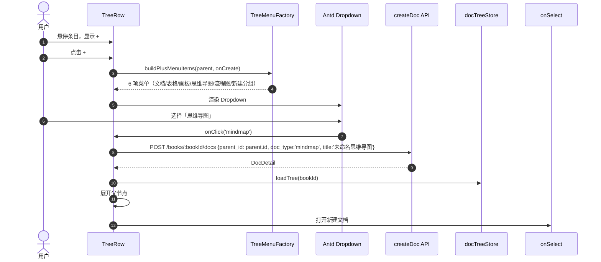
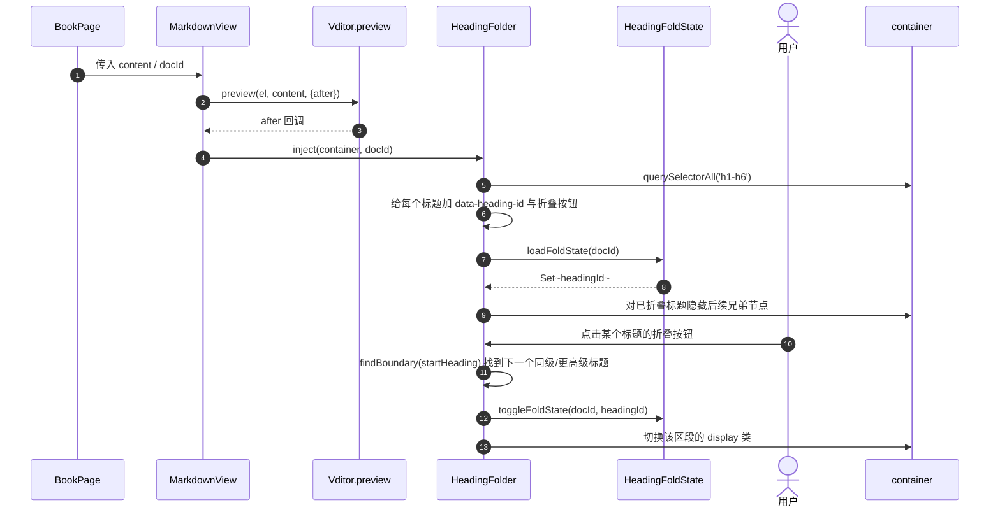
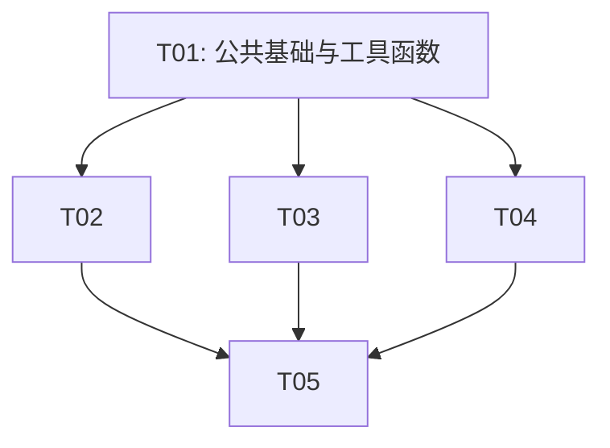

# 语雀核心交互复刻 · 增量系统架构设计

> 项目根目录：`/Users/macro/Work/go/src/github.com/maczh/haiku-wiki`  
> 设计范围：仅描述本次增量改动；现有 dnd-kit 拖拽、右键菜单、3s 自动保存、Vditor IR 渲染等能力保持不变。  
> 交付物：本设计文档 + `docs/class-diagram.mermaid` + `docs/sequence-diagram.mermaid`

---

## Part A: 系统架构设计

### 1. 实现方案与框架选型

#### 1.1 核心技术挑战

| 挑战 | 说明 | 应对策略 |
|------|------|----------|
| 目录树 hover「⋮」+「+」与 dnd-kit/右键菜单共存 | TreeRow 已被 `useSortable` 包裹，右键菜单也挂在一个 Dropdown 上；新增 hover 按钮不能截断拖拽、不能破坏 contextMenu 触发 | hover 按钮使用独立 `Dropdown trigger={['click']}`，仅渲染在 row 内部；点击事件 `stopPropagation`，不覆盖整行的右键菜单 |
| 阅读视图标题折叠 | MarkdownView 用 `Vditor.preview` 异步渲染，渲染后 DOM 才出现 h1-h6；折叠需后处理 DOM 并持久化状态 | 在 `Vditor.preview` 的 `after` 回调中调用 `HeadingFolder.inject()`，给标题注入折叠按钮；状态持久化到 `localStorage`，key 按 `docId` 隔离 |
| Vditor IR 块级操作不破坏状态机 | Vditor IR 同时维护 DOM 与 Markdown 两份状态；直接改 DOM 会被输入事件覆盖 | **以 Markdown 源串为唯一真源**：通过 `data-block` 行号定位块，修改源串后调用 `vd.setValue()` 写回，触发原有 `input` 回调与 3s 自动保存 |
| 块手柄菜单与现有 NotionEditing 组件整合 | 代码库已有 `NotionEditing.tsx` 提供行首 `/` 与左侧手柄，但菜单结构与本 PRD 要求的语雀菜单不同 | 保留其事件监听与定位逻辑，重写菜单分组与 action 路由，使其对齐「转化为/删除/复制/剪切/缩进/复制链接/在下方添加」 |
| 折叠状态按文档隔离 | 同一用户看多篇文档，折叠状态不能串 | localStorage key 使用 `hk.fold.heading:<docId>`，value 为折叠 heading id 集合的 JSON |

#### 1.2 框架与库选择

沿用现有技术栈，**不引入新的运行时依赖**：

- **React 18 + Vite 5**：保持现有组件化与构建流程。
- **Ant Design 5**：Dropdown / Menu / Tooltip / Modal / message 等全部复用。
- **Vditor 3.10.8（IR 模式）**：编辑器与阅读渲染统一来源；块手柄依赖其 `data-block` 属性。
- **dnd-kit**：目录树拖拽排序保持不变。
- **TypeScript 5.5**：`tsc --noEmit` 零报错为硬性验收。

无需新增第三方库。标题折叠、块操作、菜单工厂均用原生 DOM + Markdown 文本处理实现。

#### 1.3 架构模式

- **视图层**：React 函数组件 + Hooks，保持无状态 UI 与业务 handler 分离。
- **工具层**：新增纯函数模块（`internalLink.ts`、`headingFold.ts`、`treeMenu.ts`、`notionBlocks.ts` 扩展），便于单元测试。
- **扩展层**：DOM 后处理仅作为「渲染后装饰」，不替代 Vditor 状态；所有可写操作回写到 Markdown 源串。
- **状态持久化**：localStorage 仅保存 UI 偏好（折叠状态），不保存业务数据。

---

### 2. 文件清单

#### 2.1 新建文件

| 相对路径 | 说明 |
|----------|------|
| `web/src/lib/internalLink.ts` | 内部深链生成器（`/books/:bookId?docId=:id&tab=...`） |
| `web/src/lib/headingFold.ts` | 标题折叠状态 localStorage schema + 折叠/展开工具函数 |
| `web/src/lib/treeMenu.ts` | 目录树 hover「⋮」菜单与「+」新建菜单的工厂函数 |
| `web/src/components/editor/notion/FormatToolbar.tsx` | 选中文本时的格式浮层（H1–H6 / 加粗 / 列表 / 待办 / 行内代码 / 高亮 / 引用 / 折叠块） |

#### 2.2 修改文件

| 相对路径 | 改动说明 |
|----------|----------|
| `web/src/lib/notionBlocks.ts` | 扩展 BlockKind（增加 `callout`、`details`）、新增块级操作函数（delete/copy/cut/indent/copyLink/insertBelow）与菜单模板 |
| `web/src/components/tree/DocTree.tsx` | TreeRow 增加 hover 显隐的 ⋮ 按钮与 + 按钮；绑定复制链接、新标签页打开、移出目录、快速新建等 handler |
| `web/src/components/tree/KnowledgeTree.tsx` | `titleRender` 中文档节点增加 hover 显隐的 ⋮ 与 +；复用 `treeMenu.ts` 工厂 |
| `web/src/components/reader/MarkdownView.tsx` | `Vditor.preview` 完成后调用标题折叠注入 |
| `web/src/components/reader/reader.css` | 折叠按钮、折叠态隐藏、hover 提示的样式 |
| `web/src/components/editor/VditorEditor.tsx` | 挂载 `FormatToolbar`；确认 `writeValue` 写回后触发自动保存 |
| `web/src/components/editor/notion/NotionEditing.tsx` | 重构块手柄菜单为语雀结构：主菜单 + 「转化为」子菜单 + 「缩进」子菜单 + 「在下方添加」子菜单；增加删除/复制/剪切/复制链接 action |
| `web/src/index.css` | 目录树 hover 按钮显隐、块手柄光标等全局微调 |

#### 2.3 可能无改动的依赖文件（T01 做版本/类型核对）

| 相对路径 | 说明 |
|----------|------|
| `web/package.json` | 确认无新增依赖；本次为零新增 |
| `web/tsconfig.json` | 确认类型配置无需调整 |

---

### 3. 数据结构与接口

```mermaid
classDiagram
    direction TB

    class InternalLink {
        +static link(bookId: number, docId?: number, tab?: string): string
        +static absolute(bookId: number, docId?: number, tab?: string): string
    }

    class HeadingFoldState {
        -static key(docId: number): string
        +static load(docId: number): Set~string~
        +static save(docId: number, ids: Set~string~): void
        +static toggle(docId: number, headingId: string): Set~string~
    }

    class TreeMenuFactory {
        +static buildItems(ctx: TreeMenuContext): MenuProps['items']
        +static buildPlusItems(ctx: PlusMenuContext): MenuProps['items']
    }

    class BlockMenuFactory {
        +static buildMainItems(ctx: BlockMenuContext): MenuProps['items']
        +static buildConvertItems(ctx: BlockMenuContext): MenuProps['items']
        +static buildIndentItems(ctx: BlockMenuContext): MenuProps['items']
        +static buildAddBelowItems(ctx: BlockMenuContext): MenuProps['items']
    }

    class MarkdownBlockOps {
        +static deleteBlock(lines: string[], start: number, end?: number): string[]
        +static copyBlock(lines: string[], start: number, end?: number): string
        +static cutBlock(lines: string[], start: number, end?: number): [string[], string]
        +static indentBlock(lines: string[], start: number, end?: number, delta: number): string[]
        +static insertBelow(lines: string[], index: number, tpl: string[]): string[]
    }

    class NotionBlocks {
        <<existing utility>>
        +detectBlockKind(line: string): BlockKind
        +convertLine(line: string, kind: BlockKind): string
        +applyInlineStyle(line: string, style: InlineStyle): string
        +replaceLine(lines: string[], index: number, replacement: string[]): string[]
        +insertAfterLine(lines: string[], index: number, addition: string[]): string[]
    }

    class MarkdownView {
        -content: string
        -onRendered?: (el: HTMLElement) => void
        +render(): JSX.Element
    }

    class HeadingFolder {
        +static inject(container: HTMLElement, docId: number): void
        +static bind(container: HTMLElement, docId: number): void
        -static findBoundary(start: HTMLElement): HTMLElement | null
    }

    class NotionEditing {
        -hostRef: RefObject~HTMLDivElement~
        -getValue(): string
        -writeValue(md: string, caretBlock?: number): void
        -onHostInsert(...): void
        -ready: boolean
        +render(): JSX.Element
    }

    class FormatToolbar {
        -hostRef: RefObject~HTMLDivElement~
        -getValue(): string
        -writeValue(md: string, caretBlock?: number): void
        +render(): JSX.Element | null
    }

    class DocTree {
        -bookId: number
        -selectedId: number | null
        -onSelect(id: number): void
        +render(): JSX.Element
    }

    class TreeRow {
        -node: DocNode
        -depth: number
        -canWrite: boolean
        -onCreateChild(parent: DocNode): void
        -onRename(node: DocNode): void
        -onEdit(node: DocNode): void
        -onDuplicate(node: DocNode): void
        -onMove(node: DocNode): void
        -onExport(node: DocNode): void
        -onShare(node: DocNode): void
        -onPin(node: DocNode): void
        -onDelete(node: DocNode): void
        -onOpenInNewTab(node: DocNode): void
        -onCopyLink(node: DocNode): void
        -onMoveOut(node: DocNode): void
        +render(): JSX.Element
    }

    DocTree "1" *-- "0..*" TreeRow : renders
    TreeRow ..> TreeMenuFactory : uses
    TreeMenuFactory ..> InternalLink : generates link
    MarkdownView ..> HeadingFolder : post-process
    HeadingFolder ..> HeadingFoldState : persists state
    NotionEditing ..> BlockMenuFactory : builds menu
    NotionEditing ..> MarkdownBlockOps : block actions
    NotionEditing ..> NotionBlocks : convert / insert
    FormatToolbar ..> NotionBlocks : apply format
    VditorEditor "1" *-- "1" NotionEditing : contains
    VditorEditor "1" *-- "1" FormatToolbar : contains
```



#### 关键类型签名

```ts
// web/src/lib/internalLink.ts
export function internalLink(
  bookId: number,
  docId?: number,
  tab?: 'read' | 'edit',
): string

// web/src/lib/headingFold.ts
export interface HeadingFoldSchema {
  version: 1
  ids: string[]
}
export function loadFoldState(docId: number): Set<string>
export function saveFoldState(docId: number, ids: Set<string>): void
export function toggleFoldState(docId: number, headingId: string): Set<string>

// web/src/lib/treeMenu.ts
export interface TreeMenuContext {
  node: DocNode
  bookId: number
  canWrite: boolean
  handlers: TreeMenuHandlers
}
export interface TreeMenuHandlers {
  onRename: () => void
  onEdit: () => void
  onCopyLink: () => void
  onOpenInNewTab: () => void
  onMoveOut: () => void
  onDuplicate: () => void
  onMove: () => void
  onExport: () => void
  onPin: () => void
  onDelete: () => void
}
export function buildTreeMenuItems(ctx: TreeMenuContext): MenuProps['items']
export function buildPlusMenuItems(
  parent: DocNode,
  onCreate: (docType: DocType) => void,
): MenuProps['items']

// web/src/lib/notionBlocks.ts 扩展
export type BlockKind =
  | 'paragraph' | 'h1' | 'h2' | 'h3' | 'h4' | 'h5' | 'h6'
  | 'ul' | 'ol' | 'task' | 'quote' | 'code' | 'hr' | 'table'
  | 'callout' | 'details'

export interface BlockRange {
  start: number
  end: number
}
export function detectBlockRange(lines: string[], index: number): BlockRange
export function deleteBlock(lines: string[], range: BlockRange): string[]
export function copyBlock(lines: string[], range: BlockRange): string
export function indentBlock(lines: string[], range: BlockRange, delta: number): string[]
export function insertBelow(lines: string[], index: number, tpl: string[]): string[]
```

---

### 4. 程序调用流程

#### 4.1 目录树 hover「⋮」菜单点「复制链接」

```mermaid
sequenceDiagram
    autonumber
    actor U as 用户
    participant Row as TreeRow
    participant Factory as TreeMenuFactory
    participant Link as InternalLink
    participant DD as Antd Dropdown
    participant API as 浏览器 Clipboard

    U->>Row: 鼠标悬停目录树条目
    Row->>Row: 显示 ⋮ 按钮（hover 显隐）
    U->>Row: 点击 ⋮
    Row->>Factory: buildTreeMenuItems(ctx)
    Factory-->>Row: MenuProps['items']
    Row->>DD: 渲染 Dropdown
    U->>DD: 点击「复制链接」
    DD->>Row: onClick('copyLink')
    Row->>Link: internalLink(bookId, node.id)
    Link-->>Row: /books/:bookId?docId=:id
    Row->>API: navigator.clipboard.writeText(link)
    Row->>message: message.success('链接已复制')
```

#### 4.2 目录树「+」快速新建



#### 4.3 阅读视图标题折叠



#### 4.4 编辑器块手柄「在下方添加」

```mermaid
sequenceDiagram
    autonumber
    actor U as 用户
    participant NE as NotionEditing
    participant Host as Vditor DOM 容器
    participant Factory as BlockMenuFactory
    participant DD as Antd Dropdown
    participant Ops as MarkdownBlockOps
    participant NB as NotionBlocks
    participant VE as VditorEditor
    participant Vd as Vditor

    U->>Host: 鼠标移到块左侧留白
    NE->>Host: mousemove 监听
    NE->>NE: blockAtPoint → 命中 data-block 元素
    NE->>NE: setHover({el, block, top, left})
    U->>NE: 点击 ⋮⋮ 手柄
    NE->>Factory: buildMainItems(block, kind)
    Factory-->>NE: 主菜单项
    NE->>DD: 渲染 Dropdown
    U->>DD: hover「在下方添加」
    DD->>Factory: buildAddBelowItems()
    Factory-->>DD: 二级菜单（图片/表格/代码块/引用/高亮块/标题/列表/思维导图/流程图/公式）
    U->>DD: 点击「流程图(mermaid)」
    DD->>NE: onClick('add:flowchart')
    NE->>NB: mermaidFlowTemplate
    NB-->>NE: ['```mermaid', 'flowchart TD', '    A --> B', '```']
    NE->>Ops: insertBelow(lines, block, tpl)
    Ops-->>NE: newLines
    NE->>VE: writeValue(newMd, caretBlock)
    VE->>Vd: setValue(newMd)
    VE->>VE: latestRef.current = newMd; dirtyRef.current = true
    VE->>VE: setTimeout(doSave('auto'), 3000)
```

---

### 5. 待明确事项与假设

1. **块手柄「复制链接」的语义**：语雀可复制块级锚点链接，但当前系统无块锚点（heading id 未写入 URL）。本设计假设点击后复制**文档级深链** `/books/:bookId?docId=:id`，与目录树「复制链接」保持一致；如需块锚点，需额外设计 heading slug 与 URL hash，建议作为后续迭代。
2. **「高亮块」的 Markdown 表达**：语雀高亮块是带背景色的 callout。本设计使用标准 blockquote + 前缀 emoji 近似（如 `> 💡 提示内容`），可被 Vditor 正常渲染；如需彩色 callout，需扩展 Markdown 语法或渲染后处理。
3. **「折叠块」的 Markdown 表达**：使用 HTML `<details><summary>标题</summary>内容</details>`，Vditor IR 模式下会以原始 HTML 渲染；阅读态通过 DOMPurify 保留该标签。
4. **图片/附件插入**：块菜单中的「图片」「附件」沿用现有 `VditorEditor` 的隐藏文件选择框与 `uploadWithDedup` 链路，不新增上传逻辑。
5. **标题折叠对大纲的影响**：标题折叠后隐藏正文，但右侧大纲锚点仍保留；点击大纲锚点会展开对应标题（临时行为），滚动完成后再恢复折叠态，避免大纲失效。

---

## Part B: 任务分解

### 6. 依赖包

本次增量**不新增任何第三方运行时依赖**。所需能力均已包含在现有依赖中：

- `antd@^5.21.0`：Dropdown / Menu / Tooltip / Modal / message
- `vditor@^3.10.8`：IR 编辑器与 preview 渲染
- `react@^18.3.1` / `react-dom@^18.3.1`：组件与事件
- `typescript@^5.5.4`：类型检查

> 若工程师在实现过程中发现需要 DOM 范围/选择辅助库，请先在实现前向架构师确认；目前评估不需要。

---

### 7. 任务列表

| 任务 ID | 任务名称 | 源文件 | 依赖 | 优先级 | 验收点 |
|---------|----------|--------|------|--------|--------|
| **T01** | 公共基础与工具函数 | `web/package.json`（核对无新增依赖）<br>`web/tsconfig.json`（核对类型配置）<br>`web/src/lib/internalLink.ts`（新建）<br>`web/src/lib/headingFold.ts`（新建）<br>`web/src/lib/treeMenu.ts`（新建）<br>`web/src/lib/notionBlocks.ts`（扩展类型与操作） | 无 | P0 | 1. 深链生成单元测试通过 `/books/:bookId?docId=:id`<br>2. headingFold localStorage 读写隔离 docId<br>3. treeMenu 工厂能同时产出 contextMenu 与 hover 菜单<br>4. notionBlocks 新增 `BlockKind` / `deleteBlock` / `copyBlock` / `indentBlock` / `insertBelow` 且 `tsc` 无报错 |
| **T02** | 目录树交互增强（hover ⋮ +「+」新建） | `web/src/components/tree/DocTree.tsx`<br>`web/src/components/tree/KnowledgeTree.tsx`<br>`web/src/index.css` | T01 | P0 | 1. DocTree 与 KnowledgeTree 的文档行 hover 均显示 ⋮ 与 +<br>2. ⋮ 菜单顺序：重命名/编辑文档/复制链接/在新标签页打开/移出目录｜复制…/移动…/导出…/置顶(取消置顶)｜删除<br>3. + 菜单 6 项：文档/表格/画板/思维导图/流程图/新建分组；点击后在当前条目下新建并打开<br>4. dnd-kit 拖拽与右键菜单行为不变<br>5. 无权限时对应菜单项置灰 |
| **T03** | 阅读视图标题折叠 | `web/src/components/reader/MarkdownView.tsx`<br>`web/src/components/reader/reader.css`<br>`web/src/lib/headingFold.ts` | T01 | P0 | 1. MarkdownView 渲染完成后 h1-h6 出现折叠按钮<br>2. 点击折叠：隐藏到下一个同级/更高级标题之间的内容<br>3. 折叠状态按 `docId` 写入 localStorage，刷新后保持<br>4. mermaid 块在折叠/展开过程中不重复渲染、不丢失<br>5. 不影响非 Markdown 文档类型 |
| **T04** | 编辑器块手柄与格式浮层 | `web/src/components/editor/notion/NotionEditing.tsx`<br>`web/src/components/editor/notion/FormatToolbar.tsx`<br>`web/src/components/editor/VditorEditor.tsx`<br>`web/src/lib/notionBlocks.ts` | T01 | P0/P1 | 1. 块手柄 ⋮⋮ 菜单结构对齐 PRD：转化为/删除/复制/剪切/缩进/复制链接/在下方添加<br>2. 「转化为」子菜单：标题(H1-H6)/段落/引用/高亮块/列表/待办/代码块<br>3. 「在下方添加」子菜单：图片/表格/代码块/引用/高亮块/标题/列表/思维导图(mermaid)/流程图(mermaid)/公式<br>4. 删除/复制/剪切/缩进通过 Markdown 源串修改后 `setValue` 写回，不破坏 Vditor 状态<br>5. 选中文本弹出格式浮层：H1-H6/加粗/列表/待办/行内代码/高亮/引用/折叠块<br>6. 所有改动触发 3s 自动保存 |
| **T05** | 集成、构建与回归验证 | `web/src/pages/BookPage.tsx`（如需调整集成）<br>`web/src/main.tsx`（核对入口）<br>`tools/build/build-embed.sh`<br>后端 Go 构建 | T02, T03, T04 | P0 | 1. `cd web && npm run build`（即 `tsc --noEmit && vite build`）零报错<br>2. 执行 `bash tools/build/build-embed.sh` 成功<br>3. 后端 `GOTOOLCHAIN=local /usr/local/go/bin/go build ./...` 成功<br>4. 手动回归：目录树 hover 菜单、+ 新建、阅读折叠、编辑器块手柄/格式浮层均可用<br>5. 自动保存、右键菜单、dnd-kit 拖拽无回归 |

---

### 8. 共享知识

1. **内部深链格式**：统一使用 `/books/:bookId?docId=:id&tab=read|edit`。`BookPage` 已读取 `searchParams.get('docId')` 与 `bookId` path param，无需新增路由。
2. **菜单工厂复用**：`treeMenu.ts` 产出的 `MenuProps['items']` 同时用于右键菜单（`trigger={['contextMenu']}`）与 hover 按钮菜单（`trigger={['click']}`），确保文案、顺序、禁用逻辑一致。
3. **DOM 扩展不破坏 Vditor 状态机**：所有可写块操作必须修改 Markdown 源串并通过 `vd.setValue()` 回写；禁止直接修改 `.vditor-ir__node` 的 DOM 结构。
4. **自动保存触发方式**：`VditorEditor.writeValue()` 内部设置 `dirtyRef.current = true` 并启动 3s 定时器调用 `doSave('auto')`。所有块操作统一走 `writeValue`，不得绕过。
5. **主题 light 适配**：标题折叠按钮、hover 按钮、格式浮层均使用 `#8a919f` / `#eef1f6` / `#fff` 等语雀 light 配色；不引入暗色变量，保持与现有 UI 一致。
6. **块边界判定**：`notionBlocks.detectBlockRange(lines, index)` 负责把单行索引扩展为多行块（代码块围栏、表格、details 标签等），`delete/copy/cut/indent` 必须基于 `BlockRange` 而非单行。
7. **localStorage key 命名**：标题折叠使用 `hk.fold.heading:<docId>`；避免与现有 `hk.sidebar.*` / `hk.toc.*` 冲突。
8. **权限前置置灰**：树菜单中「编辑文档」「重命名」「复制…」「移动…」「置顶」「删除」在 `canWrite === false` 时 disabled；+ 新建按钮在 `canWrite === false` 时不渲染。

---

### 9. 任务依赖图



---

## 落定 PRD 的 Q1–Q5

### Q1：移出目录是否需要后端改动？

**结论：不需要后端改动。**

- 现有 `moveDoc(docId, { parent_id, prev_pos?, next_pos? })`（`PUT /api/docs/:id/move`）已支持 `parent_id: 0`，语义即「移到当前知识库根目录」。
- 现有 `moveDocToBook(docId, bookId, parentId = 0)`（`POST /api/docs/:id/move-to-book`）注释也明确：`parent_id 可选（0 或缺省 = 目标知识库根目录，否则为目标库内的目录/文档 id）`。
- 「移出目录」发生在**同一本书**内，只需调用 `moveDoc(node.id, { parent_id: 0 })`，成功后 `loadTree(bookId)`。
- 风险：无。后端 service 已做防环校验，前端无需额外校验。

### Q3/Q4：Vditor 块操作「在下方添加」「转化为」清单与实现路径

#### 最终块清单

**「转化为」子菜单（P1-5）**：
- 标题 → 二级展开 H1 / H2 / H3 / H4 / H5 / H6
- 段落
- 引用
- 高亮块
- 列表 → 二级展开 无序列表 / 有序列表
- 待办
- 代码块

**「在下方添加」子菜单（P1-2）**：
- 图片（走宿主上传弹窗）
- 表格
- 代码块
- 引用
- 高亮块
- 标题 → 二级展开 H1–H6
- 列表 → 二级展开 无序 / 有序
- 思维导图（mermaid）
- 流程图（mermaid）
- 公式

#### 实现路径

**推荐：操作 Markdown 源串定位替换，禁止 DOM 改写。**

原因：
- Vditor IR 模式每个顶层块都有 `data-block` 属性，值等于源串行号（从 0 开始）。
- 直接改 DOM 会被后续 `input` 事件或 `setValue` 覆盖，且可能破坏光标、历史记录、mermaid 渲染。
- 源串修改可单测、可回滚、与自动保存逻辑天然兼容。

#### 各操作具体策略

| 操作 | 实现策略 | 风险 |
|------|----------|------|
| **删除** | `detectBlockRange` 取块边界 → `lines.splice(start, end-start)` → `writeValue` | 低；多行块（代码块/表格）边界需正确识别 |
| **复制** | 取块源串文本 → `navigator.clipboard.writeText` | 低；纯前端 |
| **剪切** | 先复制再删除，原子操作 | 低；组合上述两步 |
| **缩进** | 对列表/段落行首统一加减 2 个空格（保持列表标记）；非列表行不支持缩进或仅做视觉缩进 | 中；需处理嵌套列表与任务列表标记 `-[x]` |
| **复制链接** | 调用 `internalLink(bookId, docId)` 写剪贴板；当前无块锚点 | 低；语义为文档级链接 |
| **在下方添加** | `insertAfterLine(lines, block, tpl)` → `writeValue(newMd, caretBlock)` | 低；图片/附件走宿主上传回调 |

#### 风险总评

- **高风险**：无。
- **中风险**：块边界识别（代码块、表格、mermaid 块、details 块）。建议新增 `detectBlockRange` 单测覆盖这些场景。
- **低风险**：菜单重组、剪贴板操作、状态持久化。

### Q5：复制链接格式是否确认 `/books/:bookId?docId=:id`？

**确认。**

- `BookPage.tsx` 路由为 `/books/:bookId`，并通过 `searchParams.get('docId')` 读取文档 ID。
- 该格式已天然支持深链，无需新增 `/doc/:id` 路由。
- 内部链接统一生成器：
  ```ts
  export function internalLink(bookId: number, docId?: number, tab?: 'read' | 'edit') {
    const params = new URLSearchParams()
    if (docId) params.set('docId', String(docId))
    if (tab) params.set('tab', tab)
    const qs = params.toString()
    return qs ? `/books/${bookId}?${qs}` : `/books/${bookId}`
  }
  ```
- 「在新标签页打开」直接 `window.open(internalLink(bookId, docId), '_blank')`。
