<div class="cover">

# 寄海文库 · 用户使用手册

<p class="cover-sub">一站式企业知识库：知识库、文档、协作、分享与导出</p>

<p class="cover-meta">适用版本：haiku-wiki（Go + React 单容器部署版）<br/>
文档版本：v2.0　　编制日期：2026 年 9 月</p>

</div>

## 写在前面

寄海文库把「知识库 → 目录树 → 文档」三级结构与十余种内容形态合并在一个系统里，
用一套账号、一套权限、一套搜索覆盖团队日常的全部文档场景：写文档、做表格、画脑图与流程、
排甘特与日程、收集需求原型、管理图纸与 Office 附件、导入导出、分享协作，都在同一处完成。

本手册面向**最终用户**，按实际操作顺序编排：从登录、建库、写文档，到导入导出、分享与协作，
每一步都配有真实界面截图。管理员专属功能单独成章。

> **阅读建议**：第一次使用，先看第 2 章与第 3 章建立整体印象；日常使用可把第 16 章
> 「效率技巧速查」当作索引。

<div class="pagebreak"></div>

## 目录

- [1 系统概览](#1-系统概览)
- [2 登录与账号](#2-登录与账号)
- [3 界面总览](#3-界面总览)
- [4 知识库（书架）](#4-知识库书架)
- [5 目录树与文档管理](#5-目录树与文档管理)
- [6 十一种内容类型](#6-十一种内容类型)
- [7 编辑、自动保存与历史版本](#7-编辑自动保存与历史版本)
- [8 阅读体验](#8-阅读体验)
- [9 导入](#9-导入)
- [10 导出](#10-导出)
- [11 搜索](#11-搜索)
- [12 分享](#12-分享)
- [13 协作与团队](#13-协作与团队)
- [14 回收站](#14-回收站)
- [15 管理员功能](#15-管理员功能)
- [16 效率技巧速查](#16-效率技巧速查)
- [17 常见问题](#17-常见问题)

<div class="pagebreak"></div>

## 1 系统概览

### 1.1 结构：知识库 → 目录 → 文档

```
知识库（书架上的「一本书」）
└── 产品资料           ← 目录（只用于分组，不承载正文）
    ├── 产品周报        ← 文档（Markdown）
    └── 历史版本        ← 目录（可多层嵌套）
└── 9 月费用报销明细    ← 文档（表格）
└── 包厢预订流程图      ← 文档（流程图）
```

- **知识库**是一组资料的隔离单位，有自己的可见性（私有 / 成员可见 / 公开）与成员范围。
- **目录**只是容器，用来分层归类；它不承载正文，也不会出现在搜索与「最近更新」里。
- **文档**是真正的内容，共 11 种可新建的类型，另有 2 种由导入产生的类型。

### 1.2 核心能力一览

| 分类 | 能力 |
| --- | --- |
| 组织 | 书架式知识库、多级目录树、拖拽排序、跨库移动、复制、置顶 |
| 内容 | 文档 / 表格 / 思维导图 / 流程图 / 绘图 / 待办清单 / 工作日历 / 甘特图 / 接口文档 / 图片库 / 需求原型 |
| 附件 | Word、PDF、PPT、CAD 图纸（DWG/DXF）、Visio 原文件保存 + 内置预览 |
| 检索 | 标题 + 正文搜索，权限过滤，关键词高亮与上下文片段 |
| 工作台 | 首页与文库内的待办 / 甘特 / 日历三卡聚合，最近更新，快捷操作 |
| 协作 | 文档协作者邀请、团队与团队文库、公司知识库写权限授权 |
| 分享 | 知识库公开分享、文档分享（可加密码与有效期）、微信二维码分享 |
| 版本 | 内容变化自动快照 + 手动快照 + 回滚，保留最近 20 版 |
| 流转 | 12 类格式导入、多格式服务端导出、整库打包导出 |
| 运维 | 单容器部署、SQLite / MySQL 双选、全离线运行（无外部 CDN） |

<div class="pagebreak"></div>

## 2 登录与账号

### 2.1 登录

浏览器打开系统地址（默认 `http://<服务器IP>:8080`），进入登录页。


- 账号栏支持 **用户名 / 手机号 / 邮箱** 三种形式，任选其一。
- 登录状态保存在浏览器本地，有效期为 **7 天**；过期后需重新登录。
- 同一 IP 的**注册**请求有 60 秒频率限制，超限提示「注册过于频繁」。

### 2.2 注册

点击登录页左下角「**还没有账号？立即注册**」进入注册页。

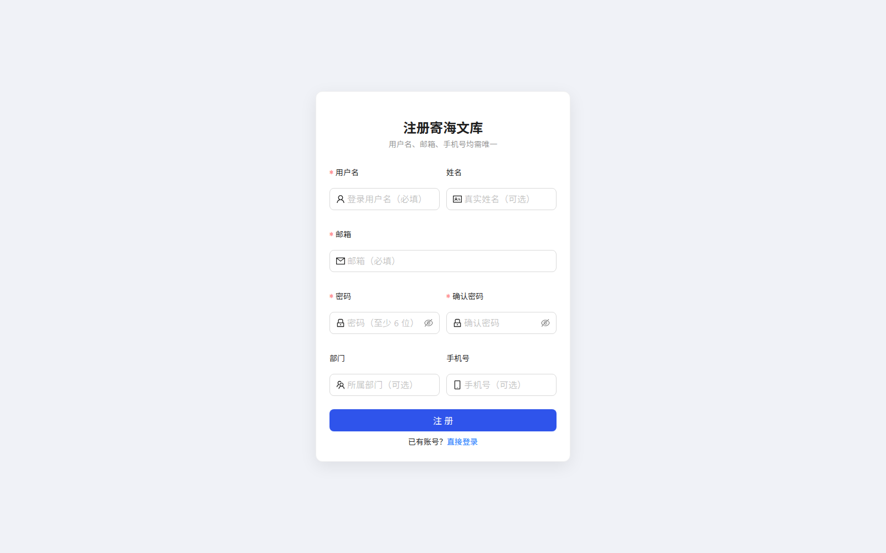

填写用户名、姓名、邮箱与密码即可自助注册。**新注册的账号一律是普通成员**，
若要成为管理员，需由现有管理员在数据库中调整角色，界面上不提供自助提权入口。

### 2.3 忘记密码

系统不提供自助找回。请联系管理员在「用户管理」中为你的账号**重置密码**，
重置后的密码仅在管理员界面上显示一次，请及时修改。

### 2.4 账号设置

点击右上角头像 →「**账号设置**」。

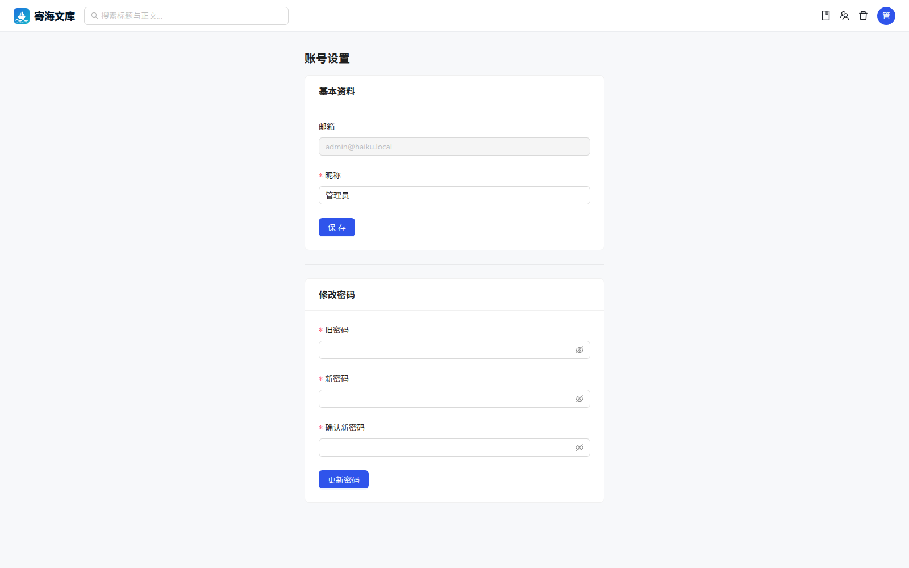

- **基本资料**：邮箱只读；可修改昵称，保存后立即生效。
- **修改密码**：需填写旧密码，新密码至少 6 位且两次输入一致。

<div class="pagebreak"></div>

## 3 界面总览

登录后进入主界面，自上而下分为**顶部导航栏**与**内容区**两部分。

### 3.1 顶部导航栏

| 元素 | 作用 |
| --- | --- |
| 寄海文库 Logo | 点击任意时刻返回首页 |
| 搜索框 | 输入关键词后回车，进入搜索结果页 |
| 书本图标 | 返回「我的知识库」首页 |
| 团队图标 | 进入团队列表（团队文库与成员管理） |
| 垃圾桶图标 | 进入回收站 |
| 头像菜单 | 账号设置 / 系统管理（仅管理员可见）/ 退出登录 |

### 3.2 首页（Dashboard）

首页同时承担「入口」与「导航」两个职责。首次进入时会展示**新手使用向导**与**视频介绍**，
两者都可以收起，且系统会记住你的选择。

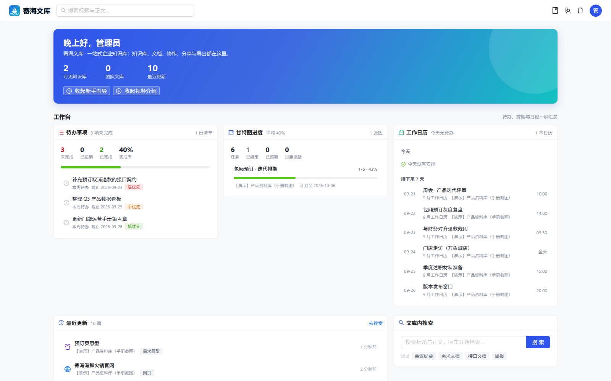

新手向导把上手路径拆成三步：

1. **新建知识库** —— 一个知识库就是书架上的「一本书」，用来隔离不同项目或团队的资料。
2. **新建文档** —— 支持九种类型，也可以直接导入现有文件。
3. **分享与协作** —— 在文档右键菜单里生成免登录分享链接，或邀请同事共同编辑。

视频介绍约 3 分钟，带语音讲解与字幕，章节包括：登录与首页、新建知识库、新建与编辑文档、
九种文档类型、搜索与分享、导出与总结。

收起向导与视频后，首页长这样：

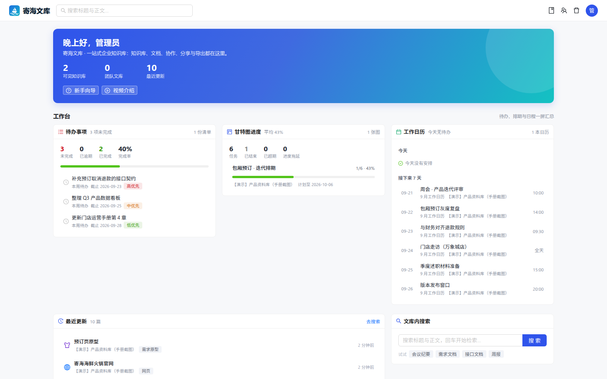

自上而下分为六个区块：

| 区块 | 说明 |
| --- | --- |
| 欢迎条 | 昵称与时间问候，以及「可见知识库 / 团队文库 / 最近更新」三项统计 |
| 工作台 | 待办事项、甘特图进度、工作日历三张卡片（本书没有任何一类时可整段隐藏） |
| 最近更新 + 文库内搜索 | 按更新时间倒序列出你可读的最近文档；右侧可直接在当前库内搜索 |
| 快捷操作 | 新建知识库、新建文档、导入文件、导入网页、全文搜索、团队、回收站、账号设置 |
| 书架 | 「我的知识库 / 团队知识库 / 公司知识库」三栏卡片区 |
| 团队速览 | 展示你参与的团队，可直达团队页 |

### 3.3 知识库页面

知识库页面采用**左右分栏**：左侧是可折叠、可拖拽调宽的文档目录树，右侧是阅读 / 编辑区域。

**未选中文档时**，右侧是「文库工作台」——把本库的待办、甘特、日历、最近更新与库内搜索
集中到一屏，方便随时接手：

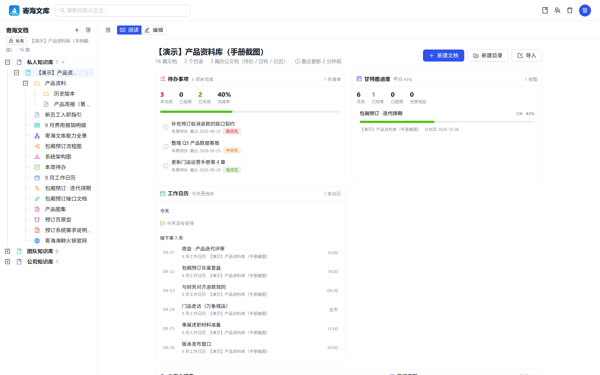

**选中文档后**，右侧切换为正文区，顶栏出现「阅读 / 编辑」切换、协作者与分享入口：

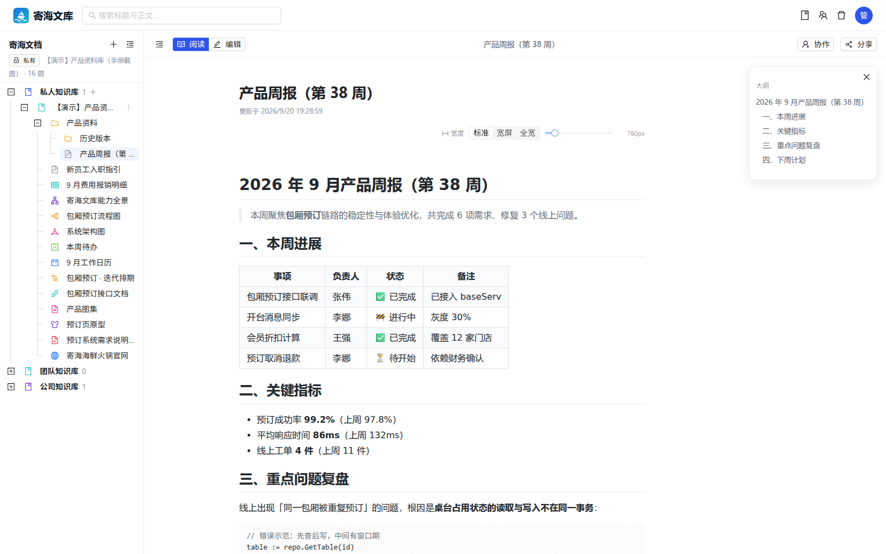

内容区右上角是可折叠的**大纲浮层**，它不随正文滚动；正文宽度可在「标准 / 宽屏 / 全宽」
之间切换，也可拖动手柄自由调整（600–1800px）。

<div class="pagebreak"></div>

## 4 知识库（书架）

### 4.1 新建知识库

首页「快捷操作 → 新建知识库」，或书架区右上角的「新建知识库」按钮。

需要填写：

| 字段 | 说明 |
| --- | --- |
| 封面色 | 卡片主色，用于书架上一眼区分 |
| 知识库名称 | 必填，例如「产品技术文档」 |
| 简介 | 一句话介绍（可选） |
| 可见性 | 私有 / 成员可见 / 公开 |

### 4.2 可见性说明

| 可见性 | 含义 |
| --- | --- |
| **私有** | 仅你可见（团队文库的成员也可读） |
| **成员可见** | 所有注册用户可读**可写** |
| **公开** | 任何人凭分享链接只读；系统自动生成公开分享短链 |

### 4.3 修改知识库

点击左侧栏书头的「**⋯**」按钮，或右键知识库节点，打开知识库菜单：

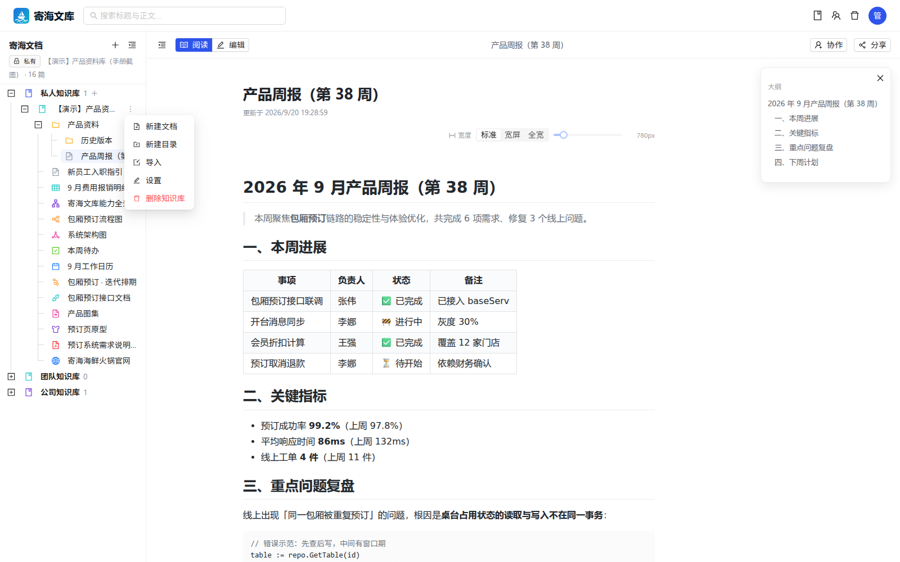

菜单里的「**编辑知识库**」可改封面色、名称与简介，「**删除知识库**」会连同库内全部文档一起移除：

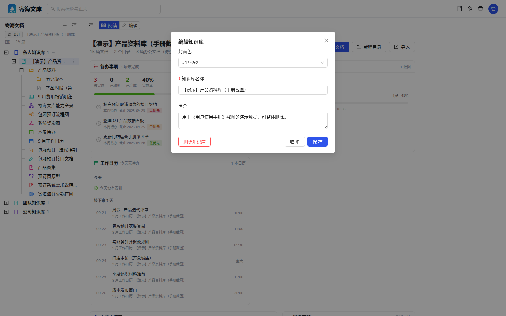

| 菜单项 | 作用 |
| --- | --- |
| 新建文档 | 在当前知识库内新建文档 |
| 新建目录 | 创建目录（容器）节点 |
| 导入 | 从文件 / 网址 / HTML 导入 |
| 设置 | 修改封面、名称、简介（公司知识库的管理员还可在此进入写权限管理） |
| 删除知识库 | 库内全部文档一并移入回收站，仅库所有者可执行 |

> **删除是软删**：文档会进入回收站，可随时恢复；但知识库本身的删除不可撤销。

<div class="pagebreak"></div>

## 5 目录树与文档管理

### 5.1 新建文档

点击左栏书头的「**＋**」，或知识库菜单 →「新建文档」。新建分两步：

**第一步 · 选择位置**

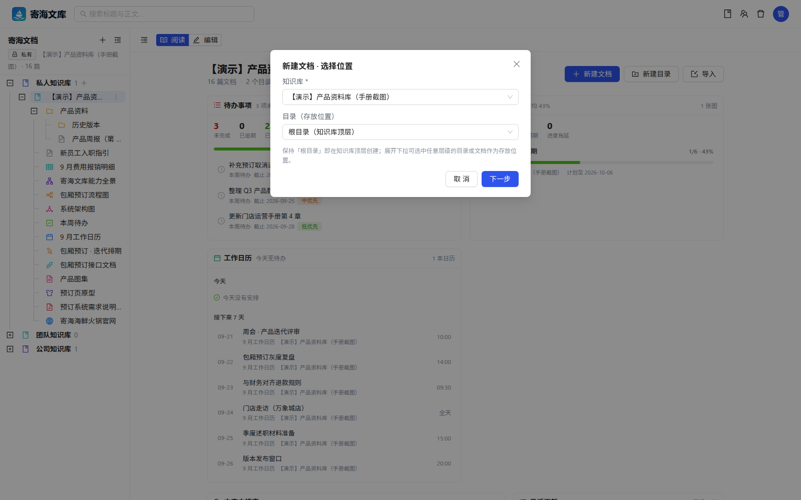

选择知识库与存放位置。保持「根目录（知识库顶层）」即建在顶层；
展开下拉可选中任意层级的目录或文档作为父级。

**第二步 · 填写信息**

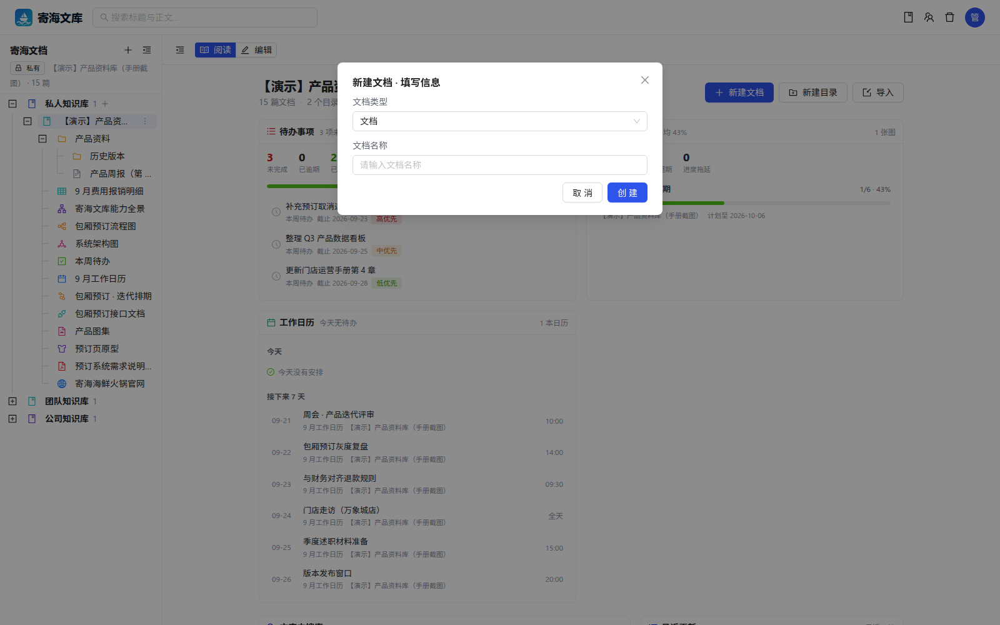

选择文档类型并填写名称。可选的 11 种类型：

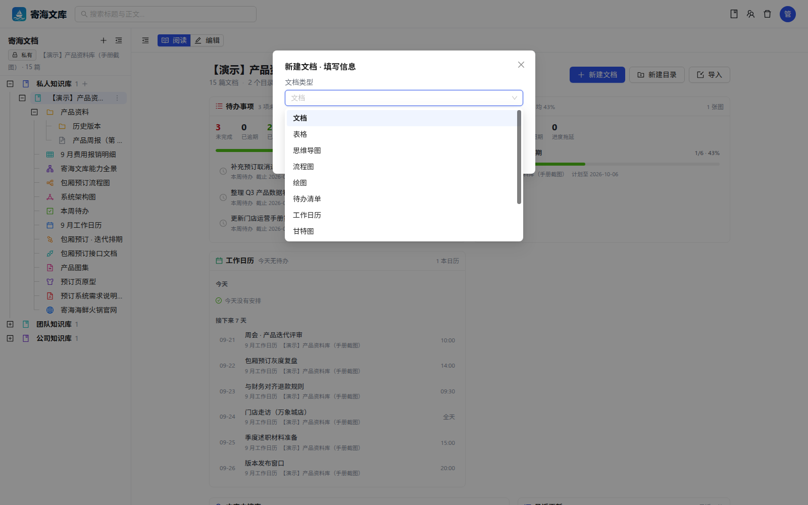

> 「需求原型」「图片库」在列表末尾，向下滚动可见。

### 5.2 右键菜单：一篇文档的全部操作

在左侧目录树的任意文档上**右键**，可以看到该文档可用的全部操作：

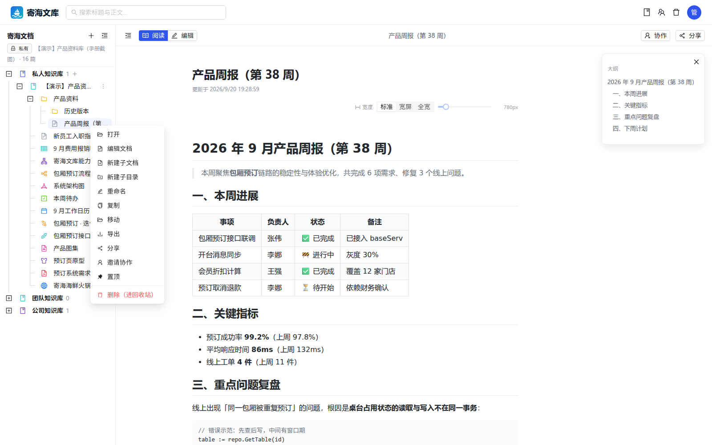

| 菜单项 | 说明 |
| --- | --- |
| 打开 | 在右侧打开该文档 |
| 编辑文档 | 直接进入编辑态 |
| 新建子文档 / 新建子目录 | 以当前文档为父级创建 |
| 重命名 | 就地修改标题 |
| 复制 | 连同整棵子树一起复制，副本标题追加「 副本」 |
| 移动 | 移动到其他知识库或目录 |
| 导出 | 打开导出对话框（见第 10 章） |
| 分享 | 生成免登录阅读链接（见第 12 章） |
| 邀请协作 | 邀请其他用户共同编辑（见第 13 章） |
| 置顶 / 取消置顶 | 在目录树中固定到该层级顶部 |
| 删除（进回收站） | 软删，可恢复 |

### 5.3 移动文档

选择「移动」后，弹窗提供**二级选择**：先选目标知识库，再选目标位置。

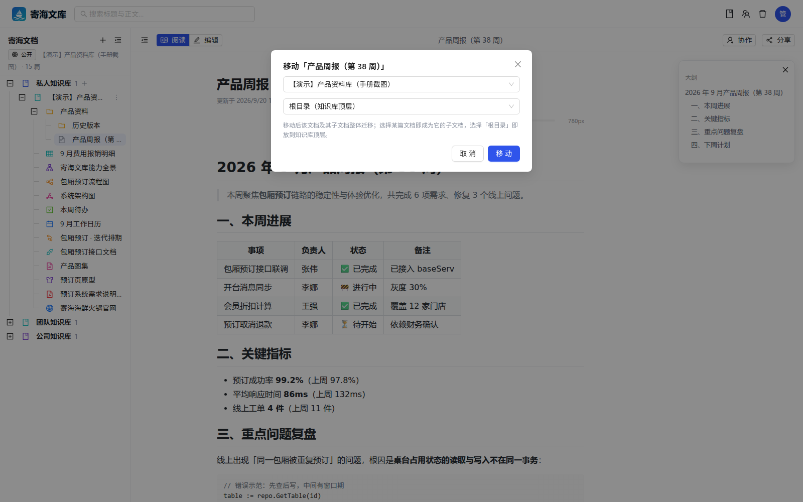

- 移动后该文档**及其全部子文档**整体迁移。
- 选择某篇文档即成为它的子文档；选择「根目录」即放到知识库顶层。
- 目标位置树中已自动摘除自身子树，因此不会出现「移到自己下面」这种非法操作。

### 5.4 复制文档

选择「复制」，同样是二级选择器：

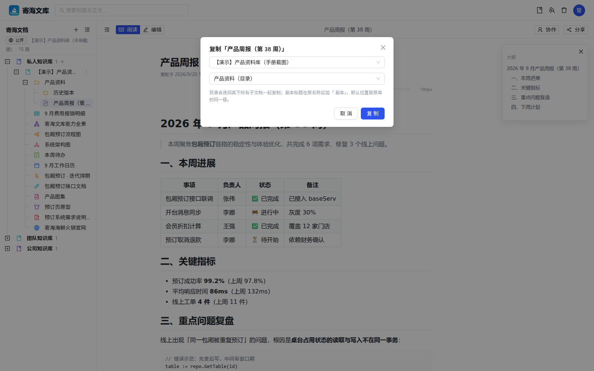

目录会连同其下所有子文档一起复制；副本标题在原名称后加「 副本」，默认位置是原库的同一级。

### 5.5 拖拽排序

目录树支持直接拖拽：

- 拖到**节点中部** → 成为该节点的子文档；
- 拖到**上下缝隙** → 同级排序；
- 拖到顶部的**知识库节点** → 跨知识库移动。

没有编辑权限、或目标不支持放置时，界面会给出明确提示（如「没有编辑权限，无法移动」
「不能移动到自身或其子孙节点下」）。

> **删除与恢复**：删除文档会连同其子文档一起进入回收站，可在回收站恢复或彻底删除（见第 14 章）。

<div class="pagebreak"></div>

## 6 十一种内容类型

每种类型都有**专用编辑器**与**专用阅读器**，读写界面同源，切换「阅读 / 编辑」不会丢失内容。

### 6.1 文档（Markdown）

最常用的类型：支持 Markdown 与富文本混合编辑，表格、代码块、引用、列表、图片、公式都能用。

| 阅读态（渲染后） | 编辑态（IR 模式） |
| --- | --- |
|  | 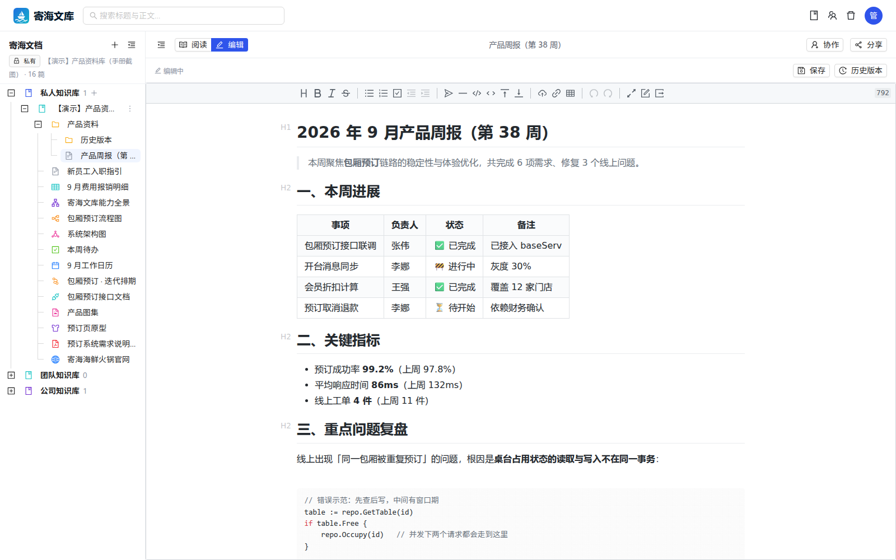 |

编辑器顶部是格式工具条；正文左侧会出现 Notion 风格的**行手柄**，把鼠标移到段落左侧即可：
拖动排序、转换段落类型、快速插入内容。输入 `/` 可以唤出斜杠菜单插入常用块。

### 6.2 表格

仿 Excel 的表格编辑器，支持多工作表、单元格样式、公式与冻结。

| 阅读态 | 编辑态 |
| --- | --- |
| 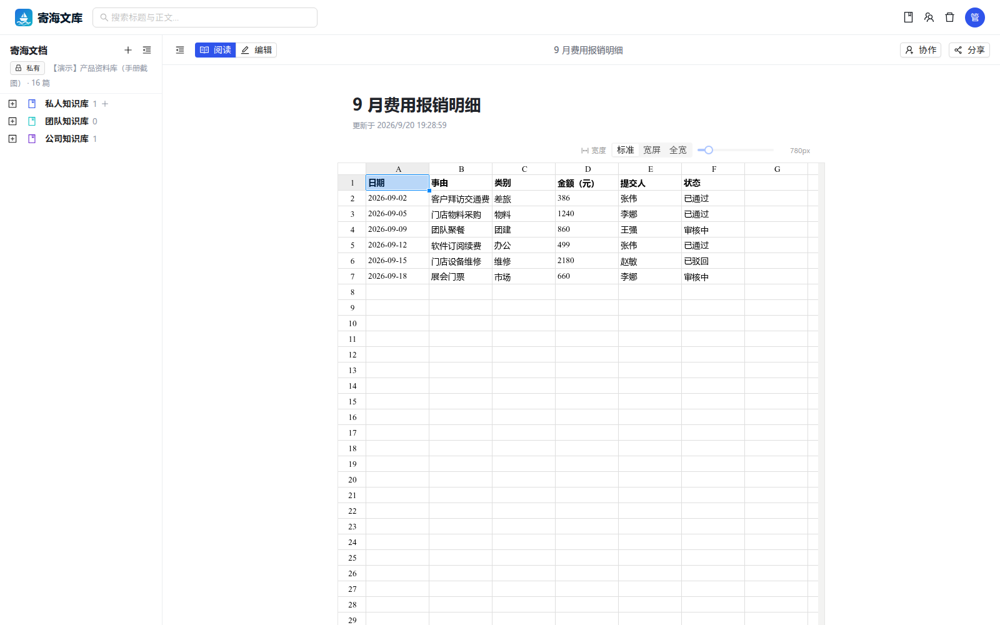 | 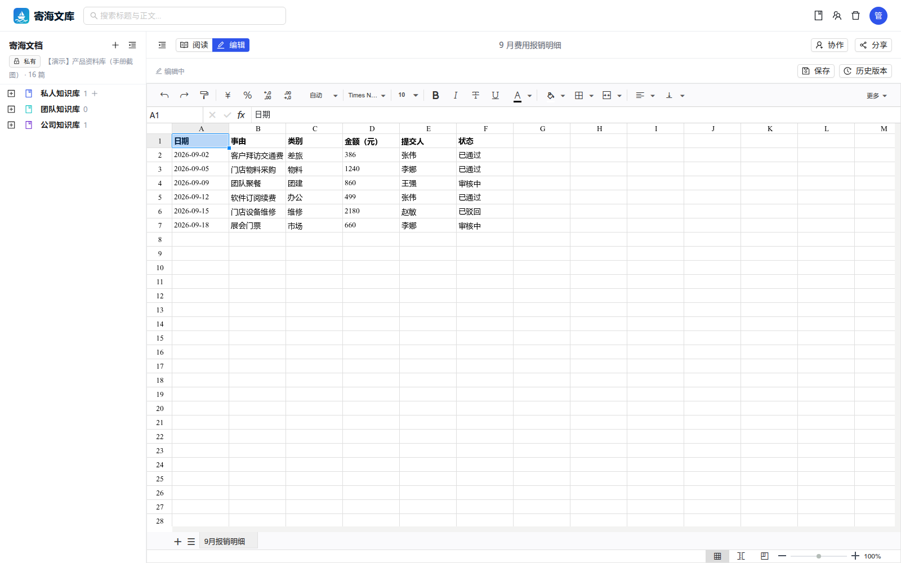 |

导入 `.xlsx` 时，**每个有内容的工作表会成为一个独立的表格子文档**，
父级是一个以文件名命名的「表格」节点，便于按工作表分别维护。

### 6.3 思维导图

基于 simple-mind-map：顶部两个工具条负责节点操作与保存导出，右下角是缩放条，
右侧竖排按钮打开「节点样式 / 基础样式 / 主题 / 结构 / 大纲 / 设置」六个面板。

| 阅读态 | 编辑态 |
| --- | --- |
| 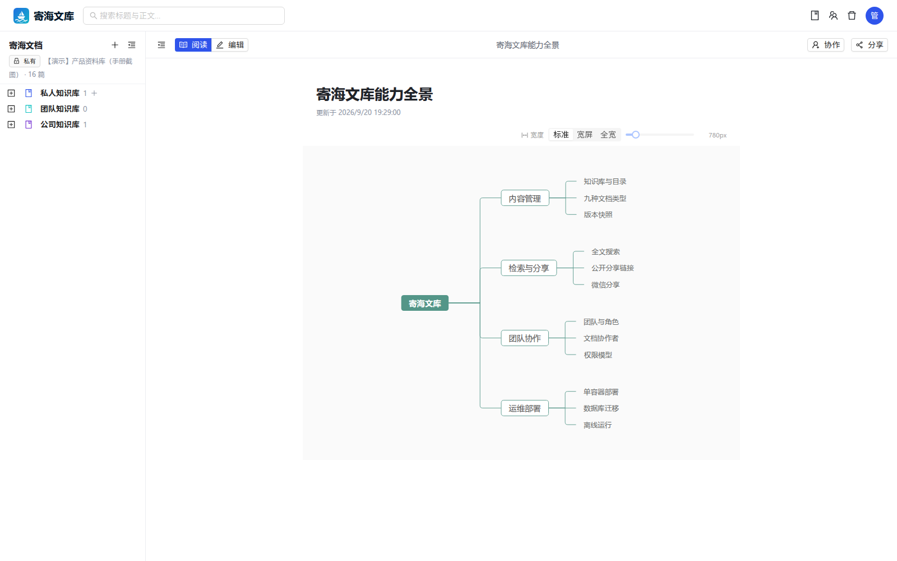 | 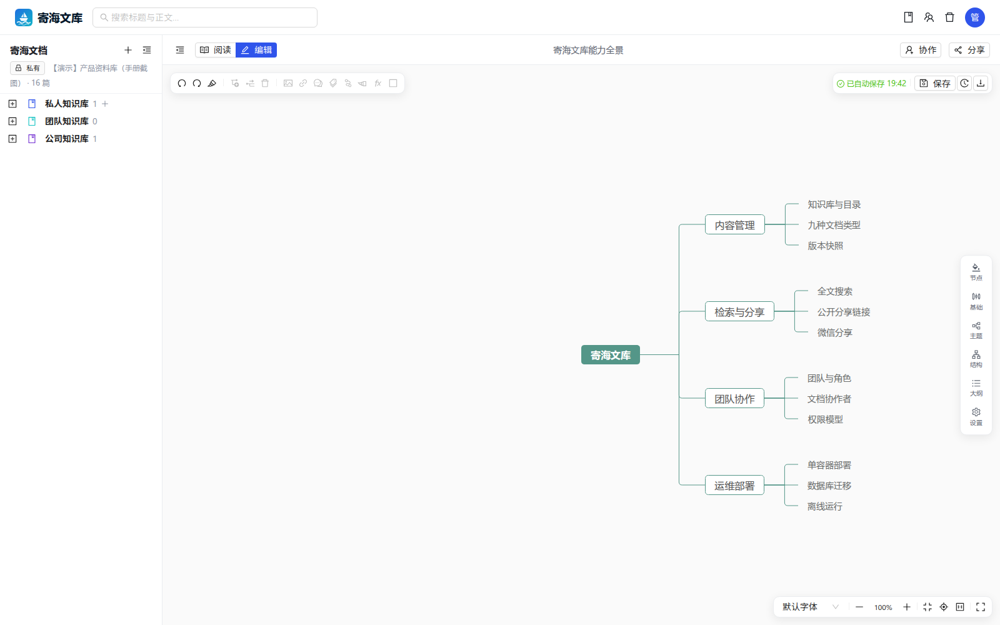 |

常用操作：添加同级 / 子节点、删除子树、插入图片与公式、设置超链接与备注、添加概要、
添加关联线、添加外框、格式刷、切换主题与结构。支持 `.smm` / `.km` / `.xmind` / `.mm` 导入导出。

### 6.4 流程图

左侧写 Mermaid 源码，右侧实时预览：

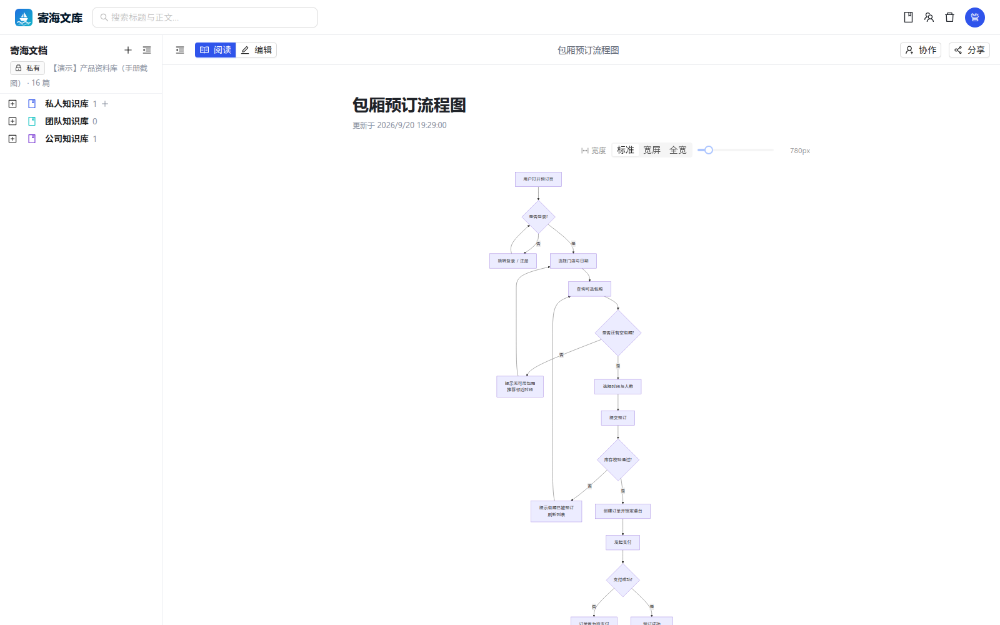

导出时可选择「Markdown + Mermaid 源码（.md）」「矢量图（.svg）」「图片（.png）」。

### 6.5 绘图（内嵌 draw.io）

完整的 draw.io 编辑器内嵌在页面里，形状库、素材库、导入导出与历史快照齐全：

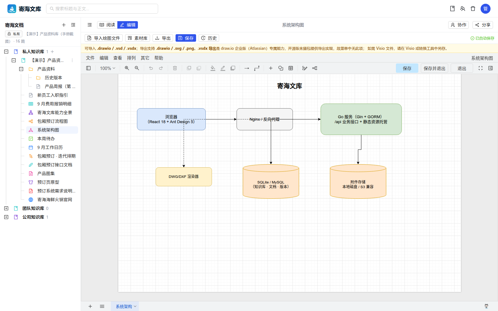

- **导入**：`导入绘图文件` 支持 `.drawio` / `.vsd` / `.vsdx`。
- **素材库**：打开 draw.io 原生「更多形状」，可添加内置素材库与搜索图标。
- **导出**：`导出` 菜单提供 `.drawio` / `.svg` / `.png`（这三个格式需在编辑器内导出，
  服务端导出对话框只提供 `.drawio`）。
- 阅读态直接渲染已保存的矢量图，不再加载绘图组件，因此打开很快：

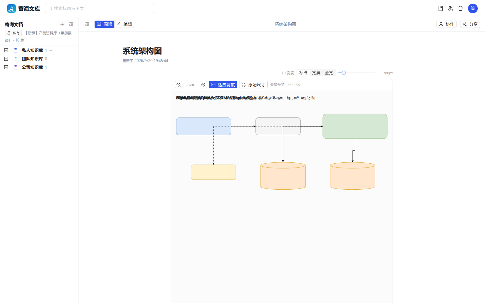

### 6.6 待办清单

为待办项设计了「截止时间 / 优先级 / 备注」三个结构化字段：

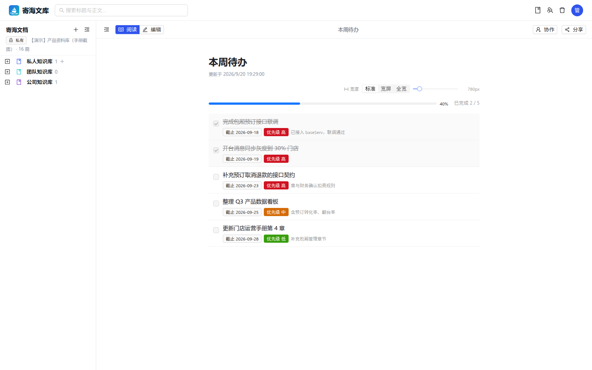

顶部显示「已完成 N / M」进度；每条可勾选完成、设置截止时间与优先级（高 / 中 / 低）、
写备注。底部输入框回车即可继续添加。可导出 `.xlsx` / `.md` / `.json`。

### 6.7 工作日历

按月查看的日程表，支持跨天任务、完成与取消状态：

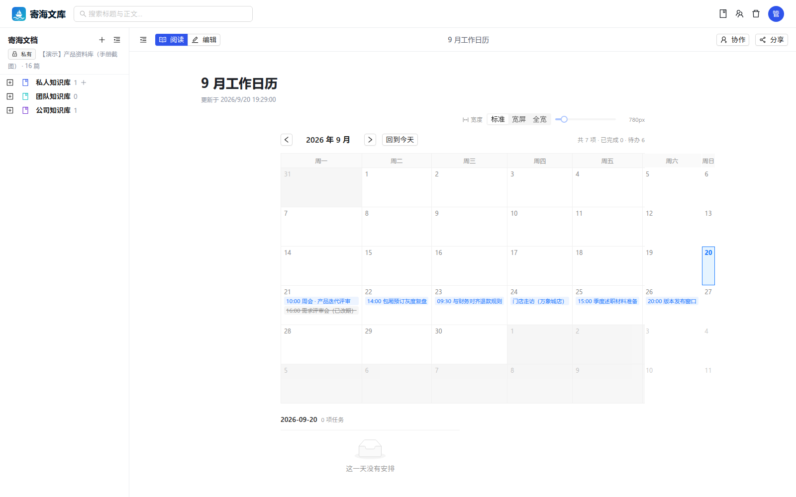

- 点击日期即可添加任务，可指定开始与结束时间；只填日期表示**全天**。
- 任务支持「标记完成 / 取消任务 / 修改 / 删除」。
- 可导出 `.xlsx` / `.ics`（`.ics` 可导入到系统日历）/ `.json`。

### 6.8 甘特图

用于排期与进度跟踪，左侧是任务表（名称、负责人、状态、优先级），右侧是时间轴：

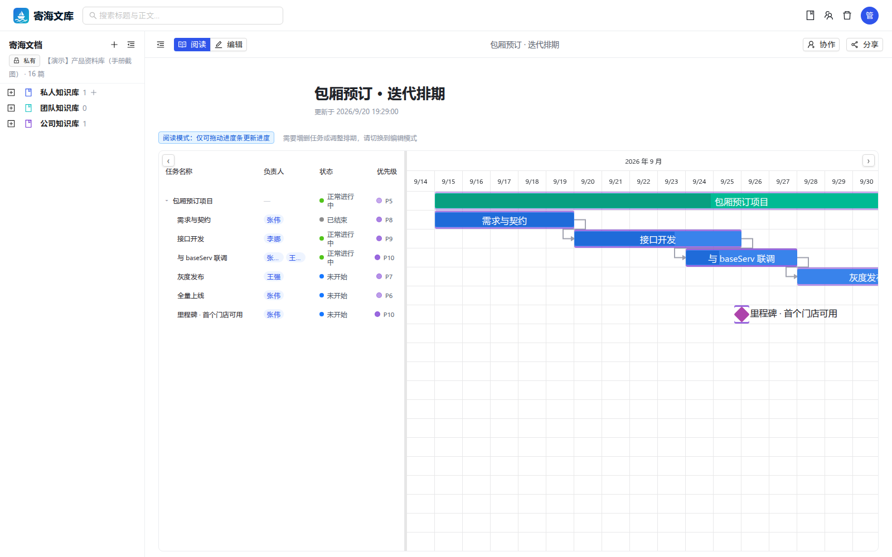

| 阅读态 | 编辑态 |
| --- | --- |
|  | 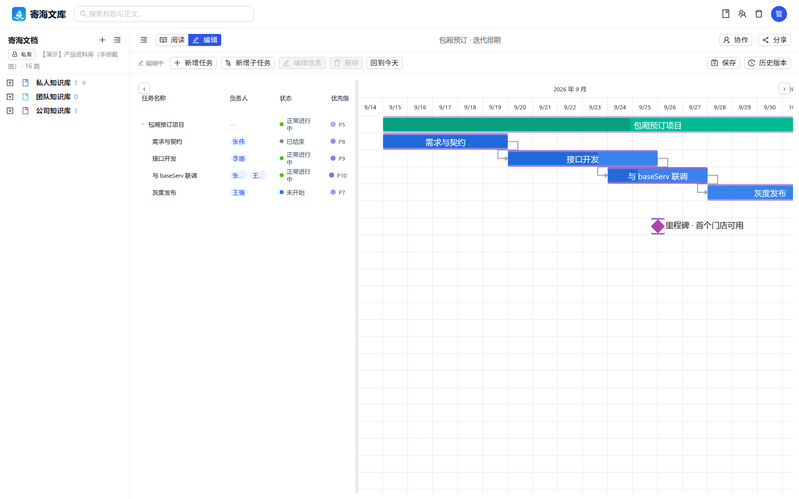 |

- 支持**任务 / 汇总任务 / 里程碑**三种形态，父子任务自动汇总进度。
- 支持**任务依赖**（完成-开始等四种类型）与彩色优先级外框。
- 编辑态可通过弹窗新增任务 / 子任务，填写名称、负责人（可多选）、优先级（P1–P10）、
  描述、开始日期、工期与进度。
- **拖动任务条可改期，拖动条上的圆形手柄可调整进度。**
- 阅读态对可写用户开放「仅可拖动进度条更新进度」，其余只读。

### 6.9 接口文档

仿 Apifox 的接口文档，含分组、请求头、请求参数、请求体与返回结果：

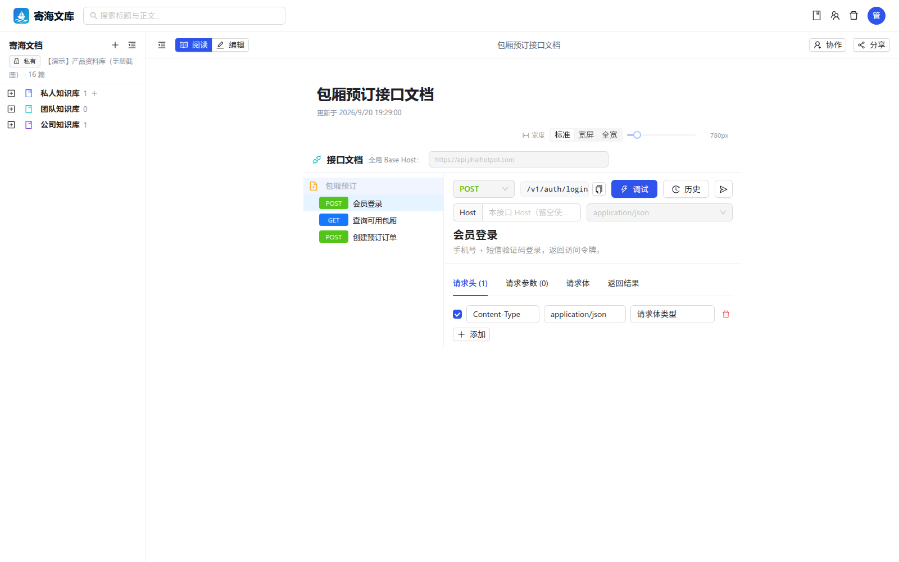

- 请求体支持「无 / JSON / 表单 / 原始（raw）」四种类型。
- 可设置「全局 Base Host」，用于切换测试与生产地址。
- 支持从「Swagger / OpenAPI / Apifox / Postman」文件或 URL **在线导入**接口集合。
- 提供**在线调试**：浏览器直接发起请求；每次调试的历史记录按「文档 + 接口 + 用户」隔离保留最近 10 条，可一键回填。
- 可导出 `.md` / `.json`。

### 6.10 图片库

用于集中管理图片素材，上传后服务端自动生成**预览图与缩略图**：

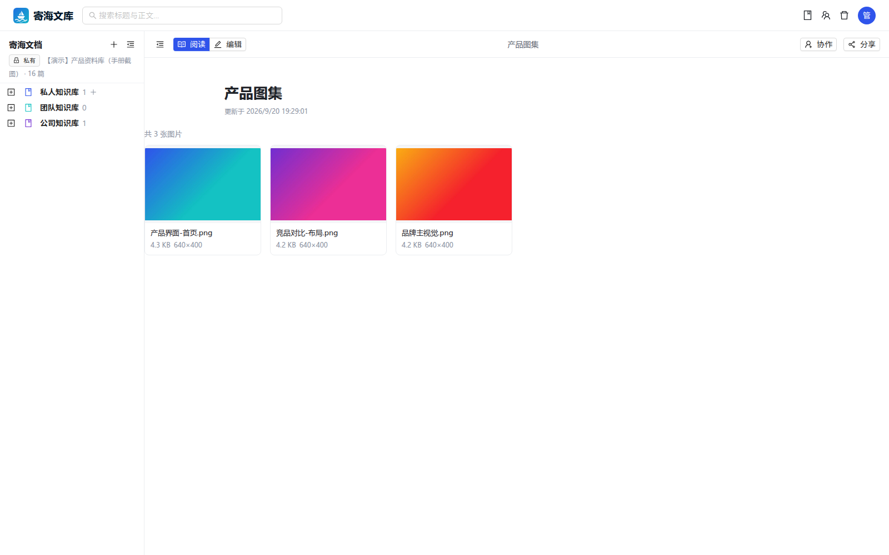

- 支持格式：JPG / PNG / GIF / TIFF / WebP / HEIC / SVG / PSD / CDR / AI，可批量上传。
- 每张图可「改名 / 重新生成 / 删除」，也可切换查看原尺寸、预览图与缩略图。
- 未安装图片转换器时，界面会提示「服务端未安装图片转换器」，非原生格式将只保留原件。

### 6.11 需求原型

把原型文件与**需求描述**绑定在一起，适合产品与设计协作：


- 支持 Axure（含导出网页包）、Mockplus（`.mp`）、Sketch（`.sketch`）、单页或打包 HTML。
- 每个原型都需要填写**标题**与**需求描述**（「这块原型要表达什么需求？」），
  描述会直接展示在卡片上，评审时无需来回切换。
- 网页型原型可点击「打开」在页面内直接浏览。

<div class="pagebreak"></div>

## 7 编辑、自动保存与历史版本

### 7.1 自动保存

进入编辑态后，所有类型都默认开启**自动保存**（约 3 秒防抖）。顶部状态条会实时显示：

```
编辑中  →  保存中…  →  已自动保存 19:42
```

也可以随时点击「**保存**」按钮立即保存，**手动保存会额外生成一条版本快照**。

### 7.2 历史版本

点击编辑态工具条上的「**历史版本**」打开右侧抽屉：

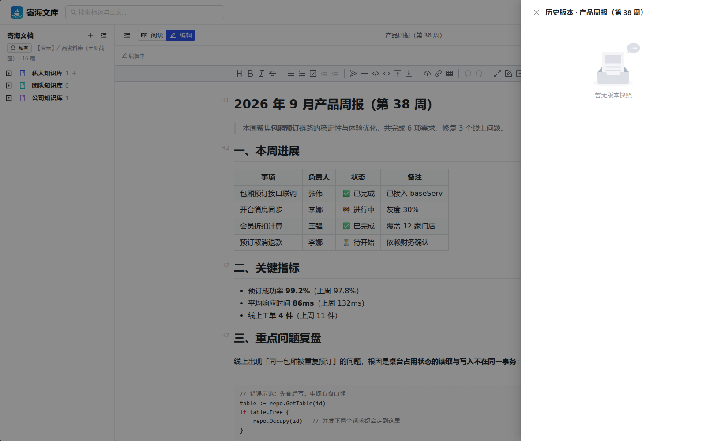

- 每条记录显示时间、来源（**自动保存 / 手动保存 / 回滚快照**）与正文字数。
- 点击「**预览**」可在不改变正文的前提下查看该版本内容。
- 点击「**回滚**」回到该版本；回滚前当前内容会先存为一条「回滚快照」，因此可以再次恢复。
- 每篇文档保留最近 **20 个版本**。

<div class="pagebreak"></div>

## 8 阅读体验

### 8.1 阅读界面


| 元素 | 说明 |
| --- | --- |
| 左栏 | 可折叠（工具条上的折叠按钮）、可拖拽调宽（拖动中间把手） |
| 大纲浮层 | 右上角，自动提取正文标题；可折叠，**不随正文滚动** |
| 宽度 | 「标准 780 / 宽屏 1100 / 全宽」，也可拖动手柄在 600–1800px 之间调整 |
| 底部 | 显示最后更新时间 |

左栏宽度、折叠状态、大纲开关与正文宽度偏好都会保存在浏览器本地，下次打开自动恢复。

### 8.2 附件与图纸阅读

导入的 Word / PDF / PPT / CAD 图纸无需下载即可在线查看。

**PDF 附件**：用 pdf.js 分页渲染，可直接滚动阅读，并可「下载原文件」。

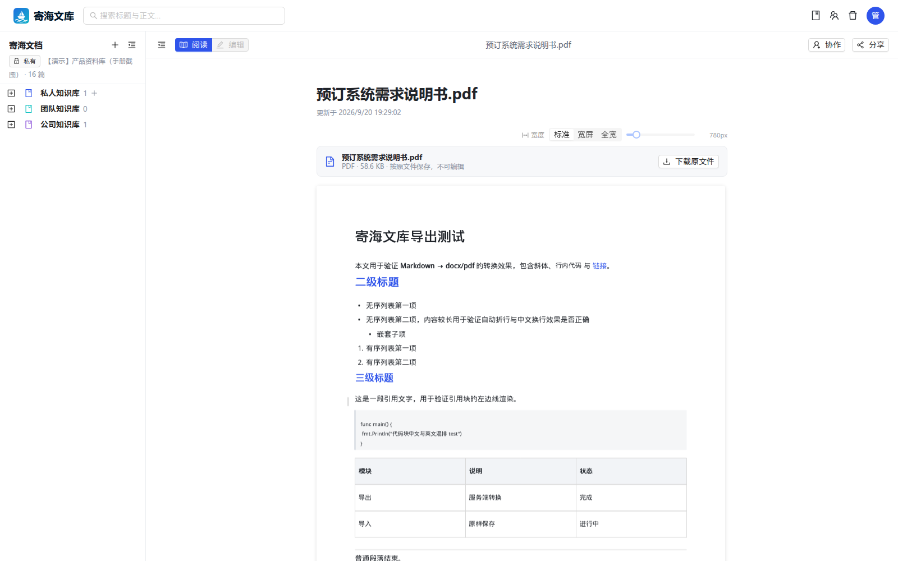

**PPT 附件**：纯前端渲染，支持逐页浏览、自动播放（3 / 5 / 10 秒间隔）、全屏与键盘翻页。

**CAD 图纸（DWG / DXF）**：

- 支持滚轮缩放（以光标为锚点）、按住拖动平移、双击复位；
- 快捷键：`+` / `-` / `0`（复位）/ 方向键平移；
- 可导出原图、SVG 或 PNG；
- 若服务端未安装 DWG 转换器，会以内嵌预览位图降级显示，界面上会明确标注「降级预览」。

**绘图 / Visio**：`.drawio` / `.vsd` / `.vsdx` 由绘图组件转换预览，可另存为可编辑的绘图文档。

### 8.3 网页型文档

「网页文档」以 iframe 嵌入方式直接打开原网站，内容始终是最新的：

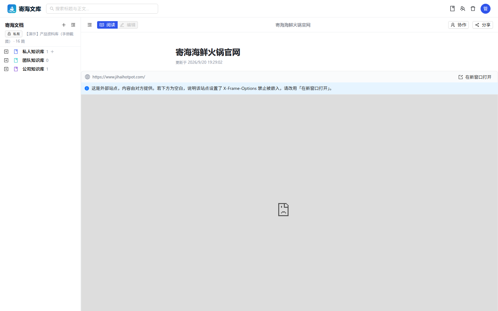

> 少数站点设置了 `X-Frame-Options` 禁止被嵌入，此时下方区域会空白，
> 请点击右上角「**在新窗口打开**」。

<div class="pagebreak"></div>

## 9 导入

### 9.1 三种导入方式

从知识库菜单选择「导入」，先选位置：

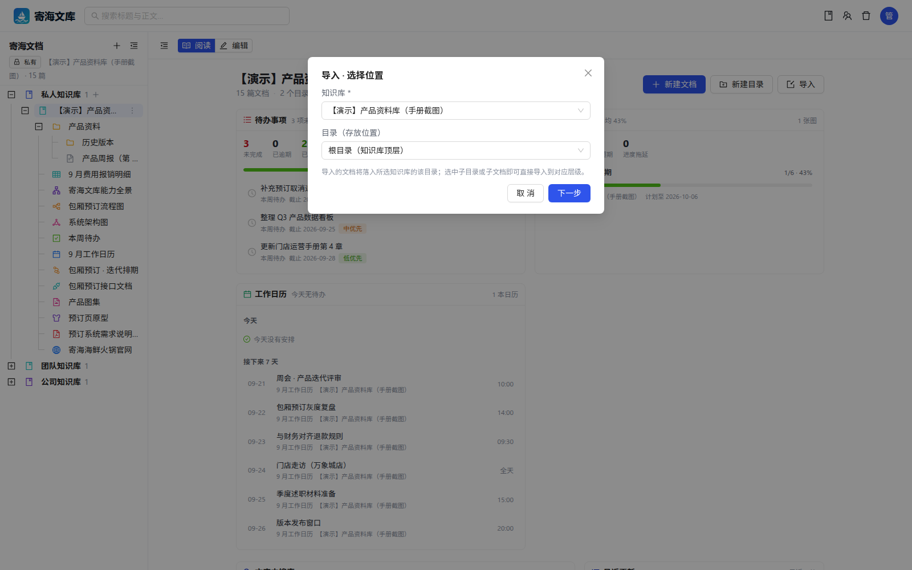

再选方式：

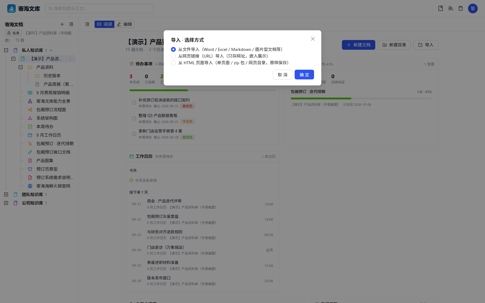

| 方式 | 适用场景 |
| --- | --- |
| **从文件导入** | Word / Excel / Markdown / PDF / PPT / 图片型文档等 |
| **从网页链接（URL）导入** | 只保存网址，以嵌入方式展示原网站内容，内容始终最新 |
| **从 HTML 页面导入** | 单页面 / zip 包 / 网页目录，原样保存不做转换 |

### 9.2 支持的文件格式与落库结果

| 格式 | 导入后 |
| --- | --- |
| `.md` `.txt` | 文档（Markdown） |
| `.html` `.htm` | 网页文档（单页） |
| `.docx` `.doc` | 附件，阅读页直接预览（Word 转换渲染） |
| `.pdf` | 附件，阅读页分页预览 |
| `.pptx` | 附件，阅读页可翻页与自动播放 |
| `.xlsx` `.xls` `.csv` `.et` | 表格；**多工作表会拆成父表格 + 多个表格子文档** |
| `.smm` `.km` `.xmind` `.mm` | 思维导图 |
| `.drawio` | 绘图文档，内嵌 draw.io 直接编辑 |
| `.vsd` `.vsdx` | 附件，阅读页由绘图组件预览 |
| `.dwg` `.dxf` | 附件，服务端自动转换为 `.svg` + `.png`，可缩放拖动并导出 |
| `.wps` `.dps` | 附件 |

不支持与失败的文件**不会产生损坏文档**，导入结果会显示「完成：成功 N 个，失败 M 个」，
并给出具体原因（如「暂不支持该格式（.xxx）」），可检查格式后重试。

> 单文件默认上限 **64 MB**（由服务端配置决定）。导入大文件时界面会提示
> 「导入成功（内容较大，打开可能较慢）」。

<div class="pagebreak"></div>

## 10 导出

### 10.1 打开导出对话框

在目录树中右键任一文档 →「**导出**」：

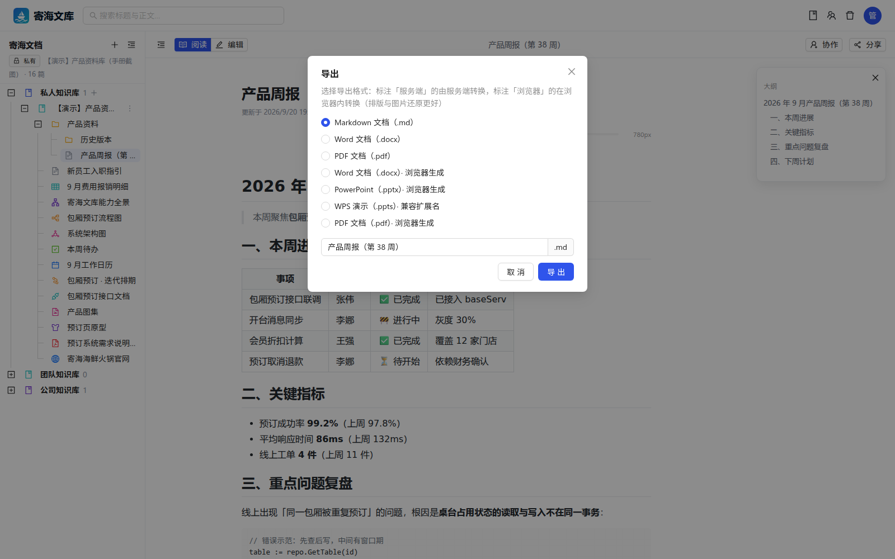

- 左上角是可选格式列表：标注「**服务端**」的由服务器完成转换，标注「**浏览器**」的在浏览器内转换
  （排版与图片还原更好，适合需要精排的场合）。
- 底部可修改文件名，扩展名由所选格式决定。
- 主按钮文案会随场景变化：普通文档是「**导出**」，附件是「**下载原文件**」，需要转换时是「**生成 PDF**」。

### 10.2 各类型可选格式

| 文档类型 | 可选格式 |
| --- | --- |
| 文档（Markdown） | `.md` / `.docx` / `.pdf`；浏览器端另有 `.pptx` / `.ppts` |
| 表格 | `.xlsx` / `.csv` / `.json` |
| 思维导图 | `.km`（百度脑图）/ `.smm` / `.xmind` / `.mm`（FreeMind）/ `.md` / `.json` / `.png` |
| 流程图 | `.md`（含 Mermaid 源码）/ `.svg` / `.png` |
| 绘图 | `.drawio`（`.svg` / `.png` / `.vsdx` 请在绘图编辑器内用「导出」获取） |
| 待办清单 | `.xlsx` / `.md` / `.json` |
| 工作日历 | `.xlsx` / `.ics` / `.json` |
| 甘特图 | `.xlsx` / `.md` / `.json` |
| 接口文档 | `.md` / `.json` |
| CAD 附件 | 原图 + `.dxf` / `.svg` / `.png` |
| 其它附件 | 原文件（`.docx` / `.pptx` 保持原样；可另生成 `.pdf`） |

### 10.3 导出整个知识库

右键知识库 →「**导出**」，会把整库导出为 **Markdown 压缩包（`.md.zip`）**：
按目录结构组织文件，附件按原文件打包，绘图导出为 `.drawio`。

<div class="pagebreak"></div>

## 11 搜索

### 11.1 全局搜索

顶部导航栏的搜索框输入关键词后回车，进入搜索结果页：


- 搜索范围是**标题 + 正文**，结果**仅包含你有权访问的知识库**。
- 命中关键词会**高亮**，并显示上下文片段。
- 表格、思维导图、绘图等结构化文档只匹配标题（不做正文摘要），会标注为「结构化文档，无文本摘要」。
- 公开知识库的文档支持**匿名搜索**（未登录访客亦可检索）。

### 11.2 文库内搜索

在首页或文库工作台的「**文库内搜索**」卡片中直接输入关键词，
搜索范围收窄到当前知识库，适合在资料多的库里快速定位。

输入框下方还提供「会议纪要 / 需求文档 / 接口文档 / 周报」等常用词一键填充，
以及「最近搜索」历史（可清空）。

<div class="pagebreak"></div>

## 12 分享

寄海文库提供两种分享方式：**知识库级公开分享**与**文档级分享**。

### 12.1 知识库公开分享

把知识库可见性设为「**公开**」后，系统自动生成免登录只读短链。访客打开后看到的是
完整的目录树 + 只读正文：

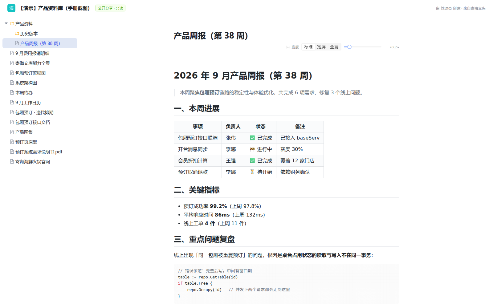

> 可见性改为「公开」后，任何人都可以通过该链接访问；改回「私有」或「成员可见」后链接即失效。

### 12.2 文档分享

在文档顶栏点击「**分享**」，或在目录树右键 →「分享」，打开分享抽屉：

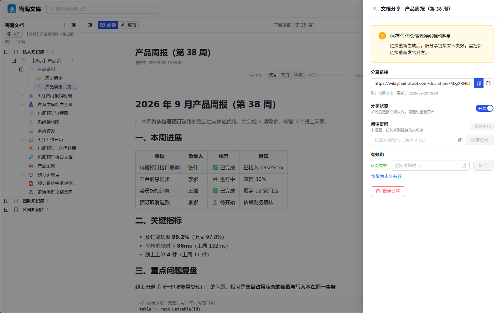

| 区块 | 说明 |
| --- | --- |
| 分享链接 | 可复制、可在新窗口打开；显示累计访问次数与更新时间 |
| 分享状态 | 开关可随时停用 / 重新开启，关闭后链接立即失效 |
| 阅读密码 | 可设置至少 4 位密码；设置后访问需输入密码才能查看 |
| 有效期 | 默认永久有效，也可指定过期时间（到期后提示链接已过期） |
| 撤销分享 | 链接立即失效且不可恢复，再次分享会生成新链接 |

> **注意**：保存任何设置都会**刷新链接**，旧链接立即失效，需要把新链接重新发给对方。
> 为安全起见，密码校验有频率限制（每分钟最多 5 次），超出会提示「尝试过于频繁」。

访客侧看到的密码门与阅读页：

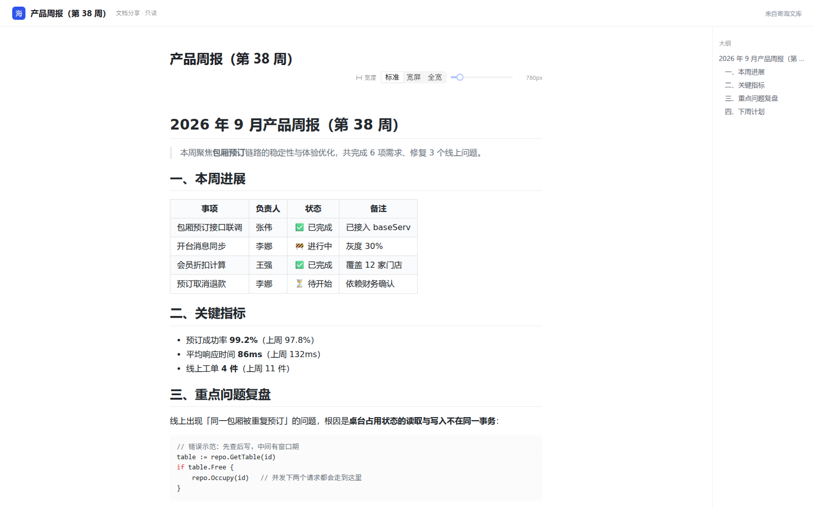

### 12.3 分享到微信

点击「分享到微信」会弹出二维码，可用微信「扫一扫」在手机上打开阅读：


也可以在微信中打开链接后，点右上角「···」→ 发送给朋友 / 分享到朋友圈；
或把链接发到「文件传输助手」后点击打开。

<div class="pagebreak"></div>

## 13 协作与团队

### 13.1 邀请文档协作者

在文档顶栏点击「**协作**」，或在目录树右键 →「邀请协作」：

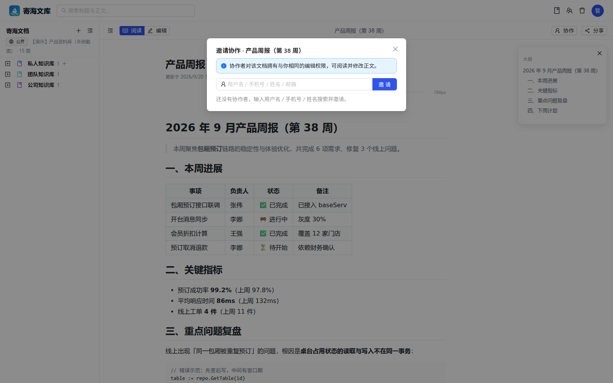

输入对方的**用户名 / 手机号 / 姓名 / 邮箱**即可添加。协作者拥有与所有者等价的编辑权限，
可随时移除。

### 13.2 团队与团队文库

进入「团队」页可以创建团队：


创建后你自动成为该团队管理员，系统会**自动创建一个团队文库**。团队详情页包含三个部分：

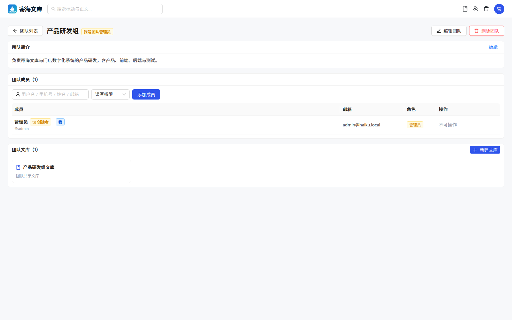

1. **团队简介**：可随时编辑。
2. **团队成员**：按用户名 / 手机号 / 姓名 / 邮箱添加成员，并指定角色——
   **团队管理员 / 读写权限 / 只读权限**。角色的实际含义：

   | 角色 | 权限 |
   | --- | --- |
   | 团队管理员 | 管理团队成员与团队文库，可读写全部文档 |
   | 读写权限 | 可读可写团队文库中的文档 |
   | 只读权限 | 只能阅读 |

3. **团队文库**：团队共享的知识库，不计入个人书架的「我的知识库」。

> 删除团队只会移除团队关系与团队名称，**团队文库中的文档仍保留在库中**。

### 13.3 公司知识库

「公司知识库」由管理员创建，对**所有成员只读**。需要协作时有两种方式：

- 管理员在「用户管理 → 公司知识库写权限」中**为指定成员授予写权限**；
- 管理员或库所有者在单篇文档上开启「**所有人可编辑**」，
  此时任何登录用户都可编辑（适合收集建议、意见与 bug 反馈）。

<div class="pagebreak"></div>

## 14 回收站

点击顶部导航栏的垃圾桶图标进入回收站：


- 每条记录显示标题、所属知识库与删除时间。
- 「**恢复**」：连同其祖先目录链一起还原到原位置。
- 「**彻底删除**」：将该文档、其全部子文档与所有版本快照**永久删除，不可恢复**。

删除知识库时，库内全部文档会一并进入回收站；恢复时请在回收站中逐条处理。

<div class="pagebreak"></div>

## 15 管理员功能

管理员在头像菜单中会额外看到「**系统管理**」，包含四个入口。

### 15.1 用户管理

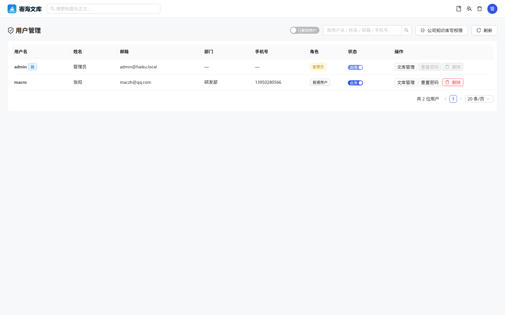

| 操作 | 说明 |
| --- | --- |
| 搜索 | 按用户名 / 姓名 / 邮箱 / 手机号过滤 |
| 启用 / 禁用 | 禁用后该用户无法登录；**不能禁用自己，也不能禁用管理员账号** |
| 文库管理 | 查看某用户的私有文库与团队文库，可备份（导出 zip）或删除 |
| 重置密码 | 留空则自动生成 12 位随机密码；**重置后的密码仅显示一次**，请及时交付用户 |
| 删除 | 软删用户，可在「已删除用户」视图中恢复或彻底删除 |

### 15.2 公司知识库写权限

点击用户管理右上角的「公司知识库写权限」：

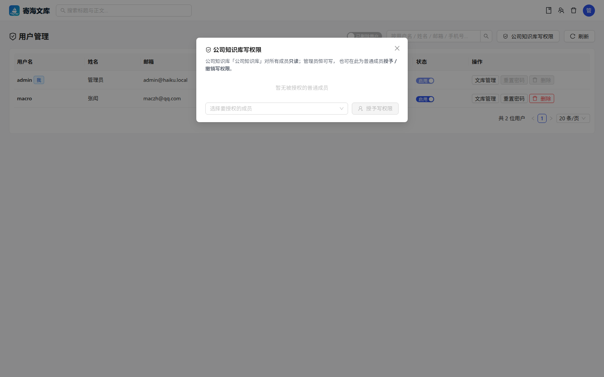

公司知识库对所有成员只读，管理员恒可写；此界面用于**为普通成员授予 / 撤销写权限**。

### 15.3 系统配置

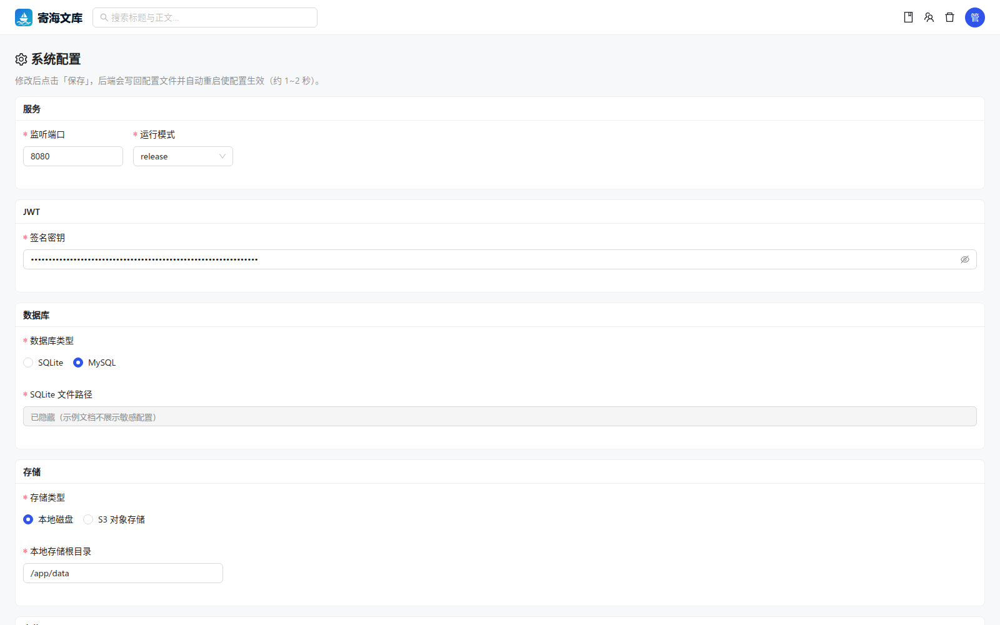

配置分为**服务 / JWT / 数据库 / 存储 / 上传**五组。修改后点击「保存并重启」，
后端会写回配置文件并自动重启（约 1–2 秒），重启期间页面会显示遮罩提示。

支持的组合：

| 项 | 可选值 |
| --- | --- |
| 数据库 | SQLite（零配置） / MySQL |
| 存储 | 本地磁盘 / S3 对象存储（兼容 MinIO、腾讯云 COS 等） |
| 单文件上限 | 可按 MB 调整 |

### 15.4 数据迁移

**数据库迁移**支持 SQLite ↔ MySQL 双向迁移：


流程：选择目标类型 → 填写连接信息 → 「测试连接」确认可达 → 「开始迁移」异步复制数据 →
勾选「迁移成功后切换到新数据库」即可自动热切换。进度卡片会实时显示
「已完成 N / M（跳过 x）（失败 y）」与逐条明细。

**存储迁移**（本地磁盘 ↔ S3）使用同款流程与界面。

<div class="pagebreak"></div>

## 16 效率技巧速查

| 我想…… | 怎么做 |
| --- | --- |
| 快速新建文档 | 知识库页左栏书头点「＋」；或首页快捷操作「新建文档」 |
| 在指定目录下建文档 | 右键目录 →「新建子文档」 |
| 把一段资料搬到另一个知识库 | 右键文档 →「移动」，二级选择目标库与位置 |
| 复制一份做草稿 | 右键文档 →「复制」，副本标题带「 副本」 |
| 恢复删错的内容 | 顶部导航栏垃圾桶图标 → 回收站 →「恢复」 |
| 让同事只读我的文档 | 右键文档 →「分享」，生成链接；需要保密就加阅读密码与有效期 |
| 让同事一起编辑 | 右键文档 →「邀请协作」，按用户名 / 手机号 / 邮箱添加 |
| 归档整个项目资料 | 右键知识库 →「导出」，得到按目录结构组织的 `.md.zip` |
| 把 Markdown 变成 Word/PDF 交付 | 右键文档 →「导出」，选 `.docx` 或 `.pdf` |
| 把 Excel 拆成几个表格分别维护 | 直接导入 `.xlsx`，多工作表会自动拆成子文档 |
| 换台电脑继续看 | 链接在任何浏览器登录后都能打开，左栏宽度与阅读偏好会跟随保存 |
| 手上没有网络也要看 | 系统全部资源随服务端分发，内网 / 离线环境功能完全可用 |

<div class="pagebreak"></div>

## 17 常见问题

**Q：新建文档时选了「目录」，为什么打开是空的？**
A：目录（文件夹）只用于分组，不承载正文，这是设计如此。正文请建文档类型。

**Q：为什么有些文档的「编辑」按钮是灰的？**
A：三种情况：附件型文档按原文件保存、不可编辑；目录不承载正文；网页型文档以嵌入方式展示原内容。
把鼠标悬停在按钮上会给出对应提示。

**Q：共享链接发给同事后打不开了？**
A：每次在分享抽屉里保存设置（改密码、改有效期、切换状态）都会**刷新链接**，旧链接立即失效。
请重新复制新链接。另外请确认没有超过有效期、分享未被撤销。

**Q：密码输入错误多次后无法提交？**
A：为防暴力破解，系统对密码校验做了频率限制（每分钟 5 次），稍等片刻即可重试。

**Q：网页文档下方一片空白？**
A：目标站点禁止被嵌入（设置了 `X-Frame-Options`）。请点击右上角「在新窗口打开」查看。

**Q：导出的 PDF 出现方块或乱码？**
A：说明服务器上没有可用的中文字体。请联系管理员按部署文档安装中文字体后重试。

**Q：导入的 DWG 图纸很模糊？**
A：说明服务端未安装 DWG 转换器，当前使用的是图纸内嵌的预览位图（界面上会标注「降级预览」）。
联系管理员安装转换器后重新导入即可得到矢量预览。

**Q：上传文件提示超出限制？**
A：单文件默认上限为 64 MB（由管理员在系统配置中设定）。请拆分或压缩后重试。

**Q：搜索不到明明存在的关键词？**
A：请确认你有该知识库的访问权限；另外结构化文档（表格、思维导图、绘图等）只索引标题，
不索引正文内容，请在文档标题中体现关键词。

---

<p class="footer-note">— 手册结束 —</p>
