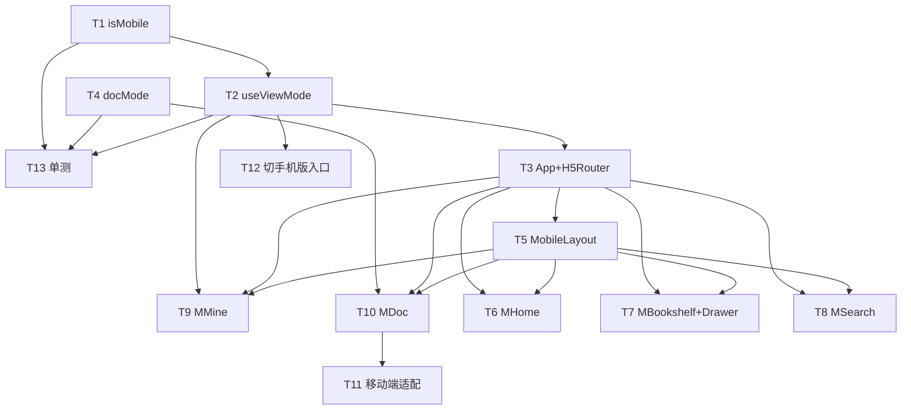

# H5 手机版 UI 系统架构设计 + 任务分解

> 作者：软件架构师 高见远（Gao）
> 适用范围：`web/`（React18 + Vite5 + antd5 + zustand + react-router-dom v6 + TypeScript strict）
> 目标：在不改动桌面版的前提下，新增独立 `/m` H5 路由树；命中手机 UA 且无用户记忆时自动进入 H5；H5 内除白板/待办/日历三类外全部只读。

---

## 一、实现方案与框架选型

### 1.1 核心难点
1. **双端共存不互相污染**：桌面 `<Routes>`（`AppLayout` + `RequireAuth`）与全新 H5 路由树互不耦合，避免改动桌面外壳与现有页面。
2. **视图模式优先级**：`localStorage['haiku_view_mode']` 优先级高于 UA；无记忆时按 UA 决定；切换后写回记忆。
3. **文档三态判定与组件复用**：`editable`（白板/待办/日历）复用现有 `editor/*`；其余 `readonly` 复用现有 `reader/*`；`folder` 为容器导航（渲染子项列表）。
4. **编辑态隐藏底部 Tab 的跨组件协调**：`MDoc` 在可编辑态需要让 `MobileLayout` 收起底部 Tab，需轻量通信机制。
5. **质量红线**：`npm run build` = `tsc --noEmit && vite build`，strict 模式下 tsc 报错必须归零；中文注释；新增页面尽量 lazy 加载；不修改 `DocTree.tsx`（死代码）。

### 1.2 框架与库选型
- **沿用现有栈，不引入任何新的运行时第三方依赖**：
  - `react` / `react-dom` / `react-router-dom v6`：H5 使用独立 `<Routes>`、`<Navigate>`、`<Outlet>`、`<Suspense>`。
  - `antd v5`：利用内置响应式，**不引入 `antd-mobile`**；H5 通过 `ConfigProvider` 的 `theme.token` 覆盖移动端触控 token。
  - `zustand`：复用 `authStore`（登录态/role），H5 不新增 store（视图模式走独立 hook，保持最小改动）。
  - `typescript`（strict）、`vite`。
- **单元测试（仅 T13，devDependencies）**：若仓库无测试运行器，新增 `vitest` + `@testing-library/react` + `jsdom`（**非运行时依赖**），用于 `isMobile`/`getDocMode`/`useViewMode` 单测。

### 1.3 架构模式
- **双路由树 + 顶层策略选择（Strategy）**：`App.tsx` 顶层读 `useViewMode().mode`，`h5` 渲染 `<H5Router/>`，`desktop` 渲染原桌面 `<Routes>`；`H5Router` 对「非 `/m` 路径」做 `<Navigate to="/m">`。
- **布局-内容分离**：`MobileLayout`（顶部栏 + 底部 Tab + `<Outlet/>`）作为 `/m` 布局路由；各页面为 `Outlet` 子路由，全部 `React.lazy` 懒加载。
- **权限矩阵（纯函数）**：`getDocMode(docType)` 集中表达「阅读/编辑」规则，`folder` 先行判定为容器。
- **跨组件协调（Context）**：`MobileLayout` 提供 `H5LayoutContext.setTabHidden`，`MDoc` 在编辑态调用以收起底部 Tab（离开时恢复）。

### 1.4 路由挂载方案（关键决策）
- `web/src/App.tsx`（桌面外壳保持不变，仅在外层加视图选择）：
  ```tsx
  function App() {
    const { mode } = useViewMode();
    return mode === 'h5' ? <H5Router /> : <DesktopRoutes />; // DesktopRoutes = 现有桌面 <Routes>
  }
  ```
- `web/src/h5/H5Router.tsx`：
  ```tsx
  function H5Router() {
    const location = useLocation();
    if (!location.pathname.startsWith('/m')) return <Navigate to="/m" replace />;
    return (
      <Routes>
        <Route path="/m" element={<MobileLayout />}>
          <Route index element={<MHome />} />                 // 首页
          <Route path="books" element={<MBookshelf />} />     // 文库
          <Route path="search" element={<MSearch />} />       // 搜索
          <Route path="mine" element={<MMine />} />           // 我的
          <Route path="doc/:docId" element={<MDoc />} />      // 文档（阅读/编辑/容器）
          {/* 登录/注册复用现有组件，全屏、隐藏 Tab（豁免重定向见待明确事项） */}
          <Route path="login" element={<LoginPage />} />
          <Route path="register" element={<RegisterPage />} />
        </Route>
      </Routes>
    );
  }
  ```
- `web/src/main.tsx`：**默认无需改动**（已有 `BrowserRouter` + `ConfigProvider`，`H5Router` 在 `App` 内部渲染，路由上下文可用）。如团队希望入口即注入全局判断，可在此包一层 `<Suspense>`，但非必需。

---

## 二、文件列表与相对路径

### 2.1 新增文件（H5 相关全部置于 `web/src/h5/`，UA 工具例外）
| 路径 | 职责 | 关联任务 |
|---|---|---|
| `web/src/lib/isMobile.ts` | UA 纯函数 `isMobile(ua?)`，可单测、可被桌面复用 | T1 |
| `web/src/h5/useViewMode.ts` | 视图模式 hook（localStorage + UA） | T2 |
| `web/src/h5/docMode.ts` | 权限矩阵 `getDocMode` + 常量 + `isContainerType` | T4 |
| `web/src/h5/H5Router.tsx` | H5 路由树 + 非 `/m` 重定向 + `Suspense` | T3 |
| `web/src/h5/MobileLayout.tsx` | 顶部栏 + 底部 Tab + `<Outlet/>` + 提供 `H5LayoutContext` | T5 |
| `web/src/h5/BottomTabs.tsx` | 底部 Tab 栏（首页/文库/搜索/我的） | T5 |
| `web/src/h5/pages/MHome.tsx` | H5 首页（文库列表 + 最近文档） | T6 |
| `web/src/h5/pages/MBookshelf.tsx` | H5 文库页（文库 + 抽屉文档树） | T7 |
| `web/src/h5/DocTreeDrawer.tsx` | 抽屉式文档树（复用 `KnowledgeTree`） | T7 |
| `web/src/h5/pages/MSearch.tsx` | H5 搜索页（复用搜索 API/逻辑） | T8 |
| `web/src/h5/pages/MMine.tsx` | H5 我的页（登录态 / 切桌面版 / 登出） | T9 |
| `web/src/h5/pages/MDoc.tsx` | H5 文档页（矩阵判定 + 复用 reader/editor） | T10 |
| `web/src/h5/readerMap.ts` | `docType → Reader` 组件映射表 | T10 |
| `web/src/h5/editorMap.ts` | `docType → Editor` 组件映射表（仅 3 类） | T10 |
| `web/src/h5/styles.ts`（或 `.css`） | 移动端公共样式 / 适配 token | T11 |
| `web/src/lib/isMobile.test.ts` | `isMobile` 单测 | T13 |
| `web/src/h5/docMode.test.ts` | `getDocMode` 单测 | T13 |
| `web/src/h5/useViewMode.test.ts` | `useViewMode` 单测 | T13 |

### 2.2 需改动的现有文件
| 路径 | 改动点 | 关联任务 |
|---|---|---|
| `web/src/App.tsx` | 顶层接入 `useViewMode` 选择渲染 `H5Router` / 桌面 `<Routes>` | T3 |
| `web/src/AppLayout.tsx` | footer 增加「切手机版」入口（调用 `useViewMode().setMode('h5')`） | T12 |
| `web/src/pages/SettingsPage.tsx` | 设置页增加「切手机版」入口 | T12 |
| `web/src/pages/LoginPage.tsx` | 响应式微调；登录成功按 view mode 跳转（H5→`/m`） | T9/T12 |
| `web/src/pages/RegisterPage.tsx` | 响应式微调 | T9/T12 |
| `web/src/main.tsx` | 默认无需改动；如需入口注入可加 `Suspense` | T3 |

> **铁律提醒**：不修改 `web/src/components/tree/DocTree.tsx`（死代码）。H5 文档树复用 `KnowledgeTree.tsx`。Reader/Editor 仅「复用 + 移动端容器适配」，不重写组件内部逻辑。

---

## 三、数据结构与接口

### 3.1 关键模块签名（TypeScript）
```ts
// web/src/lib/isMobile.ts —— 纯函数，便于单测
export function isMobile(ua: string = navigator.userAgent): boolean {
  // 命中常见手机 UA：iPhone / Android / iPod / 移动端 iPad / MicroMessenger 等
}

// web/src/h5/docMode.ts —— 权限矩阵（唯一判定来源）
import type { DocType } from '../types';
export type DocMode = 'editable' | 'readonly';
export const H5_EDITABLE_TYPES: ReadonlyArray<DocType> = ['whiteboard', 'todo', 'calendar'];
export function getDocMode(docType: DocType): DocMode {
  return (H5_EDITABLE_TYPES as readonly DocType[]).includes(docType) ? 'editable' : 'readonly';
}
// folder 不进入 getDocMode；先行判定为容器导航
export function isContainerType(docType: DocType | string): boolean {
  return docType === 'folder';
}

// web/src/h5/useViewMode.ts —— 视图模式读写（localStorage 优先，UA 兜底）
export type ViewMode = 'h5' | 'desktop';
const VIEW_MODE_KEY = 'haiku_view_mode';
export function useViewMode(): { mode: ViewMode; setMode: (m: ViewMode) => void } {
  const [mode, setModeState] = useState<ViewMode>(() => {
    const saved = localStorage.getItem(VIEW_MODE_KEY) as ViewMode | null;
    if (saved === 'h5' || saved === 'desktop') return saved;
    return isMobile() ? 'h5' : 'desktop';
  });
  const setMode = useCallback((m: ViewMode) => {
    localStorage.setItem(VIEW_MODE_KEY, m);
    setModeState(m);
  }, []);
  return { mode, setMode };
}

// web/src/h5/MobileLayout.tsx —— 跨组件协调上下文
export interface H5LayoutContextValue { setTabHidden: (hidden: boolean) => void; }
export const H5LayoutContext = createContext<H5LayoutContextValue>({ setTabHidden: () => {} });
```

### 3.2 组件映射表（阅读 / 编辑分流）
```ts
// web/src/h5/readerMap.ts —— 只读类型 → Reader 组件（共 15 种）
import type { ComponentType } from 'react';
import type { DocType, WorkbenchDoc } from '../types';
import { MarkdownView } from '../components/reader/MarkdownView';
import { SheetView } from '../components/reader/SheetView';
import { MindmapView } from '../components/reader/MindmapView';
import { FlowchartView } from '../components/reader/FlowchartView';
import { DrawioView } from '../components/reader/DrawioView';
import { WhiteboardView } from '../components/reader/WhiteboardView';
import { GanttView } from '../components/reader/GanttView';
import { ApiView } from '../components/reader/ApiView';
import { FileView } from '../components/reader/FileView';
import { PptxView } from '../components/reader/PptxView';
import { WebView } from '../components/reader/WebView';
import { GalleryView } from '../components/reader/GalleryView';
import { PrototypeView } from '../components/reader/PrototypeView';
import { CalendarView } from '../components/reader/CalendarView';
import { TodoView } from '../components/reader/TodoView';

export const READER_MAP: Partial<Record<DocType, ComponentType<{ doc: WorkbenchDoc }>>> = {
  markdown: MarkdownView, sheet: SheetView, mindmap: MindmapView, flowchart: FlowchartView,
  drawio: DrawioView, whiteboard: WhiteboardView, gantt: GanttView, api: ApiView,
  file: FileView, pptx: PptxView, web: WebView, gallery: GalleryView,
  prototype: PrototypeView, calendar: CalendarView, todo: TodoView,
};

// web/src/h5/editorMap.ts —— 可编辑类型 → Editor 组件（仅 3 类）
import { WhiteboardEditor } from '../components/editor/WhiteboardEditor';
import { TodoEditor } from '../components/editor/TodoEditor';
import { CalendarEditor } from '../components/editor/CalendarEditor';

export const EDITOR_MAP: Partial<Record<DocType, ComponentType<{ doc: WorkbenchDoc }>>> = {
  whiteboard: WhiteboardEditor, todo: TodoEditor, calendar: CalendarEditor,
};
```

### 3.3 Mermaid 类图（模块与依赖）
见 `docs/class-diagram.mermaid`（要点：`IsMobileUtil`/`ViewModeState` 被 `UseViewMode` 调用；`UseViewMode` 决定 `H5Router` 渲染树、`MMine` 调用 `setMode('desktop')`；`MobileLayout` 提供 `H5LayoutContext` 被 `MDoc` 消费；`MDoc` 依赖 `DocModeMatrix` + `ReaderMap`/`EditorMap` + `DocApi`）。

### 3.4 `MDoc` 渲染决策伪代码（设计级，非实现）
```
const { docId } = useParams();
const doc = useGetDoc(docId);              // 来自 web/src/api/docs.ts
if (isContainerType(doc.docType)) { render <FolderChildrenList doc={doc} />; return; }
const editable = getDocMode(doc.docType) === 'editable' && doc.can_write; // 见共享知识
useEffect(() => setTabHidden(editable), [editable]);
if (editable) render EDITOR_MAP[doc.docType]   // WhiteboardEditor / TodoEditor / CalendarEditor
else render READER_MAP[doc.docType]            // 其余 14 种 Reader（无工具条）
```

---

## 四、调用流程时序图（Mermaid）

见 `docs/sequence-diagram.mermaid`（主线：UA 检测 → 视图选择 → H5 路由 → 文档页 → 矩阵判定 → reader/editor；含 folder 容器分支与编辑态隐藏 Tab）。

---

## 五、任务列表（T1–T13，按实现顺序、含依赖）

| 任务 | 名称 | 源文件（新增 / 改动） | 依赖 | 优先级 |
|---|---|---|---|---|
| **T1** | UA 检测纯函数 | `web/src/lib/isMobile.ts`（新） | — | P0 |
| **T2** | 视图模式 hook | `web/src/h5/useViewMode.ts`（新） | T1 | P0 |
| **T3** | `App.tsx` 视图选择 + 新增 `H5Router` 挂载点 | `web/src/App.tsx`(改)、`web/src/h5/H5Router.tsx`(新)、`web/src/main.tsx`(可选) | T2 | P0 |
| **T4** | 权限矩阵 | `web/src/h5/docMode.ts`（新） | — | P0 |
| **T5** | H5 布局外壳（底部 Tab + 顶部栏 + Outlet + Context） | `web/src/h5/MobileLayout.tsx`(新)、`web/src/h5/BottomTabs.tsx`(新) | T3 | P0 |
| **T6** | H5 首页 | `web/src/h5/pages/MHome.tsx`(新) | T3, T5 | P1 |
| **T7** | H5 文库页 + 抽屉文档树 | `web/src/h5/pages/MBookshelf.tsx`(新)、`web/src/h5/DocTreeDrawer.tsx`(新) | T3, T5 | P1 |
| **T8** | H5 搜索页 | `web/src/h5/pages/MSearch.tsx`(新) | T3, T5 | P1 |
| **T9** | H5 我的页 | `web/src/h5/pages/MMine.tsx`(新) | T3, T5, T2 | P1 |
| **T10** | H5 文档页（矩阵复用 reader/editor） | `web/src/h5/pages/MDoc.tsx`(新)、`web/src/h5/readerMap.ts`(新)、`web/src/h5/editorMap.ts`(新) | T3, T5, T4 | P0 |
| **T11** | 各 reader/editor 移动端容器适配 | `web/src/h5/styles.ts`(新) + 适配现有 `reader/*`、`editor/*`（包裹/className） | T10 | P1 |
| **T12** | 桌面版「切手机版」入口 | `web/src/AppLayout.tsx`(改)、`web/src/pages/SettingsPage.tsx`(改)、`web/src/pages/LoginPage.tsx`(改)、`web/src/pages/RegisterPage.tsx`(改) | T2 | P2 |
| **T13** | 单元测试 | `web/src/lib/isMobile.test.ts`、`web/src/h5/docMode.test.ts`、`web/src/h5/useViewMode.test.ts`（新） | T1, T4, T2 | P2 |

> 说明：T6/T7/T8/T9 互相独立，可并行；T10 完成后再做 T11 容器适配；T12 仅依赖 T2（`setMode`）；T13 依赖三个纯模块。

### 任务依赖图（Mermaid）


---

## 六、依赖包

复用现有依赖，**无新增运行时第三方依赖**：
```
- react @ ^18.2.0（已有）：UI 框架
- react-dom @ ^18.2.0（已有）：DOM 渲染
- react-router-dom @ ^6（已有）：H5Router / Navigate / Outlet / Suspense
- antd @ ^5（已有）：组件库 + 移动端 theme token（不引入 antd-mobile）
- zustand @ ^4（已有）：authStore 登录态复用
- typescript @ ^5（已有，strict）
- vite @ ^5（已有）：构建
- （仅 T13，devDependencies）vitest + @testing-library/react + jsdom：单元测试，非运行时依赖
```
> 若仓库已有测试运行器（如 vitest/jest），则 T13 直接复用，不新增任何包。

---

## 七、共享知识（跨文件约定）

1. **视图模式唯一来源**：所有需要感知「当前 H5/桌面」的代码统一从 `useViewMode()` 读取，写入统一走 `setMode`；禁止各处自行 `isMobile()` 或读 localStorage。
2. **文档渲染唯一判定**：`MDoc` 必须先用 `isContainerType(docType)` 判断 `folder`（容器导航，渲染子项列表），否则走 `getDocMode(docType)` 得 `editable`/`readonly`，再选 `EDITOR_MAP`/`READER_MAP`；**禁止在页面里硬编码类型分支**。
3. **组件复用路径**：Reader 统一 import 自 `web/src/components/reader/*`；Editor 统一 import 自 `web/src/components/editor/*`；H5 只读场景直接复用 Reader（其本身无编辑工具条）。
4. **底部 Tab 显隐**：仅在非编辑态显示；`MDoc` 在 `editable` 时调用 `H5LayoutContext.setTabHidden(true)`，并在 `useEffect` 清理中恢复 `false`。
5. **懒加载规范**：H5 所有页面用 `React.lazy(() => import('...'))` 包裹；`H5Router` 外层或 `MobileLayout` 内提供 `<Suspense fallback={<Spin/>}>`。
6. **localStorage 键约定**：固定 `haiku_view_mode`，值仅 `'h5' | 'desktop'`；不引入其他键。
7. **antd 移动端主题**：在 `H5Router`（或 `MobileLayout`）包一层 `ConfigProvider` 覆盖 `theme.token`（如 `borderRadius: 8`、`controlHeight: 40`、`fontSize: 14`）与必要 `theme.components`，适配触控；不引入 antd-mobile。
8. **质量红线**：中文注释；所有新增 TS 文件 `tsc --noEmit` 必须零报错（strict）。
9. **目录与死代码**：H5 新文件置于 `web/src/h5/`（UA 工具除外，置于 `web/src/lib/isMobile.ts`）；**不改动 `web/src/components/tree/DocTree.tsx`**；H5 文档树复用 `KnowledgeTree.tsx`。
10. **写权限降级（建议）**：H5 编辑态额外校验 `doc.can_write`，无写权限时即使 `getDocMode` 为 `editable` 也降级为只读（MVP 可后置，先按类型矩阵）。

---

## 八、待明确事项（简短，给推荐）

1. **登录/注册在 H5 模式下的可达性**：当前 `H5Router` 对「非 `/m` 路径」重定向到 `/m`，会使 `/login` 不可达。**推荐**：在 `/m` 下新增 `login`/`register` 路由复用现有 `LoginPage`/`RegisterPage`（全屏、隐藏 Tab）；或在 `H5Router` 中豁免 `/login`、`/register`。需确认采用哪种。
2. **`folder` 是否为 `DocType` 枚举成员**：若是，`getDocMode` 不得接收 `folder`，须在 `MDoc` 先行 `isContainerType` 判断。需确认 `web/src/types.ts` 中 `folder` 的归属。
3. **`KnowledgeTree` 接口适配**：H5 抽屉文档树复用的 `KnowledgeTree` 的 props 与数据源是否支持移动端抽屉按需加载，需确认其接口形态。
4. **reader/editor 移动端适配方式**：现有组件是否暴露 `className`/尺寸 props 便于容器适配，或需包一层 `H5DocContainer`。T11 需逐个确认（尤其 `WhiteboardEditor`/Excalidraw、`SheetView`）。
5. **登录成功跳转目标**：`LoginPage`/`RegisterPage` 登录成功后是否需按 view mode 区分跳转（H5→`/m`）。属响应式微调，需确认改动边界（尽量只加模式判断，不改业务）。
6. **H5 是否需独立 antd 主题**（暗色/字号）：**推荐** `H5Router` 内包一层 `ConfigProvider` 覆盖移动端 token，不影响桌面。
7. **分享页 `/share/*` 行为**：明确不纳入 `/m`；H5 访问分享链接时的行为（是否也切 H5 阅读）需确认——当前按决策走桌面逻辑。

---

> 附：本设计配套图文件
> - 类图：`docs/class-diagram.mermaid`
> - 时序图：`docs/sequence-diagram.mermaid`
> 全部产出遵循「复用优先、MVP 优先、tsc 零报错」原则。
