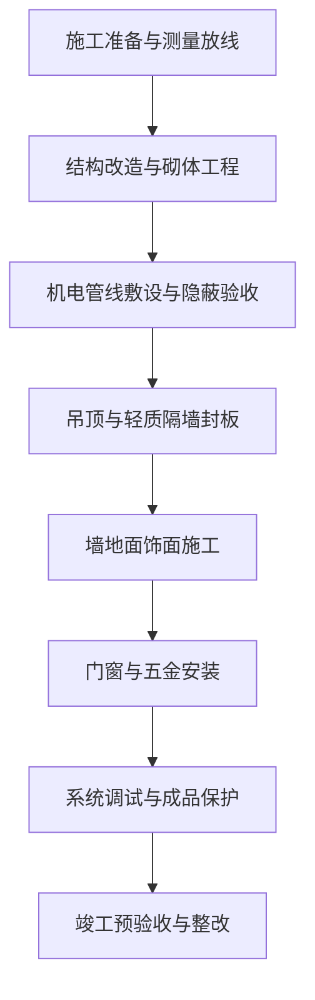

# 施工组织设计大纲

> **文档信息**：编号 SG-2026-0815 · 工程名称 星澜科技园 B 座精装修工程 · 施工单位 星澜建设 · 编制 徐一鸣 · 审核 罗建平 · 日期 2026-09-22

> **填写说明**：以下为虚构示例内容，套用后请替换为你的实际信息。

## 一、编制依据

本大纲依施工合同、设计文件及现行国家与行业标准编制，作为现场施工部署、资源配置与过程控制的纲领性文件。

| 类别 | 依据文件 | 编号 / 版本 |
| --- | --- | --- |
| 合同 | 星澜科技园 B 座精装修工程施工合同 | XL-2026-0712 |
| 设计 | B 座精装修施工图（含 6 月变更） | 施装-2026-06 |
| 标准 | 建筑工程施工质量验收统一标准 | GB 50300-2013 |
| 标准 | 建筑装饰装修工程质量验收标准 | GB 50210-2018 |
| 标准 | 建筑电气工程施工质量验收规范 | GB 50303-2015 |
| 标准 | 建设工程施工现场消防安全技术规范 | GB 50720-2011 |
| 规范 | 施工现场临时用电安全技术规范 | JGJ 46-2005 |
| 规范 | 建筑施工安全检查标准 | JGJ 59-2011 |

## 二、工程概况

| 项目 | 内容 |
| --- | --- |
| 工程名称 | 星澜科技园 B 座精装修工程 |
| 建设 / 施工 / 监理 / 设计 | 星澜科技 / 星澜建设 / 恒远工程监理 / 筑言设计院 |
| 建筑规模 | 建筑面积 18600 ㎡，地上 9 层，框架剪力墙结构 |
| 主要工作内容 | 办公区吊顶与隔墙、墙地面饰面、给排水与消防、电气与智能化 |
| 合同工期 | 2026-08-15 至 2026-12-30，共 138 日历天 |
| 质量目标 | 一次验收合格率 100%，单位工程评定合格 |
| 项目负责人 | 罗建平 |

## 三、施工部署与进度计划

### 3.1 总体流程

按「先结构改造、后机电管线、再饰面收口」的顺序组织流水施工，划分 1—3 层、4—6 层、7—9 层三个流水段，段内工序穿插，段间依次推进。

> **注意**：机电管线隐蔽验收未签认前，严禁封板；吊顶内管线试压、绝缘测试须先行完成并留存记录。

### 3.2 进度计划

| 阶段 | 时间 | 里程碑 | 责任人 |
| --- | --- | --- | --- |
| 施工准备 | 2026-08-15 ~ 08-31 | 临建、样板间通过验收 | 谭勇 |
| 结构改造与砌体 | 2026-09-01 ~ 09-25 | 砌体分项验收合格 | 谭勇 |
| 机电管线敷设 | 2026-09-20 ~ 10-25 | 隐蔽验收签认完毕 | 徐一鸣 |
| 吊顶与隔墙封板 | 2026-10-10 ~ 11-10 | 封板分项验收合格 | 谭勇 |
| 墙地面饰面 | 2026-11-01 ~ 12-05 | 饰面分项验收合格 | 黄铭 |
| 系统调试与收尾 | 2026-12-01 ~ 12-20 | 各系统调试记录齐备 | 徐一鸣 |
| 竣工预验收 | 2026-12-21 ~ 12-30 | 预验收合格并报验 | 罗建平 |

## 四、资源配置

| 工种 / 设备 / 材料 | 数量 | 进场时间 | 备注 |
| --- | --- | --- | --- |
| 木工 / 水电 / 瓦工 / 油工 | 16 / 14 / 12 / 18 人 | 2026-09-01 起分批 | 高峰在场 78 人 |
| 焊工 / 普工 | 4 / 14 人 | 2026-09-10 起 | 焊工持特种作业证 |
| 施工电梯 | 2 台 | 2026-08-25 | 限载 2 t，专人操作 |
| 砂浆搅拌机 / 电焊机 | 2 / 4 台 | 2026-09-01 | 二次侧配防触电保护器 |
| 激光水平仪 / 冲击钻 | 6 / 12 台 | 2026-09-05 | 每月绝缘检测一次 |
| 轻钢龙骨 CS60 / CS50 | 32000 m | 2026-10-05 起分批 | 复检合格后使用 |
| 纸面石膏板 9.5 mm | 12600 张 | 2026-10-08 起分批 | 双层错缝安装 |
| 墙地砖 / 乳胶漆 | 9800 ㎡ / 4600 L | 2026-10-20 起分批 | 同批次色号一致 |

## 五、质量保证措施

- 实行样板引路：吊顶、墙地砖、乳胶漆均先做 20 ㎡ 样板，经监理与建设单位确认后方可大面积展开。
- 落实三检制：班组自检、施工员复检、质量员专检，专检合格后报监理验收。
- 实测实量：每周抽检不少于 30 个点，吊顶标高偏差控制在 ±3 mm，墙面垂直度偏差不大于 3 mm，合格率不低于 95%。
- 材料控制：所有进场材料核对合格证与复检报告，检验批编号与现场部位一一对应，不合格材料 24 小时内退场。

- 允许偏差与控制频次：吊顶标高 ±3 mm，水准仪每层抽检 10 点；墙面垂直度 3 mm、地面平整度 2 mm，2 m 靠尺每层各抽检 10 点；饰面砖空鼓率不大于 5%，每检验批小锤敲击抽检 60 块。

## 六、安全文明施工措施

- 临时用电执行 TN-S 系统、三级配电两级保护，配电箱一机一闸一漏一箱，每月由韩磊组织绝缘与接地电阻检测。
- 高处作业人员系挂双钩安全带，作业面洞口、临边设防护栏杆并悬挂警示标识。
- 动火作业实行审批制，作业点配置 2 具 4 kg 干粉灭火器，设专职看火人，作业后 30 分钟内复查现场。
- 现场材料按区分类码放，通道宽度不小于 1.2 m，每日收工前清理作业面。

> **风险**：吊顶内动火与保温材料、纸面石膏板交叉作业，火灾风险等级为较大；未办理动火证一律不得施焊。

## 七、环境保护与应急预案

- 扬尘控制：切割作业湿法作业，现场 PM10 浓度控制不高于 0.15 mg/m³，出入口设洗车槽。
- 噪声控制：昼间不高于 70 dB(A)，夜间不高于 55 dB(A)，22:00 至次日 6:00 禁止有噪声作业。
- 废弃物分类：建筑垃圾与可回收材料分区堆放，交由有资质单位清运，运输联单按月归档。
- 应急组织：项目经理罗建平任组长，安全员韩磊任现场处置负责人，应急值班电话 0571-8666 1200，急救 120、火警 119。
- 应急演练：开工后 30 日内组织消防与触电应急演练各 1 次，每季度复演 1 次并留存影像。

---

| 编制 | 审核 | 审批（施工单位技术负责人） | 报送单位 | 日期 |
| --- | --- | --- | --- | --- |
| 徐一鸣 | 罗建平 | 徐一鸣 | 恒远工程监理 | 2026-09-22 |
