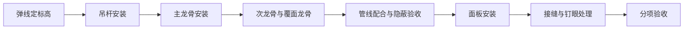

# 施工方案报审表

> **文档信息**：编号 FA-2026-0922-05 · 工程名称 星澜科技园 B 座精装修工程 · 方案名称 B 座 4—9 层吊顶工程施工方案 · 施工单位 星澜建设 · 申报日期 2026-09-22

> **填写说明**：以下为虚构示例内容，套用后请替换为你的实际信息。

## 一、报审信息

| 项目 | 内容 |
| --- | --- |
| 方案名称 | B 座 4—9 层吊顶工程施工方案 |
| 方案编号 | FA-2026-0922-05 |
| 涉及部位 | B 座 4—9 层办公区及走廊，吊顶展开面积 5820 ㎡ |
| 编制 / 审核 | 徐一鸣（技术负责人） / 罗建平（项目经理） |
| 编制依据 | 施工图 施装-2026-06、GB 50210-2018、JGJ 46-2005 |
| 报审单位 / 接收单位 | 星澜建设 / 恒远工程监理 |
| 申报日期 / 要求批复日期 | 2026-09-22 / 2026-09-25 |

## 二、方案主要内容摘要

本工程吊顶以轻钢龙骨上人吊顶为主，走廊局部采用矿棉板明架吊顶。方案对材料规格、安装工艺、质量验收与成品保护作出规定，重点解决吊顶内管线密集、标高受限与检修口设置三类问题。

- 龙骨体系：承载龙骨 CS60，间距不大于 1200 mm；覆面龙骨 CS50，间距 400 mm；吊杆采用 φ8 全牙镀锌螺杆，间距不大于 1200 mm。
- 面板：办公区采用 9.5 mm 纸面石膏板双层错缝安装，走廊采用 600×600 矿棉板。
- 特殊要求：单件重量超过 3 kg 的灯具、风口设独立吊杆，不得直接固定在罩面板上；吊顶内管线密集处增设转换层。
- 检修口：每层按空调检修需求设置 600×600 检修口 8 处，位置避开主龙骨接头。

## 三、施工工艺与关键控制点

| 序号 | 关键控制点 | 控制标准 | 检查方法 | 责任人 |
| --- | --- | --- | --- | --- |
| 1 | 吊顶标高 | 偏差 ±3 mm | 水准仪、钢尺 | 谭勇 |
| 2 | 起拱量 | 短向跨度 1/200 | 拉线与钢尺 | 谭勇 |
| 3 | 吊杆间距 | 不大于 1200 mm | 钢尺抽检 | 黄铭 |
| 4 | 主龙骨接缝 | 相邻接头错开，不得对接在同一吊杆 | 目测、钢尺 | 黄铭 |
| 5 | 面板接缝 | 双层错缝，缝宽 3~5 mm | 塞尺 | 黄铭 |
| 6 | 隐蔽前置条件 | 管线试压、绝缘测试及隐蔽验收已签认 | 资料核查 | 徐一鸣 |

> **提示**：吊顶封板前须完成吊顶内所有管线隐蔽验收，验收记录编号与检验批对应，未签认不得进入下道工序。

## 四、监理审查意见

| 审查项 | 审查结论 |
| --- | --- |
| 编制依据 | 齐全，与设计文件及现行标准一致 |
| 工艺可行性 | 同意，建议补充转换层节点大样图 |
| 质量控制措施 | 同意，实测实量抽检点位应覆盖走廊端部 |
| 安全与消防 | 同意，吊顶内动火作业须单独报审动火证 |
| 审查结论 | 修改后同意实施，修改内容于 2026-09-24 前补报 |

## 五、建设单位审批意见

| 单位 | 岗位 | 审批意见 | 日期 |
| --- | --- | --- | --- |
| 恒远工程监理 | 专业监理工程师 | 方案内容完整，按意见补充后同意实施 | 2026-09-23 |
| 恒远工程监理 | 总监理工程师 | 同意报审，施工过程按方案实施并接受巡视检查 | 2026-09-24 |
| 星澜科技 | 项目负责人 | 同意实施，要求成品保护与检修口质量同步验收 | 2026-09-25 |
| 星澜建设 | 项目经理 | 按批复意见完善后组织交底，交底记录随方案归档 | 2026-09-25 |

---

| 申报人 | 接收人（监理资料员） | 批复状态 | 归档编号 |
| --- | --- | --- | --- |
| 徐一鸣 | 恒远工程监理 资料员 | 修改后同意实施 | FA-2026-0922-05 |
