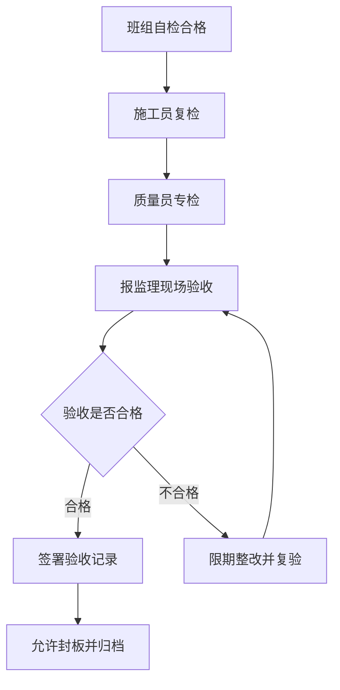

# 隐蔽工程验收记录

> **文档信息**：编号 YB-2026-1013-02 · 工程名称 星澜科技园 B 座精装修工程 · 隐蔽部位 B 座 6 层吊顶内电气管线及消防支管 · 施工单位 星澜建设 · 验收日期 2026-10-13

> **填写说明**：以下为虚构示例内容，套用后请替换为你的实际信息。

## 一、隐蔽工程概况与验收依据

本次隐蔽验收范围为 B 座 6 层办公区吊顶内（标高 +3.600 ~ +4.500）电气管线敷设与消防喷淋支管安装，覆盖 6-1 至 6-6 轴共 6 个区域，封板前须完成验收签认。

| 项目 | 内容 |
| --- | --- |
| 隐蔽部位 | B 座 6 层吊顶内，6-1 ~ 6-6 轴，展开面积 960 ㎡ |
| 隐蔽内容 | JDG 钢导管与接线盒、消防喷淋支管及支吊架、穿越楼板与防火分区封堵 |
| 施工依据 | 筑言设计院 施电-2026-06、施水-2026-06 及技术核定单 HD-2026-1022-01 |
| 验收依据 | GB 50303-2015、GB 50261-2017、GB 50242-2002 |
| 检验批编号 | JL-6F-2026-1013-A（电气）、JL-6F-2026-1013-B（消防） |
| 施工班组 | 水电安装班，2026-09-26 至 2026-10-11 完成 |

## 二、验收内容与标准

| 序号 | 检查项目 | 标准要求 | 实测值 | 结论 |
| --- | --- | --- | --- | --- |
| 1 | 导管材质与规格 | JDG φ20 钢导管，壁厚不小于 1.6 mm | 1.7 mm、1.8 mm | 合格 |
| 2 | 导管固定间距 | 不大于 1000 mm，转角处不大于 500 mm | 850 / 900 / 920 mm | 合格 |
| 3 | 管路弯曲半径 | 不小于 6 倍导管外径 | 130 mm（6D=120 mm） | 合格 |
| 4 | 接线盒标高偏差 | ±5 mm | +2 mm、-3 mm | 合格 |
| 5 | 绝缘电阻 | 不小于 0.5 MΩ | 120 MΩ | 合格 |
| 6 | 金属导管接地跨接 | 跨接线不小于 4 mm² 黄绿双色，连接连续 | 抽查 12 处全部连续 | 合格 |
| 7 | 穿越楼板、防火分区封堵 | 采用防火砂浆与阻火包封堵密实 | 抽查 6 处封堵完整 | 合格 |
| 8 | 喷淋支管水压试验 | 试验压力 1.4 MPa，保压 30 min 无渗漏 | 保压 30 min，压降 0.02 MPa | 合格 |
| 9 | 支吊架间距 | 不大于 3.5 m，防晃支架设置到位 | 3.2 m、3.4 m | 合格 |

> **注意**：第 8 项水压试验须由监理旁站并同步记录压力表读数，试验记录编号 SY-2026-1011-02，与本记录一并归档。

## 三、检查资料与影像留存

- 隐蔽前对管线走向、支吊架、封堵部位进行全数影像留存，共拍摄照片 18 张，编号 YB-2026-1013-02-01 至 18。
- 影像资料存储于项目部资料柜 03-2 号盒及项目云盘「6F 隐蔽验收」目录，保存期限不少于工程竣工后 5 年。
- 随本记录归档的资料包括：材料合格证与复检报告 9 份、水压试验记录 1 份、绝缘电阻测试记录 1 份、技术核定单 1 份。

| 附件名称 | 份数 | 编号 | 存放位置 |
| --- | --- | --- | --- |
| 管材合格证与复检报告 | 9 | HG-2026-0926 ~ 0934 | 资料柜 03-1 |
| 绝缘电阻测试记录 | 1 | JY-2026-1012-06 | 资料柜 03-2 |
| 水压试验记录 | 1 | SY-2026-1011-02 | 资料柜 03-2 |
| 隐蔽影像资料 | 18 | YB-2026-1013-02-01 ~ 18 | 云盘 / 资料柜 03-2 |

## 四、验收结论与签认

验收程序按下图执行，任一项不合格均须整改后重新报验，不得带病隐蔽。

经现场检查与资料核查，6 层吊顶内电气管线及消防支管安装质量符合设计文件与验收规范要求，9 项检查全部合格，实测数据可追溯，同意隐蔽并进入吊顶封板工序。封板过程中如发生管线位移或损伤，须立即停工并重新报验。

| 单位 | 岗位 | 验收意见 | 日期 |
| --- | --- | --- | --- |
| 星澜建设 | 施工员 | 现场自检合格，资料齐全 | 2026-10-13 |
| 星澜建设 | 质量员 | 实测实量合格，同意报验 | 2026-10-13 |
| 恒远工程监理 | 专业监理工程师 | 抽查复核合格，同意隐蔽 | 2026-10-13 |
| 星澜科技 | 项目负责人 | 同意隐蔽，要求封板后补充成品保护措施 | 2026-10-14 |

---

| 记录人 | 施工员 | 质量员 | 监理签认 | 归档编号 | 日期 |
| --- | --- | --- | --- | --- | --- |
| 黄铭 | 谭勇 | 黄铭 | 专业监理工程师 | YB-2026-1013-02 | 2026-10-14 |
