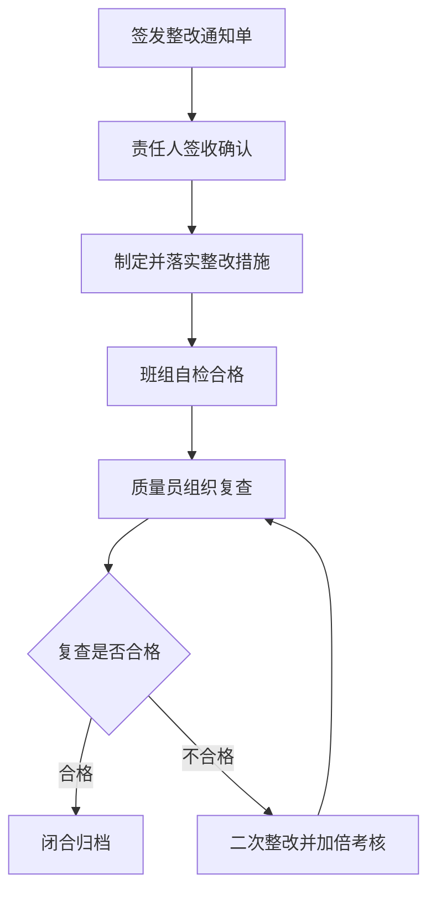

# 工程质量检查整改通知单

> **文档信息**：编号 ZL-2026-1018-07 · 工程名称 星澜科技园 B 座精装修工程 · 受检单位 星澜建设 B 座项目部 · 检查人 黄铭 · 签发日期 2026-10-18 · 整改期限 2026-10-21

> **填写说明**：以下为虚构示例内容，套用后请替换为你的实际信息。

## 一、检查基本信息

| 项目 | 内容 |
| --- | --- |
| 通知单编号 | ZL-2026-1018-07 |
| 检查类型 | 施工单位月度质量大检查（第 3 次） |
| 检查日期 | 2026-10-18，09:00—11:30 |
| 检查人 | 黄铭（质量员）、徐一鸣（技术负责人） |
| 受检范围 | B 座 6 层走廊、8 层东侧卫生间、9 层公共区 |
| 陪同人员 | 谭勇（施工员）、何思远（材料员） |
| 问题数量 | 4 项，其中严重缺陷 0 项，一般缺陷 4 项 |

## 二、问题描述

| 序号 | 部位 | 问题现象 | 依据条款 | 严重程度 |
| --- | --- | --- | --- | --- |
| 1 | 8 层东侧卫生间 WL-08 ~ WL-12 轴墙面，标高 1.2~2.4 m | 抽查饰面砖 60 块，空鼓 5 块，空鼓率 8.3% | GB 50210-2018 第 8.3.5 条（空鼓率不大于 5%） | 一般 |
| 2 | 6 层走廊地面 6-3 ~ 6-5 轴 | 地砖接缝高低差实测 0.8 mm，超出允许值 | GB 50210-2018 表 8.3.11（不大于 0.5 mm） | 一般 |
| 3 | 9 层公共区不锈钢门套 | 未做保护膜包裹，已出现划痕 2 处、长度约 30 mm | 施工合同第 7.2 条成品保护约定 | 一般 |
| 4 | 8 层砖面层检验批资料 | 检验批 JL-8F-2026-1009 记录与现场实测数据不同步，缺 3 个点位 | 项目质量管理办法第 4 章第 12 条 | 一般 |

> **风险**：饰面砖空鼓若不及时返工，交付后存在脱落伤人与二次维修风险，且将影响单位工程竣工验收评定。

## 三、整改要求与期限

| 序号 | 整改内容 | 整改标准 | 责任人 | 完成期限 |
| --- | --- | --- | --- | --- |
| 1 | 铲除 5 块空鼓饰面砖并重新铺贴 | 空鼓率为 0，粘结强度符合设计与规范要求 | 瓦工班班组长 | 2026-10-21 |
| 2 | 对接缝高低差部位打磨、调平 | 接缝高低差不大于 0.5 mm | 瓦工班班组长 | 2026-10-20 |
| 3 | 不锈钢门套加装保护膜与护角 | 保护完整，无新增划痕 | 谭勇 | 2026-10-19 |
| 4 | 补录检验批记录并重新报验 | 记录与现场一致，缺项补齐 | 黄铭 | 2026-10-21 |

- 整改材料由何思远在 2026-10-19 前落实，同批次、同色号墙砖 12 ㎡ 已锁定库存。
- 返工期间作业面须设警示围挡，成品保护措施同步恢复。

> **提示**：同一部位同类问题累计出现 3 次以上，将纳入班组质量考核并扣减当期结算款。

## 四、责任与复查安排

- 整改第一责任人 罗建平：统筹资源，确保按期完成，每日 17:00 反馈进度。
- 现场落实 谭勇：组织班组实施并完成自检，整改完成后当日自检报验。
- 材料保障 何思远：保障返工材料供应，2026-10-19 前到位。
- 复查人 黄铭：逐项复查并出具结论，2026-10-22 上午组织复查。
- 见证复查 恒远工程监理 专业监理工程师：同步参加并签认复查结论。

## 五、整改闭环流程

## 六、复查结论

2026-10-22 复查结果：8 层卫生间返工后抽检 60 块，空鼓 0 块；6 层走廊接缝高低差实测 0.4 mm；9 层门套保护膜加装完成，无新增划痕；检验批 JL-8F-2026-1009 已补录完整。4 项问题全部整改到位，同意闭合。

| 序号 | 复查项目 | 复查实测 | 复查结论 | 复查人 |
| --- | --- | --- | --- | --- |
| 1 | 饰面砖空鼓 | 60 块抽检，0 块空鼓 | 合格 | 黄铭 |
| 2 | 地砖接缝高低差 | 0.4 mm | 合格 | 黄铭 |
| 3 | 成品保护 | 保护完整 | 合格 | 谭勇 |
| 4 | 检验批资料 | 补录完整，可追溯 | 合格 | 徐一鸣 |

---

| 签发人 | 接收人（项目部） | 监理见证 | 闭合状态 | 闭合日期 |
| --- | --- | --- | --- | --- |
| 黄铭 | 谭勇 | 专业监理工程师 | 已闭合 | 2026-10-22 |
