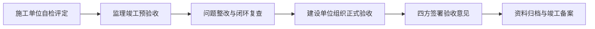

# 竣工验收报告

> **文档信息**：编号 JG-2026-1230 · 工程名称 星澜科技园 B 座精装修工程 · 建设单位 星澜科技 · 施工单位 星澜建设 · 监理单位 恒远工程监理 · 报告日期 2026-12-30

> **填写说明**：以下为虚构示例内容，套用后请替换为你的实际信息。

## 一、工程概况

| 项目 | 内容 |
| --- | --- |
| 工程名称 | 星澜科技园 B 座精装修工程 |
| 建设地点 | 星澜科技园 B 座，地上 9 层，框架剪力墙结构 |
| 参建单位 | 建设 星澜科技 / 设计 筑言设计院 / 监理 恒远工程监理 / 施工 星澜建设 |
| 建设规模 | 建筑面积 18600 ㎡，吊顶展开面积 5820 ㎡，饰面砖 9800 ㎡ |
| 合同工期 | 2026-08-15 至 2026-12-30 |
| 实际竣工日期 | 2026-12-28 |
| 合同造价 | 2860 万元 |
| 项目经理 | 罗建平 |

## 二、验收依据

| 类别 | 依据文件 | 编号 / 版本 |
| --- | --- | --- |
| 标准 | 建筑工程施工质量验收统一标准 | GB 50300-2013 |
| 标准 | 建筑装饰装修工程质量验收标准 | GB 50210-2018 |
| 标准 | 建筑电气工程施工质量验收规范 | GB 50303-2015 |
| 标准 | 建筑给水排水及采暖工程施工质量验收规范 | GB 50242-2002 |
| 标准 | 民用建筑工程室内环境污染控制标准 | GB 50325-2020 |
| 文件 | 施工合同及补充协议 | XL-2026-0712 |
| 文件 | 施工图及设计变更、技术核定单 | 施装-2026-06 及变更 12 份 |

## 三、分部分项工程质量验收情况

| 分部工程 | 主要分项 | 验收结论 | 评定等级 |
| --- | --- | --- | --- |
| 建筑装饰装修 | 地面、抹灰、门窗、吊顶、轻质隔墙、饰面板砖 | 合格 | 合格 |
| 建筑给水排水 | 室内给水管道、卫生器具、排水管道 | 合格 | 合格 |
| 通风与空调 | 风管与部件安装、空调设备安装 | 合格 | 合格 |
| 建筑电气 | 导管敷设、电线电缆、照明器具、防雷接地 | 合格 | 合格 |
| 智能建筑 | 综合布线系统、火灾自动报警系统 | 合格 | 合格 |
| 建筑节能 | 门窗节能、照明节能 | 合格 | 合格 |

- 全工程共形成检验批 428 个，一次验收合格 421 个，一次合格率 98.4%；返工 7 个批次经整改后复验全部合格。
- 隐蔽工程验收记录 86 份，签字齐全，与现场实际一致。
- 各系统调试与试运行记录 24 份，消防系统已通过第三方检测。

## 四、质量控制资料核查情况

资料核查由罗建平组织，黄铭逐项核对，核查结论如下：图纸会审与设计变更 15 份，手续完备；材料合格证与复检报告 186 份，复检结论均合格；检验批与分项验收记录 428 份，数据与现场一致；隐蔽工程验收记录 86 份，签认完整；试验与调试记录 24 份，水压与绝缘测试均合格；室内环境检测报告 1 份，符合 I 类民用建筑限值。各类资料齐全、真实、可追溯，同意通过核查。

> **注意**：资料核查中发现 9 层 2 份门窗分项验收记录签署日期早于现场实测日期，已由徐一鸣复核更正并附情况说明，结论仍为合格。

## 五、观感质量评价

按 GB 50300-2013 组织观感质量检查，抽查 30 项，其中评价「好」24 项、「一般」6 项，综合评价为「好」。主要观感质量情况如下。

- 吊顶表面平整与接缝：抽查 8 项，评价好，板缝顺直、钉眼处理到位。
- 墙面饰面砖色泽与空鼓：抽查 7 项，评价好，色泽均匀、空鼓率为 0。
- 地面接缝与平整度：抽查 6 项，评价好，接缝高低差不大于 0.4 mm。
- 门窗与五金安装：抽查 5 项，评价好，开关灵活、密封良好。
- 灯具与开关面板排布：抽查 4 项，评价一般，局部面板缝隙略大，已当场调整到位。

室内环境检测结果：甲醛 0.06 mg/m³、苯 0.02 mg/m³、TVOC 0.32 mg/m³、氡 68 Bq/m³，均低于 GB 50325-2020 I 类限值要求，检测合格。

## 六、遗留问题与整改承诺

| 序号 | 遗留问题 | 整改措施 | 责任人与完成时限 |
| --- | --- | --- | --- |
| 1 | 9 层公共区 2 处不锈钢门套轻微划痕 | 打磨抛光并重新做防护处理 | 谭勇，2026-12-31 前 |
| 2 | 地下车库入口处导向标识尚未补装 | 按设计补装并校正粘贴位置 | 何思远，2027-01-10 前 |
| 3 | 竣工图签章与归档尚未完成 | 完成四方签章并移交建设单位 | 徐一鸣，2027-01-15 前 |

上述遗留问题不影响工程结构安全与正常使用，星澜建设承诺按期完成整改，质保期内出现非使用不当造成的质量问题，由施工单位在接到通知后 24 小时内响应、72 小时内处理。

## 七、验收结论

经现场检查、资料核查与观感质量评价，本工程所含分部工程质量全部合格，质量控制资料完整，主要使用功能抽查符合要求，室内环境检测合格，观感质量评价为好。同意星澜科技园 B 座精装修工程通过竣工验收，单位工程质量评定为合格，自 2026-12-30 起转入质保期。

---

| 单位 | 岗位 | 验收意见 | 日期 |
| --- | --- | --- | --- |
| 星澜建设 | 项目经理 | 自检合格，遗留问题按期整改 | 2026-12-28 |
| 恒远工程监理 | 总监理工程师 | 预验收合格，同意竣工验收 | 2026-12-29 |
| 筑言设计院 | 设计负责人 | 符合设计文件要求，同意验收 | 2026-12-29 |
| 星澜科技 | 项目负责人 | 同意验收，按承诺跟踪遗留问题 | 2026-12-30 |
