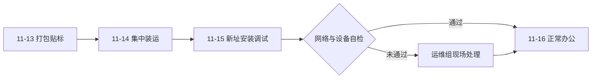

# 办公场所搬迁通知

> **文档信息**：编号 XZ-2026-1105 · 发文部门 行政部 · 拟稿 郑亦航 · 签发 陈嘉禾 · 日期 2026-11-05

> **填写说明**：以下为虚构示例内容，套用后请替换为你的实际信息。

## 一、搬迁范围与时间窗口

因业务规模扩张，研发中心与产品中心长期分散在 B 座 3F 与 A 座 3F 两处办公，跨楼沟通成本较高。经公司研究决定，将 B 座 3F 全部办公区域集中搬迁至 A 座 5F，实现产品研发一体化办公。

| 项目 | 内容 |
| --- | --- |
| 搬迁部门 | 研发中心、产品中心、运维组（共 78 人） |
| 原办公地 | 星澜科技园 B 座 3F（301–318 室） |
| 新办公地 | 星澜科技园 A 座 5F（501–512 室） |
| 搬迁窗口 | 2026-11-14（周六）08:00 至 11-15（周日）18:00 |
| 新址启用 | 2026-11-16（周一）09:00 正常办公 |

搬迁窗口内 B 座 3F 将封闭施工，除搬迁工作组外人员一律不得进入。11 月 13 日（周五）18:00 前，各部门须完成个人物品打包并贴好标签。

## 二、新址信息与通勤

新址位于星澜科技园 A 座 5F，与公司总部同楼，会议室、茶水间、打印区与总部共用，步行至总部 3F 仅需 1 分钟。通勤方面，自 11 月 16 日起作如下调整：

- **园区班车**：在地铁 4 号线科创园站 B 口设停靠点，07:40 与 08:10 各发一班，直达 A 座东门，全程约 12 分钟；
- **自驾**：车位设于园区地下车库 B1，需在 OA 系统重新登记车牌，11 月 16 日起生效；
- **步行**：由园区南门进入，距地铁站 850 米，步行约 11 分钟。

> **提示**：自驾同事请于 11 月 10 日前在 OA 系统「车辆登记」模块更新车牌与常用车场，逾期未登记将无法进入 B1 车库。

## 三、工位分配

工位按「业务链路相邻、团队相对集中」原则分配，具体如下：

| 部门 | 区域 | 工位编号 | 人数 | 区域负责人 |
| --- | --- | --- | --- | --- |
| 研发中心-平台组 | A 区 | A5-01 至 A5-24 | 24 | 徐一鸣 |
| 研发中心-应用组 | B 区 | B5-01 至 B5-22 | 22 | 周敏 |
| 产品中心 | C 区 | C5-01 至 C5-16 | 16 | 林珂 |
| 运维组 | D 区 | D5-01 至 D5-08 | 8 | 谢文 |
| 共享讨论区 | E 区 | E5-01 至 E5-08 | — | 郑亦航 |

工位牌与新址门禁卡由行政部于 11 月 13 日统一发放，请核对姓名与工位编号，如有异议当日反馈。

## 四、IT 与资产处理

| 事项 | 处理方式 | 责任人 | 时间节点 |
| --- | --- | --- | --- |
| 网络与电话 | 搬迁当日完成跳线，11-16 08:30 前测试通 | 谢文 | 11-15 |
| 台式机与外设 | 贴资产标签后集中装箱，由搬运商统一运输 | 韩磊 | 11-14 |
| 打印机与会议设备 | 新址重新安装调试，旧设备原地留用 | 谢文 | 11-15 |
| 固定资产台账 | 搬迁后 3 个工作日内完成台账地点更新 | 赵晓岚 | 11-18 |

## 五、搬迁当日注意事项

- 个人物品请自行装箱密封，箱外标注「姓名-部门-工位号」，每人不超过 3 箱；
- 贵重物品、笔记本、移动硬盘请随身携带，不得装箱托运；
- 搬迁期间 B 座 3F 电梯仅保留 1 部货运使用，请勿占用客梯搬运；
- 11 月 14 日、15 日为休息日，参与搬迁的同事可申请调休，由部门负责人汇总报人力资源部；
- 搬迁完成后，原 B 座 3F 门禁权限于 11 月 17 日统一注销。

> **注意**：涉密纸质文件与合同原件须装入带锁文件箱，由部门负责人亲自移交，全程不得离开视线。

## 六、联络人与应急

搬迁总协调：郑亦航（内线 8312）。IT 现场支持：谢文（内线 8321）。资产与搬运对接：韩磊（内线 8330）。搬迁期间如遇突发情况，请第一时间联系总协调，避免自行处置。

---

| 部门 | 打包完成确认 | 装箱数量 | 新址验收人 | 验收日期 |
| --- | --- | --- | --- | --- |
| 研发中心-平台组 | 徐一鸣 | 62 箱 | 谢文 | 2026-11-15 |
| 产品中心 | 林珂 | 41 箱 | 郑亦航 | 2026-11-15 |
| 运维组 | 谢文 | 18 箱 | 韩磊 | 2026-11-15 |

**发文部门**：星澜科技行政部
**发文日期**：2026-11-05
