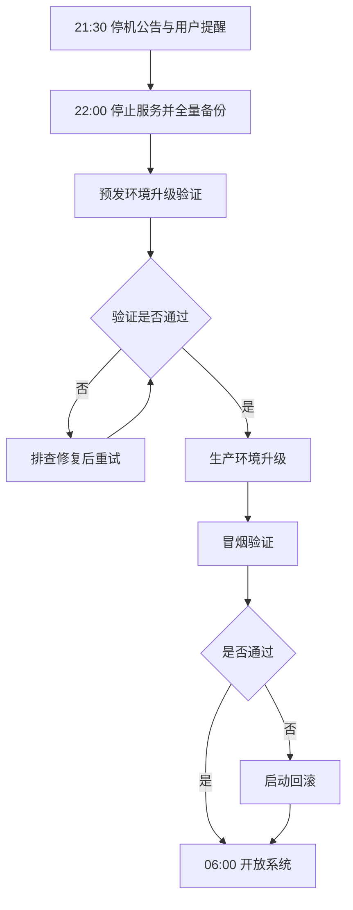

# 系统升级停机通知

> **文档信息**：编号 XZ-2026-1113 · 发文部门 研发中心运维组 · 拟稿 谢文 · 审核 徐一鸣 · 签发 陈嘉禾 · 日期 2026-11-13

> **填写说明**：以下为虚构示例内容，套用后请替换为你的实际信息。

## 一、停机安排

为完成 OA 系统 V4.2 版本升级，运维组将对生产环境执行计划内停机维护。本次升级涉及流程引擎重构与数据库表结构调整，必须停止写入服务，无法在线完成，故安排在业务低峰时段进行。

| 项目 | 内容 |
| --- | --- |
| 停机系统 | OA 系统（含移动端） |
| 停机窗口 | 2026-11-21（周六）22:00 至 11-22（周日）06:00 |
| 预计耗时 | 8 小时（升级 5.5 小时 + 验证 2.5 小时） |
| 实施团队 | 运维组 谢文、韩磊 + 厂商工程师 2 人 |
| 业务确认 | 徐一鸣 |

> **提示**：停机窗口内系统将返回维护页，请勿反复刷新；若 11-22 06:00 仍未恢复，运维组将通过企业微信群发布续报。

## 二、影响范围

| 受影响系统/功能 | 影响内容 | 不可用时段 | 替代方式 |
| --- | --- | --- | --- |
| OA 审批流 | 无法发起、审批任何单据 | 全窗口 | 纸质审批留待补录 |
| OA 考勤打卡 | 打卡记录不可提交 | 全窗口 | 事后提交考勤申诉 |
| OA 共享盘 | 文件不可上传下载 | 全窗口 | 使用本地副本 |
| 云枢 CRM | 不受影响 | — | 正常使用 |
| 星澜数据中台 | 不受影响 | — | 正常使用 |
| VPN 通道 | 不受影响 | — | 正常使用 |

> **注意**：OA 与云枢 CRM 之间存在单据同步任务，停机期间 CRM 侧产生的同步数据将在升级完成后自动补传，无需人工干预。

## 三、升级内容

- **流程引擎升级**：审批链路并发能力提升至 500 并发，长链路审批超时问题修复；
- **附件容量调整**：单附件上限由 50MB 提升至 200MB，支持断点续传；
- **移动端改造**：审批界面重构，支持批量审批与一键转办；
- **安全加固**：登录增加异地登录提醒，会话超时由 8 小时缩短为 4 小时；
- **历史数据归档**：2023 年以前已办结单据迁移至归档库，释放主库空间约 210GB。

## 四、用户须知

1. 请在 11 月 21 日 21:30 前保存并提交正在编辑的流程单据，未提交内容不保证留存；
2. 停机期间产生的纸质审批单，请于 11 月 23 日前在系统内补录并注明「停机期补录」；
3. 升级后首次登录需重新验证 VPN 会话，如提示密码错误请勿连续重试，等待 5 分钟后再试；
4. 移动端需更新至最新版本（4.2.0），旧版本将无法登录。

## 五、回滚预案与应急联络

升级采用「灰度验证 + 可回滚」策略：数据备份完成后先行升级预发环境验证，通过后再升级生产环境。若生产环境冒烟验证连续 2 轮失败，或核心审批流不可用超过 30 分钟，由徐一鸣决策启动回滚，预计回滚耗时 40 分钟。

| 联络角色 | 姓名 | 电话 | 职责 |
| --- | --- | --- | --- |
| 升级总指挥 | 徐一鸣 | 138-0000-8318 | 决策回滚与放行 |
| 现场实施 | 谢文 | 138-0000-8321 | 升级执行与验证 |
| 安全巡检 | 韩磊 | 138-0000-8330 | 备份核对与安全确认 |
| 业务联络 | 郑亦航 | 138-0000-8312 | 通知发布与用户答疑 |

---

| 升级前检查 | 检查人 | 结论 | 升级后验证 | 验证人 | 结论 |
| --- | --- | --- | --- | --- | --- |
| 数据库备份完整 | 韩磊 | 通过 | 核心审批流可用 | 谢文 | 通过 |
| 预发环境验证 | 谢文 | 通过 | 附件上传下载正常 | 谢文 | 通过 |
| 回滚脚本可用 | 谢文 | 通过 | 移动端登录正常 | 郑亦航 | 通过 |

**发文部门**：星澜科技研发中心运维组
**发文日期**：2026-11-13
