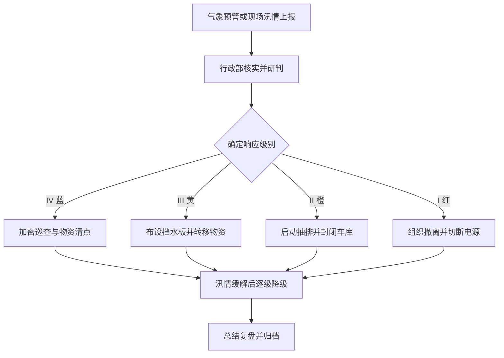

# 安全生产及防汛通知

> **文档信息**：编号 XZ-2026-0908 · 发文部门 行政部 · 拟稿 韩磊 · 审核 郑亦航 · 签发 陈嘉禾 · 日期 2026-09-08

> **填写说明**：以下为虚构示例内容，套用后请替换为你的实际信息。

## 一、汛期风险研判

根据气象部门预测，2026 年 9 月至 10 月本市将出现 2 至 3 次强降雨过程，局地伴有短时雷暴大风，累计降雨量较常年偏多约两成。公司所在园区地势偏低，历史上曾出现地下车库倒灌与配电间渗水情况，本年度防汛形势不容乐观。

| 风险点 | 潜在后果 | 风险等级 | 责任人 |
| --- | --- | --- | --- |
| 地下车库 B1/B2 出入口 | 积水倒灌，车辆与设备受损 | 高 | 郑亦航 |
| B 座 1F 仓储区 | 物资受潮、纸档损毁 | 高 | 韩磊 |
| 屋顶机房与空调外机 | 渗水导致设备短路 | 中 | 谢文 |
| A 座 3F 档案室 | 窗边渗水，档案受潮 | 中 | 孙倩 |
| 园区外围排水沟 | 堵塞导致排水不畅 | 中 | 郑亦航 |

## 二、检查要点与责任分工

各部门须在 9 月 15 日前完成首轮自查，汛期内每周五复查一次，检查结果录入 OA 系统「安全管理 / 汛期检查」台账。

| 检查区域 | 检查项目 | 合格标准 | 责任人 | 频次 |
| --- | --- | --- | --- | --- |
| 地下车库 | 挡水板、抽水泵、排水沟 | 挡水板完好可取用，抽水泵试运行正常 | 郑亦航 | 每周 |
| 1F 仓储区 | 货架离地高度、防潮垫 | 物资离地不低于 15cm | 韩磊 | 每周 |
| 屋顶与机房 | 防水层、线缆穿孔封堵 | 无渗漏痕迹，封堵完好 | 谢文 | 每周 |
| 档案室 | 窗缝密封、除湿机 | 湿度不高于 60% | 孙倩 | 每周 |
| 消防通道 | 通道畅通、应急照明 | 无堆物，照明可用 | 韩磊 | 每周 |

> **注意**：发现渗水、积水或设施失效的，须当场拍照留存并在 2 小时内上报行政部，不得先整改后补报。

## 三、应急预案与响应分级

| 响应级别 | 启动条件 | 主要动作 | 决策人 |
| --- | --- | --- | --- |
| IV 级（蓝） | 气象台发布暴雨蓝色预警 | 加强巡查，检查物资 | 韩磊 |
| III 级（黄） | 发布暴雨黄色预警或园区出现积水 | 布设挡水板，转移低位物资 | 郑亦航 |
| II 级（橙） | 发布暴雨橙色预警或积水进入 1F | 启动抽排，暂停地下车库使用 | 陈嘉禾 |
| I 级（红） | 出现人员受困或配电间进水 | 全员避险撤离，切断相关电源 | 陈嘉禾 |

> **提示**：应急物资存放于 A 座 1F 值班室与地下车库入口旁，包括沙袋 200 个、挡水板 12 块、抽水泵 3 台、应急照明 20 套，任何人不得挪作他用。

## 四、值班与信息上报要求

汛期实行 24 小时电话值班，值班安排由行政部按周排定并提前 3 日公告。值班人员职责：每小时关注气象预警；收到预警后 10 分钟内通知应急小组；出现 II 级以上响应时须到岗现场值守。信息上报要求如下：

1. 接收气象预警后 10 分钟内，通过企业微信群通知应急小组全员；
2. 发现积水、渗水或设施失效，30 分钟内电话上报郑亦航、韩磊并留存照片；
3. 触发 II 级及以上响应，立即电话报告陈嘉禾，由其决定是否升级；
4. 汛情处置完毕后 2 小时内，在 OA「汛期检查」台账中填报处置过程与损失情况。

## 五、培训与演练

行政部将于 9 月 18 日 15:00 组织一次防汛应急演练，地点为地下车库 B1 入口，参加人员为应急小组全体成员及物业安保；演练内容包括挡水板快速布设、抽水泵启用与人员疏散，演练结果纳入年度安全考核。

---

| 检查部门 | 检查人 | 首轮自查日期 | 发现问题 | 整改完成日期 |
| --- | --- | --- | --- | --- |
| 行政部 | 韩磊 | 2026-09-12 | 排水沟局部堵塞 1 处 | 2026-09-13 |
| 研发中心 | 谢文 | 2026-09-13 | 机房线缆穿孔封堵老化 | 2026-09-15 |
| 人力资源部 | 孙倩 | 2026-09-14 | 档案室除湿机故障 1 台 | 2026-09-16 |

**发文部门**：星澜科技行政部
**发文日期**：2026-09-08
