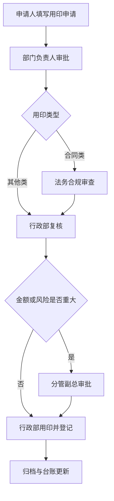

# 星澜科技行政管理制度（办法）

> **文档信息**：编号 XZ-2026-003 · 制定部门 行政部 · 起草 郑亦航 · 会签 秦朗、赵晓岚 · 审核 陈嘉禾 · 版本 V1.0 · 施行日期 2026-10-01

> **填写说明**：以下为虚构示例内容，套用后请替换为你的实际信息。

## 第一章 总则

**第一条** 为规范公司行政事务管理，明确职责分工与办事标准，保障办公秩序与资产安全，特制定本办法。

**第二条** 本办法依据公司《员工手册》及总经理办公会 2026 年第 9 次会议决议制定，是公司行政事务管理的基本依据。

**第三条** 行政事务管理遵循「统一制度、分级审批、流程留痕、成本可控」四项原则：

1. 统一制度——全公司行政事务适用同一套标准，各部门不得另行制定冲突规定；
2. 分级审批——按事项金额与影响范围确定审批层级，避免层层加签；
3. 流程留痕——申请、审批、执行、归档四个环节均在 OA 留存记录；
4. 成本可控——行政支出纳入年度预算，超预算事项须专项报批。

**第四条** 本办法所称行政事务，包括办公场地与工位、办公用品与固定资产、印章与证照、会议与会议室、差旅与接待、快递与车辆等事项。

## 第二章 适用范围与职责

**第五条** 本办法适用于公司全体在职员工，含试用期员工、实习生及外部驻场人员；外部驻场人员涉及资产领用的，由对接部门负责人承担连带管理责任。

**第六条** 行政部为公司行政事务归口管理部门，主要职责如下：

| 职责条线 | 具体职责 | 责任人 |
| --- | --- | --- |
| 制度与流程 | 起草、修订、宣贯行政制度 | 郑亦航 |
| 办公资产 | 办公用品、固定资产的采购与台账 | 郑亦航、何思远 |
| 印章证照 | 印章保管、用印审批、证照年检 | 郑亦航 |
| 会议差旅 | 会议室调度、差旅标准执行 | 郑亦航 |
| 费用预算 | 行政预算编制与执行监控 | 赵晓岚 |

**第七条** 各部门负责人对本部门行政事务承担第一责任，应指定 1 名行政对接人，负责本部门申请提报与台账核对。

**第八条** 财务部负责行政费用的预算审核与报销复核；法务负责合同用印与对外文件的合规审查。

## 第三章 办公与用印管理

**第九条** 办公用品实行「按需申领、月度汇总、预算控制」。单次申领金额 500 元以下的，由部门负责人审批；500 元（含）以上的，报行政部复核后办理。

**第十条** 固定资产领用实行「一人一档」，领用人离职或转岗时须办理资产交接；未办理交接的，暂停办理离职结算。

**第十一条** 印章实行专人保管、分级审批、逐笔登记。公司公章、合同章由行政部保管；财务专用章、法人章由财务部保管，二者不得由同一人保管。

**第十二条** 用印须履行申请与审批程序，审批通过后方可用印，严禁空白文件用印、严禁印章外带（经分管副总批准的除外）。

> **风险**：印章外带期间的安全责任由申请人承担，用印完成后 1 个工作日内须归还并核验台账。

## 第四章 会议与差旅管理

**第十三条** 会议室实行线上预约，预约提前量不少于 2 小时，单次预约时长原则上不超过 3 小时；连续占用超过 4 小时的，须说明理由并经行政部同意。

**第十四条** 会议组织应遵循「无准备不开会」原则：会议须有明确议题、必要材料与预期结论，会议纪要在会后 1 个工作日内发出。

**第十五条** 差旅实行事前审批、按标准执行。国内差旅须提前 2 个工作日在 OA 提交《出差申请单》，审批通过后方可订票。

| 职级 | 交通工具 | 住宿标准 | 市内交通 |
| --- | --- | --- | --- |
| 总监及以上 | 高铁二等座/飞机经济舱 | 600 元/晚 | 实报实销 |
| 经理级 | 高铁二等座 | 450 元/晚 | 120 元/日 |
| 普通员工 | 高铁二等座 | 350 元/晚 | 100 元/日 |

**第十六条** 差旅费用报销须附《出差申请单》、审批记录与合规票据，于返程后 10 个工作日内提交；超标准部分原则上自理，特殊情形须书面说明并经分管副总批准。

> **注意**：同城或异地多人同行出差，应合并安排交通与住宿，避免重复支出。

## 第五章 附则

**第十七条** 本办法未尽事宜，按公司既有制度执行；与本办法冲突的，以本办法为准。

**第十八条** 本办法每两年评估一次，遇组织架构调整或重大流程变更时可临时修订。

**第十九条** 本办法由行政部负责解释，自 2026 年 10 月 1 日起施行。

---

| 起草 | 会签 | 审核 | 批准 | 施行日期 |
| --- | --- | --- | --- | --- |
| 郑亦航 | 秦朗、赵晓岚 | 陈嘉禾 | 总经理 | 2026-10-01 |
