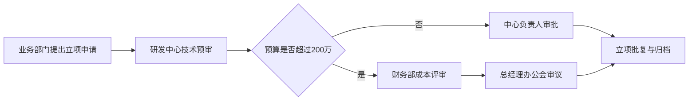

# 项目立项申请

> **文档信息**：编号 XM-2026-018 · 项目名称 星河数据中台二期 · 申请部门 研发中心 · 申请人 陈嘉禾 · 申请日期 2026-09-22 · 预算 286 万元

> **填写说明**：以下为虚构示例内容，套用后请替换为你的实际信息。

## 一、项目概述

星河数据中台一期已于 2026 年 6 月上线，解决了指标口径不统一、报表重复开发的问题。二期在一期基础上补齐实时计算与数据资产治理能力，支撑市场、售后、运营三个业务域的日级决策需求。

| 项目 | 内容 |
| --- | --- |
| 项目名称 | 星河数据中台二期 |
| 项目目标 | 指标口径全域统一，核心看板 T+0 出数 |
| 项目周期 | 2026-10-08 至 2027-02-27（约 5 个月） |
| 项目预算 | 286 万元（人力 198 万、云资源 62 万、外部咨询 26 万） |
| 项目负责人 | 陈嘉禾 |

## 二、立项背景与必要性

- 一期沉淀 168 个指标，但仍有 43 个指标由业务侧自行维护，口径分裂风险持续存在；
- 实时性不足：现有链路 T+1 出数，市场投放调优依赖隔日数据，错过当日调优窗口；
- 数据资产缺少血缘与热度信息，新人定位一张表平均耗时超过 2 小时。

> **风险**：若不立项，2027 年一季度大促期间预计出现 3 次以上口径争议，且投放调优滞后将带来约 60 万元/季的预算浪费。

## 三、项目范围

### 3.1 建设内容

| 模块 | 主要工作 | 交付物 |
| --- | --- | --- |
| 实时计算 | 引入流式链路，核心指标秒级更新 | 实时链路、18 个实时指标 |
| 资产治理 | 表级血缘、热度分级、责任人标注 | 资产地图、治理规范 |
| 指标平台 | 指标注册、口径审批、变更追溯 | 指标平台 V2.0 |
| 决策看板 | 市场投放、售后时效、运营转化三类看板 | 11 张看板 |

### 3.2 不在本期范围

- 不涉及数据源系统改造（ERP、CRM 由业务系统方负责）；
- 不做自助取数 BI 工具建设，延后至三期评估。

## 四、实施计划

| 阶段 | 时间 | 里程碑 | 负责人 |
| --- | --- | --- | --- |
| 立项与方案设计 | 2026-10-08 ~ 11-06 | 方案评审通过 | 陈嘉禾 |
| 实时链路建设 | 2026-11-09 ~ 12-18 | 核心指标秒级可见 | 徐一鸣 |
| 资产治理与指标平台 | 2026-12-21 ~ 2027-01-22 | 指标平台 V2.0 上线 | 周敏 |
| 看板建设与验收 | 2027-01-25 ~ 02-27 | 三类看板业务验收 | 林珂 |

## 五、资源需求

| 资源类型 | 需求内容 | 投入方式 | 备注 |
| --- | --- | --- | --- |
| 人力 | 研发 6 人 · 产品 1 人 · 测试 2 人 | 全职 5 个月 | 其中 2 人自 CRM 项目释放 |
| 云资源 | 实时计算集群、存储扩容 40 TB | 按量计费 | 月均 12.4 万元 |
| 外部支持 | 数据治理咨询 30 人天 | 采购服务 | 已完成供应商比价 |

## 六、收益测算

| 收益项 | 测算口径 | 年化收益 |
| --- | --- | --- |
| 报表重复开发减少 | 减少 60 人天/年 | 18 万元 |
| 投放调优提效 | 预算浪费下降 15% | 36 万元 |
| 数据定位提效 | 每人每周节省 1.5 小时 | 22 万元 |

> **提示**：投资回收期约 5.4 个月，收益测算口径与财务部已对齐。

## 七、审批意见

| 角色 | 姓名 | 意见 | 日期 |
| --- | --- | --- | --- |
| 申请部门负责人 | 徐一鸣 | 同意立项，建议压缩咨询采购规模 | 2026-09-23 |
| 财务部 | 赵晓岚 | 预算科目已核对，同意分两批拨付 | 2026-09-24 |
| 分管副总 | 陈嘉禾 | 同意 | 2026-09-25 |
| 总经理 | 待签 | — | — |
