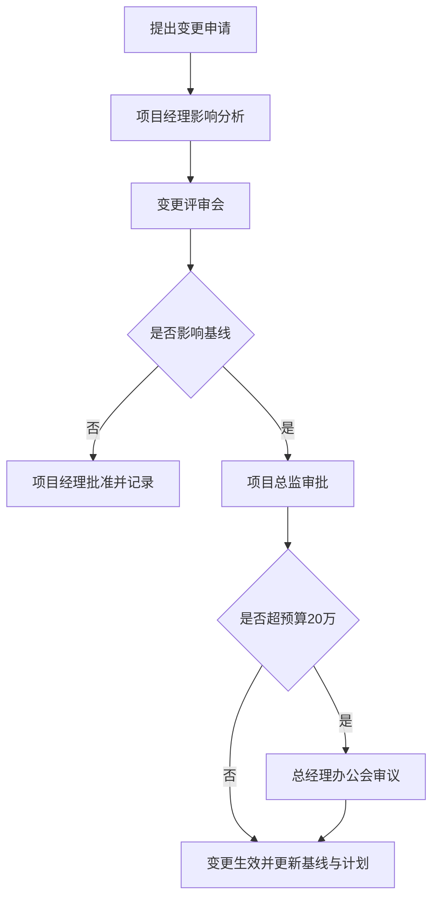

# 项目变更申请

> **文档信息**：编号 BG-2026-0033 · 项目名称 云枢 CRM 一期 · 申请人 林珂 · 项目经理 罗建平 · 版本 V1.0 · 申请日期 2026-09-24

> **填写说明**：以下为虚构示例内容，套用后请替换为你的实际信息。

## 一、变更内容与原因

**变更内容。** 拟将「订单审批流」由原定的单级审批调整为二级审批（金额 ≥ 50 万元加签财务审核），并在订单模块中增加审批留痕与超时提醒功能。

**变更原因。** 2026 年 9 月 18 日市场部与售后部联合反馈，单级审批在 50 万元以上的订单场景中缺少财务复核环节，存在回款风险；同时财务部提出订单金额口径须与结算系统一致，需要增加校验。

| 项目 | 内容 |
| --- | --- |
| 变更类别 | 范围变更 |
| 变更来源 | 市场部、售后部、财务部联合提出 |
| 提出日期 | 2026-09-18 |
| 关联需求 | 订单模块 REQ-OD-014、REQ-OD-021 |

## 二、影响分析

| 维度 | 影响描述 | 影响程度 | 量化结果 |
| --- | --- | --- | --- |
| 范围 | 新增审批流配置与提醒功能 | 中 | 新增 2 个功能点 |
| 进度 | 订单模块联调工作量增加 | 中 | 迭代顺延约 3 个工作日 |
| 成本 | 增加开发与测试人力 | 低 | 增加约 1.8 万元 |
| 质量 | 审批留痕提升合规性 | 正向 | 降低回款风险 |

> **风险**：若变更在 10 月 8 日需求冻结后才确认，订单模块需整体返工，进度影响将扩大至 7 个工作日。

## 三、替代方案对比

| 方案 | 主要做法 | 进度影响 | 成本影响 | 结论 |
| --- | --- | --- | --- | --- |
| 方案一：二期实现 | 本期维持单级审批 | 0 天 | 0 元 | 风险留存，建议不采纳 |
| 方案二：本期二级审批 | 本期完成审批流改造 | +3 天 | +1.8 万元 | 推荐采纳 |
| 方案三：规则引擎外挂 | 引入外部规则引擎 | +12 天 | +9.6 万元 | 成本过高，暂不采纳 |

方案二在进度与成本上的增量最小，且可直接复用现有审批组件，能够在本期闭环回款风险，建议采纳。

## 四、评审与审批

| 角色 | 姓名 | 意见 | 日期 |
| --- | --- | --- | --- |
| 申请人 | 林珂 | 建议采纳方案二 | 2026-09-24 |
| 项目经理 | 罗建平 | 影响可控，同意提交评审 | 2026-09-24 |
| 财务部 | 赵晓岚 | 同意增加校验，费用在预算内 | 2026-09-25 |
| 项目总监 | 陈嘉禾 | 同意变更，按方案二执行 | 2026-09-25 |

> **注意**：变更批准后由项目经理在 1 个工作日内更新需求基线、排期表与成本台账，并同步至项目看板。

---

| 变更申请人 | 项目经理确认 | 项目总监批准 | 生效日期 |
| --- | --- | --- | --- |
| 林珂 | 罗建平 | 陈嘉禾 | 2026-09-26 |
