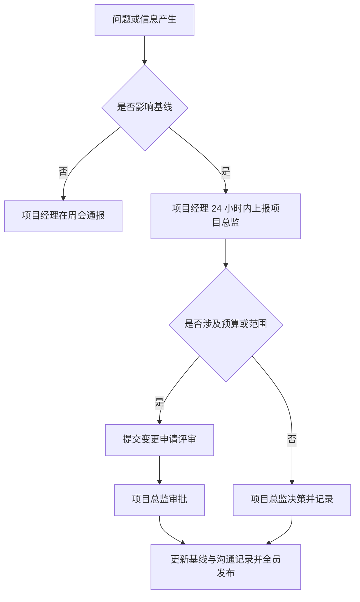

# 项目沟通计划

> **文档信息**：编号 XM-2026-063 · 项目名称 星河数据中台二期 · 编制 林珂 · 审核 陈嘉禾 · 版本 V1.0 · 发布日期 2026-10-08

> **填写说明**：以下为虚构示例内容，套用后请替换为你的实际信息。

## 一、干系人登记

识别项目干系人并明确其关注点与影响程度，是制定沟通策略的基础。

| 干系人 | 角色 | 关注点 | 影响程度 | 沟通策略 |
| --- | --- | --- | --- | --- |
| 陈嘉禾 | 项目总监 | 目标达成、资源投入 | 高 | 重点管理 |
| 赵晓岚 | 财务经理 | 预算执行、成本超支 | 高 | 重点管理 |
| 周敏 | 研发负责人 | 排期、技术风险 | 高 | 重点管理 |
| 徐一鸣 | 技术负责人 | 环境、链路稳定性 | 中 | 定期通报 |
| 吴桐 | 市场经理 | 看板可用性、数据及时性 | 中 | 定期通报 |
| 谢文 | 运维负责人 | 部署、监控、容量 | 中 | 定期通报 |
| 黄铭 | 测试负责人 | 质量、缺陷闭环 | 中 | 定期通报 |

## 二、沟通矩阵

| 沟通对象 | 沟通内容 | 频率 | 渠道 | 责任人 |
| --- | --- | --- | --- | --- |
| 项目总监 | 进度、风险、资源 | 每周 | 项目周报+周会 | 林珂 |
| 财务部 | 预算执行、变更成本 | 每月 | 月度成本报表 | 赵晓岚 |
| 业务部门 | 看板需求、验收口径 | 每两周 | 需求对齐会 | 林珂 |
| 研发团队 | 任务分派、技术问题 | 每日 | 站会（15 分钟） | 周敏 |
| 运维团队 | 部署计划、容量评估 | 每月 | 运维协调会 | 谢文 |
| 全体干系人 | 里程碑与重大变更 | 按事件 | 邮件+项目看板 | 林珂 |

> **提示**：周报模板统一使用《项目周报》，周五 17:00 前发出；临时重大事项不等待周期，即时上报。

## 三、会议机制

| 会议名称 | 频率 | 参与人 | 时长 | 目标产出 |
| --- | --- | --- | --- | --- |
| 每日站会 | 每日 09:30 | 研发、测试 | 15 分钟 | 昨日进展、今日计划、阻塞项 |
| 项目周会 | 每周一 10:00 | 全体核心成员 | 60 分钟 | 周报、风险清单、下周计划 |
| 需求对齐会 | 每两周 | 产品、业务代表 | 90 分钟 | 需求确认单 |
| 技术评审会 | 按需 | 研发、运维 | 90 分钟 | 评审纪要 |
| 里程碑评审 | 按里程碑 | 全体干系人 | 120 分钟 | 评审结论 |

## 四、信息发布与升级路径

| 事项层级 | 响应时限 | 决策人 | 发布范围 |
| --- | --- | --- | --- |
| 一般事项 | 2 个工作日 | 项目经理 | 项目组 |
| 重要事项 | 24 小时 | 项目总监 | 核心干系人 |
| 重大事项 | 即时 | 总经理办公会 | 全体干系人 |

> **注意**：所有对外发布的项目信息以项目看板与正式邮件为准，口头信息不作为决策依据；涉密数据不得通过即时通讯工具外发。

---

| 编制 | 项目管理办审核 | 项目总监批准 | 生效日期 |
| --- | --- | --- | --- |
| 林珂 | 罗建平 | 陈嘉禾 | 2026-10-08 |
