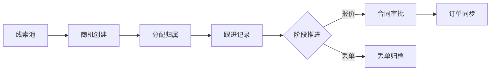

# 软件需求规格说明

> **文档信息**：编号 SRS-2026-031 · 系统 云枢 CRM · 编制人 徐一鸣 · 审核 周敏 · 版本 V1.0 · 日期 2026-09-22 · 密级 内部

> **填写说明**：以下为虚构示例内容，套用后请替换为你的实际信息。

## 一、文档目的与范围

本文档定义云枢 CRM 客户与商机模块 V2.3 的功能与非功能需求，作为设计、开发、测试与验收的唯一基线。范围覆盖客户主数据、商机跟进、合同审批三条链路，不含售后工单与结算模块。

| 项目 | 内容 |
| --- | --- |
| 系统名称 | 云枢 CRM（主业务系统） |
| 目标版本 | V2.3，计划 2026-11-14 上线 |
| 需求来源 | 市场部、售后部、运营中心共 3 个业务域 |
| 基线编号 | BL-2026-CRM-2.3-01 |
| 变更控制 | 基线冻结后变更须经周敏审批并记录影响面 |

> **注意**：需求基线冻结后，任何新增或修改需求须走变更单流程，同步更新测试用例与验收标准，否则不予纳入本版本迭代。

## 二、术语与缩略语

| 术语 | 全称 | 说明 |
| --- | --- | --- |
| 商机 | Sales Opportunity | 有明确成交预期的销售线索，具备金额与阶段 |
| 阶段 | Stage | 商机生命周期状态，取值 新建/跟进/报价/赢单/丢单 |
| 归属 | Owner | 商机当前责任人，变更需记录流转日志 |
| 主子账号 | Primary/Sub Account | 客户主账号下可挂载多个联系人账号 |
| 跟进记录 | Activity | 一次拜访、电话或邮件的结构化记录 |

## 三、业务背景与角色

云枢 CRM 承接三家业务域线索，当前日活 1 860 人，日均新增商机 4 200 条。现有版本存在商机归属冲突、跟进记录无法关联联系人、批量导入超时三类问题，V2.3 需一并解决。



- **销售**：创建商机、录入跟进记录，权限限于本人归属商机；
- **销售主管**：分配归属、调整阶段，可改派商机并跨团队查看；
- **市场运营**：查看漏斗与转化报表，仅只读权限；
- **系统管理员**：字典与权限配置，具备全量配置权限。

## 四、功能需求

需求按 FR-001 递增编号，优先级 P0 不得延后，P1 可延后一个批次，P2 视资源插空。

| 编号 | 需求名称 | 优先级 | 所属迭代 |
| --- | --- | --- | --- |
| FR-001 | 商机创建与归属分配 | P0 | 迭代 1 |
| FR-002 | 跟进记录关联联系人 | P0 | 迭代 1 |
| FR-003 | 商机阶段流转与校验 | P0 | 迭代 2 |
| FR-004 | 客户主数据批量导入 | P1 | 迭代 2 |
| FR-005 | 商机漏斗报表 | P1 | 迭代 3 |
| FR-006 | 归属变更日志审计 | P2 | 迭代 3 |

### 4.1 FR-001 商机创建与归属分配

| 维度 | 内容 |
| --- | --- |
| 描述 | 销售创建商机并自动分配归属，支持主管手动改派 |
| 输入 | 客户 ID、商机名称、预计金额、阶段、期望成交日期 |
| 处理 | 校验客户存在且状态为「活跃」；按客户所属团队路由归属人；写入归属日志 |
| 输出 | 商机 ID（雪花算法 19 位）、归属人、创建时间 |
| 优先级 | P0 |

**异常分支**：客户不存在返回 `40401`；客户已冻结返回 `40902`；单客户同名称商机重复返回 `40903`。

### 4.2 FR-002 跟进记录关联联系人

- 一条跟进记录可关联 0~5 位联系人，主联系人唯一；
- 记录支持文本、附件（单文件 ≤ 20 MB，最多 9 个）、下次跟进时间；
- 下次跟进时间早于当前时间时，前端必须二次确认。

### 4.3 FR-003 商机阶段流转与校验

| 起始阶段 | 目标阶段 | 校验规则 |
| --- | --- | --- |
| 新建 | 跟进 | 须存在至少 1 条跟进记录 |
| 跟进 | 报价 | 预计金额 > 0 且已关联主联系人 |
| 报价 | 赢单 | 须存在已审批通过的合同 |
| 任意 | 丢单 | 必填丢单原因，原因字典 12 项 |

## 五、非功能需求

| 编号 | 类别 | 指标 | 验证方式 |
| --- | --- | --- | --- |
| NFR-01 | 性能 | 商机列表 P99 ≤ 380 ms（5 000 并发） | 压测报告 |
| NFR-02 | 性能 | 批量导入 5 万行 ≤ 90 s | 场景测试 |
| NFR-03 | 可用性 | 月可用率 ≥ 99.95%，RTO ≤ 15 min | 监控统计 |
| NFR-04 | 安全 | 越权访问拦截率 100%，敏感字段脱敏 | 渗透测试 |
| NFR-05 | 兼容 | Chrome 116+ / Safari 16+ / iOS 16+ | 兼容矩阵 |

> **提示**：性能指标以 prod 环境同规格资源为基准，staging 压测结果按 1.3 倍系数折算。

## 六、外部接口需求

| 接口 | 方向 | 协议 | 频率 | 说明 |
| --- | --- | --- | --- | --- |
| 星河数据中台 | 出 | HTTPS/JSON | 5 min | 推送商机漏斗快照 |
| 岚图门户 | 入 | HTTPS/JSON | 实时 | 接收线索创建事件 |
| 远岚 App | 入 | HTTPS/JSON | 实时 | 移动端跟进记录提交 |
| 统一认证 | 入 | OAuth 2.0 | 实时 | Bearer Token 校验 |

```json
{
  "eventId": "evt_202609220001",
  "eventType": "lead.created",
  "occurredAt": "2026-09-22T10:14:07+08:00",
  "payload": {
    "leadId": "9002817364512038842",
    "channel": "portal",
    "customerName": "宁波澜川机械有限公司",
    "contactPhone": "138****6621"
  }
}
```

## 七、验收标准

- [x] AC-01（FR-001）创建 200 条商机归属准确率 100%，以自动化用例判定；
- [x] AC-02（FR-002）联系人关联与主联系人唯一性校验通过，用例加人工抽查；
- [x] AC-03（FR-003）6 类阶段流转校验全部拦截非法操作，覆盖边界用例；
- [ ] AC-04（FR-004）5 万行导入成功率不低于 99.9%，以场景测试判定；
- [ ] AC-05（NFR-01）P99 延迟与并发指标达标，以压测报告判定。

---

| 角色 | 姓名 | 评审意见 | 日期 |
| --- | --- | --- | --- |
| 技术负责人 | 徐一鸣 | 需求完整，接口需补充幂等约定 | 2026-09-23 |
| 研发负责人 | 周敏 | 同意基线冻结 | 2026-09-24 |
| 测试负责人 | 黄铭 | 需补充批量导入异常用例 | 2026-09-24 |
| 产品经理 | 林珂 | 确认范围 | 2026-09-25 |
