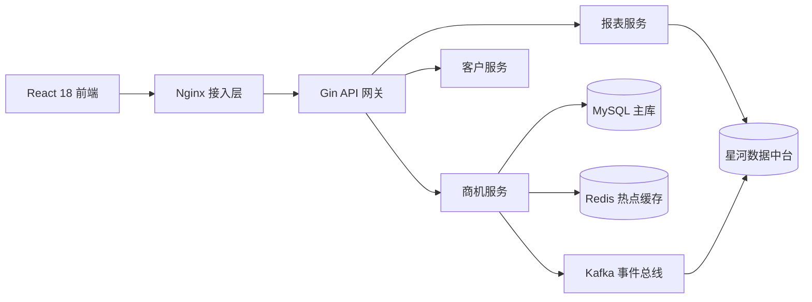
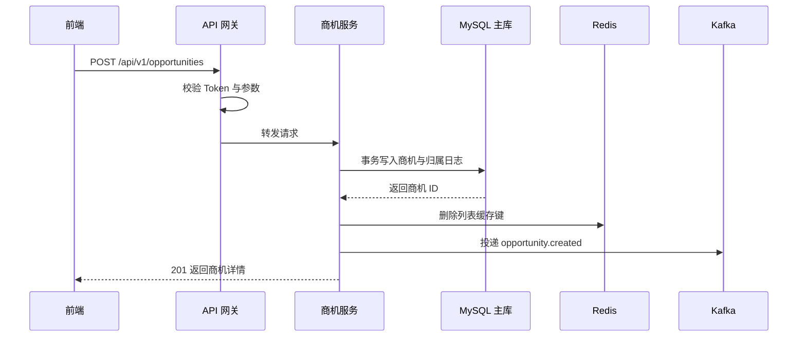

# 技术方案设计文档

> **文档信息**：编号 TDD-2026-047 · 系统 云枢 CRM · 编制人 徐一鸣 · 审核 周敏 · 版本 V1.0 · 日期 2026-09-22 · 密级 内部

> **填写说明**：以下为虚构示例内容，套用后请替换为你的实际信息。

## 一、背景与目标

云枢 CRM 商机列表在 5 000 并发下 P99 达 1.42 s，主要瓶颈为多表关联查询未命中索引、报表与交易共用同一库。本方案通过读写分离、热点缓存与异步化改造，将列表 P99 压至 380 ms 以内，并解耦报表链路。

| 目标 | 现状 | 目标值 | 度量方式 |
| --- | --- | --- | --- |
| 商机列表 P99 | 1 420 ms | ≤ 380 ms | Grafana 面板 p99 |
| 支撑并发 | 2 200 | 5 000 | 全链路压测 |
| 报表查询影响 | 交易库 CPU 峰值 82% | 交易库峰值 ≤ 55% | 监控采样 |
| 部署变更时长 | 22 min | ≤ 8 min | 发布流水线记录 |

## 二、总体架构



分层职责：接入层负责 TLS 终止与限流；API 网关负责鉴权与参数校验；领域服务承载业务逻辑；Kafka 承担写扩散与报表同步。

| 层 | 组件 | 部署形态 | 说明 |
| --- | --- | --- | --- |
| 接入层 | Nginx 1.25 | 3 副本 | 限流 2 000 QPS/实例 |
| 应用层 | Go 1.25 + Gin | K8s 8 副本 | HPA 阈值 CPU 65% |
| 缓存层 | Redis 7 | 主从 + 哨兵 | 热点商机 TTL 300 s |
| 存储层 | MySQL 8.0 | 一主两从 | 读写分离，从库承担报表只读 |
| 消息层 | Kafka 3.6 | 3 Broker | 主题 12 分区，副本因子 3 |

## 三、模块划分与职责

| 模块 | 核心职责 | 关键接口 | 负责人 |
| --- | --- | --- | --- |
| 商机服务 | 商机生命周期、归属流转 | `/api/v1/opportunities` | 徐一鸣 |
| 客户服务 | 客户主数据与联系人 | `/api/v1/customers` | 周敏 |
| 报表服务 | 漏斗与转化聚合 | `/api/v1/reports/funnel` | 周敏 |
| 权限服务 | RBAC 与数据行级权限 | `/api/v1/authz/check` | 徐一鸣 |
| 同步任务 | 中台快照推送 | Kafka Topic `crm.opportunity.snapshot` | 谢文 |

## 四、关键流程设计

### 4.1 商机创建与缓存写入



采用「先库后缓存删除」策略，避免脏读；Kafka 投递失败仅记录告警，不阻塞主流程。

### 4.2 列表查询与缓存命中

1. 按 `teamId + stage + cursor` 组装缓存键，命中则直接返回；
2. 未命中时以游标分页查从库，从库不可用时切主库；
3. 结果写回 Redis，TTL 300 s，写失败仅告警不影响返回。

## 五、数据模型概要

| 表名 | 说明 | 预估行数 | 主要索引 |
| --- | --- | --- | --- |
| `crm_opportunity` | 商机主表 | 3 200 万 | `idx_team_stage_ctime` |
| `crm_customer` | 客户主数据 | 480 万 | `uk_credit_code` |
| `crm_activity` | 跟进记录 | 1.8 亿 | `idx_opp_ctime` |
| `crm_owner_log` | 归属变更日志 | 2 600 万 | `idx_opp_id` |
| `crm_opportunity_contact` | 商机联系人关联 | 6 400 万 | `uk_opp_contact` |

```sql
SELECT o.id, o.name, o.amount, o.stage, o.updated_at
FROM crm_opportunity o FORCE INDEX (idx_team_stage_ctime)
WHERE o.team_id = 1024 AND o.stage = 'QUOTING'
  AND o.deleted_at IS NULL AND o.created_at < '2026-09-22 10:00:00'
ORDER BY o.created_at DESC
LIMIT 50;
```

## 六、技术选型与理由

| 选型点 | 方案 | 备选 | 理由 |
| --- | --- | --- | --- |
| 应用框架 | Go + Gin | Java Spring Boot | 团队已有 Go 积累，内存占用低 42% |
| 缓存 | Redis 7 主从哨兵 | Redis Cluster | 单分片容量足够，运维复杂度更低 |
| 消息 | Kafka 3.6 | RabbitMQ | 需按分区顺序消费，吞吐高一个量级 |
| 分页 | 游标分页 | OFFSET 分页 | 深分页避免全表扫描，性能稳定 |

> **风险**：游标分页牺牲跳页能力，前端「跳到第 N 页」交互需改为无限滚动，需产品确认。

## 七、性能与容量估算

| 指标 | 估算口径 | 结果 |
| --- | --- | --- |
| 峰值 QPS | 日活 1 860 × 人均 22 次 / 峰值系数 8 | 约 3 400 QPS |
| 单实例承载 | 500 QPS（含缓存命中 92%） | 需 8 副本 |
| 缓存内存 | 热点键 12 万个 × 平均 6 KB | 约 720 MB |
| 存储年增 | 跟进记录 1.1 亿行 × 约 420 B | 约 46 GB/年 |
| Kafka 吞吐 | 峰值 1 800 条/s，单条 2.4 KB | 约 4.3 MB/s |

> **提示**：容量按 1.5 倍安全冗余配置，MySQL 磁盘预留 12 个月空间。

## 八、风险与备选方案

| 风险 | 概率 | 影响 | 应对与备选 |
| --- | --- | --- | --- |
| 从库延迟导致读到旧数据 | 中 | 列表短暂不一致 | 强一致场景强制走主库 |
| Redis 缓存击穿 | 中 | 数据库瞬时压力升高 | 空值占位 60 s + 单飞锁 |
| Kafka 积压 | 低 | 中台快照延迟 | 分区扩容至 24，消费并发提升 |
| 灰度期旧接口兼容 | 中 | 移动端报错 | 保留 V1 路由一个版本 |

---

| 角色 | 姓名 | 评审意见 | 日期 |
| --- | --- | --- | --- |
| 技术负责人 | 徐一鸣 | 方案通过 | 2026-09-24 |
| 研发负责人 | 周敏 | 同意实施，补充回滚设计 | 2026-09-25 |
| 运维负责人 | 谢文 | Kafka 分区扩容需提前报备 | 2026-09-25 |
