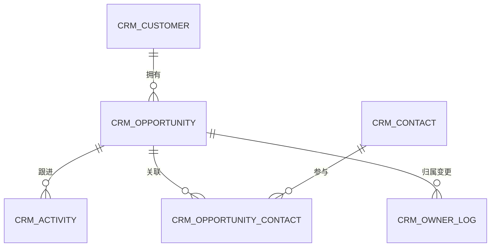

# 数据库设计说明

> **文档信息**：编号 DBD-2026-019 · 库名 `crm_core` · 编制人 徐一鸣 · 审核 周敏 · 版本 V1.0 · 日期 2026-09-22 · 密级 内部

> **填写说明**：以下为虚构示例内容，套用后请替换为你的实际信息。

## 一、设计原则与命名规范

数据库采用 MySQL 8.0 InnoDB，字符集 `utf8mb4`，排序规则 `utf8mb4_0900_ai_ci`。所有表必须含主键、创建时间、更新时间与逻辑删除标记，禁止物理删除业务数据。

| 对象 | 规范 | 示例 |
| --- | --- | --- |
| 表名 | 小写下划线，业务前缀 `crm_` | `crm_opportunity` |
| 字段名 | 小写下划线，禁用保留字 | `expected_close_date` |
| 主键 | bigint unsigned，雪花 ID | `id` |
| 普通索引 | `idx_` + 字段缩写 | `idx_team_stage_ctime` |
| 唯一索引 | `uk_` + 字段缩写 | `uk_credit_code` |
| 时间字段 | `_at` 后缀，datetime(3) | `created_at` |

> **注意**：禁止使用外键约束，关联完整性由应用层保证；跨库查询一律通过数据中台，不允许直连从库。

## 二、实体关系



## 三、表清单

| 表名 | 中文名 | 类型 | 预估行数 | 日均增长 | 保留策略 |
| --- | --- | --- | --- | --- | --- |
| `crm_customer` | 客户主数据 | 主表 | 480 万 | 1 200 | 永久 |
| `crm_contact` | 联系人 | 主表 | 1 360 万 | 3 800 | 永久 |
| `crm_opportunity` | 商机 | 主表 | 3 200 万 | 4 200 | 永久 |
| `crm_activity` | 跟进记录 | 流水表 | 1.8 亿 | 21 万 | 36 个月归档 |
| `crm_opportunity_contact` | 商机联系人关联 | 关联表 | 6 400 万 | 6 100 | 随商机 |
| `crm_owner_log` | 归属变更日志 | 日志表 | 2 600 万 | 2 400 | 24 个月归档 |

## 四、核心表结构

### 4.1 crm_opportunity 商机表

| 字段 | 类型 | 允许空 | 说明 |
| --- | --- | --- | --- |
| `id` | bigint unsigned | 否 | 主键，雪花 ID |
| `customer_id` | bigint unsigned | 否 | 客户 ID |
| `team_id` | bigint unsigned | 否 | 所属团队，行级权限依据 |
| `owner_id` | bigint unsigned | 否 | 归属人用户 ID |
| `name` | varchar(80) | 否 | 商机名称 |
| `amount` | bigint | 否 | 预计金额（分） |
| `stage` | varchar(16) | 否 | 阶段枚举 |
| `expected_close_date` | date | 是 | 期望成交日 |
| `version` | int unsigned | 否 | 乐观锁版本，默认 0 |
| `created_at` | datetime(3) | 否 | 创建时间 |
| `updated_at` | datetime(3) | 否 | 更新时间 |
| `deleted_at` | datetime(3) | 是 | 逻辑删除时间 |

```sql
CREATE TABLE `crm_opportunity` (
  `id` bigint unsigned NOT NULL COMMENT '商机ID',
  `customer_id` bigint unsigned NOT NULL COMMENT '客户ID',
  `team_id` bigint unsigned NOT NULL COMMENT '所属团队',
  `owner_id` bigint unsigned NOT NULL COMMENT '归属人',
  `name` varchar(80) NOT NULL COMMENT '商机名称',
  `amount` bigint NOT NULL DEFAULT 0 COMMENT '金额(分)',
  `stage` varchar(16) NOT NULL DEFAULT 'NEW' COMMENT '阶段',
  `expected_close_date` date DEFAULT NULL COMMENT '期望成交日',
  `version` int unsigned NOT NULL DEFAULT 0 COMMENT '乐观锁版本',
  `created_at` datetime(3) NOT NULL DEFAULT CURRENT_TIMESTAMP(3),
  `updated_at` datetime(3) NOT NULL DEFAULT CURRENT_TIMESTAMP(3) ON UPDATE CURRENT_TIMESTAMP(3),
  `deleted_at` datetime(3) DEFAULT NULL,
  PRIMARY KEY (`id`),
  KEY `idx_team_stage_ctime` (`team_id`, `stage`, `created_at`),
  KEY `idx_customer_id` (`customer_id`),
  KEY `idx_owner_updated` (`owner_id`, `updated_at`)
) ENGINE=InnoDB DEFAULT CHARSET=utf8mb4 COMMENT='商机主表';
```

### 4.2 crm_activity 跟进记录表

| 字段 | 类型 | 允许空 | 说明 |
| --- | --- | --- | --- |
| `id` | bigint unsigned | 否 | 主键 |
| `opportunity_id` | bigint unsigned | 否 | 商机 ID |
| `contact_id` | bigint unsigned | 是 | 主联系人 ID |
| `activity_type` | varchar(16) | 否 | 类型：CALL/VISIT/MAIL |
| `content` | varchar(2000) | 否 | 跟进内容 |
| `attachment_count` | smallint unsigned | 否 | 附件数量，最多 9 |
| `next_follow_at` | datetime(3) | 是 | 下次跟进时间 |
| `created_by` | bigint unsigned | 否 | 记录人 |

## 五、索引设计与查询场景

| 索引名 | 覆盖字段 | 支撑查询 | 选择性评估 |
| --- | --- | --- | --- |
| `idx_team_stage_ctime` | `team_id, stage, created_at` | 团队商机列表按时间倒序 | 高，单团队单阶段约 8 万行 |
| `idx_opp_ctime` | `opportunity_id, created_at` | 商机跟进记录时间线 | 高 |
| `uk_opp_contact` | `opportunity_id, contact_id` | 关联去重 | 唯一 |
| `idx_next_follow` | `owner_id, next_follow_at` | 待跟进提醒 | 中 |

```sql
-- 从库承担报表只读，避免影响交易库
SELECT owner_id, stage, COUNT(*) AS cnt, SUM(amount) AS total
FROM crm_opportunity
WHERE team_id = 1024 AND deleted_at IS NULL
  AND created_at >= '2026-08-01 00:00:00'
GROUP BY owner_id, stage;
```

> **提示**：模糊查询统一改为前缀匹配或接入检索服务，禁止在 `varchar(2000)` 字段上建索引。

## 六、容量与归档估算

| 对象 | 单行估算 | 年增量 | 三年容量 |
| --- | --- | --- | --- |
| `crm_opportunity` | 约 320 B | 约 490 GB | 约 1.5 TB（含索引） |
| `crm_activity` | 约 420 B | 约 530 GB | 归档后主表维持 12 个月 |
| `crm_owner_log` | 约 180 B | 约 160 GB | 24 个月后转冷存储 |
| 索引开销 | 约主表 45% | — | 随主表同比 |

归档策略：每月 3 日 02:00 将超过保留期的记录迁移至 `crm_core_archive`，迁移批次 5 000 行，遇主从延迟 > 30 s 自动暂停。

## 七、变更与回滚机制

变更统一通过 Flyway 管理，脚本命名 `V<版本>__<描述>.sql`，禁止手工执行 DDL。上线顺序为 staging 全量验证 → prod 灰度库 → prod 主库。

| 变更类型 | 窗口 | 是否可回滚 | 回滚方式 |
| --- | --- | --- | --- |
| 新增表 | 任意 | 是 | 删除表 |
| 新增字段 | 任意 | 是 | 保留字段不读（可空） |
| 修改字段类型 | 维护窗口 | 受限 | 备份表反向同步 |
| 删除字段 | 需二次确认 | 否 | 提前重命名加 `_deprecated` |

> **风险**：`ALTER TABLE` 在大表上可能触发锁等待，超过 500 万行的表必须使用 `gh-ost` 在线变更，并提前 1 个工作日报备运维。

---

| 角色 | 姓名 | 评审意见 | 日期 |
| --- | --- | --- | --- |
| 技术负责人 | 徐一鸣 | 设计通过 | 2026-09-23 |
| 研发负责人 | 周敏 | 归档任务需补充暂停阈值 | 2026-09-24 |
| 运维负责人 | 谢文 | 大表变更须走 gh-ost | 2026-09-25 |
