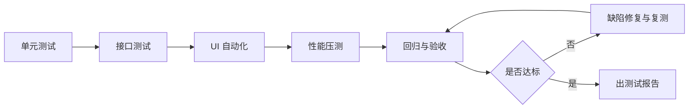

# 测试计划与测试报告

> **文档信息**：编号 TEST-2026-CRM-118 · 系统 云枢 CRM V2.3 · 编制人 黄铭 · 审核 周敏 · 版本 V1.0 · 日期 2026-09-22 · 密级 内部

> **填写说明**：以下为虚构示例内容，套用后请替换为你的实际信息。

## 一、测试范围与不测项

本次测试覆盖云枢 CRM V2.3 商机、客户、报表三个模块共 42 条需求，重点验证阶段流转校验与批量导入性能。

- 纳入测试（P0）：商机创建与归属、跟进记录、阶段流转、批量导入、漏斗报表；
- 纳入测试（P0）：行级权限与 Token 失效场景；
- 不测项：售后工单与结算模块，本期未开发；
- 不测项：星河数据中台内部指标计算逻辑，由数据团队自行保障；
- 不测项：远岚 App 原生壳层兼容问题，归移动端专项负责。

## 二、测试策略

采用分层测试，单元测试保障逻辑、接口测试保障契约、UI 自动化保障主链路、性能测试保障容量。每层失败均阻断进入下一层。

| 层级 | 工具 | 覆盖目标 | 执行时机 |
| --- | --- | --- | --- |
| 单元测试 | Go test + Ginkgo | 行覆盖率 ≥ 75% | 每次提交 |
| 接口测试 | Postman + Newman | 覆盖 68 个接口 | 每日构建 |
| UI 自动化 | Playwright | 12 条核心链路 | 每轮提测 |
| 性能测试 | k6 + Prometheus | 5 000 并发场景 | 提测前一次 |

## 三、测试环境

| 环境 | 用途 | 数据规模 | 资源规格 |
| --- | --- | --- | --- |
| dev | 开发自测 | 10 万商机 | 2C4G × 2 |
| staging | 功能与接口测试 | 800 万商机 | 8C16G × 4 |
| perf | 性能压测 | 全量克隆，脱敏 | 16C32G × 8 |
| prod | 验收抽检 | 生产数据 | 生产规格 |

> **提示**：staging 数据每周日 02:00 从 prod 脱敏刷新，测试期间请勿依赖跨周数据。

## 四、用例设计与统计

| 模块 | 用例数 | 自动化数 | 自动化率 | 优先级 P0 |
| --- | --- | --- | --- | --- |
| 商机管理 | 128 | 96 | 75.0% | 54 |
| 客户与联系人 | 86 | 61 | 70.9% | 31 |
| 阶段流转 | 64 | 58 | 90.6% | 42 |
| 批量导入 | 32 | 18 | 56.3% | 12 |
| 报表 | 41 | 22 | 53.7% | 9 |
| 权限与安全 | 37 | 30 | 81.1% | 24 |
| 合计 | 388 | 285 | 73.5% | 172 |

## 五、执行结果与缺陷统计

本轮共执行 3 轮，最终 PASS 382 条，阻塞 0 条，失败 6 条转为遗留问题。

| 严重度 | 新增 | 已修复 | 遗留 | 修复率 |
| --- | --- | --- | --- | --- |
| 致命 | 3 | 3 | 0 | 100% |
| 严重 | 14 | 14 | 0 | 100% |
| 一般 | 41 | 37 | 4 | 90.2% |
| 轻微 | 22 | 20 | 2 | 90.9% |
| 合计 | 80 | 74 | 6 | 92.5% |

| 模块 | 缺陷数 | 占比 | 主要问题 |
| --- | --- | --- | --- |
| 批量导入 | 24 | 30.0% | 大文件超时、错误行定位不准 |
| 阶段流转 | 18 | 22.5% | 并发改派后版本冲突 |
| 报表 | 15 | 18.8% | 跨月统计口径偏差 |
| 商机管理 | 13 | 16.3% | 列表游标翻页丢行 |
| 权限 | 10 | 12.5% | 跨团队只读越权 |

> **风险**：批量导入缺陷集中在超时分支，若上线前未完成优化，5 万行以上导入仍需人工重试。

## 六、性能测试结果

| 场景 | 并发 | P99 | 错误率 | 结论 |
| --- | --- | --- | --- | --- |
| 商机列表查询 | 5 000 | 341 ms | 0.00% | 达标 |
| 商机创建 | 1 000 | 268 ms | 0.02% | 达标 |
| 阶段流转 | 800 | 214 ms | 0.00% | 达标 |
| 5 万行批量导入 | 50 | 82 s | 0.10% | 达标 |
| 漏斗报表 | 200 | 1 180 ms | 0.05% | 超阈值，需缓存 |

## 七、测试结论与遗留问题

结论：功能测试通过，性能除报表接口外均达标，建议报表接口增加 60 s 结果缓存后再次验证。

| 编号 | 遗留问题 | 严重度 | 影响 | 计划处理 |
| --- | --- | --- | --- | --- |
| BUG-2317 | 跨月报表口径偏差 0.3% | 一般 | 报表与中台对账不符 | V2.3.1 修复 |
| BUG-2329 | 游标翻页偶发丢行 | 一般 | 列表数据不完整 | V2.3.1 修复 |
| BUG-2341 | 导入错误行提示不精确 | 一般 | 人工排查成本高 | V2.4 修复 |
| BUG-2350 | 报表接口 P99 超标 | 一般 | 高峰期响应慢 | 加缓存后复测 |
| BUG-2358 | 导出文件名中文乱码 | 轻微 | 体验问题 | V2.4 修复 |
| BUG-2362 | 提示文案中英混排 | 轻微 | 体验问题 | V2.4 修复 |

## 八、上线建议

- 是否可上线：建议上线，报表接口增加 60 s 缓存后复测，依据为致命与严重缺陷已清零；
- 灰度范围：先开放市场部 2 个团队，观察 3 天，因缺陷集中于导入与报表；
- 监控重点：导入超时率、报表 P99、从库延迟，均为本轮缺陷热点；
- 回滚预案：按《上线发布方案与回滚预案》执行，已联调验证。

---

| 角色 | 姓名 | 结论 | 日期 |
| --- | --- | --- | --- |
| 测试负责人 | 黄铭 | 同意有条件上线 | 2026-09-22 |
| 研发负责人 | 周敏 | 遗留问题纳入 V2.3.1 | 2026-09-23 |
| 技术负责人 | 徐一鸣 | 复核通过 | 2026-09-23 |
