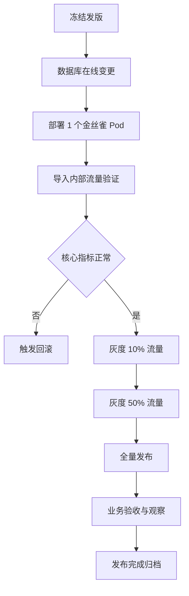

# 上线发布方案与回滚预案

> **文档信息**：编号 REL-2026-CRM-023 · 系统 云枢 CRM V2.3 · 编制人 谢文 · 审核 徐一鸣 · 版本 V1.0 · 日期 2026-09-22 · 密级 内部

> **填写说明**：以下为虚构示例内容，套用后请替换为你的实际信息。

## 一、发布信息

| 项目 | 内容 |
| --- | --- |
| 发布版本 | 云枢 CRM V2.3（commit `a41d7c9`） |
| 发布窗口 | 2026-11-14 23:00 — 11-15 01:30 |
| 发布类型 | 灰度发布 + 数据库在线变更 |
| 发布负责人 | 谢文（运维负责人） |
| 业务验证 | 林珂（产品经理） |
| 影响范围 | 商机模块、客户模块、报表接口 A4 |

> **注意**：发布窗口内禁止其他团队对 `crm_core` 库执行 DDL，变更窗口已在运维平台登记并锁定。

## 二、发布前置检查清单

| 编号 | 检查项 | 判定标准 | 责任人 | 状态 |
| --- | --- | --- | --- | --- |
| C1 | 制品与镜像 | 镜像 tag 与 commit 一致，签名校验通过 | 谢文 | 待办 |
| C2 | 配置项 | prod 配置已 diff 核对，无调试开关 | 徐一鸣 | 待办 |
| C3 | 数据库变更 | Flyway 脚本在 staging 全量演练通过 | 周敏 | 待办 |
| C4 | 压测报告 | 5 000 并发 P99 ≤ 380 ms | 黄铭 | 待办 |
| C5 | 监控告警 | 面板与告警规则已就位并试触发 | 谢文 | 待办 |
| C6 | 回滚制品 | 上一版本镜像 V2.2.4 可用 | 谢文 | 待办 |
| C7 | 数据备份 | 全量备份完成并校验可恢复 | 谢文 | 待办 |
| C8 | 沟通通知 | 业务方与值班群已提前 24 h 通知 | 林珂 | 待办 |

## 三、发布步骤



| 步骤 | 操作 | 预计耗时 | 责任人 | 校验点 |
| --- | --- | --- | --- | --- |
| S1 | 停止 CI 自动部署，锁定分支 | 5 min | 谢文 | 分支保护生效 |
| S2 | 执行 Flyway 增量脚本（2 个） | 12 min | 周敏 | 脚本状态 Success |
| S3 | 部署金丝雀 Pod 并接入内部流量 | 8 min | 谢文 | 健康检查通过 |
| S4 | 内部流量验证 20 条核心用例 | 15 min | 黄铭 | 全部通过 |
| S5 | 灰度 10% → 50% | 每档 15 min | 谢文 | 错误率 < 0.1% |
| S6 | 全量滚动发布 8 副本 | 10 min | 谢文 | 副本全部 Ready |
| S7 | 业务验收与 30 min 观察 | 30 min | 林珂 | 无阻断问题 |

## 四、数据变更与灰度策略

| 变更脚本 | 类型 | 是否在线 | 回滚方式 |
| --- | --- | --- | --- |
| `V2.3.0__add_opportunity_version.sql` | 新增字段 | 是 | 字段可空，保留不读 |
| `V2.3.1__add_idx_team_stage_ctime.sql` | 新增索引 | 是（gh-ost） | DROP INDEX |
| `V2.3.2__create_crm_owner_log.sql` | 新建表 | 是 | 保留表 |

灰度采用 K8s 流量切分，按用户 ID 哈希取模，同一用户固定落同一批次，避免体验跳变。

| 批次 | 流量比例 | 时长 | 放量条件 |
| --- | --- | --- | --- |
| 金丝雀 | 内部账号 | 20 min | 用例全过、无 5xx |
| 批次 1 | 10% | 15 min | 错误率 < 0.1%、P99 < 400 ms |
| 批次 2 | 50% | 15 min | 错误率 < 0.1%、无告警升级 |
| 批次 3 | 100% | — | 业务验收通过 |

## 五、发布后校验项

- V1 接口 5xx 率低于 0.1%，Grafana 观测；
- V2 商机列表 P99 不高于 380 ms，Grafana 观测；
- V3 从库延迟低于 3 s，MySQL Exporter 采集；
- V4 Kafka 积压少于 5 000 条，Kafka Exporter 采集；
- V5 核心链路 12 条用例全过，Playwright 执行；
- V6 数据一致性抽样 200 条一致，对账脚本校验。

```bash
# 发布后快速校验：错误率与延迟
kubectl -n crm rollout status deploy/crm-api --timeout=300s
curl -s 'https://api.starwave.example/api/v1/healthz' -H 'X-Request-Id: rel-check-01'
kubectl -n crm logs -l app=crm-api --since=5m | grep -c '"level":"error"'
```

> **提示**：校验窗口内任何一项不达标，立即暂停放量并评估是否回滚，禁止「带病全量」。

## 六、回滚触发条件与步骤

| 触发条件 | 判定标准 | 观察窗口 |
| --- | --- | --- |
| 接口错误 | 5xx 率 > 1% 且持续 3 min | 3 min |
| 性能劣化 | P99 > 800 ms 且持续 5 min | 5 min |
| 数据异常 | 对账不一致率 > 0.5% | 抽样 200 条 |
| 阻断缺陷 | 核心链路用例失败 ≥ 2 条 | 即时 |
| 数据库异常 | 主从延迟 > 60 s 或变更脚本报错 | 即时 |

回滚步骤：S1 摘除新版本流量 → S2 回滚镜像至 V2.2.4 → S3 执行反向数据脚本（仅当涉及数据写入）→ S4 复跑校验项 → S5 通报业务方。目标回滚耗时 RTO ≤ 15 min。

| 步骤 | 操作 | 预计耗时 | 责任人 |
| --- | --- | --- | --- |
| R1 | 流量切回旧版本 Service | 3 min | 谢文 |
| R2 | 镜像回滚至 V2.2.4 | 5 min | 谢文 |
| R3 | 反向脚本处理新增字段写入 | 视数据量 | 周敏 |
| R4 | 复跑核心用例与对账 | 10 min | 黄铭 |
| R5 | 通报与记录事故单 | 5 min | 林珂 |

> **风险**：`V2.3.2` 新建表若已有写入，回滚后数据仍保留在表中，需人工确认无脏数据影响后续版本。

## 七、应急预案与联络表

| 角色 | 姓名 | 联系方式 | 职责 |
| --- | --- | --- | --- |
| 发布总指挥 | 谢文 | 138-0000-6621 | 决策放量与回滚 |
| 技术负责人 | 徐一鸣 | 138-0000-3312 | 应用层问题定位 |
| 研发负责人 | 周敏 | 138-0000-4478 | 数据库与数据恢复 |
| 测试负责人 | 黄铭 | 138-0000-5190 | 验证与缺陷复现 |
| 业务验证 | 林珂 | 138-0000-7734 | 业务侧确认 |
| 平台值班 | 运维值班 | 内线 8100 | 基础设施支持 |

---

| 角色 | 姓名 | 确认意见 | 日期 |
| --- | --- | --- | --- |
| 发布负责人 | 谢文 | 方案可执行 | 2026-09-25 |
| 技术负责人 | 徐一鸣 | 同意发布 | 2026-09-25 |
| 研发负责人 | 周敏 | 数据变更已演练 | 2026-09-26 |
| 业务方 | 林珂 | 确认验证计划 | 2026-09-26 |
