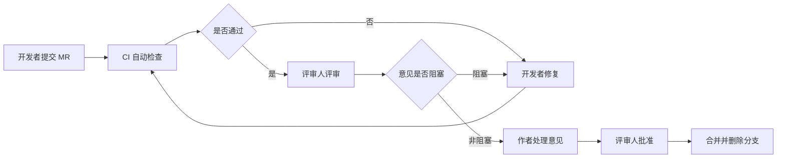

# 代码评审规范

> **文档信息**：编号 RD-2026-STD-007 · 适用范围 研发中心全仓库 · 编制人 周敏 · 审核 徐一鸣 · 版本 V1.2 · 日期 2026-09-22 · 密级 内部

> **填写说明**：以下为虚构示例内容，套用后请替换为你的实际信息。

## 一、评审目标与原则

代码评审用于在合并前发现缺陷、统一风格、传递领域知识，不是对个人的评价。评审以事实与规范为依据，不因职级或工期压力降低门槛。

- **小步提交**：单次合并请求控制在 400 行有效变更以内；
- **前置自动化**：CI 未通过不进入人工评审；
- **就事论事**：意见指向代码与设计，不评价作者；
- **及时响应**：评审人 4 小时内首次响应，同类问题集中说明，避免逐行刷屏。

> **提示**：紧急修复（hotfix）可走简化流程，但必须在 24 小时内补一次完整评审。

## 二、提交门槛

合并请求必须同时满足以下条件，任一不达标由 CI 自动阻断。

| 门槛 | 标准 | 检查方式 |
| --- | --- | --- |
| 编译与构建 | `go build ./...` 与前端 `tsc --noEmit` 无错误 | CI |
| 单元测试 | 全量通过，新增代码行覆盖率 ≥ 75% | CI + Codecov |
| 静态检查 | `golangci-lint` 无 error，warning ≤ 5 | CI |
| 格式 | `gofmt -l` 输出为空 | CI |
| 安全扫描 | 依赖无高危漏洞（CVSS ≥ 7.0） | Trivy |
| 提交信息 | 符合 Conventional Commits | commitlint |

```bash
# 本地提交前自检
gofmt -l . && go vet ./... && golangci-lint run --timeout 5m ./...
go test ./... -race -coverprofile=coverage.out -covermode=atomic
go tool cover -func=coverage.out | tail -n 1
```

## 三、评审范围与规模建议

| 变更类型 | 建议行数 | 评审人要求 | 时限 |
| --- | --- | --- | --- |
| 常规功能 | ≤ 400 | 1 名同域工程师 | 8 h |
| 核心链路 | ≤ 300 | 1 名同域 + 1 名跨域 | 12 h |
| 数据库变更 | 不限 | 必须含 1 名 DBA 角色 | 24 h |
| 权限与鉴权 | ≤ 200 | 必须含技术负责人 | 12 h |
| 依赖升级 | 不限 | 1 名工程师 + 运维确认 | 24 h |

以下路径属核心链路，命中即提升评审等级：`internal/authz/`、`internal/opportunity/`、`internal/report/`、`migrations/`。

## 四、检查项清单

### 4.1 正确性

- 边界与空值是否处理，整数溢出、除零是否有防护；
- 并发场景是否存在竞态，共享状态是否加锁或使用原子操作；
- 错误是否被静默吞掉，`err` 返回值是否全部处理；
- 事务边界是否正确，是否存在跨事务的隐式依赖。

### 4.2 可读性与可维护性

| 检查项 | 合格标准 |
| --- | --- |
| 命名 | 见名知义，避免 `data`、`tmp`、`handle2` |
| 函数长度 | 建议 ≤ 60 行，圈复杂度 ≤ 12 |
| 注释与日志 | 注释解释「为什么」；日志结构化输出，含 `requestId` 与关键业务 ID |

### 4.3 性能

- 循环内禁止发起数据库或 RPC 调用；
- 列表接口必须分页，禁止一次加载全量数据；
- 新增查询需说明走哪个索引，避免全表扫描；
- 大对象序列化注意内存复用，避免高频分配。

### 4.4 安全

| 检查项 | 要求 |
| --- | --- |
| SQL 注入 | 一律使用参数化查询，禁止字符串拼接 |
| 越权 | 数据查询必须带行级权限条件 |
| 敏感信息与密钥 | 手机号、身份证脱敏后落日志；密钥禁止硬编码，统一走配置中心 |

```go
// 反例：拼接 SQL 且未带行级权限
query := "SELECT * FROM crm_opportunity WHERE name LIKE '%" + keyword + "%'"

// 正例：参数化查询 + 权限条件
err := db.WithContext(ctx).
    Where("team_id = ? AND name LIKE ?", teamID, keyword+"%").
    Limit(limit).Find(&items).Error
```

### 4.5 测试

- 新增业务分支必须有对应单测，关键分支覆盖异常路径；
- 表驱动用例需覆盖空值、边界值与错误码；
- 含 `time.Now()` 的逻辑必须可注入时钟，便于测试。

## 五、评审流程



| 环节 | 责任人 | 输出 |
| --- | --- | --- |
| 提交 | 开发者 | 自检清单勾选完成 |
| 自动化 | CI | 检查报告 |
| 人工评审 | 评审人 | 分级意见 |
| 处理与合并 | 开发者 / 评审人 | 逐条回复、Approve 记录 |

## 六、意见分级与处理时限

| 级别 | 标记 | 含义 | 处理时限 |
| --- | --- | --- | --- |
| 阻塞 | `[blocker]` | 存在缺陷或安全风险，必须修复 | 合并前 |
| 重要 | `[major]` | 设计或性能问题，本轮修复 | 24 h |
| 建议 / 提问 | `[minor]` / `[question]` | 可读性优化可选做；提问需作者解释 | 4 h 内回复 |

> **注意**：同一 MR 中 `[blocker]` 超过 3 条时，评审人应直接与作者同步沟通，避免在线来回消耗时间。

## 七、评审记录

| MR 编号 | 标题 | 作者 | 评审人 | 变更行数 | 阻塞数 | 结论 |
| --- | --- | --- | --- | --- | --- | --- |
| MR-2418 | 商机列表游标分页 | 郑亦航 | 徐一鸣 | 312 | 1 | 已合并 |
| MR-2431 | 阶段流转乐观锁 | 郑亦航 | 周敏 | 186 | 0 | 已合并 |
| MR-2447 | 漏斗报表缓存 | 孙倩 | 徐一鸣 | 254 | 2 | 修复后合并 |
| MR-2459 | 批量导入内存优化 | 孙倩 | 周敏 | 398 | 1 | 已合并 |

---

| 角色 | 姓名 | 确认意见 | 日期 |
| --- | --- | --- | --- |
| 研发负责人 | 周敏 | 规范生效 | 2026-09-22 |
| 技术负责人 | 徐一鸣 | 同意并纳入 CI 强制项 | 2026-09-23 |
| 测试负责人 | 黄铭 | 覆盖率门槛认可 | 2026-09-23 |
