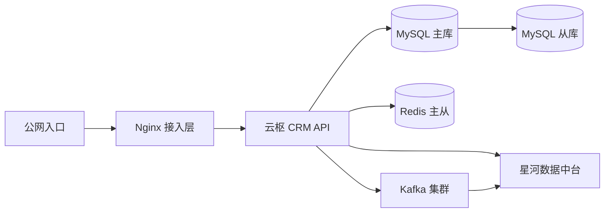
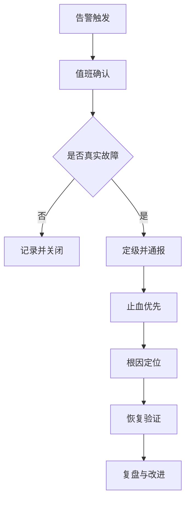

# 运维监控与应急预案

> **文档信息**：编号 OPS-2026-033 · 系统 云枢 CRM · 编制人 谢文 · 审核 徐一鸣 · 版本 V1.1 · 日期 2026-09-22 · 密级 内部

> **填写说明**：以下为虚构示例内容，套用后请替换为你的实际信息。

## 一、监控体系总览

监控采集层由 Prometheus + Grafana 承担指标，Loki 承担日志，Alertmanager 承担告警路由。所有服务统一暴露 `/metrics`，采集间隔 15 s，指标保留 30 天。

| 层次 | 监控对象 | 主要指标 | 采集方式 |
| --- | --- | --- | --- |
| 基础设施 | 节点、容器 | CPU、内存、磁盘、Pod 重启次数 | Node Exporter |
| 中间件 | Nginx、Kafka、Redis | 连接数、积压、命中率 | Exporter |
| 数据库 | MySQL 主从 | QPS、慢查询、主从延迟 | MySQL Exporter |
| 应用 | 云枢 CRM 服务 | QPS、P99、错误率、GC | 埋点 + Exporter |
| 业务 | 商机与报表 | 创建量、导入成功率、对账差异 | 业务指标上报 |

## 二、关键指标与阈值

| 指标 | 采集项 | 阈值 | 告警级别 |
| --- | --- | --- | --- |
| 接口错误率 | `http_5xx_rate` | > 0.5% 持续 3 min | P1 |
| 接口延迟 | `http_p99_ms` | > 500 ms 持续 5 min | P1 |
| 应用 CPU | `cpu_usage` | > 80% 持续 10 min | P2 |
| 内存使用 | `mem_usage` | > 85% 持续 10 min | P2 |
| 磁盘使用 | `disk_used` | > 85% | P2 |
| 主从延迟 | `mysql_slave_lag` | > 10 s | P1 |
| Kafka 积压 | `kafka_lag` | > 50 000 条 | P2 |
| Redis 命中率 | `cache_hit_rate` | < 85% | P3 |
| 导入成功率 | `import_success_rate` | < 99% | P2 |

> **注意**：P1 告警 5 min 内未确认将自动升级至技术负责人，P0 事故（核心链路不可用）直接电话通知。

## 三、告警分级与通知策略

| 级别 | 定义 | 通知渠道 | 响应时限 |
| --- | --- | --- | --- |
| P0 | 核心链路完全不可用 | 电话 + 群 + 短信 | 5 min |
| P1 | 部分功能受损或指标持续超阈 | 群 + 短信 | 15 min |
| P2 | 潜在风险，尚未影响业务 | 群通知 | 2 h |
| P3 | 优化项，无业务影响 | 工单 | 下个工作日 |

通知收敛策略：同一告警 10 min 内合并为一条；同源告警抑制下游；维护窗口内静默，窗口结束后补发汇总。

## 四、核心服务拓扑



单点说明：Nginx 与 API 均为多副本无单点；MySQL 主库为唯一写入点，故障时通过编排提升从库，RTO ≤ 5 min、RPO ≤ 1 s。

## 五、故障应急响应流程



| 阶段 | 关键动作 | 责任人 |
| --- | --- | --- |
| 确认 | 核对监控与日志，排除误报 | 值班工程师 |
| 定级 | 按 P0~P3 定级并拉起群 | 值班工程师 |
| 止血 | 降级、限流、回滚、扩容 | 谢文 |
| 定位 | 结合链路追踪定位到服务与接口 | 徐一鸣 |
| 恢复 | 复跑校验项，确认业务可用 | 黄铭 |
| 复盘 | 24 h 内输出复盘报告 | 谢文 |

常见场景处置：

| 场景 | 快速判断 | 处置动作 |
| --- | --- | --- |
| 接口大面积 5xx | 检查最近发布与配置变更 | 优先回滚上一版本 |
| 数据库连接耗尽 | 查看连接池与慢查询 | 限流 + 杀长事务 |
| Redis 命中率骤降 | 检查大 Key 与过期策略 | 预热热点键 |
| Kafka 积压 | 查看消费组 lag 与分区 | 扩容消费并发 |
| 磁盘写满 | 检查日志与归档任务 | 清理日志并调整保留期 |

```bash
# 常用排查命令
kubectl -n crm top pod | head -n 20
kubectl -n crm logs -l app=crm-api --since=10m | grep -i '"level":"error"' | tail -n 50
mysql -h db-primary -e 'SHOW PROCESSLIST;'
kafka-consumer-groups --bootstrap-server kafka:9092 --describe --group crm-snapshot
```

> **提示**：止血优先于定位。任何超过 10 min 未止血的 P1 事故，值班人有权直接执行回滚，事后补审批。

## 六、值班与升级路径

| 角色 | 排班方式 | 职责 | 升级触发条件 |
| --- | --- | --- | --- |
| 一线值班 | 7×24 轮值，每周 1 人 | 告警确认与初步处置 | P1 超 15 min 未恢复 |
| 二线研发 | 工作日 9:00–21:00 on-call | 应用层定位与修复 | P0 或涉及数据变更 |
| 技术负责人 | 电话随时可达 | 重大决策与回滚授权 | P0 事故 |
| 运维负责人 | 电话随时可达 | 基础设施与容量处置 | 资源类故障 |
| 业务方 | 工作日在线 | 业务影响确认 | 需要业务侧让步决策 |

升级路径：一线 → 二线研发 → 技术负责人 → 运维负责人 / 业务方。每级升级需同步「现象、影响面、已尝试动作」三项信息。

## 七、事后复盘要求

| 项目 | 要求 |
| --- | --- |
| 时限 | P0/P1 事故 24 h 内完成复盘，P2 三个工作日内 |
| 产出 | 事故报告，含时间线、根因、影响、改进项 |
| 时间线 | 精确到分钟，标注每个关键动作与执行人 |
| 根因 | 区分直接原因与系统性原因，禁止只写「人为失误」 |
| 改进项 | 每项须有责任人与完成时间，纳入迭代跟踪 |
| 闭环 | 改进项完成率纳入季度运维考核，未闭环需说明 |

> **风险**：若同类告警连续两周重复出现且未闭环改进项，运维负责人须在周例会上专项说明。

---

| 角色 | 姓名 | 确认意见 | 日期 |
| --- | --- | --- | --- |
| 运维负责人 | 谢文 | 预案生效 | 2026-09-22 |
| 技术负责人 | 徐一鸣 | 阈值与升级路径确认 | 2026-09-23 |
| 测试负责人 | 黄铭 | 补充导入成功率监控 | 2026-09-24 |
| 研发负责人 | 周敏 | 同意纳入值班手册 | 2026-09-24 |
