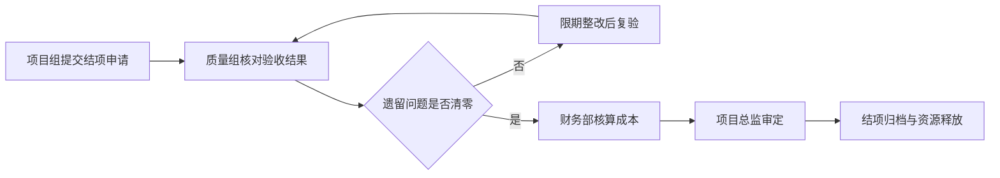

# 项目结项报告

> **文档信息**：编号 XM-2026-018-JX · 项目名称 云枢 CRM 一期 · 项目经理 林珂 · 结项日期 2026-09-30 · 版本 V1.0 · 编制日期 2026-10-10

> **填写说明**：以下为虚构示例内容，套用后请替换为你的实际信息。

## 一、项目概况

云枢 CRM 一期于 2026-01-06 立项，2026-08-22 上线，2026-09-30 通过业务验收并正式结项。项目覆盖客户、商机、订单三条主链路，服务市场部、售后部、运营部共 186 名使用人员。

| 项目要素 | 内容 |
| --- | --- |
| 项目周期 | 2026-01-06 至 2026-09-30，共 8 个月 25 天 |
| 项目预算 | 386 万元（人力 268 万、云资源 72 万、外部服务 46 万） |
| 实际支出 | 372 万元，节余 14 万元 |
| 参与规模 | 研发 9 人 · 产品 2 人 · 测试 3 人 · 设计 1 人 |
| 验收结论 | 业务场景全部跑通，验收通过 |

## 二、交付成果对照

| 交付项 | 立项承诺 | 实际交付 | 达成情况 |
| --- | --- | --- | --- |
| 核心需求条数 | 40 条 | 42 条 | 超出 2 条 |
| 主链路场景 | 3 条（客户/商机/订单） | 3 条 | 达成 |
| 移动端场景 | 3 个 | 2 个（跟进、审批） | 少 1 个，工单查看移入二期 |
| 数据看板 | 6 张 | 7 张 | 超出 1 张 |
| 系统集成接口 | 12 个 | 12 个 | 达成 |
| 用户培训 | 4 场 | 6 场 | 超出 2 场 |

## 三、进度与成本偏差

| 偏差维度 | 计划 | 实际 | 偏差 | 原因 |
| --- | --- | --- | --- | --- |
| 上线日期 | 2026-09-30 | 2026-08-22 | 提前 39 天 | 第 2–3 迭代并行开发，测试左移提前介入 |
| 项目工时 | 14,600 人时 | 14,180 人时 | 节约 420 人时 | 需求合并减少 11 条，开发量下降 |
| 人力支出 | 268 万元 | 261 万元 | 节约 7 万元 | 加班补贴低于预算，但新人试用成本增加 |
| 云资源支出 | 72 万元 | 82 万元 | 超支 10 万元 | 压测环境与灰度环境并行，额外运行 6 周 |
| 外部服务支出 | 46 万元 | 29 万元 | 节约 17 万元 | 咨询采购规模压缩 |

> **提示**：项目整体节余 14 万元，其中云资源超支部分已由外部服务节余对冲，无需追加预算。

## 四、质量与验收

| 质量指标 | 目标 | 实际 | 结论 |
| --- | --- | --- | --- |
| 提测缺陷密度 | ≤ 1.2 个/需求 | 0.94 个/需求 | 达标 |
| 遗留缺陷 | ≤ 5 个且无高优先级 | 3 个，均为低优先级 | 达标 |
| 核心接口响应时间 | ≤ 300 ms | 218 ms | 达标 |
| 上线后 30 天故障 | 0 次 P0 故障 | 0 次 | 达标 |
| 业务验收场景 | 18 个场景全通过 | 18 个通过 | 达标 |

验收由市场部、售后部各指定 1 名业务代表参与，用例在提测前一周完成确认。上线后 30 天内系统可用率 99.96%，未发生数据事故。

## 五、经验教训

- **测试左移有效**：测试人员在需求评审阶段即介入，缺陷在提测前发现比例达 41%，回归轮次由 3 轮降至 2 轮。
- **需求合并价值明显**：通过业务流程建模合并 11 条重叠需求，节省约 18 人天开发量，建议在二期沿用。
- **范围控制偏松**：一期共受理变更 23 次，其中 7 次发生在第 4 迭代之后，导致该迭代延期 6 天。
- **环境规划不足**：压测与灰度环境未提前申请，额外产生 10 万元云资源支出，二期应在上线前 8 周锁定环境。

> **教训**：变更受理必须与迭代节点绑定，迭代启动后新增需求一律进入下一批次，否则进度与成本会同时失控。

## 六、结项结论

项目在功能范围、质量指标、成本控制三方面均达到立项要求，主链路业务场景全部跑通，业务方验收通过，同意结项。项目组 9 名研发人员中 6 人自 10 月起转入星河数据中台二期，2 人转入云枢 CRM 二期需求阶段。

---

| 项目经理 | 质量负责人 | 财务部 | 项目总监 | 结项日期 |
| --- | --- | --- | --- | --- |
| 林珂 | 黄铭 | 赵晓岚 | 陈嘉禾 | 2026-09-30 |
