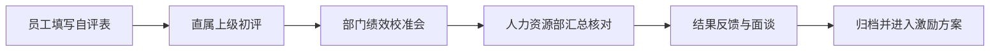

# 个人绩效自评表

> **文档信息**：编号 JX-2026-H1-021 · 被考核人 黄铭 · 岗位 质量负责人（质量中心） · 考核周期 2026-03-01 至 2026-08-31 · 版本 V1.0 · 自评日期 2026-09-22

> **填写说明**：以下为虚构示例内容，套用后请替换为你的实际信息。

## 一、岗位职责与考核周期

考核周期内本人负责研发质量体系建设、测试资源统筹与版本发布把关，覆盖云枢 CRM、星河数据中台、岚图门户三条产品线。周期内共参与版本发布 8 个，组织提测评审 22 场，管理测试人员 3 人，牵头落地接口打桩与灰度回滚两项机制。本周期未发生因测试漏测导致的线上 P0 故障。

## 二、KPI 自评表

| 考核指标 | 权重 | 目标值 | 实际值 | 自评分 |
| --- | --- | --- | --- | --- |
| 提测缺陷密度 | 25% | ≤ 1.10 个/需求 | 0.94 个/需求 | 95 |
| 测试用例执行率 | 20% | ≥ 96% | 98% | 88 |
| 上线后 P1 及以上故障 | 15% | ≤ 2 次 | 1 次 | 92 |
| 提测一次通过率 | 15% | ≥ 70% | 74% | 90 |
| 自动化用例覆盖率 | 15% | ≥ 45% | 41% | 85 |
| 测试团队培养 | 10% | 完成 3 场内部分享 | 4 场 | 93 |

> **提示**：按权重折算，自评综合得分 90.7 分。自动化用例覆盖率是唯一未达目标的指标，缺口 4 个百分点。

## 三、重点工作举证

- **接口打桩机制落地**：牵头引入打桩框架，报表模块与外部接口层新增可测用例 186 个，使该两层覆盖率由 12% 提升至 41%。星河数据中台联调阶段因此提前 2 天完成。
- **灰度回滚预案**：制定灰度回滚检查清单，明确 12 项回滚触发条件。周期内共触发回滚 2 次，均在 15 分钟内完成，避免了全量故障。
- **提测门槛治理**：推动提测门槛统一，未达标提测比例由 18% 降至 6%，回归轮次由平均 2.6 轮降至 2.0 轮。
- **质量数据看板**：建成质量度量看板，覆盖缺陷密度、用例执行率、一次通过率等 9 项指标，实现按迭代自动出数，替代此前的手工统计。

| 重点工作 | 量化成效 | 佐证材料 |
| --- | --- | --- |
| 接口打桩机制落地 | 报表与接口层覆盖率 12% 提升至 41% | 覆盖率报告、框架使用说明 |
| 灰度回滚预案 | 2 次回滚均在 15 分钟内完成 | 回滚记录、值班日志 |
| 提测门槛治理 | 未达标提测比例下降 12 个百分点 | 提测评审记录 |
| 质量数据看板 | 9 项指标按迭代自动出数 | 看板地址、出数截图 |

## 四、能力评价

- **专业能力**：对质量度量指标的口径定义与拆解较为扎实，能够识别指标背后的流程问题而非停留在统计层面。自动化测试方案设计能力仍有提升空间。
- **协同能力**：与研发、运维的配合顺畅，牵头事项均能在无强制授权下推进落地，灰度回滚机制即由跨部门共识形成。
- **管理能力**：对 3 名测试人员的任务分配与培养较有节奏，但跨团队测试资源冲突时的协调手段偏单一，主要依赖部门负责人出面。

## 五、改进计划

| 改进项 | 具体行动 | 衡量标准 | 完成时间 |
| --- | --- | --- | --- |
| 提升自动化覆盖率 | 引入页面对象模型，补齐核心链路自动化用例 | 覆盖率提升至 60% | 2026-12-31 |
| 强化性能测试能力 | 完成性能压测专项学习并主导 1 次全链路压测 | 输出压测报告 1 份 | 2026-11-30 |
| 提升资源协调能力 | 建立测试资源需求提前 2 周申报机制 | 资源冲突事项减少 50% | 2026-12-31 |

## 六、自评结论与流程

本周期各项指标整体达成，自评综合得分 90.7 分，建议评定为良好。自动化覆盖率一项未达标，已列入下一周期改进计划并作为首要提升项。

---

| 被考核人 | 直属上级评语 | 人力资源部 | 确认日期 |
| --- | --- | --- | --- |
| 黄铭 | 徐一鸣：质量体系建设成效明显，自动化建设需加快 | 孙倩 | 2026-09-22 |
